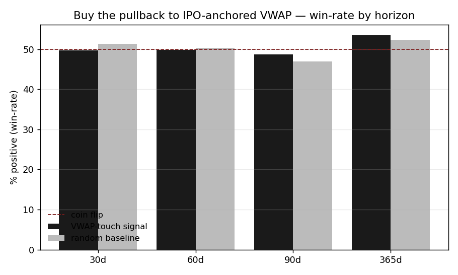
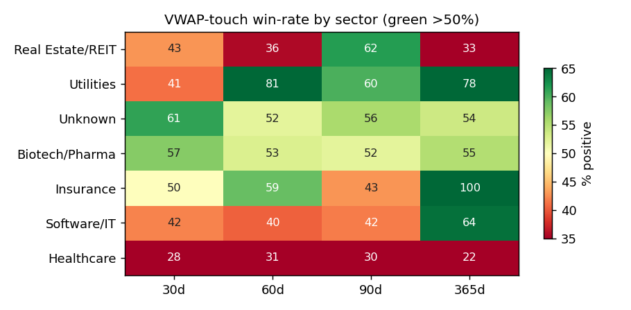
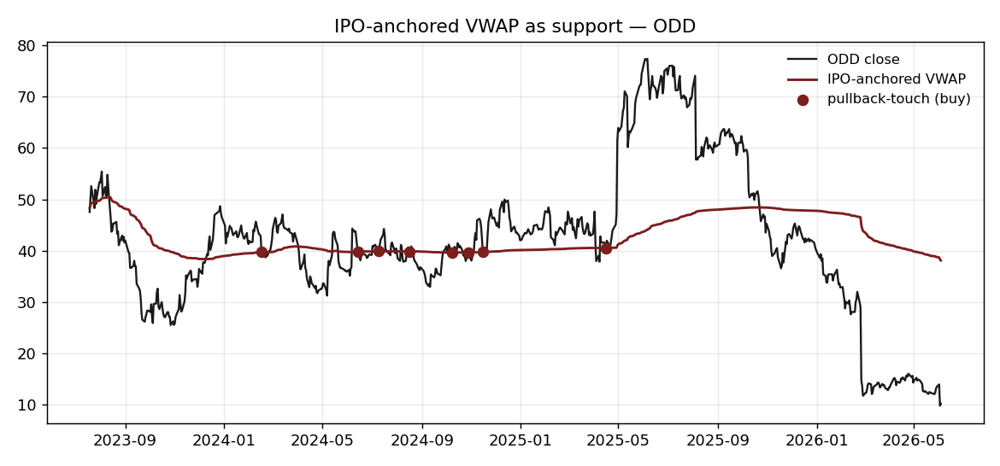

# 02 — Buying the IPO-anchored VWAP touch has no win-rate edge

**Question.** A popular technical claim: on a recently-IPO'd stock, buying when price pulls back to (or reclaims) the VWAP *anchored to the first trading day* is a high-probability entry. Across a large IPO cohort, is the win-rate any better than a random entry in the same names? **Answer: no — it's a coin flip.**

> Research / backtested. No live capital, no audited track record, no transaction costs. The cohort is young IPOs only (2022-10 onward), an unusual regime — treat as a tested-and-failed technique, not a law.

## Data & method

- **Universe.** 881 IPOs since 2022-10; 188 cleared a liquidity gate (≥60 trading days, median dollar-volume > $1M, median price ≥ $4). Split-adjusted daily prices with per-bar VWAP.
- **Anchored VWAP.** Cumulative Σ(vwap·volume)/Σ(volume) from the first trading day — the average cost basis of every holder since the IPO.
- **Two signals tested.** (1) *Pullback* — buy when price touches the AVWAP from above. (2) *Reclaim* — buy when price crosses back above the AVWAP. Win = positive return at 30 / 60 / 90 / 365 days.
- **Validation.** Compared to a random-entry baseline in the same tickers; block bootstrap (block=21) for 95% CIs; walk-forward split (in-sample <2025 vs out-of-sample ≥2025); per-sector breakdown.

## Claim 1 — The pullback "buy the touch" win-rate sits on 50%

Across every horizon the signal win-rate hugs 50% and is indistinguishable from a random entry in the same universe.

| Horizon | n | % Positive (win) | Median | Mean | Edge vs random |
|---|---:|---:|---:|---:|---:|
| 30d | 316 | 49.7% | −0.08% | +13.2% | −1.6 pts |
| 60d | 303 | 49.8% | −0.03% | +4.2% | −0.5 pts |
| 90d | 277 | 48.7% | −0.34% | +4.5% | +1.7 pts |
| 365d | 142 | 53.5% | +2.11% | +25.4% | +1.2 pts |

The block bootstrap confirms it: the 90d mean is +4.45% with a 95% CI of **[−0.79%, +10.04%]** — it spans zero, so the result is not statistically distinguishable from no edge.

## Claim 2 — The reclaim variant is no better

Buying the cross back *above* the AVWAP — the "trend-confirmation" version of the trade — also lands on a coin flip, and actually underperforms the random baseline at the shorter horizons.

| Horizon | n | % Positive (win) | Median | Mean | Edge vs random |
|---|---:|---:|---:|---:|---:|
| 30d | 467 | 48.4% | −0.48% | +6.4% | −2.9 pts |
| 60d | 433 | 48.7% | −0.51% | +8.5% | −1.6 pts |
| 90d | 415 | 50.6% | +0.09% | +10.8% | +3.6 pts |

## Claim 3 — Sector dispersion exists but is too thin to trade

Sector cells scatter widely (Utilities 60% / REIT 62% at 90d vs Healthcare 30%), but every cell holds only n=15–32 — small enough that the spread is consistent with noise. No sector shows a robust, repeatable edge, and the walk-forward split agrees: 90d win-rate was 49.1% in-sample (<2025) versus 48.5% out-of-sample (≥2025) — there was never an edge to overfit.

## The answer, in the data

**Q: If I buy when price touches the IPO-anchored VWAP, is the win-rate an edge?**
**A: No.** It is ~49% — a coin flip — confirmed two ways (pullback and reclaim), consistent out-of-sample, with a bootstrap CI that includes zero. The anchored VWAP is a useful *descriptive* level (the cohort's average cost basis) but not a *predictive* entry signal.

| Signal (90d) | n | % Positive | Edge vs random | Verdict |
|---|---:|---:|---:|---|
| Pullback to AVWAP | 277 | 48.7% | +1.7 pts | Coin flip (CI spans zero) |
| Reclaim of AVWAP | 415 | 50.6% | +3.6 pts | Coin flip |
| Best sector cell | 15–32 | 60–62% | — | n too small to be real |

## Caveats

- Sample is young IPOs only (2022-10 onward) — an unusual cohort that rode a specific regime; no pre-2022 IPOs were available.
- Gated on traded price, not the original offer price (offer prices were unavailable), so the very first-day fill is approximated.
- Tests the *IPO* anchor specifically. A VWAP anchored to a later major high or low is a different question and is not addressed here.
- Returns are gross of costs and slippage; bounce/win rates are point-in-time on daily bars.

## References

- Sullivan, Timmermann & White (1999). *Data-snooping, technical trading rule performance, and the bootstrap.* Journal of Finance — why "obvious" technical rules tend to vanish once tested out-of-sample.
- Brock, Lakonishok & LeBaron (1992). *Simple technical trading rules and the stochastic properties of stock returns.* Journal of Finance.
- Practitioner communities (r/Daytrading, r/TechnicalAnalysis) on anchored-VWAP entries — the prior this note tests and falsifies.
