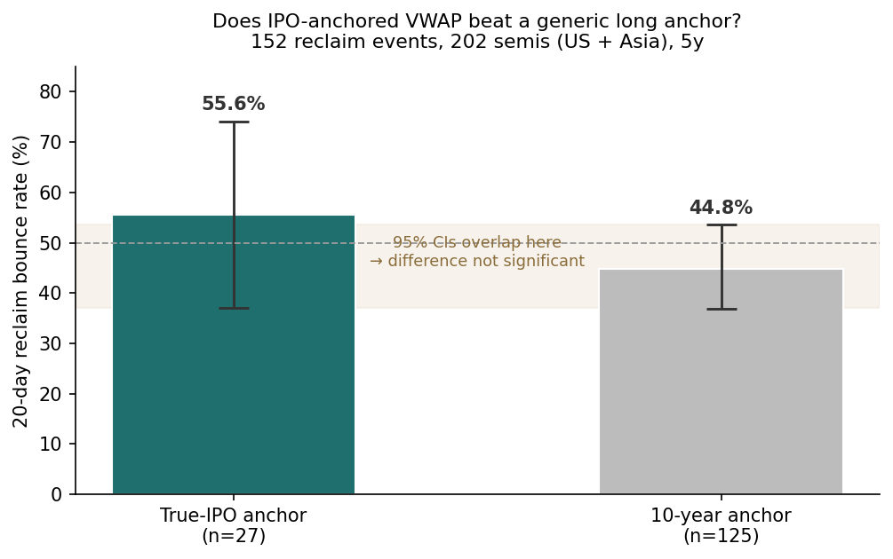
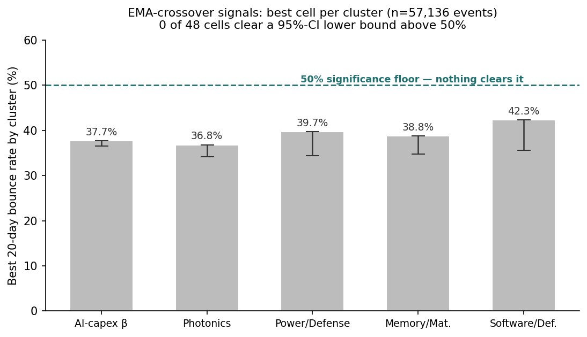

# Is IPO-anchored VWAP a "real" level? 202 semiconductors across US and Asia

**A widely-believed technical premise, tested on five years of data — and not confirmed.**

*Hsin Cheng Yeh · independent research · 2026*

---

## Question

A common claim in technical-analysis circles: for a recently-IPO'd stock, a VWAP **anchored to the first trading day** marks a psychologically meaningful support/resistance level — more meaningful than a VWAP anchored to some arbitrary older date, because every holder since listing is measured against it.

Two testable questions follow:

1. **Anchor question** — do "reclaim" events (price closing back above the anchored VWAP after an extended period below) bounce more reliably when the anchor is the *true IPO date* versus a generic 10-year anchor?
2. **Confirmation question** — does layering an EMA-stack "trend confirmation" filter on top of a reclaim improve its hit rate? And do classical EMA crossovers (golden cross, etc.) carry standalone edge in this universe?

My prior, going in, was that IPO-anchored VWAP would show a real edge and that the golden cross would bounce 55-65% of the time. **Both priors turned out to be wrong.**

## Universe

- **202 tickers**, 463,621 daily bars, ~5 years.
- **124 US-listed + 78 international** semiconductor names across Taiwan, Japan, Korea, Hong Kong, and China exchanges (e.g. SK Hynix, GlobalWafers, Phison, alongside NVDA, AMD, ASML, ARM).
- **Anchor classification:** 36 *true-IPO* names (first listed post-2016 — the AI-era cohort: CRWD, DDOG, NET, SNOW, PLTR, IONQ, ARM, ALAB, CRWV, NBIS …) vs 166 *long-anchor* names (listed pre-2016).

## Method

1. **Reclaim event** — a high-volume, strong-close day on which price closes back above its anchored VWAP after 60+ consecutive days below it. 152 such events across the universe.
2. **EMA stack** — for each name, a 0–6 score counting how many of the 5/7/21/30/50/200-day EMAs price sits above (6 = fully stacked bull trend).
3. **Crossover events** — 57,136 EMA-crossover events across 8 cross types (5×21, 21×50, 50×200, up/down), tagged by sector cluster.
4. **Outcome** — 20-day forward "bounce" (positive return) rate; 30-day mean return.
5. **Inference** — bootstrap 95% confidence intervals on every bounce rate; Bonferroni adjustment considered for the 48-cell crossover grid.

## Result 1 — IPO anchor does *not* beat a generic anchor

| Anchor type | n | 20d bounce | 95% CI | mean 30d return |
|---|---:|---:|---|---:|
| True-IPO | 27 | 55.6% | [37.0, 74.1] | +26.2% |
| 10-year | 125 | 44.8% | [36.8, 53.6] | +7.5% |

True-IPO reclaims bounce **10.8 percentage points** more often and return **18.7pp** more on average — which *looks* like a real edge. But the **95% confidence intervals overlap heavily** ([37.0, 74.1] vs [36.8, 53.6]); the lower bounds nearly coincide. With only 27 true-IPO events, I cannot reject the null that the two are drawn from the same distribution. The eye-catching return gap is driven by a handful of big winners in a small, AI-cycle-enriched cohort.

**Takeaway:** on this evidence, anchoring VWAP to the IPO date is *not demonstrably* better than a generic long anchor. The honest conclusion is "unproven at this sample size," not "confirmed."

## Result 2 — the "trend-confirmation filter" was already baked in

I expected that filtering reclaims to those with EMA-stack ≥ 4 (a bullish trend backdrop) would lift the hit rate. Instead, **all 152 reclaim events already had stack ≥ 4.** The stratification I designed (anchor × stack, six cells) collapsed into one populated cell.

This is an informative null, not a dead end: the reclaim definition itself (high volume + strong close + price back above VWAP) *mechanically forces* price above most of its short EMAs on the event day. The "confirmation filter" added nothing because it was implicit in the event definition. To test whether stack score has *standalone* power, a looser reclaim criterion (admitting weak-close or normal-volume events) would be needed — the follow-up.

## Result 3 — classical EMA crossovers carry no standalone edge here

Across 57,136 crossover events and 48 (cross-type × cluster) cells, **not one cell has a 95%-CI lower bound above 50%.** The best signal in each sector cluster tops out at 37–42%:

| Cluster | Best crossover | 20d bounce | CI lower |
|---|---|---:|---:|
| AI-capex β | 5×21 up | 37.7% | 36.6% |
| Photonics | 5×21 up | 36.8% | 34.2% |
| Power/Defense | 21×50 up | 39.7% | 34.4% |
| Memory/Materials | 21×50 down | 38.8% | 34.8% |
| Software/Defensive | 50×200 down | 42.3% | 35.6% |

The **golden cross (50×200 up) underperformed its reputation** — 36.3% bounce in the AI-capex cluster (n=832), far below the 55–65% I'd predicted. Under Bonferroni correction (0.05/48 ≈ 0.001) the picture is even starker. Counter-intuitively, several *down*-crosses outperformed *up*-crosses on the 20-day window — consistent with short-term mean-reversion after sharp breakdowns rather than any trend-following edge.

## What I take from it

- **Two priors falsified.** IPO-anchored VWAP showed no significant edge over a generic anchor; the golden cross underperformed badly. Reporting that cleanly is the point — these are exactly the "obvious" signals a careful process should retire rather than trade.
- **Design can hide a result.** The stack-filter test failed not because the filter is bad but because it was already implicit in the event definition. Worth remembering before claiming a filter "works."
- **The true-IPO cohort is a watch-item, not a signal.** The +18.7pp return gap is intriguing but rests on n=27 and likely survivorship/regime effects. The right move is to re-test in 1–2 years as the post-2016 IPO cohort grows, not to trade it now.

## Caveats

- **Small true-IPO sample (n=27)** and **multiple comparisons** (48 crossover cells) — treat any single positive as a lead, not a result.
- **Survivorship / regime bias** — the true-IPO cohort is concentrated in 2019–2024 names that rode the AI cycle; reclaim windows overlap a favourable regime.
- **No transaction costs, slippage, or borrow** modelled; bounce rates are gross.
- **Today's universe sits in an unusually bullish backdrop** (≈74% of names at EMA-stack ≥ 4), which limits how many reclaim setups exist right now.
- Daily bars and a close-vs-open side proxy are coarse; intraday dynamics are not captured.

---

*Part of a series of independent research notes. The data pipeline and any production screening logic are kept private; this note publishes method and findings only. Research / backtested — no live capital, no audited track record.*
