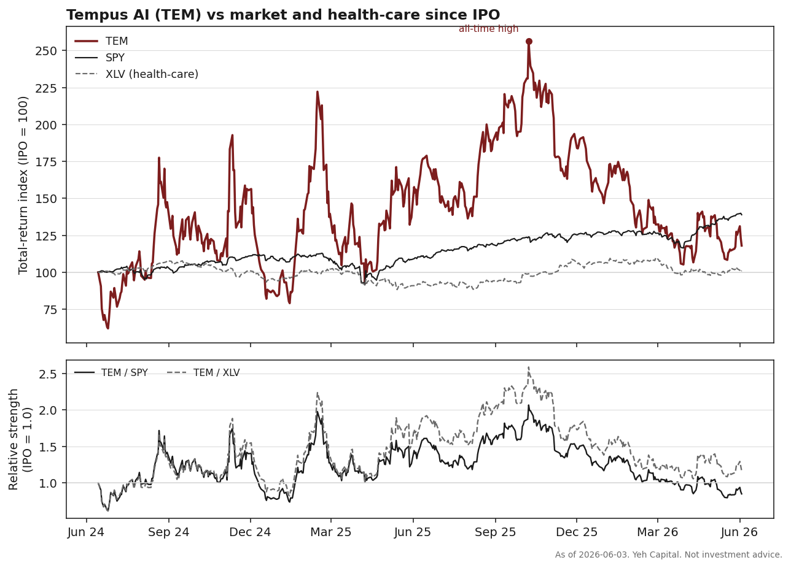
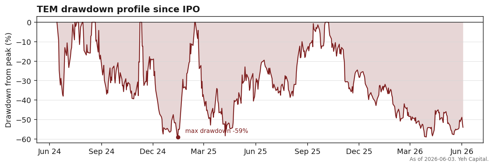

# 03 — A due-diligence news hub: verified event tracking for one name

**Question.** Can fragmented, mixed-reliability sources — filings, financial press, and social chatter — be turned into a verified, source-scored event timeline for a single fast-moving company, separating fact from rumour reproducibly?

**Finding.** Yes, as a methodology. A single-name pipeline ingests and extracts coverage, then routes every claim through an **independent verification gate** that promotes an item to "fact" only at confidence > 70, producing a clean timeline with unverified chatter quarantined. This is an **engineering / methodology case study** (built on Tempus AI, $TEM) — not a return backtest. Its honest test is the verifier's precision and recall, set out below.

> Methodology / tooling case study. Design and approach only — no code, keys, endpoints, or deployment. Not investment advice; not a backtested signal.

## The problem

Diligence on a fast-moving AI-healthcare name means reconciling sources that disagree and vary wildly in reliability:

- **Primary** — SEC filings (8-K / 10-Q), investor-relations releases
- **Secondary** — financial press
- **Noisy / early** — Reddit, X, and other social chatter, where a partnership "rumour" can move the stock days before it is confirmed (or turns out false)

The hard part isn't *collecting* this — it's **separating verified fact from unverified chatter**, attaching a reliability weight to each source, and assembling a timeline you can reason from. Reading 40 tabs by hand doesn't scale and isn't reproducible.

## The approach

```
  INGEST                 ANALYSE              VERIFY                  SCORE & STRUCTURE
  ──────                 ───────              ──────                  ─────────────────
  SEC EDGAR filings  ┐                    ┌ cross-check each      ┌ source-reliability
  Investor relations ┤   LLM extraction   │ claim against an      │ weight per source
  Financial press    ┼─► of entities,  ─► │ independent search ─► ┤ verified flag +
  Reddit             │   events, claims    │ engine; confidence    │ confidence (0-100)
  X / social         ┘   + sentiment       │ 0-100 + discrepancies │ event timeline,
                                           └ list                  └ value chain, catalysts
```

## The gate that makes it diligence, not a feed reader

Every extracted claim is sent to an **independent verification step** (a separate search-grounded model) that returns a structured result: a `verified` flag, a `confidence` score (0–100), a short summary, and an explicit list of `discrepancies`. An item is promoted to **verified** only when the verifier returns `verified = true` **and** `confidence > 70`. Everything else stays flagged and is held out of the "facts" timeline; conflicts between sources are captured explicitly rather than averaged away.

That single thresholded, independent check is the difference between a diligence tool and a news aggregator.

## What it produces

- **Verified event timeline** — chronological, filing-grounded, with unverified items quarantined
- **Source-reliability scoring** — each source carries a weight, so a 10-K and a Reddit post are never treated as equal
- **Value-chain view** — partners, customers, and supply-chain relationships mapped from the coverage
- **Catalyst tracker** — upcoming and recent events that could move the thesis

## How it should be validated (the honest test)

Because this is tooling, the right test is not a P&L but the verifier's accuracy — two measurable checks:

1. **Precision / recall of the gate** against a hand-labelled set of later-confirmed vs later-falsified claims: does `confidence > 70` actually separate true from false, and at what cost in missed true items?
2. **Lead-time**: do items the gate marks "verified" *precede* the eventual filing or price confirmation, or merely lag it?

Until those are run on a labelled sample, this is a validated *design*, not a validated *signal* — and that distinction is the point of publishing it honestly.

## Why single-name, not a market scanner

Diligence depth beats breadth. Pointing the whole stack at **one** company (here Tempus AI — where the genomics/data narrative and the reported financials need careful reconciliation) lets the verification layer be tuned to that company's people, partners, and claims, instead of producing shallow coverage of hundreds of tickers.

## Honest scope

Personal research tooling. **Not investment advice** — the output is a verified information layer to support judgement, not a recommendation. Verification quality is bounded by the underlying search model; `confidence > 70` reduces false positives but does not eliminate them, so discrepancies are surfaced rather than hidden.

---

<!-- TEMPUS_TRACKER_DATA_START -->
### The live read on Tempus AI ($TEM) - as of 2026-06-03

This section is regenerated each refresh from current data. Tempus IPO'd 2024-06-14; the read below covers 493 trading days since.

**Honest scope.** The price / relative-strength block is the only hard quantitative result. The idea ledger is qualitative but sourced - each thesis is distilled from dated notes in the research corpus, not asserted from memory. News-sentiment coverage is thin (4 rows) and there is **no social-chatter coverage** for this name (0 tagged posts), so the social lead-vs-filing test in the methodology above is **not feasible here and is not faked**.

#### Price read (hard stat)

| Metric | Value |
| --- | --- |
| Total return since IPO | +18.0% |
| Max drawdown | -59.0% (trough 2025-01-14) |
| From all-time high ($103) | -54.0% |
| Annualised volatility | 98% |
| Trailing 90d / 180d / 365d | -10.4% / -38.0% / -23.3% |
| Last close | $47.51 |

Cumulative return since IPO, TEM vs benchmarks:

| Instrument | Return since IPO |
| --- | --- |
| TEM | +18.0% |
| SPY | +39.0% |
| XLV | +1.1% |

Relative strength since IPO (>0 = outperformed, <0 = lagged):

| Pair | Change |
| --- | --- |
| TEM / SPY | -15.1% |
| TEM / XLV | +16.7% |





#### Idea ledger (qualitative, sourced)

Distilled from the 20 on-topic corpus notes that mention TEM (1 additional tagged note(s) excluded as off-topic tags). "Notes" counts items in the corpus supporting the thesis; a thesis with at most one supporting note is flagged limited-coverage rather than promoted. Each thesis carries a confirm/break test in the internal tracker. The "latest in corpus" date is when the item entered the research corpus, not when the underlying event occurred - several notes describe earlier 2024-2025 quarterly results and deals.

| Thesis | Notes | Latest in corpus | Status |
| --- | --- | --- | --- |
| Genomic-testing volume + revenue growth is the core engine | 11 | 2026-05-22 | active - multiple dated notes |
| Signatera / MRD assay is the high-value adoption catalyst | 13 | 2026-05-22 | active - multiple dated notes |
| Biopharma data-licensing / partnerships monetise the multimodal library | 12 | 2026-05-22 | active - multiple dated notes |
| Path to profitability (adjusted-EBITDA breakeven) is in view | 3 | 2026-05-22 | active - multiple dated notes |
| Balance-sheet / financing capacity (convertible raise) funds expansion + M&A | 5 | 2026-05-20 | active - multiple dated notes |
| Institutional/thematic-fund flow is a swing factor (watch item) | 2 | 2026-05-06 | active - multiple dated notes |

The recurring threads the notes actually support: genomic-testing volume and revenue growth as the core engine; the Signatera/MRD assay and its Medicare-coverage push as the high-value adoption catalyst; biopharma data-licensing partnerships (Actuate, Debiopharm, Cleveland Clinic, Caris) monetising the multimodal library; a stated path toward adjusted-EBITDA breakeven; and a $500M convertible raise funding expansion. The only positioning signal in the corpus is thematic-fund selling (ARK ARKK SELL prints) - flagged as a watch item, not a thesis.

#### News & catalysts (thin)

News-sentiment rows in the corpus: 4 total (4 positive, 0 negative, 0 other). This is too sparse to read as a sentiment trend; it is logged, not interpreted.

Catalyst calendar:

- 2026-05-05 - earnings (most recent, source-flagged confidence high)

*Living tracker - a future refresh re-runs the pull and regenerates these blocks, the figures, and the internal dashboard. Personal research; not investment advice.*
<!-- TEMPUS_TRACKER_DATA_END -->
