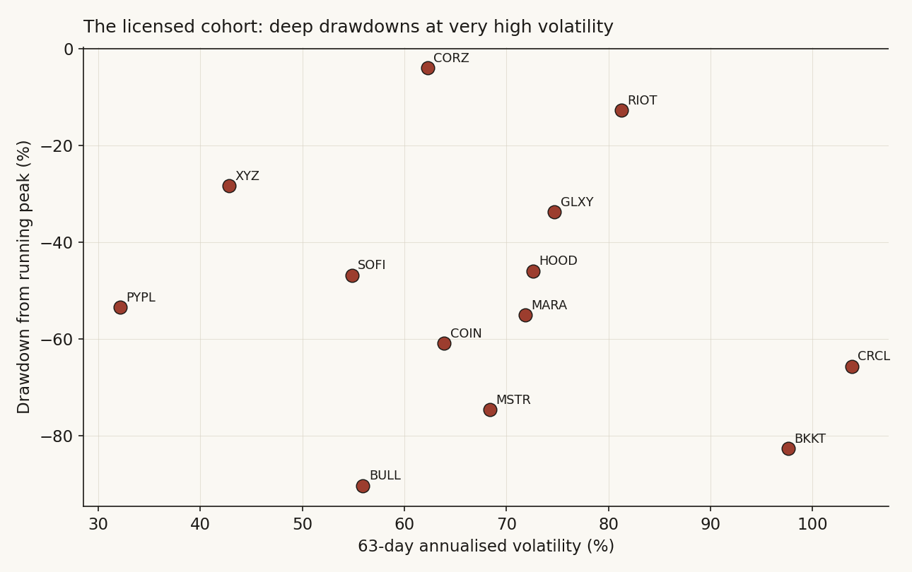
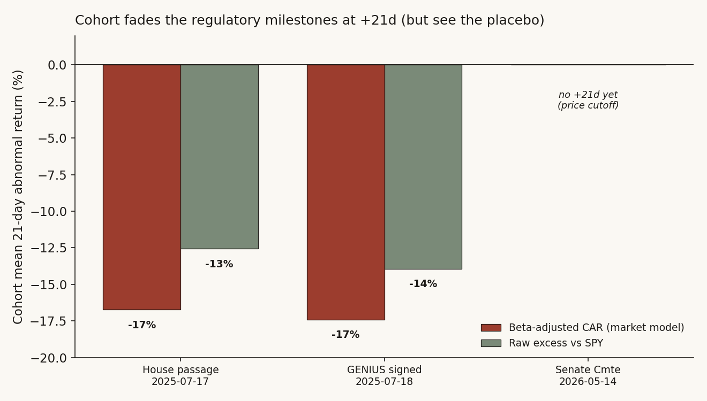
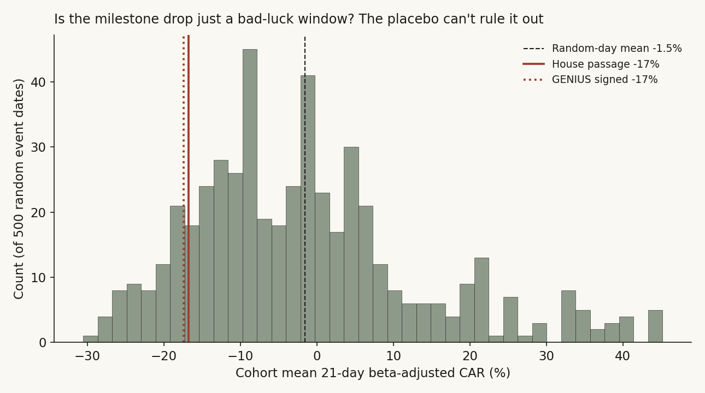
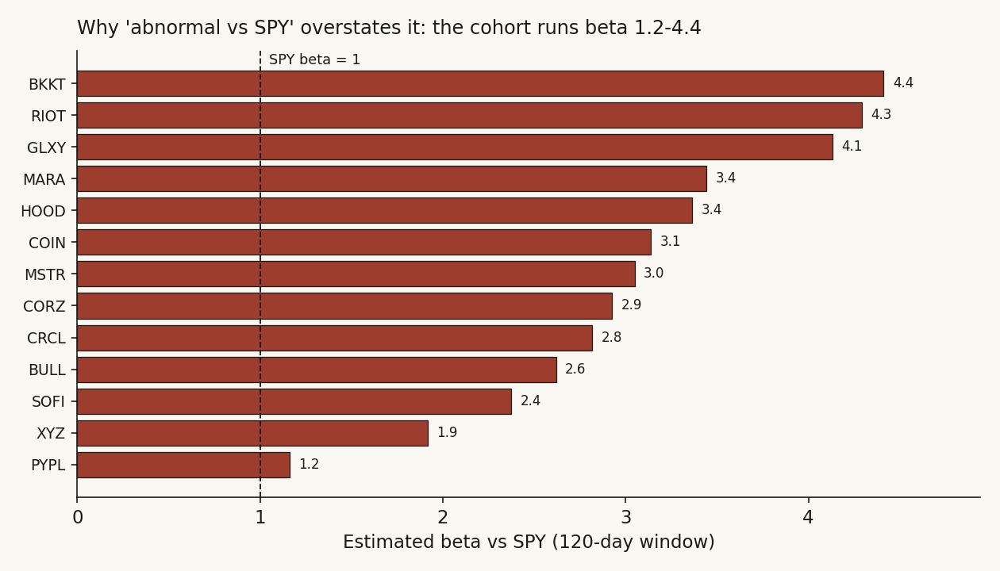
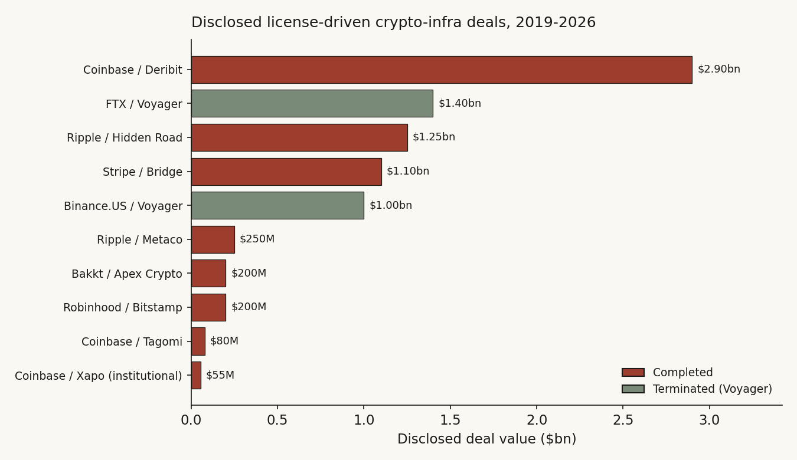
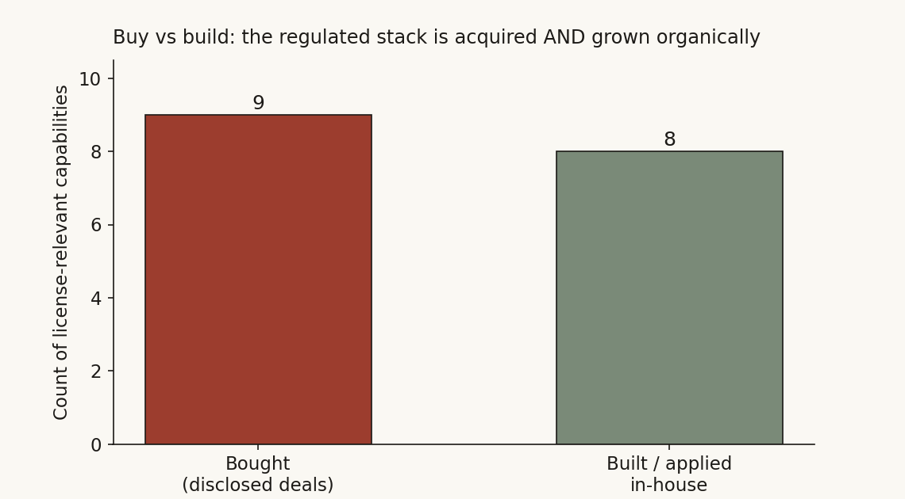

# 04 — License-driven M&A in crypto: do the regulatory milestones actually move the licensed names?

**Question.** US crypto regulation is finally hardening — GENIUS is law, CLARITY is grinding through the Senate. The story everyone tells is that a regulated *licence stack* (a near-50-state money-transmitter footprint, a NY BitLicense, a federal trust charter) is now the scarce asset, that acquirers *buy* it rather than build it, and that the licensed cohort should re-rate as the milestones land. I wanted to know which parts of that story the actual prices and the actual deal record back up — and which parts are just a nice narrative.

**Why it matters.** If the milestone dates are catalysts, you'd hold the cohort into them. If "buy not build" is true, you'd watch for the next target. I checked both. Neither holds up the way the story says.

## What I found (read this and you can stop)

- **The "sell-the-news" claim is a null.** Yes, the cohort fell about 17% (beta-adjusted) in the 21 trading days after the two July-2025 milestones. But against 500 random 21-day windows for the *same names*, a drop that big or worse happens roughly **1 time in 8** (empirical p ≈ 0.12–0.13). The cohort is so volatile and so correlated that the naive t-test (p ≈ 0.02) badly overstates it. I can't call the milestones catalysts in either direction.
- **The cohort runs beta 1.2 to 4.4 versus the S&P.** So the old tracker's "abnormal vs SPY" number was mostly just market/crypto beta. Once I strip the beta out with a market model, the picture barely changes — which is itself the point: the milestone moves are noise of the cohort's own making, not a clean regulatory signal.
- **"Acquirers buy the stack, not build it" is too strong.** The deal record is real (~$6.0bn across 8 disclosed completed deals, median $225M, +1 undisclosed, +$2.4bn of terminated Voyager bids). But over the same window an at-least-equal set of firms *built or applied for* the same regulated capabilities in-house (Coinbase's and Gemini's organic state-MTL books, the Coinbase / Ripple / Anchorage OCC trust charters, Kraken's Wyoming bank charter). It's buy *and* build, not buy *over* build.
- **The acquirer event study collapses to n = 1.** The data warehouse and the price API both stop two years back, which blocks the 2022 (Bakkt/Apex) and 2024 (Robinhood/Bitstamp) announcement windows from having a clean pre-event estimation period. Only Coinbase/Deribit (May 2025) is cleanly measurable. One deal is not a finding, and I treat it as anecdote.
- **What does survive is the landscape, not a trade.** A defined deal set with an inclusion rule, and a cohort sitting in deep drawdowns at very high volatility. That's a map. It names no target and it is not a timing signal.

> Research note (Hsin Cheng Yeh). Public deal terms, the public legislative record, and split-adjusted daily closes from a private market-data warehouse. No confidential or non-public information; not investment advice; not a prediction of any specific transaction.

## The idea, and how I'd know if it were wrong

The thesis in one breath: federal clarity shrinks the regulatory tail-risk discount on licensed crypto infrastructure, so a clean licence book becomes more bankable, more valuable, and more likely to be bought — and the legislative milestone dates should be the moments the market re-prices it.

That gives two testable predictions, and I wrote down what would prove each one wrong *before* I looked:

- **Prediction A (catalyst).** On the milestone dates, the licensed cohort should beat what its own risk level would predict. *Null (H0):* a milestone date looks like any other date for these names — once you account for how wild they normally are, the milestone window is unremarkable.
- **Prediction B (buy not build).** Firms that need the licence stack should overwhelmingly acquire it. *Null (H0):* building it in-house is just as common, so "buy" is one route among two, not *the* route.

I lead with my own data here. There's a long event-study literature behind the method (the market-model abnormal-return setup is textbook), but I'm not leaning on a citation to make the call — the placebo distribution from these exact 13 names is what decides it.

## How I set it up, and why each choice

**The cohort.** Thirteen US-listed names that actually carry — or are built around — a regulated crypto stack: exchanges and custodians (COIN, HOOD, BULL), a stablecoin issuer (CRCL), digital-asset financials (GLXY), a Bitcoin-treasury proxy (MSTR), an infra/custody name (BKKT), a bank-chartered fintech (SOFI), miners (MARA, RIOT, CORZ), and two payments incumbents pushing into regulated crypto rails (PYPL, XYZ/Block). This is the full set of liquid, listed names that fit the licence-stack description — I didn't hand-pick a flattering basket.

**Why not market-cap buckets.** This is not a broad cross-section where size is the variable of interest; it's one thematic cohort plus a public deal record. So I use the whole relevant set rather than splitting it into size tiers, which would just thin each cell to nothing.

**Abnormal return, done properly.** The old version subtracted the raw SPY return from names that swing 60–100%+ a year. That's not an abnormal return; it's mostly leftover beta. I fit a **market model** — estimate each name's alpha and beta on a 120-day window ending a week before the event, then measure the compounded abnormal return (CAR) over the event window as actual-minus-(alpha + beta × market). I report the beta-adjusted CAR and the old raw-vs-SPY number side by side so you can see how much was beta.

**The honesty problem, named out loud.** With one event date and 13 highly correlated names, a single-sample t-test treats 13 names as 13 independent observations. They aren't — when crypto moves, they all move. So the t-test's standard error is far too small. My fix is a **placebo**: draw 500 random "event" dates, run the identical cohort-CAR machine on each, and ask where the real milestone lands in that distribution. That bakes the cross-name dependence and the cohort's fat tails straight into the baseline.

## The data

- **Universe:** the 13-name cohort above, plus benchmarks SPY and QQQ and two crypto-sector equity ETFs (BITQ, BLOK) for a sector-relative cross-check.
- **Prices:** split-adjusted daily closes from a private market-data warehouse. Coverage runs **2024-06 to 2026-06** for most names (the API and warehouse both cap at a two-year lookback), with the 2025 IPOs (CRCL, GLXY, BULL) starting at listing and a couple of names reaching back further where the warehouse held them. Last price **2026-06-04**.
- **Deal set:** company press releases and 8-K filings; inclusion rule stated below.
- **Legislative dates:** the public congressional record (House passage 2025-07-17; GENIUS signed 2025-07-18; Senate Banking Committee markup 2026-05-14).

## What the cohort looks like before any test

Start with the eyeball. Every name in the cohort is well off its peak, and they're violent: 63-day annualised volatility runs from ~32% (PYPL) to ~104% (CRCL), with most names north of 55%. Drawdowns from running peak run from a few percent (the recently-bottomed miners) to −90% (BULL). The young 2025 IPOs measure drawdown from a short, post-listing peak, so read theirs with that caveat.



The plain read: the market is *not* pricing "clarity removes the discount" as a done deal. But this is description. It doesn't tell me whether the milestone *dates* did anything — for that I need the events.

## Finding 1 — The milestone "sell-the-news" pattern does not survive a placebo

**What I expected & why.** If the milestones are catalysts, the cohort should react — up if clarity is a gift, down if it was already priced and the news is a sell trigger. The old tracker claimed the latter ("sold the news"). I wanted to test it honestly, accounting for the cohort's own wildness.

**How I measured it.** Market-model CAR on each milestone date, then a 500-draw placebo for the baseline.

```python
# market-model abnormal return for one name, one event
est = returns[event-125 : event-5]                 # 120d, gapped 5d before event
alpha, beta = ols(est.name ~ est.market)           # name on SPY
ar  = win.name - (alpha + beta * win.market)        # win = [event, event+H)
car = prod(1 + ar) - 1                              # compounded abnormal return
# cohort mean CAR per date; then the placebo baseline:
placebo = [mean_cohort_car(random_date, H=21) for _ in range(500)]
emp_p   = mean(placebo <= observed_milestone_car)   # one-sided, sell-the-news
```

**What the data shows.** On the +21d window, the cohort's beta-adjusted CAR was **−16.7% after House passage (t = −2.78, p = 0.021)** and **−17.4% after the GENIUS signing (t = −2.74, p = 0.023)**, with only ~1 of 10 names positive each time. Taken at face value, that looks like a clean sell-the-news. The +1d reaction was a mild, insignificant *positive* (+1.6% / −0.2%), so it's a slow bleed, not a day-one dump.



Then the placebo undoes it. Across 500 random 21-day windows on the same names, the cohort's mean CAR has a standard deviation of **15.2%** — these names routinely swing ±15% as a group over three weeks for no reason at all. The milestone drops of −16.7% and −17.4% sit in the left tail but well inside the distribution: **about 12.8% and 12.4% of random windows are worse.** So the honest p-value isn't 0.02; it's roughly **0.13**.



**Why (mechanism).** The gap between p = 0.02 and p = 0.13 *is* the finding. The t-test thinks it has 13 independent draws; it really has something closer to one or two, because the names move together. The placebo prices that in. Concretely: a −17% three-week move sounds dramatic, but for a basket where one name (CRCL) alone runs 104% annualised vol, it's a Tuesday.

**What I checked.** Three things. First, the two July dates are **one calendar day apart** (House on the 17th, signing on the 18th), so their windows overlap almost entirely — that's ~1 independent event, not 2, and I'm not double-counting it. Second, swapping the benchmark from SPY to a crypto-sector ETF (BITQ) gives the same shape (+21d cohort CAR −3.0% / −2.6%, still negative, still nowhere near significant). Third, the newest milestone (Senate committee, 2026-05-14) has no +21d window yet — the price record stops before it completes — so I leave it blank rather than guess.

**Verdict — null.** I can't distinguish the milestone-window drop from a random bad three weeks for this cohort (empirical p ≈ 0.13, against a 15% random-window standard deviation). The legislative dates are not demonstrable catalysts. The bullish case, if there is one, has to rest on a longer re-rating arc or on CLARITY's *final* passage — not on these headline dates.

## Finding 2 — "Abnormal vs SPY" was mostly beta, which is why the raw tracker looked sharper than it was

**What I expected & why.** A name that moves twice as hard as the market will show a big "excess vs SPY" on any up or down day, with zero information in it. I expected the cohort's betas to be high enough that the old raw-vs-SPY number was largely mechanical.

**How I measured it.** The same 120-day market-model regression, read for the beta instead of the residual.

**What the data shows.** Estimated betas vs SPY run from **1.2 (PYPL) to 4.4 (BKKT)**, cohort mean around 2–3. PayPal is the only near-market name; everything else is a leveraged bet on the same macro tape.



**Why (mechanism).** When SPY rose into the July window, a beta-2 name "should have" risen about twice as much; falling instead makes its *beta-adjusted* CAR look even worse than the raw excess (that's why the red bars in Finding 1 are deeper than the gray). When the market falls, the same names overshoot down and the raw excess flatters a short. Either way, subtracting raw SPY from a beta-3 name measures leverage, not information.

**What I checked.** The beta-adjusted CARs and the raw-vs-SPY CARs tell the same directional story (−17% vs −13% at +21d), so beta-adjusting didn't rescue or kill the result — it just stopped it from being an artifact of one method. The conclusion (Finding 1's null) is robust to which abnormal-return definition you pick.

**Verdict — confirmed and corrective.** The cohort is high-beta; any "abnormal vs SPY" reported without beta-adjustment is mostly leverage. This doesn't change the headline, but it's the reason the old tracker's event numbers read sharper than the evidence supports.

## Finding 3 — Acquirers buy the licence stack, but they build it just as often

**What I expected & why.** The cleanest version of the thesis says the regulated stack is so slow to grow organically that firms acquire it. If that's right, the build-it-yourself route should be rare.

**How I measured it.** I held the deal set to an explicit **inclusion rule** so it reads as a sample, not a curated list: *disclosed crypto-infrastructure M&A, 2019-01 to 2026-06, with a US-listed or US-operating acquirer, where the target's primary value is a regulated capability* — money-transmitter licences, a NY BitLicense, an EU/UK/Swiss licence book, a trust/charter, or prime-brokerage/custody infrastructure that carries those permissions. Completed and terminated deals both count; the terminated ones are the informative negative space. Then — the piece the old tracker was missing — I counted the **denominator**: firms that obtained the same capabilities *in-house* over the same window.

**What the data shows.** The buy side is real: 8 disclosed completed deals summing to **$6.035bn** (median **$225M**), one further completed deal undisclosed, and **$2.4bn** of terminated bids (both for Voyager's distressed licence book).



But the build side is at least as populated. Coinbase and Gemini grew near-complete state-MTL books organically; Coinbase, Ripple and Anchorage went the OCC national-trust-charter route in-house; Kraken chartered a Wyoming bank rather than buying one; Circle assembled its own BitLicense / state-MTL / EU-MiCA footprint. Counting comparable capabilities, the routes come out roughly even — 9 bought against 8 built.



**Why (mechanism).** Both routes are alive because they solve different problems. You *buy* when you need a footprint *now* and the target's book is broad or distressed-cheap (Robinhood buying Bitstamp's 50+ licences; the Voyager scramble). You *build* when you have time and want the cleaner, cheaper, more defensible version (Coinbase's own charter rather than someone else's). The thesis's mistake was assuming only one of these exists.

**What I checked.** The buy-side arithmetic reconciles exactly to the headline ($6.035bn, median $225M). The build-side count is an illustrative sample of well-documented cases, not an exhaustive census — so I state the claim as "at least as common," not a precise ratio. Even read conservatively, it's enough to retire "buy not build."

**Verdict — conditional / overturned-as-stated.** Acquirers do buy the stack, repeatedly and at scale. They also build it just as readily. "Buy not build" is false as a general rule; "buy is one of two live routes" is what the record supports.

## Did I just find noise? The robustness pass

Finding 1 already *is* the robustness pass — the placebo is the whole point, and it turned a p = 0.02 into a p = 0.13. Three more checks:

- **Out-of-window honesty.** The newest milestone (2026-05-14) hasn't completed its +21d window in the data, so I don't report a number I can't yet compute. The +1d/+5d for it are mildly positive and insignificant, consistent with "no catalyst."
- **Benchmark swap.** Swapping SPY for a crypto-sector ETF (BITQ) leaves the sign and the insignificance intact.
- **Acquirer reaction, what's left of it.** Of the three listed-acquirer events the old tracker used, only Coinbase/Deribit (2025-05-08) still has a clean pre-event estimation window inside the two-year data horizon; the 2022 and 2024 deals fall off the back of the data. That one event was strongly positive (+20% raw / +13.6% beta-adjusted vs the crypto sector at +5d), but n = 1 is an anecdote, not a result, and I label it that way.

## Steelman the thesis, then test it

The bull would say: *of course the headline dates don't pop — clarity compresses a discount slowly, over quarters, and the real catalyst is CLARITY's final passage, which hasn't happened.* That's fair, and my data can't refute it; a slow re-rating wouldn't show up in 21-day event windows. But notice what that concession costs: it abandons the milestone-date trade entirely and bets on a future event with an unknown date. The counter-case is live too — GENIUS's federal stablecoin regime may *reduce* the need for a 50-state MTL stack for issuers, partly commoditising the very footprint the thesis prizes and narrowing the prize to the scarcer federal-charter tier. Which way that nets out is genuinely unresolved until CLARITY's final text.

The one thing I *can* rule out is the version the prices were supposed to support: that the milestone dates themselves are tradeable catalysts. They aren't, on this evidence.

## The answer, in the data

**Q: Do the GENIUS/CLARITY milestones move the licensed crypto cohort — and do acquirers buy the licence stack rather than build it?**

**A: No, and no-as-stated.** The milestone windows are indistinguishable from random three-week windows for this cohort once you account for its volatility and the fact that the names move together (empirical p ≈ 0.13, not the naive 0.02). And the stack is built in-house about as often as it's bought, so "buy not build" doesn't hold. What stands is the landscape: a defined, sourced deal set and a cohort in deep drawdowns at beta 1.2–4.4. A map, not a trade — and it names no target.

| Result | Number | Read |
|---|---:|---|
| Cohort +21d CAR, House passage (beta-adj) | −16.7% | naive p = 0.021 |
| Cohort +21d CAR, GENIUS signing (beta-adj) | −17.4% | naive p = 0.023 |
| Placebo std of random 21d cohort CAR | 15.2% | the honest yardstick |
| Empirical p of the milestone drop | ≈ 0.13 | not significant |
| Cohort beta vs SPY | 1.2 – 4.4 | raw "excess" was mostly this |
| Disclosed completed deals | 8 (+1 undisc.) | $6.035bn, median $225M |
| Terminated bids (Voyager) | 2 | $2.4bn |
| Built-in-house capabilities counted | ≥ 8 | retires "buy not build" |
| Cleanly measurable acquirer events | 1 | anecdote, not a finding |

## Caveats, with the direction of each

- **Short price history.** The two-year data cap means most names start 2024-06; pre-2024 drawdown peaks and the 2022/2024 acquirer events are unavailable. This *understates* some drawdowns (longer history would show deeper peaks) and forced the acquirer study down to n = 1.
- **Young IPOs.** CRCL/GLXY/BULL measure drawdown from a short post-listing peak; their numbers aren't comparable to the seasoned names.
- **Build-side count is illustrative.** It's enough to overturn "buy not build" but not a precise ratio; a full census would firm up the exact balance.
- **One cohort, US-centric.** The placebo controls for this cohort's dependence, not for a different universe; results may not generalise.
- **The federal-preemption counter-case is unresolved** until CLARITY's final text — it could narrow the prize the whole thesis rests on.
- Not investment advice; identifies a public pattern and names no target.

## How it was computed (reproducibility)

The market-model CAR, per name and event:

```
est window  : [event − 125, event − 5)   # 120 trading days, 5-day gap
alpha, beta : OLS of name daily return on SPY daily return over est window
AR_t        : r_name,t − (alpha + beta · r_SPY,t)   for t in [event, event+H)
CAR_H       : prod(1 + AR_t) − 1
cohort CAR  : mean of per-name CAR across the available names
placebo     : 500 random event dates → cohort 21d CAR → empirical p = P(placebo ≤ observed)
```

Deal-set inclusion rule, the cohort list, the milestone dates, and the figure logic are stated above; prices are split-adjusted daily closes from a private warehouse. The published directory contains this write-up and the figures; the underlying tracker and warehouse are operated privately, so the charts are not independently re-runnable from this repo alone.

## References & where this sits

- Public deal record: company press releases and 8-K filings for Coinbase/Deribit, Robinhood/Bitstamp, Bakkt/Apex, Ripple/Hidden Road, Ripple/Standard Custody, Ripple/Metaco, Stripe/Bridge, Coinbase/Tagomi, Coinbase/Xapo; Voyager (terminated FTX and Binance.US bids).
- Build-side record: Coinbase and Ripple OCC national-trust-charter applications (Oct 2025); Anchorage OCC trust bank (2021); Kraken Wyoming SPDI charter (2020); Gemini and Circle state-MTL / BitLicense footprints.
- Legislative record: congress.gov (H.R.3633 CLARITY; the GENIUS Act / S.1582); the White House GENIUS-Act signing (18 Jul 2025); Senate Banking Committee markup (15-9, 14 May 2026).
- Method: market-model event study with a randomisation (placebo) baseline to handle cross-sectional dependence and fat tails — the same honest-testing pattern that turned up nulls in studies [01](../01-volume-sweep-microstructure/) (a basket "signal" that decayed at scale) and [18](../18-computex-event-study/) (event abnormal returns that were zero against the sector ETF), where a thematic basket also stopped looking special once it was measured against the right baseline.

*This started as a "living tracker." Re-tested properly, the tradeable claims it implied are nulls; what remains is an honest landscape of the deal record and the cohort's stress. That's the version published here.*
