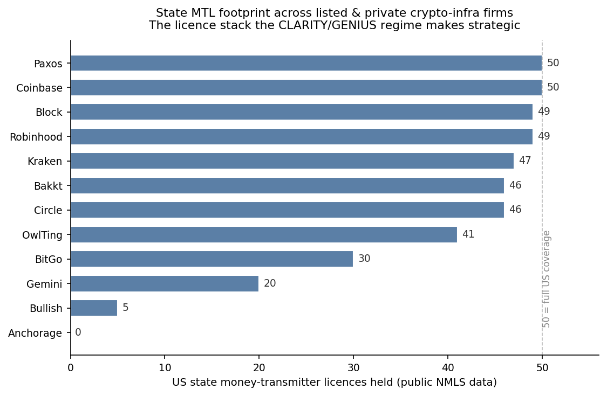

# License-driven M&A in crypto infrastructure: what the CLARITY/GENIUS regime makes valuable

**As US crypto regulation crystallises, the binding constraint to operate becomes the licence stack — and history says firms buy that stack faster than they build it.**

*Hsin Cheng Yeh · independent research · 2026*

---

## Thesis

US digital-asset regulation is moving from ambiguity to a framework: the **GENIUS Act** (stablecoin issuance/licensing) is law, and the **CLARITY Act** (market-structure: who regulates what) has passed the House and sits in the Senate. As the rules harden, the scarce, slow-to-build asset isn't technology — it's **regulatory coverage**: a near-50-state money-transmitter-licence (MTL) footprint, a NY BitLicense, and increasingly a federal (OCC) charter.

Building that stack organically takes years and state-by-state approvals. **Acquiring a company that already holds it is the shortcut** — and the public record shows acquirers repeatedly paying for exactly that. This note maps who holds the licences (public data) and what acquirers have historically paid to buy them (public deals). It does **not** predict specific takeovers — it identifies the *pattern* and the *characteristics* that make a licensed platform strategically relevant.

## Who holds the licence stack (public NMLS / regulatory data)

| Company | US states | BitLicense | OCC | EU MiCA | UK FCA |
|---|---:|:-:|:-:|:-:|:-:|
| Coinbase | 50 | Y | – | Y | Y |
| Paxos | 50 | Y | Y | Y | – |
| Robinhood | 49 | Y | – | Y | Y |
| Block | 49 | Y | – | – | – |
| Kraken | 47 | Y | – | – | Y |
| Circle | 46 | Y | Conditional | Y | Y |
| Bakkt | 46 | Y | – | – | – |
| OwlTing | 41 | – | – | Pending | – |
| BitGo | 30 | – | Y | – | – |
| Gemini | 20 | Y | – | Y | Y |
| Bullish | 5 | – | – | – | – |
| Anchorage | 0 (federal) | Y | Y (national trust) | – | – |

*(Licence counts are point-in-time public data and change as approvals are granted.)* Anchorage is the instructive outlier — it skipped the state-by-state route entirely with a federal OCC national trust charter, which is exactly the structural prize the CLARITY/GENIUS framework elevates.

## The pattern: acquirers buy licences (public, announced deals)

| Year | Acquirer | Target | Deal size | What was really bought |
|---|---|---|---:|---|
| 2024 | Stripe | Bridge | $1,100M | Stablecoin orchestration + rails |
| 2025 | Ripple | Hidden Road | $1,250M | Multi-asset prime brokerage |
| 2024 | Robinhood | Bitstamp | $200M | EU/UK licences + 50-state footprint |
| 2022 | Bakkt | Apex Crypto | $200M | State-MTL footprint at scale |
| 2024 | Ripple | Metaco | $250M | Custody tech + Swiss-adjacent licensing |
| 2024 | Coinbase | Tagomi | ~$80M | BitLicense + prime brokerage |
| 2019 | Coinbase | Xapo | $55M | BitLicense + licence consolidation |

The terminated deals are as informative as the completed ones: both **FTX–Voyager ($1.4B)** and **Binance.US–Voyager ($1.0B)** were attempts to consolidate a distressed player's *state-MTL book and retail base* out of bankruptcy. Across a decade, the recurring rationale is the same — **buy the licensed footprint, skip the queue.**

## Why CLARITY raises the value of an existing licence book

- **Legal status** (public legislative tracking): House passed CLARITY on 17 Jul 2025; it now needs Senate Banking Committee markup, a 60-vote floor passage, reconciliation with the Senate Agriculture bill, a merged House–Senate reconciliation, then signature.
- **Mechanism:** federal market-structure clarity reduces the regulatory tail-risk discount that has sat on licensed crypto-infra equity. As that discount compresses, a clean, broad licence book becomes a more bankable acquisition asset — and a more expensive one to replicate from scratch.

## What it implies — categories, not names

The defensible read is about *characteristics*, not a target list:

- **Most strategically relevant licensed platforms** share three traits: a broad state-MTL footprint (40+), a NY BitLicense, and a clean compliance/enforcement record. The federal-charter holders (Anchorage, Paxos) are a distinct, scarcer tier.
- **The natural acquirers** are payment networks and fintechs that need regulated US rails without a multi-year licensing slog — the same profile as the Stripe and Mastercard (BVNK) stablecoin-infra purchases.
- **The catalyst that converts pattern into activity** is CLARITY's passage compressing the regulatory discount.

## Caveats

- **Not investment advice, and not a prediction of any specific transaction.** This identifies a public pattern and the public licence landscape; it deliberately does not name takeover targets.
- Licence counts are point-in-time public data and shift with new approvals.
- M&A is idiosyncratic — strategic fit, governance, and price kill more deals than licensing logic creates.
- US-centric; EU MiCA and UK FCA regimes follow different consolidation dynamics.

---

*Part of a series of independent research notes. Public regulatory data and announced transactions only — no confidential, client, or non-public information.*
