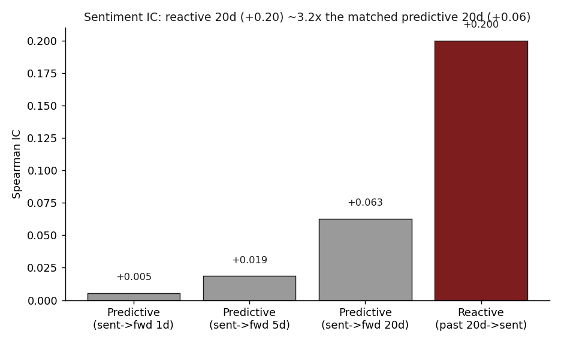
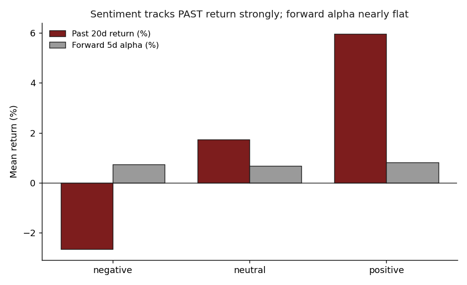
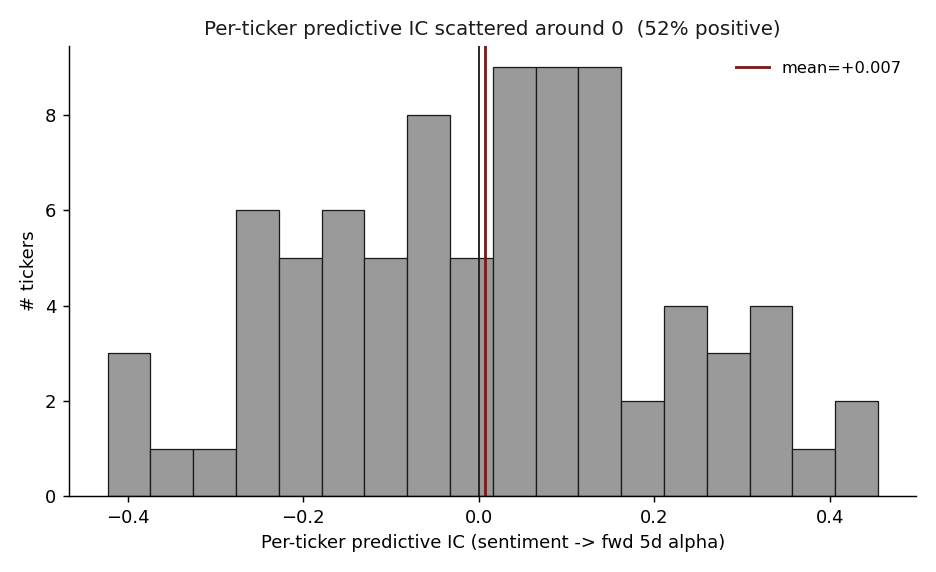

# 05 — News sentiment is reactive, not predictive

**Question.** Does model-tagged news sentiment at post-time *predict* a stock's forward return, or does it merely *mirror* the return it already had? **Finding.** It mirrors. Sentiment tracks the prior 20-day return strongly (Spearman IC **+0.20**, 95% CI [+0.17, +0.23]); its horizon-matched forward IC is about one-third as large (**+0.06**), and the directly tradable long-short spread is statistically zero. Verdict: **reactive**.

> Research / backtested. No live capital, no audited track record. News-headline sentiment only, one ~21-month bull regime; the one "significant" predictive number does not survive a time split.

## Data & method

- **Sample:** 4,035 news-sentiment posts across ~117 tickers (the names that had both news coverage and computable post-event returns), 2024-07 to 2026-04.
- **What was tested:** each post carries a third-party model's positive/neutral/negative tag mapped to {+1, 0, −1}. I measure the *reactive* link (prior 20-day return → sentiment) and the *predictive* link (sentiment → forward 1/5/20-day market-adjusted alpha) on the same names, holding the horizon fixed at 20 days for the honest head-to-head.
- **Metric & validation:** rank-based Spearman information coefficient (IC) with p-values, a positive-minus-negative long-short spread with a bootstrap 95% CI and Mann-Whitney test, a per-ticker IC distribution, and a time-split / walk-forward stability check on the one predictive number that clears significance. Forward returns are market-adjusted and winsorized at ±50%.

## Claim 1 — Sentiment tracks the past ~3x more strongly than the future

Holding the horizon fixed at 20 days on both sides, the reactive correlation dwarfs the predictive one.

| Relationship | Spearman IC | p-value | n | Read |
|---|---:|---:|---:|---|
| Reactive: past-20d return → sentiment | **+0.200** | 2e-37 | 4,001 | strong, significant |
| Reactive: %-from-52w-high → sentiment | +0.329 | 1e-101 | 4,001 | strongest |
| Reactive: RSI-at-post → sentiment | +0.246 | 2e-56 | 4,001 | strong |
| Predictive: sentiment → forward-1d alpha | +0.005 | 0.73 | 4,035 | noise |
| Predictive: sentiment → forward-5d alpha | +0.019 | 0.24 | 4,035 | not significant |
| Predictive: sentiment → forward-20d alpha | +0.063 | 0.0003 | 3,352 | significant **but unstable** (Claim 3) |

The horizon-matched reactive/predictive ratio is **~3.2x** (+0.200 / +0.063). Sentiment correlates more tightly with momentum technicals already printed on the chart (%-from-52w-high, RSI, distance above the 200-day) than with any forward return — it is a restatement of the trend, not a forecast of it.

## Claim 2 — Forward returns are flat across sentiment buckets; the long-short edge is zero

Bucket the posts by sentiment and the *past* return rises monotonically (negative −2.6%, neutral +1.7%, positive +6.0%) while the *forward* 5-day alpha is nearly flat — and the negative bucket does not even underperform the positive one.

| Slice | n | % fwd-5d > 0 | mean past-20d return | median fwd-5d alpha | mean fwd-5d alpha |
|---|---:|---:|---:|---:|---:|
| Positive sentiment | 2,418 | 51.7% | +6.0% | +0.0023 | +0.0081 |
| Neutral sentiment | 844 | 47.7% | +1.7% | −0.0026 | +0.0068 |
| Negative sentiment | 773 | 49.7% | −2.6% | −0.0007 | +0.0074 |
| **Baseline (all)** | 4,035 | 50.5% | — | +0.0011 | +0.0077 |

The long-short (positive minus negative) forward-5d alpha is **+0.0007, 95% CI [−0.0073, +0.0084]** — it spans zero (Mann-Whitney p=0.49). **No tradable edge.** Per ticker, the predictive IC distribution is centered on zero (mean +0.007, 52% positive), so there is no broad cross-sectional signal hiding under the aggregate.

## Claim 3 — The one "significant" predictive number does not survive a time split

Forward-20d IC is the only predictive figure that clears significance (+0.063, p=0.0003). Split it by time and almost all of it lives in the most recent window:

| Window | IC (sentiment → fwd-20d) | n |
|---|---:|---:|
| Early half (2024-07 .. 2025-12) | +0.041 (p=0.10, not significant) | 1,676 |
| Late half (2025-12 .. 2026-04) | +0.087 (p<0.001) | 1,676 |
| By year 2024 | −0.013 | 432 |
| By year 2025 | +0.017 | 1,419 |
| By year 2026 | **+0.139** | 1,501 |

The effect roughly doubles between halves and goes from ~0 (slightly negative) in 2024 to +0.14 in 2026. The forward-5d walk-forward shows the same fragility — the sign flips across the split (in-sample −0.042, out-of-sample +0.077). A signal whose entire effect concentrates in the last few months of a single-regime sample is not something to trade.

## The answer, in the data

**Q: Does news sentiment predict forward returns, or react to past ones?**
**A: Reactive.** It describes where price has been, not where it is going.

| | Reactive (past-20d → sentiment) | Predictive (sentiment → fwd-20d) | Long-short fwd-5d |
|---|---:|---:|---:|
| Spearman IC / spread | **+0.200** | +0.063 | +0.0007 |
| Significant? | yes (CI [+0.17, +0.23]) | only in-sample; fails time split | no (CI [−0.0073, +0.0084]) |
| Tradable? | — | no | no |

Use news sentiment as a fast read on where price *has been* (a momentum/trend mirror), not as an entry signal.

## Caveats

- **News-headline sentiment only.** This is the only corpus source carrying a sentiment field; social, transcript and RSS sentiment are not tested, so "reactive" is specific to news-headline tags.
- **Model-generated labels.** The tags are a third-party model's, not human-validated. Label noise would bias ICs toward zero — yet the strong *reactive* IC shows the labels do encode the prior trend.
- **Selection bias.** Only ~117 tickers survive the news-plus-returns join; these skew toward larger, more-covered names.
- **Single regime, ~21 months.** 2024-07 to 2026-04 is one broad bull window; the temporal-stability failure means the late-sample predictive flicker may be regime-specific, not structural.
- **Imbalanced classes** (60% positive) concentrate the negative bucket in a smaller n=773; rank-based tests tolerate this but it bounds the negative-side precision.

## References

- Tetlock (2007). *Giving content to investor sentiment: the role of media in the stock market.* Journal of Finance — the canonical result that news sentiment relates to returns, here tested for direction (lead vs lag).
- Da, Engelberg & Gao (2011). *In search of attention.* Journal of Finance — attention/sentiment proxies as concurrent, not leading, signals.
- Technical context (RSI, 52-week-high distance, 200-day moving average) is standard momentum literature; the sentiment tags are a third-party model's output used only in aggregate, not reproduced.
