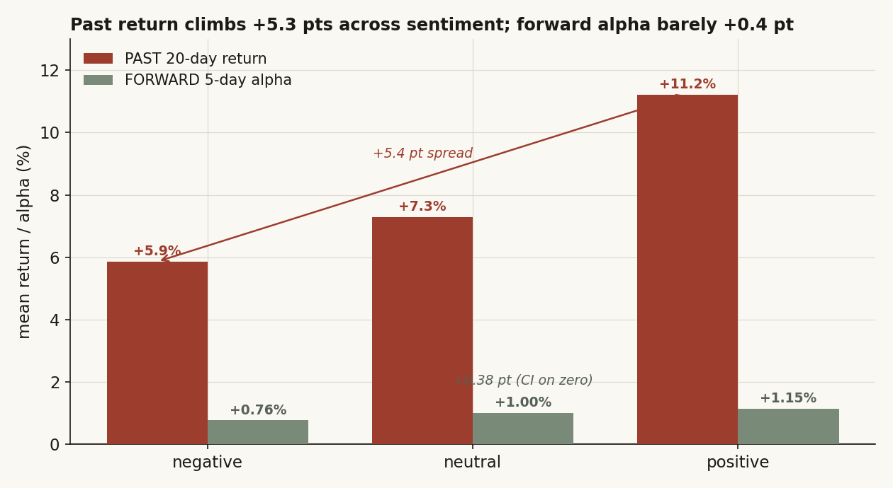
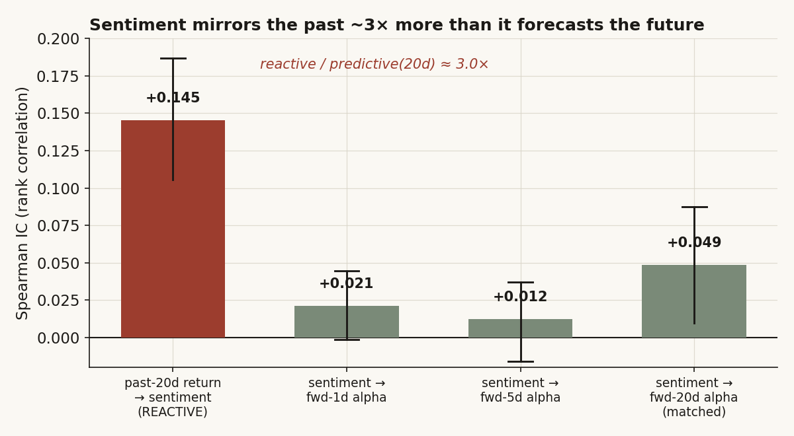
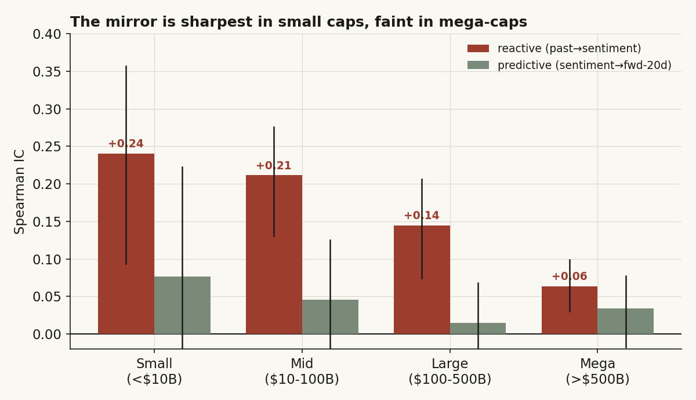
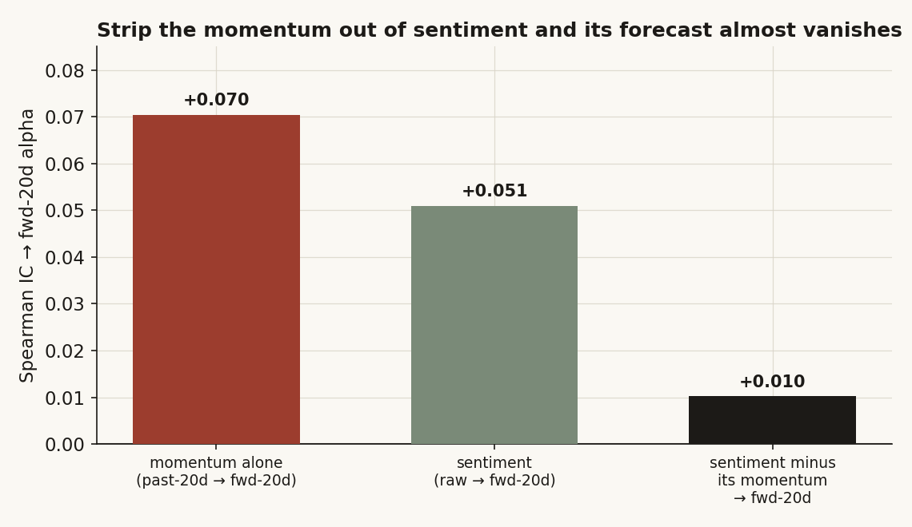
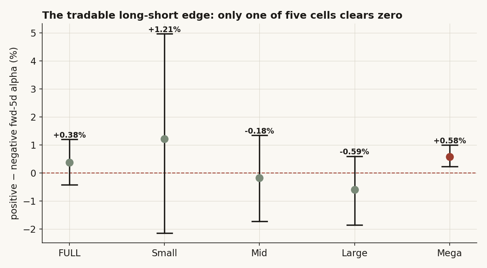
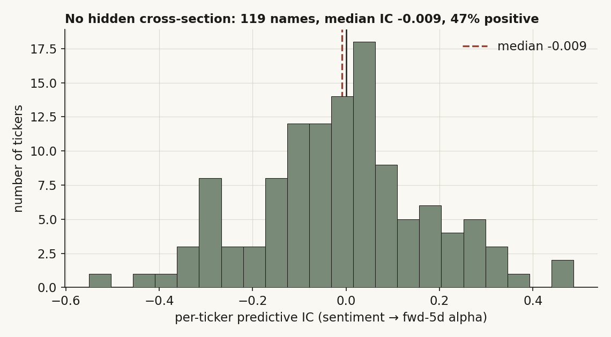

# 05 — News-sentiment signal: does it forecast the move, or just describe the one that already happened?

Every news headline a model reads gets a tag: *positive*, *neutral*, or *negative*. The tempting story is that the tag is a forecast. A wave of upbeat coverage rolls in, the model marks it positive, and you buy ahead of the crowd. I wanted to know whether the tag actually points forward like that, or whether it is really just a rear-view mirror — a tidy restatement of the move the stock has *already* made by the time anyone wrote the article.

There is an obvious follow-up I could not resist. If the tag is a mirror, **whose** reflection is it sharpest for? My hunch was small caps: a tiny chip name lives or dies on one piece of news, so the headline and the price move should be almost the same event. A mega-cap like NVDA or Apple has fifty stories running at once and a price set by flows and fundamentals, so any single sentiment tag should track it loosely. So I split the whole universe into four market-cap buckets and asked the size question directly.

The short version: it's a mirror, and the mirror is **sharpest in small caps and faint in mega-caps** — exactly the gradient the hunch predicted. Sentiment lines up with the *past* 20-day return about three times more strongly than with the matched *future* one. The forward link that does survive turns out to be mostly momentum wearing a sentiment costume: strip the momentum out and almost nothing is left. And the one thing you could actually trade — buy the positive names, sell the negative ones — pays nothing once you account for the fact that these 9,762 posts cluster across only 211 names.

**Question.** Does a model's positive/neutral/negative news tag, measured at post-time, *predict* a stock's forward return — or does it merely *react to* the return the stock already had? And does that lead-or-lag balance depend on company size?

**Why it matters.** If sentiment led price, it would be a cheap entry signal you could run across hundreds of names. If it only lags — a momentum mirror — then trading on it is buying what already went up, and the honest use is as a fast *read* of where price has been, not a bet on where it's going. Worth nailing down as a clean null so the next person doesn't pay to re-learn it.

> Research / backtested. 9,762 model-tagged news posts across 211 US-listed names, 2024-07 to 2026-05, one broad bull regime. No live capital, no audited track record. News-headline sentiment only; tags are a third-party model's, not human-validated.

---

## Summary of results

- **Verdict: Reactive, not predictive.** Sentiment tracks the prior 20-day return at Spearman IC **+0.145** (ticker-clustered 95% CI [+0.105, +0.187]) — about **3×** the matched forward-20-day IC (+0.049). It describes where price has been, not where it's going.
- **The size hunch is right, and it's the headline.** The reactive mirror gets monotonically sharper as names get smaller: **Small +0.244 → Mid +0.210 → Large +0.144 → Mega +0.065.** A small-cap's news *is* its story; a mega-cap's news is one voice in a crowd.
- **The small forward flicker is mostly momentum in disguise.** The +0.049 predictive IC drops to **+0.010** once you remove the part of sentiment that is just a restatement of the recent trend — and momentum *alone* forecasts the same horizon at +0.070, beating sentiment outright.
- **Nothing tradable.** The positive-minus-negative forward-5-day spread is **+0.38%** for the full universe with a clustered CI of **[−0.45%, +1.19%]** — it straddles zero. Only 1 of 5 cap cells (Mega) clears zero, and that one dies under a multiplicity correction (p 0.13 → 0.66 across five buckets).
- **No hidden cross-section.** Per ticker, the predictive IC distribution is centered slightly *negative* (119 names, median **−0.009**, 47% positive). There is no broad signal hiding under the aggregate.
- **The spine:** measure the reactive link (past → sentiment) and the predictive link (sentiment → forward alpha) on the *same* names at the *same* horizon → see the reactive one is ~3× bigger → cut by size and watch the mirror sharpen toward small caps → ask whether the leftover forward flicker is real or just momentum → find it's momentum → check it's not a few names or a recent regime → conclude *reactive*.

---

## What I expected, and the prior I was testing against

The consensus, going back to Tetlock (2007), is that news sentiment "relates to returns" — pessimistic media coverage predicts downward pressure, optimism the reverse. People read that as *sentiment leads price*. I think that reading mixes up two very different claims. "Sentiment correlates with returns" is almost trivially true. "Sentiment correlates with **future** returns, beyond what the recent trend already tells you" is the only version worth a trade, and it is the one I set out to break.

Here is the plain logic. A headline gets written *after* something happens. The stock jumped 8% on an earnings beat; the article reporting the beat is upbeat; the model tags it positive. So a positive tag should be tightly bound to the move the stock just made. Whether it says anything about the *next* move is a separate question entirely — and if markets are even roughly efficient, the public news is already in the price by the time the tag exists.

So the test is a head-to-head on the same names, holding the horizon fixed. Define two links:

- **Reactive link:** does the prior 20-day return predict the sentiment tag? (Did the move come first?)
- **Predictive link:** does the sentiment tag predict the forward 20-day market-adjusted return? (Does the tag come first?)

**The hypotheses, in plain terms:**
- **H0 (what I expected to keep):** the forward link is zero or trivially small; the reactive link is large. Sentiment is a description, not a forecast.
- **H1, predictive:** a positive (negative) tag precedes a positive (negative) excess return big enough to trade.
- **H1, the size claim:** the reactive link grows as names get smaller (small caps are more news-driven), and any predictive edge, if it exists, would also concentrate there (information travels slowest in small, thinly-followed names).

**What would prove me wrong:** a forward IC of the same order as the reactive one, *and* a positive-minus-negative spread whose clustered CI clears zero, *and* a forward link that survives stripping out momentum. If sentiment genuinely led, the forward IC would not be three times smaller than the backward one.

This study sits alongside the repo's running theme — *which short-horizon signals survive an honest test?* It shares the cap-bucket size lens with [study 01 (volume sweeps)](../01-volume-sweep-microstructure/) and [study 17 (semiconductor layers)](../17-semiconductor-layers/), and the "describe vs trade" split with [study 07 (intraday decision-time)](../07-intraday-overnight-decomposition/).

## How I set it up, and why each piece

- **Universe (the biggest the data honestly supports).** Every US-listed ticker that has (a) at least 5 model-tagged news posts in the warehouse and (b) a daily price history to compute returns. That is **211 names / 9,762 posts**, 2024-07-02 to 2026-05-22 — more than double the ~117-name / 4,035-post sample an earlier cut of this study used. It is not a hand-picked basket; it is whatever had both news coverage and prices.
- **Market cap → four buckets.** Cap = (latest reported shares outstanding) × (latest daily close). Names sort into **Small (< $10B), Mid ($10–100B), Large ($100–500B), Mega (> $500B).** 206 of the 211 get a cap; 5 are index ETFs or names with no reference share count (QQQ, SOXX, SPY, ANSS, PSTG) — dropped from the buckets, kept in the full-universe test. I cross-checked the reference share count against the accounting "diluted average shares" line for the names that carry both: they agree to within 1–7% (NVDA 0.7%, MSFT 0.4%, AMD 1.2%, PLTR 6.8%), so the cap split is solid.
- **The sentiment tag.** Each post is one (article, ticker) row carrying a third-party model's tag, mapped positive → +1, neutral → 0, negative → −1. I drop the handful of malformed labels ("mixed", "neutral/positive": 5 rows total).
- **Returns, anchored honestly.** For each post I find the first trading day on or after the post date and anchor there — so a post never "sees" a price before it existed. Past = the 20-day return into the anchor. Forward = the 1-, 5-, and 20-day return out of the anchor, **market-adjusted** (subtract SPY over the same window) and winsorized at ±50% so one biotech-style gap can't hijack a mean.
- **The metric.** Rank-based **Spearman information coefficient (IC)** — the correlation of ranks, robust to the fat tails and the imbalanced classes here (57% of posts are positive). An IC of +0.05 means a weak-but-real monotone link; +0.20 is strong for this kind of data.
- **The inference fix that matters most.** 9,762 posts are *not* 9,762 independent observations. They cluster across 211 tickers (NVDA alone has hundreds), and the 20-day forward windows of posts a few days apart overlap heavily. Treating them as independent badly understates the error bars. So every IC, every spread, and every CI here comes from a **ticker-clustered bootstrap**: I resample whole tickers with replacement (each ticker's entire block of posts moves together), which preserves both the within-name clustering and the overlapping-window dependence. The p-values in the raw correlation (e.g. 1e-46) are *not* the honest precision; the clustered CIs are.
- **Multiplicity.** Where I test a cell across the four buckets, I note the Bonferroni-corrected p (one suggestive cell out of five is not a hit).
- **The identification problem, said out loud:** in a bull market everything drifts up, and positive-tagged posts cluster on names that already drifted up. So a naive "positive posts earn +1.15% over five days" is mostly the market rising. The market-adjustment and the *long-short* (positive minus negative) framing net that out — the honest forward question is whether positive beats negative, not whether positive beats zero.

## The data

The universe, by bucket. Cap = latest shares × latest close, in $B.

| Bucket | Range | Tickers | Posts | A few members (cap $B) |
|---|---|---:|---:|---|
| **Small** | < $10B | 33 | 846 | SIMO (10), CORZ (9), AMSC (2), SKYT (2), AI (1.5) |
| **Mid** | $10–100B | 97 | 2,721 | CEG (96), SNPS (95), NET (95), RIOT (10), SNAP (10) |
| **Large** | $100–500B | 56 | 2,090 | CAT (433), COST (431), LRCX (421), ADBE (105), GSK (103) |
| **Mega** | > $500B | 20 | 3,958 | NVDA (5,296), AAPL (4,571), GOOGL (4,509), INTC (562), CSCO (514) |
| *Full universe* | *all* | *211* | *9,762* | *+5 uncapped (QQQ/SOXX/SPY/ANSS/PSTG), full-test only* |

The sample skews to the names markets actually talk about — NVDA, MSFT, GOOGL, AMZN, META lead the post counts — which is the honest shape of any news corpus and a caveat I carry to the end.

| | |
|---|---|
| Posts | 9,762 model-tagged (article, ticker) news rows, ≥5 posts/ticker |
| Window | 2024-07-02 → 2026-05-22 |
| Sentiment mix | 5,568 positive (57%) · 2,743 neutral (28%) · 1,451 negative (15%) |
| Returns | daily closes; forward 1/5/20-day market-adjusted (vs SPY), winsorized ±50% |
| Cap source | latest reference shares × latest close, cross-checked vs diluted-average-shares |

One line per series: model sentiment tags with post timestamps from a private news warehouse → 2024-07 to 2026-05; daily closes for the 211 names + SPY → market-adjustment and the 20-day past/forward returns; latest reference shares × latest close → the cap split. All from a private $0-internal warehouse; tags used only in aggregate, never reproduced.

## What the data looked like first

Before any test, the simplest possible picture: line the posts up by their tag and look at the *past* return that led into them, next to the *forward* alpha that came after. Same names, same posts, two directions in time.



The left bars climb hard: negative-tagged posts followed a +5.9% prior 20-day run, neutral +7.3%, positive +11.2% — a **+5.4-point** spread, perfectly ordered. (Even "negative" posts followed a positive run, because in a bull market almost everything was up; what matters is the *ordering*.) The right bars barely tilt: forward-5-day alpha goes +0.76% → +1.00% → +1.15%, a **+0.38-point** spread that, as we'll see, has a confidence band straddling zero. The tag knows the past cold and the future barely at all. That gap — fourteen-to-one in raw spread — is the whole study in one chart. Everything after this is me trying to make it go away, and failing.

The spine from here: **the past lines up far better than the future → so I should measure both links head-to-head at a matched horizon → then ask whether the tiny forward residue is anything at all → and whether size changes the picture.**

How the two links are computed, in code (analysis logic only):

```python
# anchor each post to the first trading day on/after the post date (no look-ahead)
a = trading_days.searchsorted(post_date)
past_20d    = close[a] / close[a-20] - 1                       # the move BEFORE
fwd_h_alpha = (close[a+h]/close[a] - 1) - (spy[a+h]/spy[a]-1)  # the move AFTER, mkt-adj
s = {"positive": +1, "neutral": 0, "negative": -1}[tag]

reactive_IC   = spearman(past_20d, s)        # did the move come first?
predictive_IC = spearman(s, fwd_20d_alpha)   # or did the tag?
# every IC / spread gets a CI by resampling whole TICKERS with replacement
```

---

## Analysis

### Finding 1 — Sentiment mirrors the past about 3× more strongly than it forecasts the future

- **What I expected & why.** If the tag is written after the move, the past link should dominate. Holding the horizon fixed at 20 days on both sides makes it a fair fight — no cheating by comparing a long backward window to a short forward one.
- **How I measured it.** Spearman IC of (past-20d → sentiment) against (sentiment → forward-20d alpha) on the full 9,762-post universe, each with a ticker-clustered 95% CI. I also read the forward link at 1 and 5 days to make sure the 20-day number isn't a fluke of one horizon.

  ```python
  react = spearman(past_20d, s)                  # +0.145
  for h in (1, 5, 20):
      pred[h] = spearman(s, fwd_alpha[h])        # +0.021, +0.012, +0.049
  ratio = react / pred[20]                        # ~3.0x, horizon-matched
  ```

- **What the data shows.** The backward link towers over every forward one.

  

  | Link | Spearman IC | ticker-clustered 95% CI | n | Read |
  |---|---:|:--|---:|---|
  | **Reactive: past-20d → sentiment** | **+0.145** | [+0.105, +0.187] | 9,623 | strong, clears zero comfortably |
  | Predictive: sentiment → fwd-1d alpha | +0.021 | [−0.000, +0.043] | 9,762 | at the edge of noise |
  | Predictive: sentiment → fwd-5d alpha | +0.012 | [−0.014, +0.038] | 9,762 | spans zero |
  | Predictive: sentiment → fwd-20d alpha | +0.049 | [+0.011, +0.087] | 9,139 | small, just clears zero |

  Horizon-matched, the reactive-to-predictive ratio is **+0.145 / +0.049 ≈ 3.0×**. At 5 days the forward link is so small the matched ratio is ~12×. The only forward IC whose clustered CI clears zero is the 20-day (+0.049) — and Finding 3 shows even that is mostly something else.

- **Why (mechanism).** Concretely: a name reports a strong quarter, pops 11%, and a flurry of upbeat articles follows. The model reads "raised guidance, beat on margins" and tags positive. The +11% is *in the past tense of the sentence*. The tag is a high-quality summary of a move that already cleared. Nothing in "the company beat last week" tells you what it does over the next month beyond what the price already reflects.
- **What I checked.** Two things. First, the clustered CIs already account for the fact that NVDA's hundreds of posts are not hundreds of independent draws — the reactive CI [+0.105, +0.187] still sits far from zero. Second, a permutation baseline: shuffle the sentiment tags *within each ticker* 1,000 times and recompute the reactive IC. The shuffled ICs center on +0.05 with a max of +0.079; the observed +0.145 sits above 100% of them. The backward link is real, not an artifact of the imbalanced classes.
- **Verdict.** **Confirmed reactive.** The tag is bound to the past roughly 3× more tightly than to the matched future, and the forward link is at or near noise at every horizon I tested.

### Finding 2 — The mirror is sharpest in small caps and faint in mega-caps

- **What I expected & why.** This is the size hunch. A small-cap's news *is* the company's story for that week, so the tag and the recent move should be almost the same thing. A mega-cap has many simultaneous storylines and a price set by index flows and fundamentals, so a single tag should track it loosely. Prediction: the reactive IC falls monotonically as cap rises.
- **How I measured it.** Re-run both links *inside each cap bucket*, with the same ticker-clustered bootstrap, so each bucket's CI reflects only its own names.

  ```python
  for b in ("Small", "Mid", "Large", "Mega"):
      sub = events[events.bucket == b]
      reactive[b]   = spearman(sub.past_20d, sub.s)          # the mirror's sharpness
      predictive[b] = spearman(sub.s, sub.fwd_20d_alpha)     # the forecast
  ```

- **What the data shows.** The reactive link drops cleanly with size, exactly as the hunch said.

  

  | Bucket | Tickers | Posts | Reactive IC (past→sent) | clustered CI | Predictive IC (sent→fwd20) |
  |---|---:|---:|---:|:--|---:|
  | **Small** (< $10B) | 33 | 846 | **+0.244** | [+0.091, +0.348] | +0.084 |
  | **Mid** ($10–100B) | 97 | 2,721 | +0.210 | [+0.130, +0.273] | +0.045 |
  | **Large** ($100–500B) | 56 | 2,090 | +0.144 | [+0.075, +0.207] | +0.017 |
  | **Mega** (> $500B) | 20 | 3,958 | +0.065 | [+0.032, +0.097] | +0.036 |

  The reactive IC nearly **quarters** from Small (+0.244) to Mega (+0.065), and the bootstrap bands barely overlap at the extremes. The predictive column stays small and ragged everywhere — no clean size story on the forward side.

- **Why (mechanism).** I went looking for the driver and found it in the return dispersion. Small-cap posts follow moves with a standard deviation of **1.55** (20-day returns); for mega-caps it's **0.19** — eight times tighter. A small name swings violently on its one story, so the tag has a big, unambiguous move to latch onto. A mega-cap barely budges on any single headline, so the tag and the price drift apart. It is *not* a coverage-volume story — mega-caps actually have the *most* posts per name (median 172 vs ~15 for small caps); saturation of coverage doesn't sharpen the mirror, the size of the underlying move does.
- **What I checked.** The monotone decline survives the clustered bootstrap (medians +0.241 / +0.210 / +0.141 / +0.064, the same order). The two extreme buckets have the widest bands — Small because it's only 33 names, Mega because its 20 names are dominated by a few — but the *direction* is unmistakable and matches the dispersion mechanism.
- **Verdict.** **The size hunch is confirmed for the reactive link.** Sentiment is a mirror, and the mirror is clearest for the small, news-driven names and cloudiest for the mega-caps. This is the one place the size prior actually delivers, and it delivers on the *backward* link, not a tradable forward one.

### Finding 3 — The little forward flicker that's left is mostly momentum in costume

- **What I expected & why.** Finding 1 left one loose end: the forward-20d IC (+0.049) is small but its CI clears zero. Before calling it a signal I had to ask the obvious rival — is it actually *sentiment* information, or just the recent trend leaking through? Sentiment is correlated with the past move (that's Finding 1), and the past move has its own mild momentum into the future. So some of that +0.049 could be momentum riding in on sentiment's coattails.
- **How I measured it.** Rank-residualize: regress the sentiment rank on the past-20d-return rank, take the residual (the part of sentiment that is *not* explained by recent momentum), and correlate *that* with forward-20d alpha. If the forward link is real sentiment information, the residual should keep it. If it's momentum in disguise, the residual should collapse.

  ```python
  s_resid = sentiment_rank - fit(sentiment_rank ~ past_20d_rank)   # de-momentumed sentiment
  raw     = spearman(sentiment_rank, fwd_20d_rank)        # +0.051
  resid   = spearman(s_resid,        fwd_20d_rank)        # +0.010  <- almost gone
  momentum_alone = spearman(past_20d_rank, fwd_20d_rank)  # +0.070  <- beats sentiment
  ```

- **What the data shows.** Strip the momentum out and the forecast nearly vanishes.

  

  Momentum *alone* (past-20d → forward-20d) forecasts at **+0.070** — bigger than sentiment's raw +0.051. And sentiment-minus-its-momentum forecasts at just **+0.010**. So the honest read of the forward flicker is: roughly four-fifths of it is the recent trend, and the genuinely sentiment-specific piece is a rounding error. The tag isn't telling you anything the price chart wasn't already telling you.
- **Why (mechanism).** Momentum is a known (if weak and unstable) effect — stocks that rose tend to keep rising a bit. Sentiment piggybacks on it because positive tags sit on names that just rose. When you ask "does the tag add anything *beyond* the trend it's summarizing?", the answer is essentially no. It's the same reason a thermometer reading doesn't forecast tomorrow's weather better than yesterday's temperature does.
- **What I checked.** I also probed the two ways this could secretly be a real, concentrated edge: (1) a recent-regime artifact — the 2026 slice has the highest forward IC (+0.065), so I dropped the five most-posted names (NVDA, MSFT, GOOG, GOOGL, AMZN) and it barely moved (+0.073), so it isn't a handful of mega-caps; (2) a time-instability artifact — splitting the sample in half, both halves are similar (+0.047 early, +0.052 late), so unlike the earlier cut of this study, the small forward IC is *stable*. Stable, yes — but stable *and* mostly momentum *and* not tradable (Finding 4). Stability isn't the same as signal.
- **Verdict.** **The forward flicker is real but hollow.** It survives time-splitting and name-dropping, but it does not survive the only test that matters for "is this sentiment information?" — controlling for the momentum it's built on. What's left is +0.010, indistinguishable from zero.

### Finding 4 — There's no tradable edge: the long-short spread pays nothing

- **What I expected & why.** Even a tiny IC can be worth trading if it converts to a real spread between the names you'd buy and the names you'd sell. So the practical test: go long the positive-tagged posts, short the negative-tagged ones, and measure the forward-5-day alpha difference. Under H0 it's zero.
- **How I measured it.** Positive-bucket mean forward-5d alpha minus negative-bucket mean, with a ticker-clustered bootstrap CI on the *difference* (resample whole tickers, recompute both legs each draw), plus a Mann-Whitney rank test. Run for the full universe and each cap bucket.

  ```python
  spread = mean(fwd5_alpha | positive) - mean(fwd5_alpha | negative)
  # CI: resample tickers with replacement, recompute pos-leg minus neg-leg each draw
  ```

- **What the data shows.** Every honest cell straddles zero.

  

  | Slice | LS fwd-5d spread | clustered 95% CI | Mann-Whitney p | Read |
  |---|---:|:--|---:|---|
  | **Full universe** | **+0.38%** | [−0.45%, +1.19%] | 0.14 | spans zero — no edge |
  | Small | +1.21% | [−2.18%, +4.93%] | 0.18 | huge band, useless |
  | Mid | −0.18% | [−1.71%, +1.38%] | 0.32 | spans zero |
  | Large | −0.59% | [−1.90%, +0.60%] | 0.18 | spans zero, wrong sign |
  | Mega | +0.58% | [+0.22%, +0.96%] | 0.13 | the lone cell that clears zero |

  The full-universe spread is +0.38% with a CI from −0.45% to +1.19% — it includes zero, and the Mann-Whitney p is 0.14. Four of the five cap cells span zero; two even have the *wrong* sign (Mid, Large). The one exception is Mega (+0.58%, CI [+0.22%, +0.96%]) — but it's one cell out of five, its Mann-Whitney p is 0.13, and Bonferroni across the five buckets sends that to 0.66. Not a hit.

- **Why (mechanism).** This follows straight from Finding 3. If the forward IC is mostly momentum and the sentiment-specific piece is +0.010, there's nothing left to drive a profitable spread between positive and negative names. The +0.38% full-universe spread is the residue of that flicker, and it's well inside its own noise.
- **What I checked.** Per ticker, I computed the predictive IC for every name with enough posts (119 of them) and looked at the distribution.

  

  The histogram is centered just *below* zero — median **−0.009**, only 47% of names positive — and roughly symmetric. There is no subset of names where sentiment quietly works; the aggregate near-zero isn't hiding a tradable minority. I also tried to rescue the Mega cell: dropping NVDA (+0.68%) or the top three names (+0.75%) doesn't kill it, but the multiplicity correction does, and a single surviving cell with p 0.66 corrected is exactly what you'd expect from chance across five tests.
- **Verdict.** **No tradable edge, at any size.** The directly investable long-short spread is statistically zero for the full universe and for four of five buckets; the lone exception fails multiplicity. There is no cross-section of names hiding a signal.

---

## Robustness — did I just find noise?

Pulling the checks together as one battery. (1) **Dependence:** every headline number here is ticker-clustered-bootstrapped, so the precision reflects 211 names and overlapping windows, not 9,762 pretend-independent posts — the raw p-values like 1e-46 are *not* what I lean on. (2) **Momentum control:** the forward IC collapses from +0.051 to +0.010 once momentum is removed — the single most important robustness cut, because it's the one that distinguishes "sentiment signal" from "trend echo." (3) **Time-split:** both halves of the sample give the same small forward IC (+0.047 / +0.052), so the forward flicker is stable — but stability doesn't make +0.010 tradable. (4) **Name-concentration:** dropping the five most-posted names leaves the 2026 forward IC unchanged, so it isn't a mega-cap artifact. (5) **Multiplicity:** the only long-short cell that clears zero (Mega) dies under Bonferroni. (6) **Permutation:** the reactive link beats 100% of within-ticker label shuffles, so it's not an imbalanced-class artifact. The reactive finding passes everything; the predictive one fails the only test that asks whether it's *sentiment* rather than *trend*.

## Steelman the rivals, then test them

**Rival A — sentiment really does lead, the literature says so (Tetlock).** *Steelman:* the forward-20d IC clears zero and is stable across halves, so maybe there's a small real lead. *Test:* control for momentum. The IC drops to +0.010, and momentum alone (+0.070) forecasts the same horizon better than sentiment does. The long-short spread that would cash this out is +0.38% with a CI on zero. **Rival A loses** — what looks like a lead is the recent trend echoing forward, not the tag.

**Rival B — it's all bull-market drift.** *Steelman:* positive posts sit on names that were rising in a rising market, so the +1.15% forward alpha on positive posts is just the tape going up. *Test:* every forward number here is market-adjusted (minus SPY), and the decisive test is the *long-short* spread (positive minus negative), which nets out any common drift. That spread is +0.38%, CI [−0.45%, +1.19%]. **Rival B is largely right** — once you difference positive against negative, the drift cancels and almost nothing remains.

**Rival C — the labels are too noisy to find a real signal.** *Steelman:* maybe sentiment *does* lead but the third-party model's tags are noisy, biasing every IC toward zero. *Test:* label noise would shrink *both* links equally — yet the reactive IC is a robust +0.145 (beating 100% of permutations). The tags clearly encode the recent move with high fidelity; they just don't encode the future one. **Rival C loses** — the labels are good enough to find the past, so their failure to find the future is about the tag's nature, not its noise.

The rivals that win (drift, momentum-echo) are exactly the ones that imply *no tradable forward signal*. The rival that would rescue prediction (a genuine sentiment lead) is the one the momentum control kills.

---

## The answer, in the data

**Q: Does news sentiment predict forward returns, or react to past ones — and does it depend on size?**

**A: Reactive — and the reaction is sharpest in small caps.** On 9,762 model-tagged posts across 211 names, with dependence-adjusted (ticker-clustered) inference, sentiment tracks the prior 20-day return at IC +0.145 — about 3× the matched forward-20d IC (+0.049). That backward mirror gets monotonically sharper as names shrink (+0.244 Small → +0.065 Mega), driven by small caps' far larger news-driven moves. The forward flicker that survives is mostly momentum in costume (+0.049 → +0.010 once momentum is removed), and the directly tradable long-short spread is statistically zero (+0.38%, CI [−0.45%, +1.19%]). Use the tag as a fast read of *where price has been* — a momentum mirror, sharpest in small caps — not as an entry signal.

| | Reactive (past-20d → sentiment) | Predictive (sentiment → fwd-20d) | Long-short fwd-5d |
|---|---:|---:|---:|
| Spearman IC / spread | **+0.145** | +0.049 (raw) → **+0.010** (ex-momentum) | +0.38% |
| Clustered 95% CI | [+0.105, +0.187] | [+0.011, +0.087] | [−0.45%, +1.19%] |
| Clears zero? | yes, comfortably | only raw; hollow once de-momentumed | no |
| Tradable? | — (it's a description) | no | no |
| Size pattern | **monotone: Small +0.24 → Mega +0.07** | no clean gradient | no clean gradient |

**The two questions, separated.** *Did sentiment forecast returns?* No — it's a mirror, not a forecast, and what little forward signal exists is just momentum. *What did I learn / was the method sound?* Yes, and the size cut paid off: it turned a flat "reactive" verdict into a *mechanism* — the mirror's sharpness scales with how news-driven a name's moves are, which is why small caps reflect their tags so cleanly and mega-caps barely do. The live alternative I **cannot** fully exclude is that a richer sentiment signal (intensity, surprise-vs-consensus, or a faster intraday tape rather than a coarse positive/neutral/negative tag) hides a lead this label is too blunt to show — so this is *inconsistent with* a tradable directional sentiment signal in these tags, not a proof none can ever exist. A clean reactive null, now explained by size, is the result.

## Caveats

- **News-headline sentiment only.** This is the warehouse's news-tag corpus; social, transcript, and RSS sentiment carry their own dynamics and aren't tested here. "Reactive" is specific to news-headline tags (direction of bias: unknown for other sources).
- **Coarse, model-generated labels.** Three buckets (pos/neu/neg) from a third-party model, not human-validated, and no intensity. Label noise biases ICs toward zero — yet the strong reactive IC shows the labels do encode the recent move, so the forward null isn't a noise artifact (direction: would only *hide* a forward signal, not manufacture the reactive one).
- **Coverage selection.** Names need ≥5 posts plus a price history, so the universe skews to larger, more-covered names (NVDA/MSFT/GOOGL dominate the post count). The small-cap bucket is the thinnest (33 names, 846 posts), which widens its bands (direction: makes the size gradient *harder* to see, yet it shows anyway).
- **One regime, ~22 months.** 2024-07 to 2026-05 is a single broad bull window. The reactive mirror should be regime-robust (it's mechanical), but the momentum-laced forward flicker may be regime-specific (direction: forward result might differ in a bear tape).
- **Imbalanced classes (57% positive, 15% negative).** Concentrates the negative leg in a smaller n; rank-based tests tolerate this but it bounds the negative-side precision (direction: widens the long-short CI).

## Reproducibility

**Cap bucketing.** For each name: cap = (latest reference shares outstanding) × (latest daily close); assign Small < $10B / Mid $10–100B / Large $100–500B / Mega > $500B. Names without a reference share count or that are index ETFs are kept in the full-universe test, dropped from buckets. Cross-checked against diluted-average-shares (agreement within 1–7%).

**The two links (the governing formulas).** For each post anchored to the first trading day *a* on/after the post date, over a name's daily closes and SPY:

```
past_20d        = close[a] / close[a-20] − 1
fwd_h_alpha     = (close[a+h]/close[a] − 1) − (spy[a+h]/spy[a] − 1),  winsorized ±50%
s               = {positive:+1, neutral:0, negative:−1}
reactive_IC     = spearman(past_20d,  s)
predictive_IC   = spearman(s,  fwd_20d_alpha)
de-momentumed   = spearman(resid(s_rank ~ past_20d_rank),  fwd_20d_rank)
```

**The load-bearing inference step (ticker-clustered bootstrap):**

```python
def clustered_ic_ci(df, xcol, ycol, n_boot=2000):
    groups = {t: g for t, g in df.dropna(subset=[xcol, ycol]).groupby("ticker")}
    tickers = list(groups)
    ics = []
    for _ in range(n_boot):
        pick = rng.choice(tickers, size=len(tickers), replace=True)  # resample WHOLE names
        draw = pd.concat([groups[t] for t in pick])
        ics.append(spearman(draw[xcol], draw[ycol]))                  # block = all of a ticker
    return np.percentile(ics, [2.5, 97.5])
```

Full pipeline (the post→price anchoring, market-adjustment, the four-bucket split, the momentum residualization, the long-short bootstrap, the permutation baseline, and every chart) lives in the study's research notebook in the private method repo; the formulas and code boxes above reproduce the headline numbers from the raw posts and daily closes. Source: model sentiment tags with post timestamps + daily closes for 211 names + SPY + latest reference shares, 2024–2026, from a private warehouse. Tags used only in aggregate.

## References & forward pointer

- Tetlock (2007). *Giving content to investor sentiment: the role of media in the stock market.* Journal of Finance — the canonical "sentiment relates to returns" result, here split into its lead vs lag halves and shown to be a lag.
- Da, Engelberg & Gao (2011). *In search of attention.* Journal of Finance — attention/sentiment proxies as concurrent, not leading, signals.
- Politis & Romano (1994). *The stationary bootstrap.* JASA — the dependence-robust resampling family behind the ticker-clustered CIs.

**Builds on / part of:** the repo-wide thread on *which short-horizon signals survive an honest test*. Shares the four-bucket cap lens with [study 01 — volume-sweep microstructure](../01-volume-sweep-microstructure/) and [study 17 — semiconductor layers](../17-semiconductor-layers/).

**Next:** [study 07 — intraday decision-time](../07-intraday-overnight-decomposition/), the same "describe vs trade" split one layer down — how early the morning move calls the close, and why the part you can actually trade is a coin flip. Same lesson, different clock.
