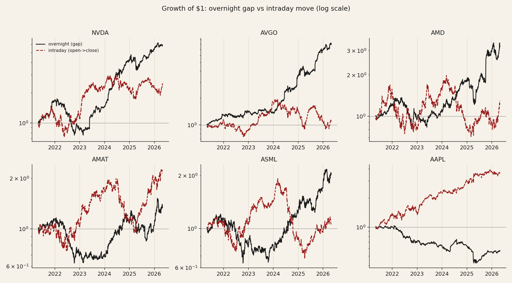
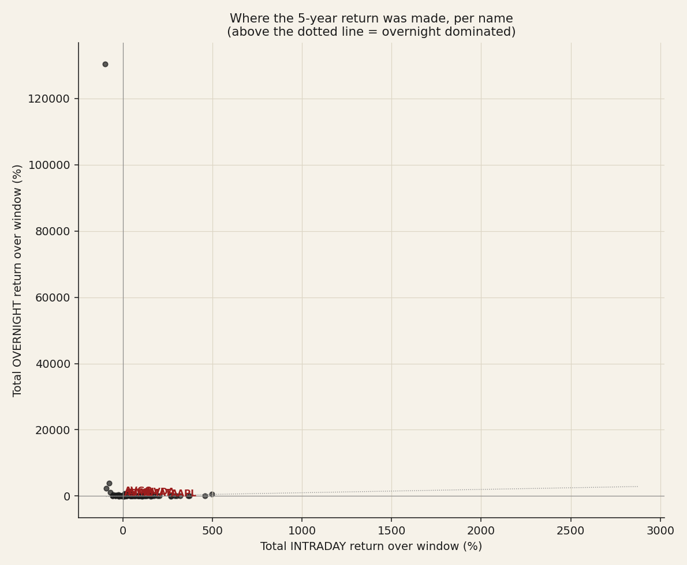
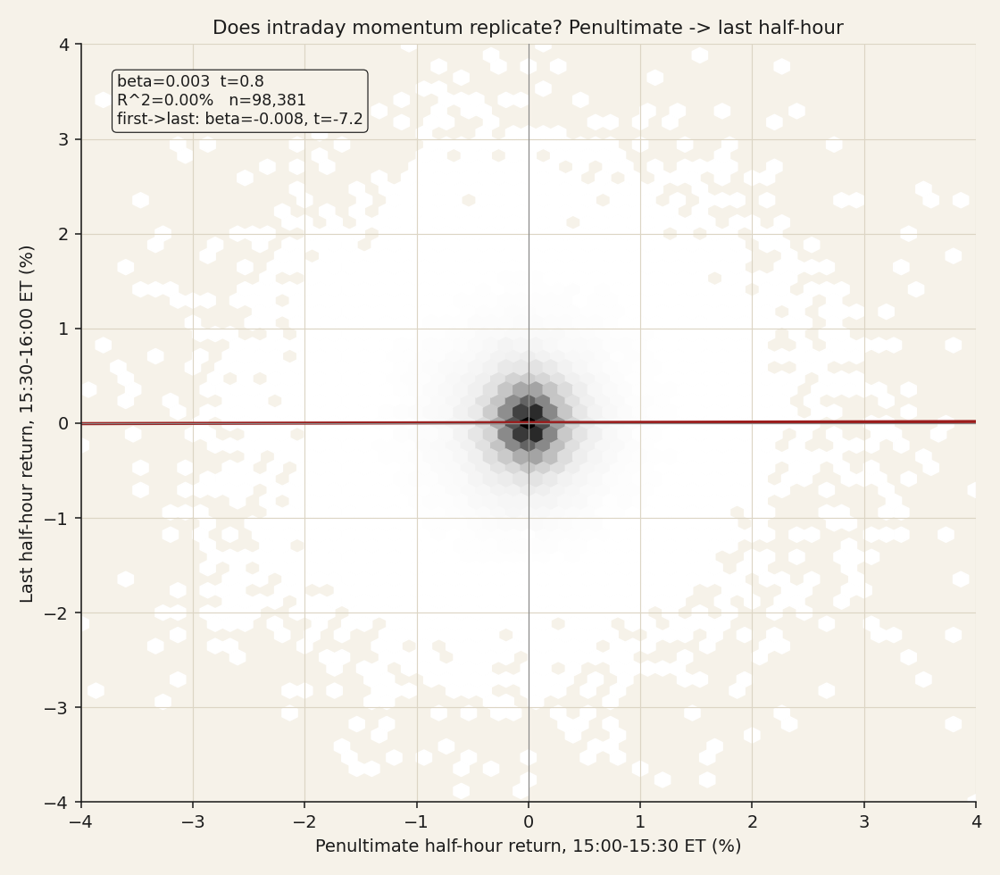
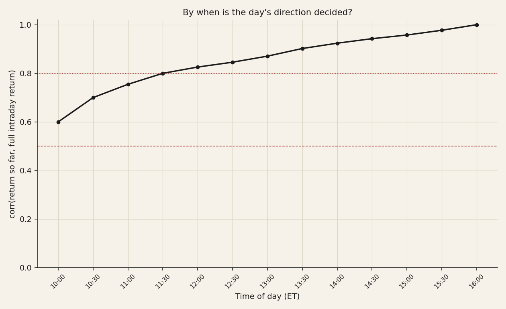

# 07 — Intraday vs close: where the daily return is made

**Question.** Within a trading day, where does a semiconductor's return actually come from — the overnight gap or the session — and is the intraday path predictable?

**Finding.** Three results, separated below: the overnight gap drives the *leaders'* returns but not the universe; intraday momentum does not replicate; and the day's direction is set early.

> Research / backtested. 93 full-history semis/AI names, 5-minute and daily bars, 2021-04-30 → 2026-04-30. No live capital.

## Data & method

- **Universe:** 93 names with full daily history; 5-minute intraday bars (~14M rows). The regular session is a fixed 14:30–21:00 in stored time (= 09:30–16:00 ET, verified stable across daylight-saving). Split-adjusted.
- **Decomposition:** overnight = `open_t / close_{t-1} − 1`; intraday = `close_t / open_t − 1`; the identity `(1+on)(1+id) = (1+c2c)` was checked to 1e-9.
- **Intraday momentum:** OLS of the last half-hour return on the first and on the penultimate half-hour (Gao-Han-Li-Zhou).
- **Time of day:** correlation of the cumulative return-so-far with the full intraday return, by half-hour.

## Claim 1 — The overnight gap drives the leaders, not the universe

For NVDA the overnight leg compounded to **+480%** versus **+130%** intraday; AVGO is similar. But across 93 names overnight beat intraday only **56%** of the time, and for AAPL and ASML the intraday leg dominated while the overnight leg was flat-to-negative. The two legs are essentially uncorrelated day to day (median −0.01), so they are independent return streams, not a strict tug of war.

## Claim 2 — Intraday momentum does not replicate in these names

The canonical predictor (penultimate half-hour → last half-hour) is **insignificant**: beta 0.003, t 0.79. The only significant intraday autocorrelation is a *mild reversal* off the first half-hour (beta −0.008, t −7.2), explaining under 0.1% of variance. The sign of the penultimate move calls the last move 49.6% of the time — a coin flip.

The Gao-Han-Li-Zhou effect was documented in index futures; it does not survive in individual high-volatility semis.

## Claim 3 — The day's direction is set early, then drifts

Correlation between the return-so-far and the full intraday return is already **0.60 just 30 minutes in** (by 10:00 ET), reaches 0.80 by late morning, and climbs to the close. The opening move carries real information; the rest of the session mostly extends it.

## The answer, in the data

**Q: Where does a semi's daily return come from — overnight or the session — and is the intraday path predictable?**
**A: Conditional.** The overnight gap drives the *leaders* but not the universe; intraday momentum does not replicate; the day's direction is set in the first 30 minutes.

| Finding | Stat |
|---|---|
| Overnight beats intraday | only 56% of 93 names |
| NVDA overnight vs intraday | +480% vs +130% |
| Intraday momentum (penult → last ½hr) | β 0.003, t 0.79 (not significant) |
| Direction set early | corr 0.60 by 10:00 ET, 0.80 by late morning |

## Caveats

Plain OLS t-stats (not Newey-West) — a robustness check that would tighten, not overturn, an already-null momentum result; intraday tests use complete sessions only; the overnight result is concentrated in the megacap leaders, not the median name.

## References

- Lou, Polk & Skouras (2019). *A tug of war: overnight versus intraday returns.* JFE.
- Gao, Han, Li & Zhou (2018). *Market intraday momentum.* JFE.
- Heston, Korajczyk & Sadka (2010). Intraday return periodicity. Journal of Finance.
- Community: r/algotrading discussion of the "overnight edge" (buy-close/sell-open) and why naive intraday-momentum bots fail to replicate the index-futures result on single names.
