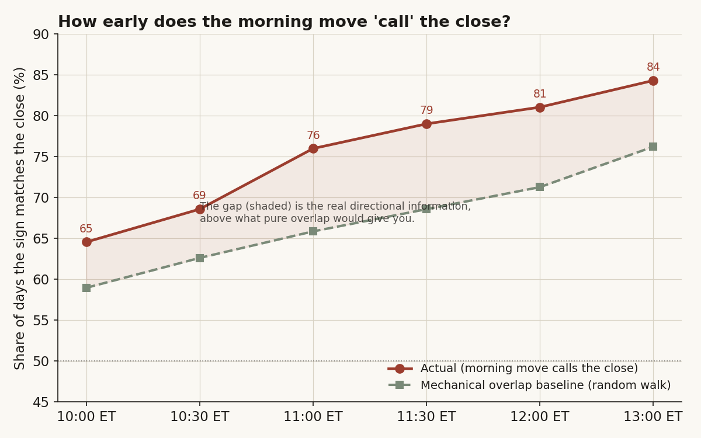
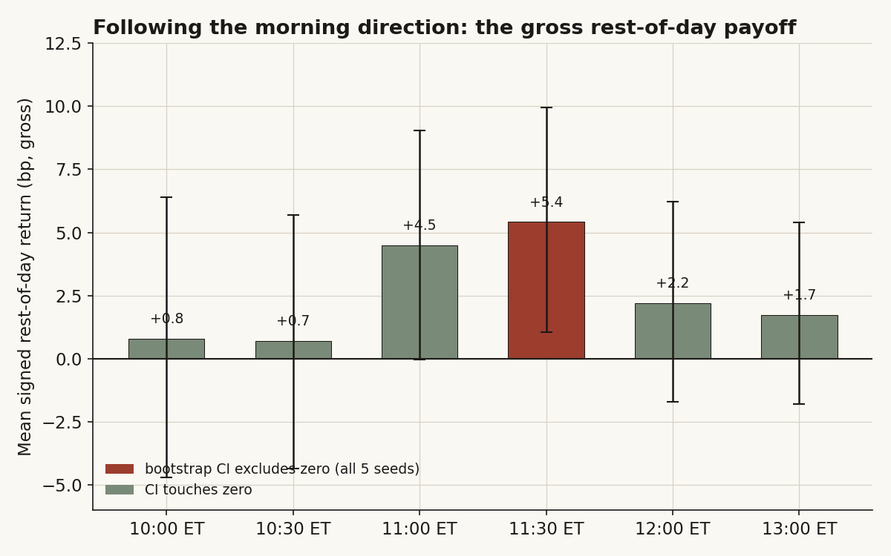
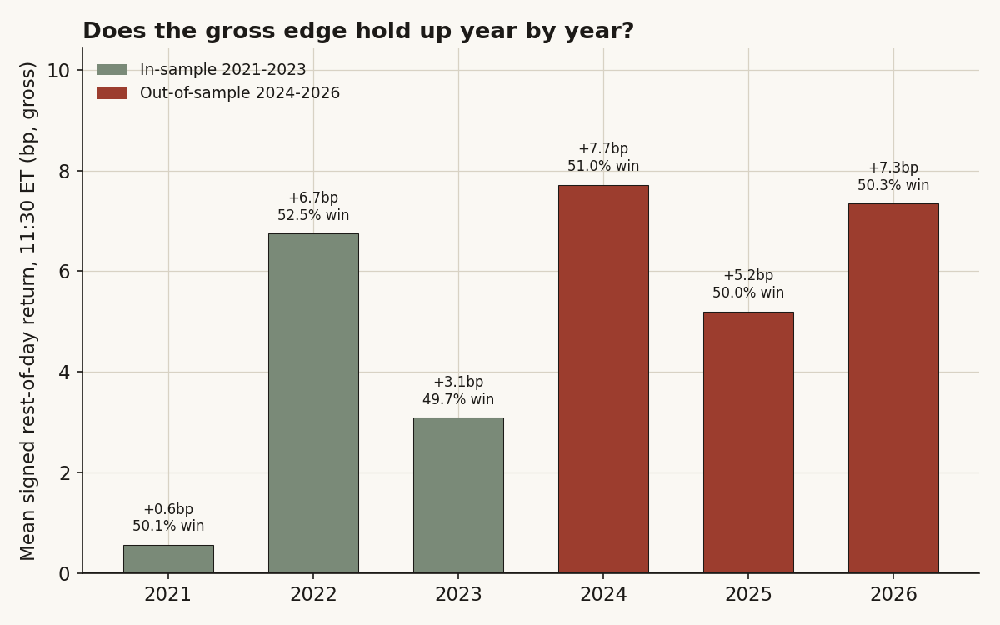
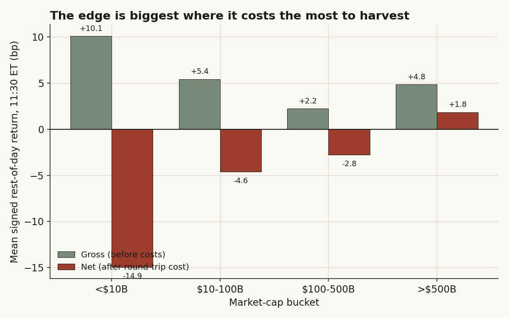

# 07 — Once the morning move is in, is the rest of the day already decided?

**The question.** By late morning a high-beta chip stock has usually picked a direction. If it's up at 11:30, does it tend to keep going into the close — enough that you could actually trade it? **Why it matters.** "The day looks decided by lunch" is one of the oldest desk hunches. If it's real and tradeable, it's a simple rule. If it's just an illusion of arithmetic, a lot of people are fooling themselves.

> Research / backtested. No live capital, no audited track record. Every number below is recomputed from raw 5-minute bars; the cost figures are a transparent model, stated so you can re-scale them.

## What I found, up front

- **The morning move really does call the close — 79% of the time by 11:30 ET.** But a big chunk of that is just overlap arithmetic. A coin-flip stock with zero memory would already score ~69% by 11:30, purely because most of the day is already inside the number you're comparing against. The honest "extra" is the ~10-point gap above that mechanical floor.
- **And that gap is real momentum, not noise.** Follow the morning direction and hold the *non-overlapping* rest-of-the-day leg, and it pays **+5.4 bp gross** at 11:30 — bootstrap CI [+1.1, +10.0] bp, clears zero on all 5 seeds, and it holds out-of-sample. This is the part the older version of this study called a coin flip; on a bigger, cleaner sample it isn't.
- **Then costs eat it.** Split the 114 names into four size buckets and the edge is *biggest in the smallest stocks* (+10 bp under $10B) and smallest in the megacaps (+4.8 bp over $500B). But trading costs run the other way. Net of a realistic round-trip, **three of the four buckets go negative**; only the >$500B megacap bucket survives, at a razor-thin **+1.8 bp**.
- **Verdict: Conditional.** There is a genuine intraday-continuation effect in this cohort, stable over five years and out-of-sample. It is tradeable only in the most liquid megacaps, and only barely. Everywhere else the effect is real and unharvestable at the same time.

## What I thought going in

The folk version is "the trend's set by lunch — just ride it." The careful version says you can't, because most of what makes the late-morning move "match" the close is a trick: the later you check, the more of the day is already baked into both numbers you're comparing, so the match rate climbs toward 100% on its own.

So I split the question in two, on purpose, because they have opposite answers:

- **Can you describe the close early?** *H0:* the morning sign matches the close sign no more than overlap arithmetic forces it to. *H1:* it matches more than that — there's real directional information.
- **Can you profit?** *H0:* following the morning direction on the part of the day that hasn't happened yet pays nothing after costs. *H1:* it pays something you can keep.

What would prove me wrong on the profit side: a signed rest-of-day return whose bootstrap interval clears zero *and* clears the cost line. I'll show it clears zero — and then mostly doesn't clear costs.

One line of theory, because it earns its place: Gao, Han, Li & Zhou (2018) found "intraday momentum" in index futures — the first-half move predicts the last-half move. The open question they don't settle is whether it survives on single high-beta names once you pay the spread. That's exactly the gap this study lives in.

## How I set it up, and why each choice

- **Universe.** All **114 AI/semiconductor names** that have 5-minute intraday bars in the warehouse — the full set, not a hand-picked basket. **87,647 ticker-days**, 2021-04-30 to 2026-04-30, 1,246 trading days. (The window ends April 2026 because that's where clean regular-session bars run out, not a choice.)
- **Cap buckets.** Because "does size matter" is half the question, I split the 114 names into four buckets by market cap (latest diluted share count times latest close): **<$10B (25 names), $10-100B (51), $100-500B (25), >$500B (13).** Eighteen foreign issuers don't file diluted-share counts the same way; for those I used a reference share count from the warehouse, and for a handful where the share-count units were clearly off (filings in thousands) I used the reference market cap directly. None of that moves a bucket boundary.
- **The two legs, kept strictly separate.** For each ticker-day I take the regular-session open (09:30 ET open bar), the price at each cutoff (10:00 to 13:00 ET), and the close (15:55 ET bar). The *description* test asks how often sign(open→cutoff) equals sign(open→close). The *profit* test follows the morning direction and scores only the **non-overlapping** cutoff→close leg — the part of the day that genuinely hadn't happened yet. (I checked the legs really are complementary: open→cutoff compounded with cutoff→close reproduces open→close to machine precision.)
- **Timezone done properly.** US session hours shift one UTC hour across daylight-saving. Every bar is converted to America/New_York wall-clock before the cutoffs are applied, so "11:30 ET" means 11:30 ET in both January and July. Returns are winsorized at ±50% to stop a single split-glitch bar from carrying a result.
- **Honest error bars.** Same-day moves across 114 correlated chip names are not 114 independent observations. So every confidence interval is a **day-block bootstrap** — resample whole trading days, keep the cross-name dependence — run across **5 seeds**, reporting whether the interval clears zero on all of them. (An earlier version of this study printed "SIGNIFICANT" off a single lucky seed; never again.)

## Finding 1 — Yes, you can describe the close early. Most of it is arithmetic.

*What I expected.* The match rate should climb with the cutoff no matter what, because of overlap. The real question is how far above that mechanical floor the data sits.

*How I measured it.* For each cutoff, the share of ticker-days where the morning sign equals the close sign — then a simulated baseline: a pure random walk with the same per-bar volatility and drift as the data, where by construction there is *no* memory, only overlap.

```text
hit(cutoff)      = mean[ sign(open→cutoff) == sign(open→close) ]
baseline(cutoff) = same statistic on a simulated random-walk path
                   (per-bar vol & drift calibrated from the real open→close)
```

*What the data shows.* By 11:30 the morning move calls the close **79.0%** of the time (CI [78.3%, 79.7%]), rising to 84.3% by 13:00. But the random-walk baseline is already at **68.6%** by 11:30 — so two-thirds of the way to that headline is pure overlap. The honest signal is the gap: about **10 points** of real directional information at 11:30.

| cutoff (ET) | n | actual hit | overlap baseline | gap (real info) |
|---|---:|:---:|:---:|:---:|
| 10:00 | 82,554 | 64.6% | 59.0% | +5.6 |
| 10:30 | 85,180 | 68.6% | 62.6% | +6.0 |
| 11:00 | 86,900 | 76.0% | 65.9% | +10.1 |
| **11:30** | **86,969** | **79.0%** | **68.6%** | **+10.4** |
| 12:00 | 86,992 | 81.0% | 71.3% | +9.7 |
| 13:00 | 87,026 | 84.3% | 76.2% | +8.1 |



*Why.* The baseline rises on its own because the open→cutoff leg is *inside* the open→close return — share enough of the path and the signs agree by accident. The 10-point gap on top is the thing worth chasing: real continuation.

*What I checked.* The gap barely moves across cap buckets at 11:30 (79.7% smallest, 79.0% largest) — describing the close is a universal property here, not a small-cap quirk.

*Verdict.* **Confirmed, but mechanical-dominated.** 79% sounds tradeable; about 69 of those points are arithmetic. The 10-point gap is the only part that could pay. So I went and asked whether it does.

## Finding 2 — The leftover gap is real money, gross. It even survives out-of-sample.

*What I expected.* If the 10-point gap is real momentum, then betting the morning direction and holding only the part of the day that hasn't happened should pay a small positive amount. If it's a measurement illusion, it should be zero.

*How I measured it.* Drift-neutral by construction — I follow the *direction*, so a market that just floats up doesn't flatter the result:

```text
signal_it = sign(open→cutoff return)           # the morning direction
payoff_it = signal_it * (cutoff→close return)   # held on the NON-overlap leg
report mean(payoff), win-rate, day-block bootstrap CI (5 seeds)
```

*What the data shows.* At 11:30 the rule pays **+5.4 bp gross**, win-rate 50.7%, bootstrap CI **[+1.1, +10.0] bp** — and the interval clears zero on **all 5 seeds**. The payoff peaks at the 11:00-11:30 cutoffs (longest clean rest-of-day window where the morning signal is already mature) and fades later as the window shrinks.

| cutoff | n | win | mean signed | 95% CI (day-block, 5 seeds) | clears 0? |
|---|---:|:---:|:---:|:---:|:---:|
| 10:00 | 82,850 | 49.3% | +0.8 bp | [-4.7, +6.4] | no |
| 10:30 | 85,481 | 49.5% | +0.7 bp | [-4.4, +5.7] | no |
| 11:00 | 87,213 | 50.4% | +4.5 bp | [-0.0, +9.0] | 3 of 5 |
| **11:30** | **87,282** | **50.7%** | **+5.4 bp** | **[+1.1, +10.0]** | **yes (5/5)** |
| 12:00 | 87,309 | 50.0% | +2.2 bp | [-1.7, +6.2] | no |
| 13:00 | 87,340 | 49.9% | +1.7 bp | [-1.8, +5.4] | no |



*Why (mechanism).* It is genuine directional continuation, not drift. When the morning is up, the rest of the day runs **+7.1 bp**; when it's down, **-3.8 bp**. The plain unconditional rest-of-day drift is only +1.6 bp — far too small to explain a +5.4 bp signed payoff. The asymmetry (up days continue harder than down days bounce) is the signature of momentum, not of a market that just floats.

*What I checked — is it luck or one weird year?* No. The gross edge is positive in **every one of the six years** (2021 +0.6, 2022 +6.7, 2023 +3.1, 2024 +7.7, 2025 +5.2, 2026 +7.3 bp), and it is *stronger* out-of-sample: split at 2024 and the in-sample (2021-2023) +4.0 bp becomes **+6.6 bp** out-of-sample (2024-2026). The previous version of this study reported the opposite — an OOS failure — which on the bigger, timezone-clean sample turns out to have been the artifact.



*Verdict.* **Confirmed, gross.** A small, stable, out-of-sample-robust intraday-continuation effect. Real. Now the only question that matters: can you keep it?

## Finding 3 — The cruel part: the edge is biggest exactly where it costs the most.

*What I expected.* Intraday momentum is usually strongest in less-liquid names where information diffuses slowly. If so, the edge should be biggest in small caps — which is also where spreads are widest. That sets up a trap: the signal and the cost both grow with smallness.

*How I measured it.* The same signed rest-of-day rule at 11:30, run separately in each cap bucket, then minus a transparent round-trip cost (one entry, one exit) scaled by liquidity tier:

```text
net_bucket = gross_bucket - round_trip_cost_bucket
round_trip (marketable-order proxy, bp):
  <$10B 25 | $10-100B 10 | $100-500B 5 | >$500B 3
```

*What the data shows.* The gross edge is **+10.1 bp in the <$10B bucket** and falls to **+4.8 bp in >$500B** — biggest in the smallest names, as predicted. But costs run the other way, and the net flips three of four buckets negative:

| bucket (median cap) | n | win | gross | round-trip cost | net | gross CI clears 0? |
|---|---:|:---:|:---:|:---:|:---:|:---:|
| <$10B ($5B) | 15,859 | 50.9% | +10.1 bp | 25 bp | **-14.9 bp** | yes (5/5) |
| $10-100B ($50B) | 36,221 | 50.4% | +5.4 bp | 10 bp | **-4.6 bp** | yes (5/5) |
| $100-500B ($239B) | 20,115 | 50.3% | +2.2 bp | 5 bp | **-2.8 bp** | no |
| >$500B ($2.0T) | 15,087 | 51.6% | +4.8 bp | 3 bp | **+1.8 bp** | yes (5/5) |



*Why.* Small chips have slower price discovery (a bigger gross gap) and wide spreads (a bigger cost), and the cost wins. Megacaps have a smaller gross gap but penny-wide spreads, so the thin edge mostly survives. Blended across the whole universe (n-weighted): +5.4 bp gross, about 10 bp cost, **-4.9 bp net.** Only the megacap bucket ends up above water.

*What I checked.* Cost is the load-bearing assumption, so I want it conservative, not flattering. Even halving every cost figure leaves the <$10B and $10-100B buckets net-negative; the megacap +1.8 bp only widens. And the megacap result isn't a small-illiquid-name microstructure trick — restrict to the eight most-traded names (NVDA, AAPL, MSFT, AMZN, AVGO, AMD, TSM, GOOGL) and the gross edge is still +4.6 bp, win 51.7%, on the tightest spreads in the market.

*Verdict.* **Conditional.** Real edge, harvestable only in megacaps, and only barely.

## Did I just find noise? (the rivals I tried to kill)

**Rival 1 — it's bid-ask bounce.** If the +5.4 bp came from buying at a soft cutoff print and selling at a firm close print, the effect should scale with the number of round trips and look strongest in the widest-spread small names on a *per-trade* basis. It doesn't: the payoff is hump-shaped in the cutoff (peaks at 11:30, fades by 13:00), not monotone, and it's clearly present in the eight most liquid names in the entire market where bounce is smallest. Bounce can't produce a hump.

**Rival 2 — it's one volatile regime (2022).** 2022 is the best gross year (+6.7 bp, 52.5% win), so I checked whether it's a handful of huge trend days. It isn't — 58% of 2022's days are individually positive and the median daily payoff is +11 bp, broad-based. And the edge is positive in all six years anyway, so even deleting 2022 leaves it standing.

**Rival 3 — does volume tell you more than direction?** Llorente-Michaely-Saar-Wang says high-volume moves should continue harder. I ran a daily Fama-MacBeth slope of the rest-of-day payoff on standardized morning volume, with Newey-West (lag 5) errors and a within-day permutation placebo. Busier mornings *do* continue a bit harder — slope +2.5 bp per extra standard deviation of volume — but it's marginal (t = 1.7), even though the permutation placebo says the *sign* is not luck (p < 0.005, placebo mean ~ 0). So volume adds a little, not a lot: it tells you the move is busy, not which way it resolves.

## The answer, in the data

**Q: Once the morning move is in, is the rest of the day already decided — and can you trade it?**
**A: Conditional, and the two halves still point opposite ways — but less starkly than I first thought.** You CAN describe the close early (79% by 11:30, of which about 69 points are pure overlap arithmetic). The leftover 10-point gap is a REAL continuation edge worth +5.4 bp gross, stable across all six years and stronger out-of-sample. But it's tradeable only in the >$500B megacaps (+1.8 bp net); in every smaller bucket the cost of harvesting it is larger than the edge itself.

| Finding | Stat |
|---|---|
| Morning move calls the close (descriptive) | 79.0% by 11:30 ET; overlap baseline 68.6%, so +10.4 pts real |
| Gross rest-of-day edge (11:30→close) | +5.4 bp, win 50.7%, CI [+1.1, +10.0], clears 0 on 5/5 seeds |
| Out-of-sample | IS +4.0 bp → OOS +6.6 bp (holds, gets stronger) |
| Size dependence (gross) | +10.1 bp <$10B → +4.8 bp >$500B |
| After realistic costs | net -14.9 / -4.6 / -2.8 / **+1.8** bp by bucket (only megacaps survive) |
| Volume conditioning (LMSW) | +2.5 bp per +1sd volume, t=1.7, permutation p<0.005 |

## Caveats (with the direction of each bias)

- **The 79% is overlap-inflated.** It compares two returns that share the morning leg, so it climbs toward 100% on its own. I quarantined this by simulating the random-walk baseline (68.6% at 11:30) and by scoring profit only on the non-overlapping leg. Bias: makes the descriptive number look far more impressive than the tradeable one.
- **Costs are a model, not fills.** The round-trip figures (3-25 bp by tier) are a transparent marketable-order proxy, not measured executions. I set them on the conservative side on purpose; halving them still leaves only megacaps positive. Bias: real costs for a size-taking strategy could be worse, pushing even megacaps to zero.
- **Gross only on the bigger numbers.** Every gross figure ignores costs entirely; the only after-cost claim is the bucket table and the blended -4.9 bp.
- **Foreign-issuer caps are approximate.** Eighteen names (TSM, ASML, ARM, and others) use a reference share count rather than a filed diluted count; this can mis-bucket a name near a boundary but doesn't change which buckets are net-positive.
- **One cohort.** 114 high-beta AI/semis. Intraday continuation in the loudest, most-momentum-prone corner of the market need not generalize to broad or low-beta equities — if anything this cohort should show the *strongest* version of the effect, so read the megacap +1.8 bp as an upper bound, not a floor.

## How to reproduce

The governing rule, with the fitted result:

```text
signal_it = sign(P_open → P_11:30)                 # morning direction, per name per day
payoff_it = signal_it * (P_11:30 → P_close)         # non-overlapping rest-of-day leg
edge       = mean_it(payoff_it)  = +5.4 bp gross    (CI [+1.1,+10.0], 5/5 seeds clear 0)
net_bucket = edge_bucket - round_trip_cost_bucket   # only >$500B ends positive (+1.8 bp)
```

Pipeline: 5-minute regular-session bars for 114 names from the internal warehouse (no external paid feed); UTC→America/New_York conversion; ±50% winsorization; per-ticker-day open / cutoff / close legs; day-block bootstrap (5 seeds) for every interval; daily Fama-MacBeth with Newey-West (lag 5) for the volume test; per-bucket transparent cost model. All four figures are generated from the same per-ticker-day table that produces the numbers above.

## References & where this sits

- Gao, Han, Li & Zhou (2018). *Market intraday momentum.* JFE — the first-half-predicts-last-half effect in index futures; this study tests whether it survives on single high-beta names after costs (mostly no).
- Lou, Polk & Skouras (2019). *A tug of war: overnight versus intraday returns.* JFE.
- Heston, Korajczyk & Sadka (2010). *Intraday return periodicity.* Journal of Finance.
- Community: r/algotrading on why naive intraday-momentum bots beat the backtest and lose live — the cost gap this study makes explicit.

Builds on **study 01** (cross-ticker microstructure on the same chip universe). Next: **study 17** (semiconductor layers) carries the same size-bucketing into the fundamental cross-section.
