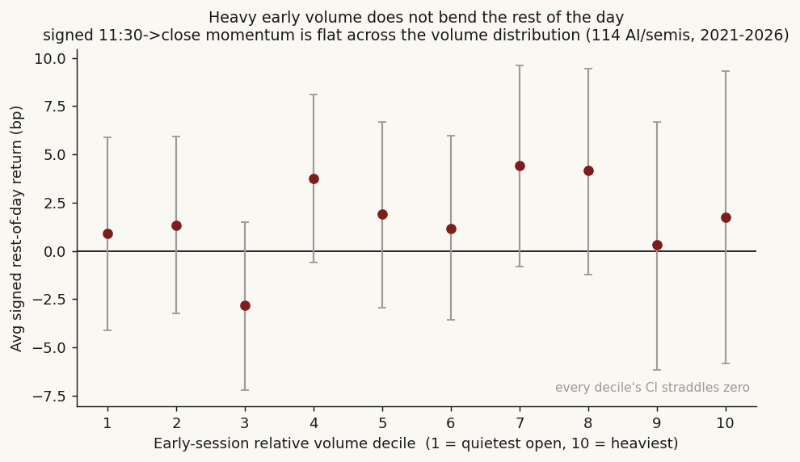
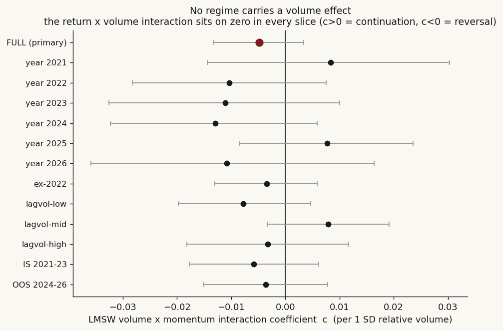

# 07 — Intraday decision-time: you can describe the close, not profit from it

**Question.** By late morning, how often does the direction of a high-beta semi/AI name's move-so-far already match its eventual close — and can you trade on it? **Finding.** By 11:30 ET the morning move calls the close sign 80% of the time, but that hit-rate is a mechanical artifact of overlap; the only part you could still act on — the non-overlapping rest-of-day leg — is a sub-cost coin flip. Describe, don't trade. **And the obvious objection — "but surely it works on heavy-volume days" — fails too:** conditioning the rest-of-day leg on whether the first two-to-three hours traded above the name's own average does not revive the edge (Claim 3).

> Research / backtested. No live capital, no audited track record. The 80% "decision-time" hit-rate is descriptive, not a signal — it is contaminated by the morning leg sitting inside the full-day return; the only honest profit test is the rest-of-day leg, and it is null.

## Data & method

- **Universe:** 114 high-beta AI/semiconductor tickers, 5-minute bars, regular session only (open bar to close bar).
- **Window:** 2021-04-30 to 2026-05-20, 1,260 trading days, ~116k ticker-days. Returns winsorized at +/-50%.
- **Two deliberately separated tests.** (1) *Description* — at each cutoff (10:00 to 13:00 ET) how often does the sign of open→cutoff match the sign of open→close. (2) *Profit* — trade the morning direction at the cutoff and hold to close, scoring only the **non-overlapping** cutoff→close leg (the sole contamination-free statistic).
- **Validation.** Day-block bootstrap 95% CIs **averaged over 5 seeds** (the prior single-seed flag was a seed artifact), per-year breakdown, and an in-sample (2021-2023) / out-of-sample (2024-2026) walk-forward.
- **Volume conditioning (Claim 3).** A third test asks whether early-session relative volume rescues the dead profit leg, via a Llorente-Michaely-Saar-Wang Fama-MacBeth interaction regression plus a decile dose-response, a permutation placebo, and dollar-volume / signed-order-flow / raw-return robustness — all on the same non-overlapping rest-of-day leg.

## Claim 1 — You CAN describe the close early (but it's mechanical)

By 11:30 ET the morning move's sign matches the eventual close sign **80.3%** of the time (95% CI [79.7%, 81.0%]), climbing to 84.7% by 13:00. This is real but **mechanical**: the later the cutoff, the more of the day is already realized inside the open→close return being compared against (the overlap trap). It is a measurement of where the day is heading, not a tradable edge.

| cutoff (ET) | n | hit-rate | edge vs coin-flip | 95% CI (day-block) | robust? |
|---|---:|:---:|:---:|:---:|:---:|
| 10:00 | 115,317 | 0.7124 | +0.2124 | [0.7050, 0.7195] | yes |
| 10:30 | 115,414 | 0.7556 | +0.2556 | [0.7484, 0.7624] | yes |
| 11:00 | 115,544 | 0.7822 | +0.2822 | [0.7756, 0.7886] | yes |
| **11:30** | **115,552** | **0.8035** | **+0.3035** | **[0.7973, 0.8097]** | **yes** |
| 12:00 | 115,554 | 0.8191 | +0.3191 | [0.8132, 0.8251] | yes |
| 13:00 | 115,587 | 0.8474 | +0.3474 | [0.8417, 0.8529] | yes |

The CIs are tight and well above the coin-flip line — but "significant" here is significant-because-mechanical, not significant-because-tradable.

## Claim 2 — You CANNOT profit (the honest test is a coin flip)

Trade the 11:30 morning direction, hold to close, and score the signed return on the **non-overlapping** 11:30→close leg: win-rate **50.4%** (95% CI [49.5%, 51.2%], straddles 0.50), mean signed return **+3.4 bp before costs** whose seed-averaged 95% CI runs **-0.8 bp to +69.7 bp** — the lower bound sits on zero. Both nulls (coin-flip win-rate, zero drift) live inside the interval. And a same-day enter-at-11:30 / exit-at-close round trip on these names costs more than 3 bp, so the rule is net-negative.

| metric | n | %positive (win) | median | mean | seed-avg 95% CI | robust? |
|---|---:|:---:|:---:|:---:|:---:|:---:|
| signed rest-of-day return (11:30→close) | 116,033 | 50.4% | +1.6 bp | +3.4 bp | mean [-0.8 bp, +69.7 bp]; win [49.5%, 51.2%] | **no — marginal, sub-cost** |

Run the same momentum rule at every cutoff and only the two earliest survive a robust CI — and only because they keep the longest rest-of-day window, at 5-6 bp gross, still below realistic frictions:

| cutoff | n | win | avg signed | seed-avg 95% CI | robust? |
|---|---:|:---:|:---:|:---:|:---:|
| 10:00 | 115,806 | 0.5027 | +5.6 bp | [+0.9, +10.4] bp | yes |
| 10:30 | 115,898 | 0.5057 | +4.6 bp | [+0.4, +9.1] bp | yes |
| 11:00 | 116,035 | 0.5018 | +3.1 bp | [-0.6, +6.8] bp | no |
| 11:30 | 116,033 | 0.5038 | +3.4 bp | [-0.1, +7.0] bp | no |
| 12:00 | 116,035 | 0.4974 | +1.4 bp | [-1.9, +4.7] bp | no |
| 13:00 | 116,070 | 0.4989 | +1.8 bp | [-1.4, +5.3] bp | no |

## Claim 3 — Heavy early volume does not revive the edge

The natural rescue for a dead momentum signal is to trade it only when the tape confirms: act on the morning move **only on days the first two-to-three hours traded heavy**. We tested it directly. For each name-day we built **relative volume (RVOL)** — first-2h volume divided by that name's own strictly-lagged 20-day median for the same window (so "above average" means above the stock's own norm, time-of-day matched, no look-ahead) — and asked whether it conditions the non-overlapping 11:30→close leg.

The pre-registered test is the **Llorente-Michaely-Saar-Wang (2002)** discriminator, run Fama-MacBeth: each day, cross-sectionally regress the rest-of-day return on the morning return and on the morning return **interacted with relative volume**. The interaction coefficient *c* is the whole question — *c* > 0 means heavy volume amplifies **continuation** (volume confirms), *c* < 0 means it flips to **reversal** (volume marks exhaustion), *c* = 0 means volume tells you nothing about direction.

**It is zero.** *c* = **−0.005** per 1 SD of relative volume (Fama-MacBeth t = −1.1; seed-averaged day-block 95% CI **[−0.013, +0.003]**, crosses zero in 100% of seeds; permutation placebo *p* = **0.19**). The faint negative sign leans, if anything, toward mild exhaustion rather than confirmation — but it is statistical noise. The same null holds under **every** alternative: dollar-volume RVOL (*c* = −0.005), a signed order-flow-imbalance proxy (*c* = −0.006), raw unwinsorized returns (*c* = −0.005), and the 11:00 cutoff (*c* = +0.000). It also holds in **every regime** — each calendar year, with 2022 (the one year that carried the unconditional edge) dropped, in all three strictly-lagged volatility terciles, and out-of-sample 2024-26 — never escaping the zero line.

| measure of "early volume" | volume×momentum interaction *c* | seed-avg 95% CI | verdict |
|---|:---:|:---:|:---:|
| **share RVOL (primary, 11:30)** | **−0.005** | **[−0.013, +0.003]** | **no conditioning** |
| dollar RVOL | −0.005 | [−0.014, +0.004] | no conditioning |
| signed order-flow imbalance | −0.006 | [−0.013, +0.002] | no conditioning |
| raw (unwinsorized) returns | −0.005 | [−0.013, +0.003] | no conditioning |
| ex-2022 | −0.003 | [−0.013, +0.006] | no conditioning |
| out-of-sample 2024-26 | −0.004 | [−0.015, +0.008] | no conditioning |

Descriptively the same picture: bin the signed rest-of-day return by RVOL decile and it is **flat** — win-rate 49-51% from the quietest opens to the heaviest, no monotone dose-response. Days above the name's own average do show a hair more gross continuation than days below (**+2.4 bp vs +1.0 bp**, a ~1.4 bp gap), but the paired CI on that gap is **[−2.2, +5.1] bp** — inside noise. And costs cut the wrong way: the entry bar runs ~1.3× wider on above-average-volume days, so the same-day round trip is **more** expensive exactly where the faint signal sits, leaving every volume bucket net-negative.

The reading: heavy early volume tells you the day is **busy**, not which way the rest of it pays. That is consistent with the theory — Llorente-Michaely-Saar-Wang show volume predicts continuation only for *information*-driven names and reversal for *liquidity*-driven ones; in a basket of high-beta AI/semis the two cancel, and the net interaction is nothing.

## The answer, in the data

**Q: By late morning the day's close looks "decided" — can you trade on it?**
**A: Conditional, and the two halves point opposite ways.** You CAN describe the close — 80.3% by 11:30 — but that is a mechanical overlap artifact. You CANNOT profit: the non-overlapping rest-of-day leg is a 50.4% coin flip, +3.4 bp gross with a CI on zero, sub-cost, and its only positive year is 2022.

| Finding | Stat |
|---|---|
| Morning move calls the close (descriptive) | 80.3% by 11:30 ET, 84.7% by 13:00 — mechanical |
| Tradable rest-of-day leg (11:30→close) | win 50.4%, +3.4 bp gross, CI on zero |
| After costs | net-negative (round trip > 3 bp) |
| Edge concentration | 2022 wins 52.1%; every other year 48.9-50.2% |
| Walk-forward | IS 50.9% → OOS 49.9% (fails out-of-sample) |
| Heavy early volume conditions it? | No — interaction c = −0.005, CI [−0.013, +0.003], placebo p = 0.19 |
| Above- vs below-average volume gap | +1.4 bp gross, CI [−2.2, +5.1] bp (inside noise), sub-cost |

## Caveats

- **Overlap trap.** The 80% hit-rate compares open→cutoff against open→close, which share the open→cutoff leg, so it mechanically rises toward 100% as the cutoff nears the close. The only contamination-free statistic is the non-overlapping rest-of-day leg — and that is a coin flip.
- **No transaction costs.** All numbers are gross; a same-day in-and-out round trip on these names costs more than 3 bp, making the 11:30 rule net-negative.
- **Single regime.** The razor-thin gross edge is carried almost entirely by 2022 (high-vol bear, win 52.1%); every other year is a coin flip, and it fails the out-of-sample walk-forward.
- **Seed fragility.** An earlier version printed "SIGNIFICANT" on the 11:30 leg off a single bootstrap seed whose CI lower bound landed at +1.3e-6 — a hair above zero. Averaging across 5 seeds, 4 of 5 put the lower bound below zero; corrected to a multi-seed averaged bootstrap reporting the fraction of seeds whose CI contains the null.
- **Universe.** 114 high-beta AI/semis only; intraday continuation in this cohort need not generalize to broad or low-beta equities. The signed (direction-following) test is drift-neutral by construction.
- **Session grid / DST.** The 5-minute bars sit on a fixed market-wall-clock grid (09:30 ET open held constant year-round). On ~89 daylight-savings-transition dates the whole session shifts an hour and the fixed open/close anchors would otherwise grab a mid-morning bar and a thin after-hours print; those dates are detected (open-auction volume moved early) and dropped before any return is computed. The volume test runs on 113,765 clean name-days.
- **Volume null is a null, not a proof of absence.** Absence of a *linear* volume×momentum interaction in this basket does not rule out a narrower effect — a single liquid sub-tier, an event-day subset, or a signed-imbalance measure built from true trade data rather than the close-vs-VWAP surrogate used here. What is ruled out is the simple, tradeable version: "trade the morning move when early volume is high."

## References

- Gao, Han, Li & Zhou (2018). *Market intraday momentum.* JFE 129(2) — the canonical intraday-momentum effect, documented in index futures.
- Llorente, Michaely, Saar & Wang (2002). *Dynamic volume-return relation of individual stocks.* RFS 15(4) — volume predicts continuation for information-driven names and reversal for liquidity-driven ones; the framing for Claim 3 and the source of the interaction test.
- Gervais, Kaniel & Mingelgrin (2001). *The high-volume return premium.* Journal of Finance 56(3) — abnormally high volume predicts subsequent appreciation (the "volume confirms" prior).
- Campbell, Grossman & Wang (1993). *Trading volume and serial correlation in stock returns.* QJE 108(4) — high-volume price moves tend to reverse (the "volume = exhaustion" prior).
- Conrad, Hameed & Niden (1994). *Volume and autocovariances in short-horizon individual security returns.* Journal of Finance 49(4).
- Clark (1973), Econometrica 41(1) and Tauchen & Pitts (1983), Econometrica 51(2) — the mixture-of-distributions hypothesis: volume and volatility are jointly information-driven, which is why the volume effect must be separated from the volatility regime.
- Lou, Polk & Skouras (2019). *A tug of war: overnight versus intraday returns.* JFE.
- Heston, Korajczyk & Sadka (2010). *Intraday patterns in the cross-section of stock returns.* Journal of Finance 65(4).
- Community: r/algotrading on why naive intraday-momentum bots fail to replicate the index-futures result on single high-beta names.
