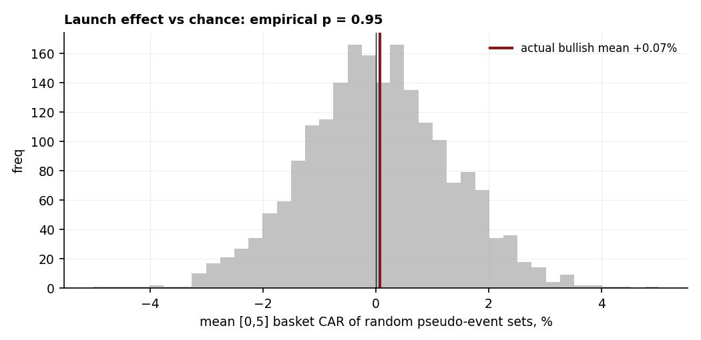

# 08 — AI model launches: does the stock react, and does it repeat?

**Question.** When a frontier AI model ships, does the compute complex (NVDA and peers) reliably move — and does the reaction survive an honest significance test?

**Finding.** No. At the true sample size — **19 events, not 152 event-by-ticker pairs** — the bullish-launch reaction is **+0.07% over [0,5], with a bootstrap 95% CI of [−2.6%, +3.0%]** and a **placebo p of 0.95**: statistically indistinguishable from picking random dates. The only large mover was the compute-*efficient* DeepSeek shock (−6% mean), and that rests on a single episode (R1) that largely retraced. "Launch = buy NVDA" is noise.

> Research / backtested. 19 web-verified launches (2022–2025) on an 8-name AI/compute basket; constant-mean event study with **event-level aggregation + bootstrap + placebo**. 2026 launches excluded (data ends 2026-04-30). No live capital.

## Data & method

- **Basket:** NVDA, AVGO, AMD, TSM, AMAT, ASML, MU, MRVL. Constant-mean expected return, estimation window [−120, −21] trading days; [0,5] CAR.
- **The fix vs a naive event study:** aggregate to **event-level** basket CARs (n=19), because the 8 names co-move on a launch — so the effective sample is the count of *events*, not 152 pairs. Bootstrap the bullish mean (10k resamples); placebo = the null distribution of "mean of k random pseudo-event sets" (2k draws) for an empirical p-value.

## Claim 1 — The bullish "pop" is statistically zero

Bullish launches: mean [0,5] basket CAR **+0.07%** (median +0.68%, positive on 52% — a coin flip). The bootstrap 95% CI is **[−2.6%, +3.0%]** (straddles zero); the placebo empirical **p = 0.95**. The actual reaction sits dead-centre of the random-date null — indistinguishable from chance.

## Claim 2 — And what little there was faded after 2023

Mean bullish [0,5] CAR by year: **2022 −4.8%, 2023 +3.5%, 2024 −0.7%, 2025 −0.6%.** The 2023 euphoria, when every launch pumped semis, is gone; NVDA was positive on only 52% of bullish launches.

![Mean basket [0,5] reaction by year (bullish)](launch_by_year.png)

## Claim 3 — The only big mover was the efficiency shock (one episode)

Compute-efficient (DeepSeek) launches drew a mean [0,5] of **−6.0%** (n=2 → no CI). DeepSeek-R1 released 2025-01-20 (US market closed, MLK Day); NVDA fell **−17% on 01-27** — about **$589bn**, the largest one-day market-cap loss in US history — but its [0,20] abnormal return was largely retraced. One episode, not a law.

## The answer, in the data

**Q: Does a model launch reliably move the compute complex?**
**A: No** — the bullish reaction is statistically zero, and only a single efficiency shock moved the tape.

| Group | n | Mean [0,5] | 95% CI / note | Placebo p |
|---|---:|---:|---|---:|
| Bullish | 17 | +0.07% | [−2.6%, +3.0%] | 0.95 |
| Efficient | 2 | −6.0% | single-episode (R1) | — |

## Caveats

Event-level n=19 (bullish 17, efficient 2) is small; the efficient result is essentially the single DeepSeek-R1 episode. ADRs (TSM, ASML) react with a timezone lag. Constant-mean model; 2026 launches are excluded (no post-event window before the data cutoff).

## References

- MacKinlay (1997). *Event studies in economics and finance.* JEL.
- Brown & Warner (1985). *Using daily stock returns.* JFE.
- Bernard & Thomas (1989). Post-earnings-announcement drift.
