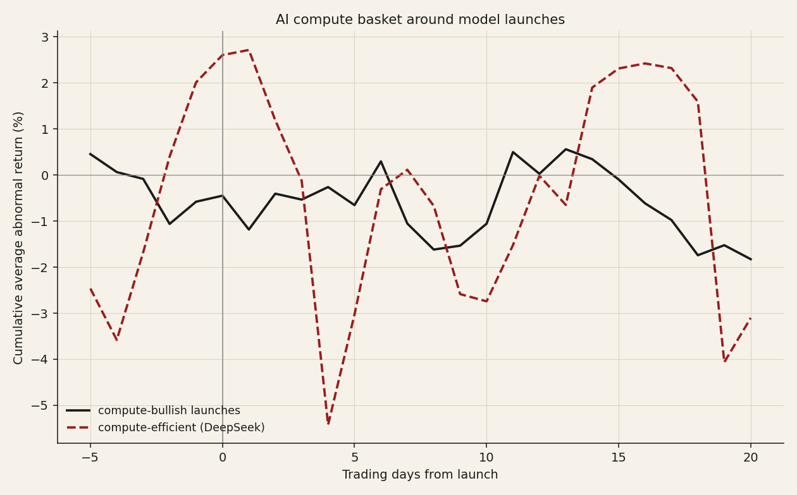
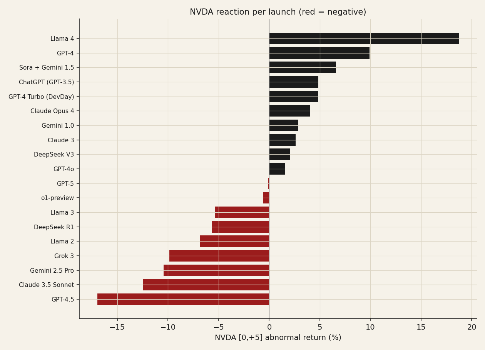

# 08 — AI model launches: does the stock react, and does it repeat?

**Question.** When a frontier AI model ships, does the compute complex (NVDA and peers) reliably move, and has the reaction held up over time?

**Finding.** The compute-bullish "launch pop" is a coin flip and has faded; the only reliable mover was the compute-*efficient* DeepSeek shock (negative), and even that rests on a single episode and largely retraced.

> Research / backtested. 19 web-verified launches (2022–2025) on an 8-name AI/compute basket; constant-mean event study. No live capital.

## Data & method

- **Events:** 19 major launches, each tagged compute-**bullish** (implies more demand) or compute-**efficient** (DeepSeek-style "we did it cheaper").
- **Basket:** NVDA, AVGO, AMD, TSM, AMAT, ASML, MU, MRVL.
- **Method:** constant-mean abnormal returns, estimation window [−120, −21] trading days; CAR over [0,0], [−1,1], [0,5], [0,20]; cross-sectional t-stats.

## Claim 1 — The bullish launch pop is a coin flip, and it faded

Across bullish launches the basket's [0,5] abnormal return is ~0% (t −0.10; NVDA rose on only **53%** of them). By year the reaction fell from **+3.9% (2023)** to negative in 2024–25 — the 2023 euphoria, when every launch pumped semis, is gone.

![Mean [0,5] reaction by year (bullish)](b2_by_year.png)

## Claim 2 — The only reliable mover was the efficiency shock (and it retraced)

Compute-efficient (DeepSeek) releases drew **−5.0%** over [0,5] (t −2.7). DeepSeek-R1 released 2025-01-20 (US market closed); NVDA fell **−17% four trading days later** on 01-27 — the largest one-day market-cap loss in US history — but its [0,20] abnormal return was just **−0.7%**: the shock was largely retraced within a month.

## Claim 3 — The sign depends on the compute implication

Capability launches imply more compute demand (bullish, but increasingly priced in); efficiency launches imply less GPU demand (bearish). The market now fades the former and punishes the latter — "launch = buy NVDA" is not a strategy.

## Caveats

The t-stats treat each event-by-ticker pair as independent, but the 8 names move together on a launch, so the effective sample is the number of *events* (19), not 152 — the efficient-launch result rests on essentially the single DeepSeek-R1 episode. ADRs (TSM, ASML) react with a timezone lag. 2026 launches are excluded (no post-event window yet).

## References

- MacKinlay (1997). *Event studies in economics and finance.* JEL.
- Brown & Warner (1985). *Using daily stock returns.* JFE.
- Bernard & Thomas (1989). Post-earnings-announcement drift.
