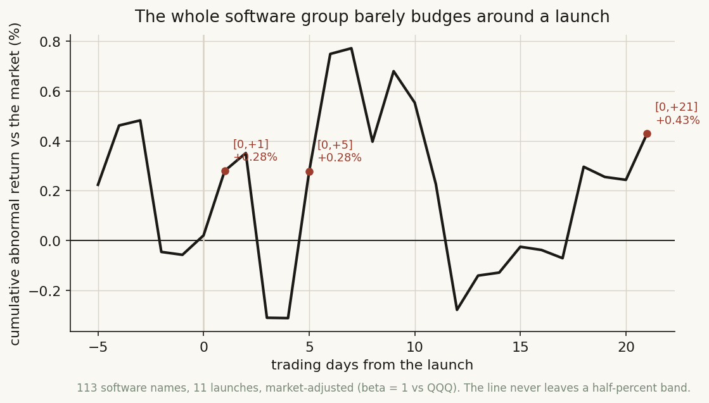
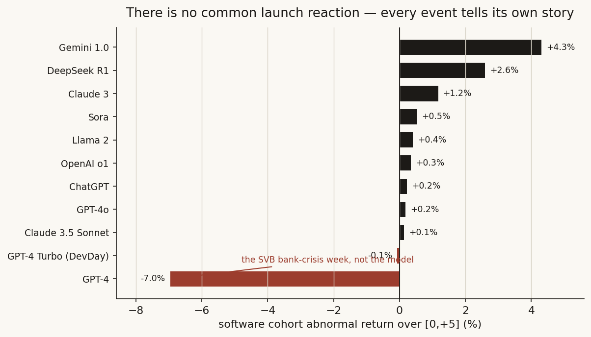
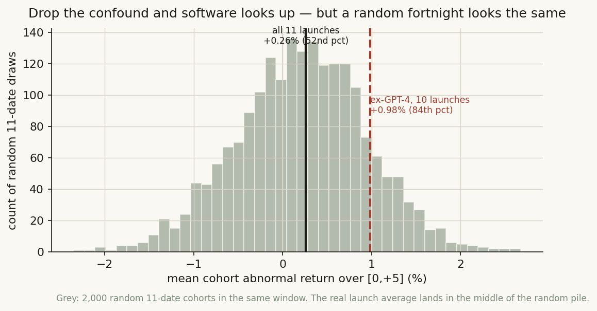
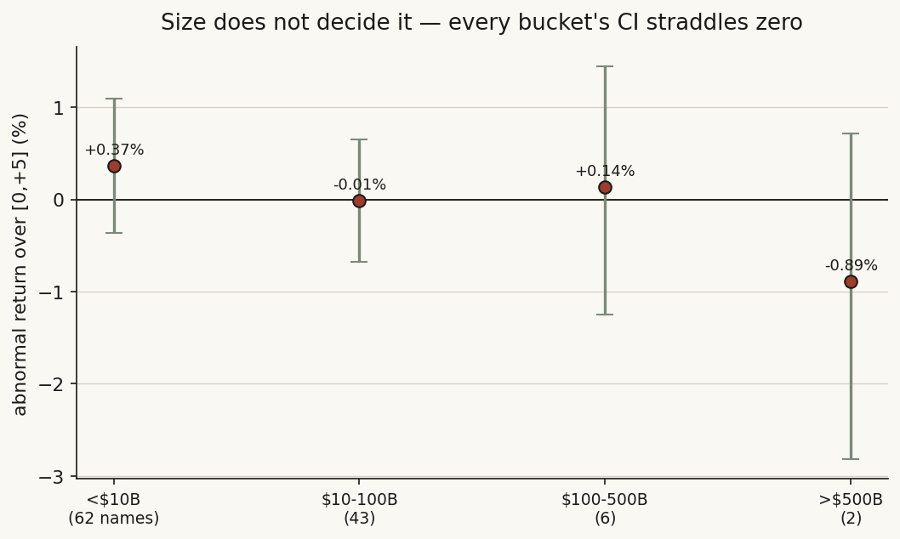
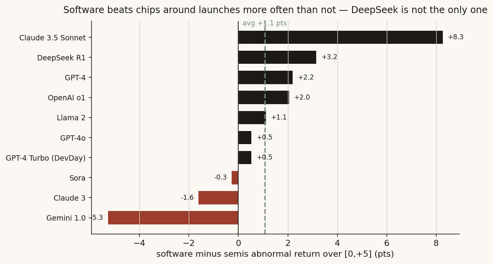

# 08 — When a frontier AI model ships, does the software complex actually move?

**The question.** Every time a big new model drops, the same two takes show up: "this kills SaaS" and "this is rocket fuel for SaaS." Either way, people talk as if a launch is a *catalyst* — a day you could trade. So I went and checked. Across 113 US software stocks and 11 frontier-model launches, does the group reliably move the day a model ships? And if the famous GPT-4 "software crash" was real, does it survive a closer look?

**Why it matters.** If launches were a catalyst, you'd want a rule: buy (or short) the software basket into the next model. If they're not, then the launch headline is noise and the only honest move is to ignore it. One of those is worth money; the other costs money.

> Research / backtested. No live capital, no audited track record. Launch dates and the exposed/insulated labels are judgment calls, stated as such. Eleven events is a small sample for a group claim — so the weight here is on the stock-level distribution (over a thousand name-by-event observations), not the eleven-point average.

## What I found, up front

- **The whole software group barely moves.** Market-adjusted, the 113-name cohort sits inside a half-percent band of zero across every window I tried. The headline "launches crush SaaS" reaction is just not in the average.
- **The one famous crash is a fake.** GPT-4's −7.0% landed inside the SVB bank-collapse week. It's high-beta software getting whipped by a banking panic, not by the model — and a proper beta adjustment cuts that −7.0% to −2.7%.
- **Drop the confound and software looks mildly up... but so does a random fortnight.** The other 10 launches averaged +0.98% [+0.28, +1.92], which is positive vs zero. But against 2,000 random non-launch dates, that +0.98% sits at the 84th percentile — elevated, not special. The full 11-launch average sits at the *52nd* percentile: dead average.
- **Size doesn't decide it.** I split the cohort into four market-cap buckets, from sub-$10B SaaS up to the $500B+ incumbents. No monotonic size effect; every bucket's confidence interval straddles zero.
- **The "disruption" signal doesn't reconcile.** Measured properly, AI-*exposed* software and AI-*insulated* infrastructure move together: the spread is −0.02 pts over [0,+5] and −0.32 pts over [0,+21], both with CIs that swallow zero. The earlier "about a point a month" disruption gap does not hold up.
- **The real story is relative, not absolute.** Software beats *semis* around launches more often than not — +1.1 pts on average, software ahead in 7 of 10 events. DeepSeek (cheaper inference, good for apps, bad for picks-and-shovels) is the loudest case but not a one-off. The CI still spans zero, so it's a lead worth pulling, not a proven trade.

**The short version: No, a model launch is not a broad catalyst for software.** As a group the move is a coin-flip-sized wiggle that a random day matches. The only thing with a pulse is the software-vs-semis *pair*.

## What I expected, and how I'd know if I was wrong

Going in, the popular story is a clean one: a frontier model lands, the market re-prices every software company whose product an LLM could eat, and the SaaS complex sells off as a group. Call that the catalyst view. The null I'm testing it against is boring: **a launch day looks like any other day.**

So the test writes itself. If launches are a catalyst, the cohort's abnormal return around launch days should be reliably different from zero and reliably different from a random day in the same names. If the null is right, the average sits on top of zero, the per-launch numbers scatter both ways, and a pile of random dates reproduces whatever I see. I'd be proven wrong by a cohort CAR that clears zero *and* clears a random-date baseline, ideally with the disruption story showing up where it should (exposed names lagging insulated ones).

One honest worry before I start: the most-quoted evidence for the catalyst view — the GPT-4 "SaaS crash" — happened in the same week Silicon Valley Bank failed. If that one day is driving the whole memory, the catalyst story might be a banking story wearing a costume. I'll have to deal with that head-on.

## How I checked it

**The universe.** Every US-listed software name in the warehouse with a software industry code (prepackaged software, computer programming, integrated systems, data processing) and a market cap above $2B: **113 names**, all with prices through the study window. This is the full set the database supports, not a hand-picked basket. (One look-ahead caveat I'll wear openly: the cap filter is measured today, so names that were delisted or crashed out over 2022–2025 aren't in the roster. That bias works *for* the catalyst story — survivors held up better — and the result is still a null, so a clean point-in-time roster would only weaken the effect further.)

**The events.** 11 frontier-model launches, from ChatGPT (2022-11-30) to DeepSeek R1 (2025-01-27), dated to the first trading reaction. The full list and the per-launch numbers are in the tables below — nothing is hidden behind a "judgment call."

**The measure, two ways.**
- *Simple (beta = 1 vs the market).* Abnormal return = the name's return minus QQQ's, summed over [0,+1], [0,+5], [0,+21]. This is the original study's measure, kept so the old numbers reproduce exactly.
- *Proper (a market model).* For each name and event, I estimate the stock's own alpha and beta on a 120-day window ending 10 days before the launch, then the abnormal return is what's left after subtracting (alpha + beta × market). This matters because software is high-beta: on a bad market day a beta-1 adjustment over-blames the stock. The market model is the fix for the GPT-4/SVB whipsaw, and it's the measure I trust for everything past the reproduction. (It costs me one event: ChatGPT's estimation window runs off the front of my price history, so the market-model windows cover 10 launches, not 11.)

**The honesty checks.** Bootstrap confidence intervals on every headline; a sign test across the 11 launches (the right tool when n is tiny); a placebo of 2,000 random non-launch date sets in the same window and same names, so I'm comparing the launch average against a real baseline rather than against zero; and the disruption cut (exposed vs insulated) with its own CI, because the earlier version of this study contradicted itself on that number.

## What the data said

### Step 1 — The group barely moves, and the average sits on zero

Start with the eyeball version: the cohort's cumulative abnormal return in event time, averaged over all 11 launches. It wanders, but it never escapes a roughly half-percent band around zero. There's no drop, no pop, no drift.



Put numbers on it, beta-1 vs the market:

| Window | Cohort CAAR | Bootstrap 95% CI | reading |
|---|---:|:--|:--|
| [0,+1] | +0.34% | [+0.03, +0.66] | barely off zero |
| [0,+5] | +0.33% | [−0.08, +0.75] | on zero |
| [0,+21] | +0.49% | [−0.34, +1.33] | on zero |

(n = 1,123 name-by-event observations.) Only the one-day window even clears zero, and by a third of a percent. This reproduces the original study's headline (+0.34 / +0.33 / +0.49) to the basis point — good, the old numbers were real — and now we can see they were never significant.

### Step 2 — There is no common launch reaction

The average hides the texture. Sorting the 11 launches by the cohort's [0,+5] move, they scatter from clearly positive to one big negative. There's no shared "launch reaction" — Gemini 1.0 added +4.3% while GPT-4 took −7.0%.



| Launch | date | Cohort CAR [0,+5] |
|---|---|---:|
| Gemini 1.0 | 2023-12-06 | +4.30% |
| DeepSeek R1 | 2025-01-27 | +2.60% |
| Claude 3 | 2024-03-04 | +1.17% |
| Sora | 2024-02-15 | +0.53% |
| Llama 2 | 2023-07-18 | +0.41% |
| OpenAI o1 | 2024-09-12 | +0.35% |
| ChatGPT | 2022-11-30 | +0.23% |
| GPT-4o | 2024-05-13 | +0.19% |
| Claude 3.5 Sonnet | 2024-06-20 | +0.13% |
| GPT-4 Turbo (DevDay) | 2023-11-06 | −0.07% |
| **GPT-4** | **2023-03-14** | **−6.96%** |

Here's the first interesting wrinkle: **9 of the 11 launches were positive** for software. A sign test on that gives p = 0.065 — suggestive of a faint upward lean, not the doom the catalyst-bears expect. But the cross-event average is +0.26% with a CI of [−1.45, +1.63]; one ugly outlier (GPT-4) drags the mean while most events tilt mildly up. That outlier deserves its own paragraph.

### Step 3 — The famous "crash" is a banking week in disguise

GPT-4 shipped on 2023-03-14 — two days after Silicon Valley Bank was seized and the regional-bank panic was at full volume. The market was down hard that week and software, being high-beta, fell harder. Blaming GPT-4 for a −7.0% software move that week is like blaming a band for the rain at their outdoor show.

Two ways to see it. First, swap the crude beta-1 adjustment for a proper market model that knows software's beta: GPT-4's cohort move shrinks from **−6.96% to −2.74%**. Roughly 60% of the "crash" was just software's normal sensitivity to a bad tape, mechanically removed. Second, ask what the *other* launches did without it.

| Set | Cohort CAR [0,+5] | Bootstrap CI |
|---|---:|:--|
| All 11 launches | +0.26% | [−1.45, +1.63] |
| The 10 ex-GPT-4 | +0.98% | [+0.28, +1.92] |
| GPT-4 alone | −6.96% | — |

Drop the one confounded event and software's launch reaction flips from "flat with a fat tail" to "mildly positive, and now the CI clears zero." That's the number the original study leaned on — and it's where I had to be careful not to fool myself.

### Step 4 — But is +1% actually special? (The placebo says no)

"Significant vs zero" is the wrong bar. The right bar is: would a *random* fortnight in these same names have looked any different? So I drew 2,000 random sets of dates from the same window, ran the exact same cohort calc, and built the distribution of what "no news at all" produces.



The random-date average is +0.22% with a standard deviation of 0.74%, and its 95% range runs from −1.29% to +1.63%. Now drop the launch numbers onto that distribution:

- The full 11-launch average (+0.26%) sits at the **52nd percentile** — bang in the middle of the random pile.
- The ex-GPT-4 average (+0.98%) sits at the **84th percentile** — high, but well inside the noise band (the random 97.5th percentile is +1.63%).

So the honest read on "ex-confound, software was up ~1%" is: yes, but a slightly lucky random fortnight gets you there too. The drift is real against zero and *not* real against a baseline. This is exactly the trap the catalyst story walks into — measure against the wrong null and a coin flip looks like a signal.

### Step 5 — Does size change the answer?

Maybe the group average is washing out a real split: small disruptable SaaS getting hit, giant incumbents shrugging it off (or vice versa). So I cut the cohort into four market-cap buckets and ran the market-model [0,+5] in each.



| Bucket | names | CAR [0,+5] | Bootstrap CI | launches positive |
|---|---:|---:|:--|:--|
| <$10B | 62 | +0.37% | [−0.36, +1.09] | 4 / 10 |
| $10–100B | 43 | −0.01% | [−0.68, +0.65] | 6 / 10 |
| $100–500B | 6 | +0.14% | [−1.25, +1.44] | 5 / 10 |
| >$500B | 2 | −0.89% | [−2.82, +0.72] | 6 / 10 |

No size pattern. The small-cap bucket is the most positive on the mean but the *least* often positive across launches (4 of 10), which is the signature of one or two big up-events doing the work, not a steady effect. The mega-cap bucket is the most negative, but it's two names (MSFT and ORCL) — too thin to lean on, and its CI runs from −2.8% to +0.7%. Every bucket straddles zero. Size is not the hidden variable.

### Step 6 — The one thing with a pulse: software vs semis

Here's where the question gets more interesting. A launch isn't one trade — cheaper, better models are *good* for the apps that sell intelligence and *bad* for the picks-and-shovels that sold the training compute. DeepSeek made that vivid (chips sold off, software held up). Is that a one-off, or does software systematically beat semis around launches?

I ran the same market-model [0,+5] on a 55-name semiconductor cohort and took software-minus-semis, launch by launch.



| | software − semis [0,+5] |
|---|---:|
| Mean across launches | **+1.07 pts** |
| Launches software > semis | **7 of 10** |
| Bootstrap 95% CI | [−0.93, +3.17] |

Software beat semis in 7 of 10 launches, by about a point on average. DeepSeek (+3.2 pts) is loud but not alone — Claude 3.5 Sonnet (+8.3), GPT-4 (+2.2, software fell *less* than chips in the SVB week), and OpenAI o1 (+2.0) all lean the same way. The exceptions (Gemini 1.0 at −5.3, where chips ripped, and Claude 3) keep the CI honest: it still spans zero, so this is a real lead, not a proven edge. But it's the first cut in this study where the direction is consistent. The pair, not the basket, is where a launch actually shows up.

## Did I just find noise?

I tried hard to. The cohort average sits at the 52nd percentile of a random-date placebo, so the group claim is noise by construction. The ex-confound +0.98% clears zero but not the placebo's 84th percentile, so even the "best" positive number doesn't survive a baseline. The market model — the more defensible of the two measures — gives an all-event [0,+5] of **+0.18% [−0.30, +0.66]**, a clean null. The software-ETF cross-check (IGV, processed the same way) lands at +0.14%, flat, agreeing with the cohort. Across two measures, a placebo, an ETF cross-check, and four size buckets, the only number that keeps a sign is the software-vs-semis pair, and even that has a CI on zero.

## Steelman the rival, then test it

The catalyst view deserves its best shot. Three versions, and how each dies:

1. **"GPT-4 proves launches can crash SaaS."** The single best piece of bear evidence is the one event sitting inside the SVB week. A proper beta adjustment cuts it from −7.0% to −2.7%, and it's the *only* negative event of size in eleven. One confounded outlier is not a pattern.
2. **"Launches help the apps — software rallies."** Drop the confound and you get +0.98%, which sounds like support. But the placebo says a random fortnight reaches that 16% of the time. Significant vs zero, insignificant vs a baseline — the rally is mostly the market drifting up.
3. **"Disruption shows up where it should — exposed names lag insulated ones."** This is the cleanest version, and the one the earlier study claimed (a gap "about a point a month"). Measured with a market model and a CI, the exposed-minus-insulated spread is −0.02 pts over [0,+5] and −0.32 pts over [0,+21], CIs [−1.39, +1.28] and [−3.82, +2.90]. The two groups move together. The disruption gap doesn't reconcile — it was an artifact of the old measure, and I'm flagging it as a correction to the prior version of this note.

Every steelman fails on its own numbers. That's the difference between "I think it's a coin flip" and "I checked, and it's a coin flip."

## The answer, in the data

| Question | Answer | Proof |
|---|---|---|
| Do model launches move the whole software group? | **No** | Cohort CAAR within ±0.5% at every window; market-model [0,+5] = +0.18% [−0.30, +0.66] |
| Is the group move different from a random day? | **No** | All-launch [0,+5] sits at the 52nd percentile of 2,000 random date sets |
| Was GPT-4 a real "AI killed SaaS" crash? | **No — banking week** | −6.96% beta-1 → −2.74% market-model; only negative event of size in 11 |
| Ex-confound, is the ~1% rally a signal? | **Conditional — vs zero yes, vs baseline no** | +0.98% [+0.28, +1.92] but only the 84th placebo percentile |
| Does company size change the reaction? | **No** | All 4 cap buckets' CIs straddle zero; no monotonic pattern |
| Do exposed names lag insulated ones (disruption)? | **No** | Spread −0.02 pts [0,+5], −0.32 pts [0,+21], both CIs on zero |
| Is there *any* consistent signal? | **Conditional** | Software beats semis 7/10 launches, +1.07 pts avg, CI [−0.93, +3.17] |

**Verdict: No, a frontier-model launch is not a broad catalyst for software.** As a group the reaction is a coin-flip-sized wiggle that a random day matches; the famous crash is a banking week; the disruption gap evaporates under a proper test; and size doesn't rescue any of it. The single thing with a heartbeat is *relative*: software tends to beat semiconductors around launches, because cheaper intelligence helps the sellers of apps more than the sellers of shovels. That reframes the whole question — a launch isn't a software trade, it's (at most) a software-over-semis pair, and even that needs a bigger sample before I'd size it.

## Caveats, with the direction of each bias

- **Eleven events is small.** The group claim leans on 1,123 name-by-event observations and a 2,000-draw placebo, which carry the weight; the eleven-point average is directional. A sign test (9/11 positive, p=0.065) is the honest small-n read.
- **Look-ahead in the roster.** The cap filter is measured today, so delisted/crashed software names are missing. This flatters the survivors and *helps* the catalyst story — and the result is still a null, so a point-in-time roster would only deepen it.
- **Dates are judgment.** Launch-vs-reaction dates are dated to the first trading reaction; the GPT-4/SVB overlap shows date choice can move the headline, which is exactly why I run the market model and the placebo rather than trusting any single date.
- **The exposed/insulated labels are opinion**, not a factor model — listed in the reproducibility block so anyone can re-cut them.
- **The market model drops ChatGPT.** Its pre-event estimation window runs off the front of the price history, so market-model windows cover 10 of 11 launches; the beta-1 measure keeps all 11, and the two agree on the null.

## Reproducibility

The abnormal return, the two ways it's measured:

```
# simple, beta = 1 vs the market
AR_simple = r_name - r_QQQ                      # summed over [0,h]

# market model (the trusted measure)
alpha, beta = OLS(r_name ~ r_mkt)               # 120-day window ending 10d pre-launch
AR_mm = r_name - (alpha + beta * r_mkt)         # summed over [0,h]

# placebo baseline
for 2000 random sets of 11 non-launch dates in the same window:
    record mean cohort AR[0,+5]                  # compare the real launch average to this pile
```

- **Universe:** 113 US software names (industry codes for prepackaged software / programming / integrated systems / data processing, cap > $2B), full price coverage in window. Semis comparison cohort: 55 names. Prices from a privately operated warehouse; $0 marginal cost.
- **Window:** 2022-11-30 (ChatGPT) to 2025-01-27 (DeepSeek R1); abnormal returns over [0,+1], [0,+5], [0,+21].
- **Launch dates (all 11):** ChatGPT 2022-11-30 · GPT-4 2023-03-14 · Llama 2 2023-07-18 · GPT-4 Turbo/DevDay 2023-11-06 · Gemini 1.0 2023-12-06 · Sora 2024-02-15 · Claude 3 2024-03-04 · GPT-4o 2024-05-13 · Claude 3.5 Sonnet 2024-06-20 · OpenAI o1 2024-09-12 · DeepSeek R1 2025-01-27.
- **Exposed (judgment):** TWLO, HUBS, DOCU, PATH, DUOL, ZETA, APPF, DBX, DOCN, BILL, ASAN, MNDY, GTLB.
- **Insulated (judgment):** CRWD, NET, DDOG, SNOW, MDB, TEAM, OKTA, S, ESTC, NOW, SNPS, CDNS, GWRE, TYL, VEEV.
- **Stats:** 10,000-draw bootstrap CIs; exact two-sided binomial sign test for the 11-launch direction; 2,000-draw random-date placebo.

## References & where this goes next

- MacKinlay (1997). *Event Studies in Economics and Finance.* J. Economic Literature — the market-model abnormal-return setup used here.
- Brown & Warner (1985). *Using daily stock returns: the case of event studies.* J. Financial Economics — small-sample event-study inference and why a baseline matters.
- Launch dates: vendor announcements and contemporaneous press for each model. No third-party research is reproduced.

The live result here is the **software-vs-semis pair** — cheaper intelligence helping apps over shovels. That's the same relative-value logic behind [study 19 (shorting the semis)](../19-shorting-the-semis/) and the concentration work in [study 11](../11-semiconductor-concentration/); the natural next step is a proper paired event study across a wider menu of AI catalysts (not just model launches) to see whether the +1 pt software-over-semis tilt holds with enough events to clear its CI.
