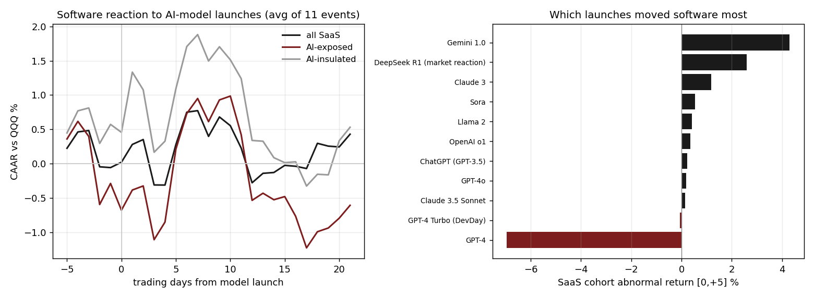

# 08 — AI-model launches are not a broad SaaS catalyst

**Question.** When a frontier AI model ships, does the software complex sell off (the "AI killed SaaS" reaction) — or rally? **Finding.** Neither. Across 11 curated launches, software as a group barely moves versus the broad tech market; the reaction is idiosyncratic, and the one famous "crash" was the SVB banking week, not the model.

> Research / backtested. No live capital, no audited track record. Launch-vs-reaction dates and the exposed/insulated labels are judgment calls, stated as such; 11 events is a small sample.

## Data & method

- **Cohort:** 113 US-listed software names (application/systems/data software, market cap > $2B), event study around **11 frontier-model launches** from ChatGPT (Nov 2022) through DeepSeek R1 (Jan 2025).
- **Abnormal return:** cumulative abnormal return (CAAR) versus QQQ in event time, windows [0,+1], [0,+5], [0,+21]. Cross-checked against the IGV software ETF as a sanity baseline.
- **Disruption split:** the cohort is also split into AI-*exposed* names (products an LLM can plausibly substitute) versus AI-*insulated* infrastructure/security/data names, to test whether the disruption story shows up where it should. Labels are curated opinion, not a factor model.

## Claim 1 — Software barely moves around launches

The group-level reaction is small and not directionally consistent. Across all three windows the all-SaaS CAAR sits within roughly half a percent of zero, and IGV (the ETF) is flatter still — the popular "launches crush SaaS" reaction simply isn't in the average.

| Window | All SaaS | AI-exposed | AI-insulated | IGV (ETF) |
|---|---:|---:|---:|---:|
| [0,+1] | +0.34% | −0.10% | +0.76% | −0.03% |
| [0,+5] | +0.33% | +0.50% | +0.52% | +0.05% |
| [0,+21] | +0.49% | −0.32% | −0.04% | −0.30% |

## Claim 2 — The reaction is idiosyncratic, and the famous "crash" is a confound

Per-launch [0,+5] abnormal returns scatter from clearly positive to one large negative — there is no common "launch reaction." The single big negative, GPT-4, landed on **2023-03-14, inside the SVB / regional-bank collapse week**; the −6.96% is high-beta software getting whipped by the banking crisis, not by GPT-4.

| Launch | SaaS CAAR [0,+5] |
|---|---:|
| Gemini 1.0 (2023-12-06) | +4.30% |
| DeepSeek R1 (2025-01-27) | +2.60% |
| Claude 3 (2024-03-04) | +1.17% |
| Sora / Llama 2 / o1 / GPT-4o / ChatGPT / Claude 3.5 / DevDay | −0.1% to +0.5% |
| GPT-4 (2023-03-14) — SVB week, not the model | −6.96% |

**Excluding the GPT-4 / SVB confound, the other 10 launches averaged roughly +1% abnormal** — mildly *positive* for software. The "AI launches crushed SaaS" memory is not supported by the data.

## Claim 3 — One real (but small) disruption signal

Where the disruption thesis does show up, it is real but tiny: AI-*exposed* software lagged AI-*insulated* infrastructure by **−0.88 pts over [0,+5]** and **−1.14 pts over [0,+21]** — about a point a month, directionally consistent with the thesis but far from a tradable catalyst. A cross-asset note: DeepSeek R1 *hurt* semis (NVDA roughly −17% that week) while *helping* software (+2.6%) — cheaper inference is bad for the picks-and-shovels and good for the apps, so a single launch is not one trade.

## The answer, in the data

**Q: Are AI-model launches a broad catalyst for software stocks?**
**A: No.** As a group, software barely moves versus the broad tech market around launches; the reaction is idiosyncratic, the famous GPT-4 "crash" is the SVB banking week, and ex-confound the launches were mildly positive. The only structural signal — exposed lagging insulated by about a point a month — is real but too small to trade.

## Caveats

11 events is a small sample. The CAAR is market-adjusted (beta = 1 vs QQQ), which slightly penalizes high-beta software on down days. Exact launch-vs-reaction dates are judgment, and the GPT-4 / SVB overlap shows that date choice can drive the headline number. The exposed/insulated lists are curated opinion, not a factor model.

## References

- MacKinlay (1997). *Event studies in economics and finance.* Journal of Economic Literature.
- Brown & Warner (1985). *Using daily stock returns: the case of event studies.* Journal of Financial Economics.
- Public launch dates for the frontier models studied (vendor announcements, contemporaneous press). Industry context informed by sector analysis (e.g. specialist sector research); no third-party material is reproduced here.
