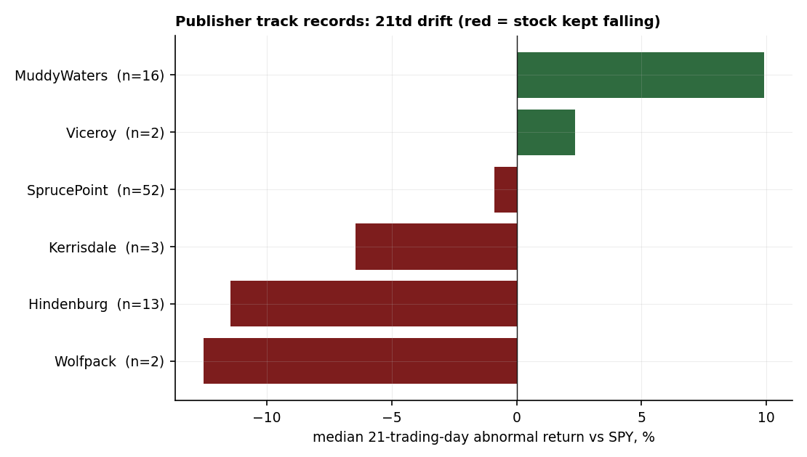

# 09 — Activist shorts: no pooled drift; the only edge is the publisher

**Question.** After an activist short report drops, does the target keep falling, and does it matter which firm published it? **Answer:** pooled, there is no drift you could trade — the post-report path is statistically indistinguishable from a random day in the same names. The only structure is publisher-specific, and it is too small-sample to call a finding.

> Research / backtested. No live capital, no audited track record. The campaign list is hand-curated (not exhaustively scraped), so it skews toward memorable, discussed campaigns — a survivorship tilt the numbers below cannot remove.

## Data & method

96 dated US-listed activist-short campaigns, Jan-2020 to Feb-2026, across 14 publishers. For each, the post-report path is measured as an abnormal return versus SPY at +1 / +5 / +21 / +63 trading days (entry at the report-day close, returns winsorized at +/-50%). The event path is tested two ways: a one-sample bootstrap CI on the event mean, and — the part that actually answers the question — a two-sample block bootstrap of the *difference* between the event window and a random non-event window in the same tickers. A walk-forward split (pre-2023 vs 2023+) checks regime stability. The publisher mix is imbalanced (SprucePoint 52, Muddy Waters 16, Hindenburg 13, ten shops with n <= 3), so per-publisher numbers are reported descriptively only.

## Claim 1 — No pooled drift, and no edge over a random day

The headline horizon is +21 trading days. The event-window median is essentially flat and the edge over the same-name baseline is not significant; the same holds at every horizon tested.

| metric (21td vs SPY) | value |
|---|---|
| n | 96 |
| % negative (drift "hit rate") | 52.1% |
| median AR | -0.54% |
| mean AR | +0.46% |
| one-sample boot95 CI (mean) | [-2.02%, +2.74%] — spans 0 |
| edge vs random-day baseline | +1.83pp |
| two-sample boot95 CI of the edge | [-0.72pp, +4.24pp] — spans 0, **not significant** |

Full horizon grid (pooled, market-relative):

| horizon | n | % neg | median AR | mean AR | edge vs baseline | edge CI95 | significant |
|---|---:|---:|---:|---:|---:|---|---|
| +1td | 96 | 49.0% | +0.08% | +0.58% | +0.66pp | [-0.70, +2.07] | no |
| +5td | 96 | 59.4% | -1.81% | +0.26% | +0.51pp | [-0.46, +1.46] | no |
| +21td | 96 | 52.1% | -0.54% | +0.46% | +1.83pp | [-0.72, +4.24] | no |
| +63td | 95 | 60.0% | -7.35% | -4.35% | +0.19pp | [-6.96, +7.18] | no |

The 63-day pooled median (-7.35%) looks like drift, but the random-day baseline median is -4.79% — so most of the long-horizon decline is just the unconditional drift of this mostly small/speculative universe, not a report effect. The edge over baseline at 63 days is +0.19pp. **Answer: No** — pooled, the activist-short event carries no tradable post-report drift.

## Claim 2 — The only structure is the publisher, and it is small-sample

Splitting by publisher does surface a real-looking, intuitive divide: forensic-fraud shops' targets keep falling, while a contested-call shop's targets tend to bounce.

| publisher | n | % neg (21td) | median AR (21td) | evidence tier |
|---|---:|---:|---:|---|
| Hindenburg | 13 | 76.9% | -11.47% | indicative (no valid CI) |
| Kerrisdale | 3 | 66.7% | -6.45% | indicative |
| SprucePoint | 52 | 53.8% | -0.89% | bootstrap-able (n > 21) |
| Muddy Waters | 16 | 25.0% | +9.92% | indicative (the bounce cohort) |

This split is real and intuitive, but it cannot be significance-tested: every publisher except SprucePoint has n <= 21, and the block bootstrap (block = 21) collapses to a zero-width CI once the block is as long as the sample. So Hindenburg's persistent decline and Muddy Waters' bounce are hypotheses to carry forward, not validated edges. **Answer: Conditional** — the publisher identity is the only thing that separates outcomes, but on this sample it is indicative, not proven.

## Claim 3 — Fat tails on both sides; the median tells most of the story

The 21-day distribution has heavy tails in both directions. The left tail is shorts that worked (SOUN -25%, IEP -49%, XL -48%); the right tail is squeezes (GL +49%). The median sits near zero and the mean is pushed around by whichever tail is heavier in a given cut — which is exactly why the pooled mean alone is not evidence of an edge.

## Caveats

- **Curated, survivorship-tilted sample.** Campaign dates are hand-assembled; only known, discussed campaigns are included. Quietly-failed shorts (published, nothing happened, never talked about) are unobserved, biasing the pool toward memorable outcomes.
- **Entry at report-day close.** A date off by a day or two, or a missed intraday report-day gap, would understate the immediate reaction.
- **Small-n everywhere.** 14 publishers, ten with n <= 3; every publisher except SprucePoint has n <= 21, so no per-publisher number is bootstrap-validated. The imbalanced mix (SprucePoint 52) dominates the pool.
- **Fat tails both sides.** The median is near zero; the mean is tail-driven. We do not manufacture an edge — the pooled null result stands.

## References

- Ljungqvist & Qian (2016). *How constraining are limits to arbitrage?* Review of Financial Studies.
- Mitts (2020). *Short and distort.* Journal of Legal Studies.
- Zhao (2020). Activist short-selling and corporate opacity.
- Campaign dates assembled from publisher research pages, Wikipedia, and reputable press.
