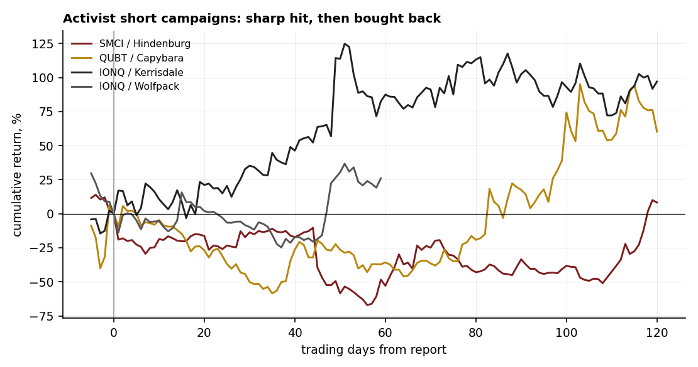

# 09 — Activist short reports: post-performance in the AI/quantum complex

**Question.** When an activist short report drops on an AI or quantum name, does the thesis play out, or is the stock bought back?

**Finding.** Computed across four 2024–26 campaigns: a sharp initial hit (median **−12%** on day one, −13% vs the semis basket) that was **bought back to a median +60% (raw) / +48% (relative) by +120 trading days**. The pure valuation short (Kerrisdale / IONQ) fared worst — IONQ rose **+97%**. Classic fraud-era shorts still collapsed their targets; this is a *regime* difference, not a thesis-quality one. Small sample (n=4) — read as computed cases, not a powered aggregate.

> Research. 4 web-verified campaigns; returns computed from split-adjusted daily closes. "Relative" = versus an equal-weight semis basket (SOXX is not in the warehouse). IONQ/Wolfpack's +60/+120d windows run past the 2026-04-30 data cutoff. No live capital.

## Data & method

- **Campaigns:** SMCI / Hindenburg (2024-08-27), QUBT / Capybara (2025-01-16), IONQ / Kerrisdale (2025-03-13), IONQ / Wolfpack (2026-02-04).
- **Measure:** raw cumulative return from the last pre-report close at +1 / +20 / +60 / +120 trading days, and the same relative to an equal-weight semis basket (NVDA, AVGO, AMD, TSM, AMAT, ASML, MU, MRVL). A constant-mean abnormal model was rejected — these names were parabolic pre-report, which makes the implied drift nonsensical — so raw and basket-relative are reported.

## Claim 1 — A sharp hit, then bought back

| Campaign | Thesis | +1d | +20d | +60d | +120d |
|---|---|---:|---:|---:|---:|
| SMCI / Hindenburg | accounting | −19% | −16% | −53% | +8% |
| QUBT / Capybara | promotion | −10% | −27% | −36% | +60% |
| IONQ / Kerrisdale | valuation | +17% | +21% | +88% | +97% |
| IONQ / Wolfpack | valuation | −14% | +2% | n/a | n/a |
| **Median (raw)** | | **−12%** | **−7%** | **−36%** | **+60%** |

The reports landed a sharp blow (median −12% day one) but the names were bought back; by +120 days the three with full windows had a median raw return of **+60%**.

## Claim 2 — The valuation short fared worst

Kerrisdale's IONQ report ("the revenue multiple is absurd") was run over — IONQ rose +88% by +60d and +97% by +120d. Shorting an expensive momentum name on valuation alone is the textbook way to get squeezed.

## Claim 3 — Regime-dependent: fraud shorts still work

The classic fraud campaigns (Nikola / Hindenburg 2020, Luckin / Muddy Waters 2020) ended in collapse or delisting — but they pre-date our price window, so they are cited, not recomputed. The difference from the 2024–26 cases is the dip-buying bid, not the quality of the allegation. The industry also contracted: the DOJ charged Citron's Andrew Left with fraud in 2024, and Hindenburg Research wound down in January 2025, so liquid recent campaigns are genuinely few.

## The answer, in the data

**Q: Do activist shorts on AI/quantum names pay off for the short?**
**A: No, in this regime.** Only the first few days rewarded the short; by six months the median target was bought back to +60%.

| Horizon | Median raw | Median vs basket |
|---|---:|---:|
| +1 day | −12% | −13% |
| +20 days | −7% | −11% |
| +60 days | −36% | −12% |
| +120 days | **+60%** | **+48%** |

## Caveats

n = 4, all 2024–26 high-beta retail names; the activist-short industry contracted after 2024, so recent campaigns on liquid US names are few. SOXX is absent, so "relative" is versus an equal-weight semis basket. Wolfpack's longer windows exceed the data cutoff. Classic-campaign outcomes are sourced (pre-2021), not computed.

## References

- Ljungqvist & Qian (2016). *How constraining are limits to arbitrage?* RFS.
- Mitts (2020). *Short and distort.*
- Zhao (2020). Activist short-selling and corporate opacity.
- Community: r/stocks and r/wallstreetbets threads on the SMCI and IONQ squeezes — the "buy the short report" dip-buying dynamic in real time.
