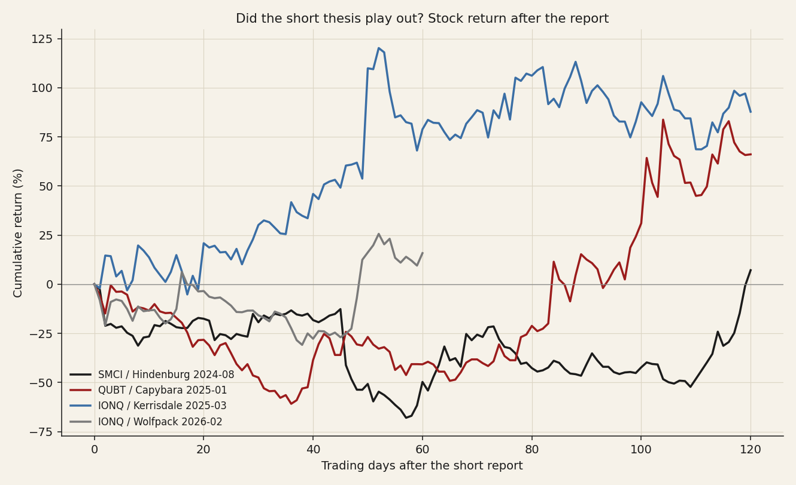
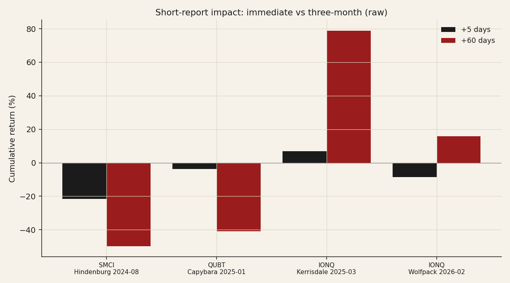

# 09 — Activist short reports: post-performance in the AI/quantum complex

**Question.** When an activist short report drops on an AI or quantum name, does the thesis play out, or is the stock bought back?

**Finding.** All four verified campaigns were *faded* — a sharp initial hit, then bought back within 3–6 months; the pure valuation short saw the stock roughly double. That contrasts with classic fraud shorts that collapsed: a regime difference, not a thesis-quality difference.

> Research. 4 web-verified campaigns priced in full; raw and SOXX-relative cumulative return. A small sample — read these as cases, not a powered aggregate.

## Data & method

- **Campaigns:** SMCI / Hindenburg (2024-08-27), QUBT / Capybara (2025-01-16), IONQ / Kerrisdale (2025-03-13), IONQ / Wolfpack (2026-02-04).
- **Measure:** raw cumulative return from the last pre-report close, anchored so +1d captures the first reaction day; plus a SOXX-relative leg. A constant-mean abnormal-return model was **rejected** — these names were parabolic pre-report, which made the implied drift nonsensical (it produced impossible −300% "abnormal" returns).

## Claim 1 — In the 2024–26 retail-momentum regime, the shorts were faded

Each report landed a sharp blow (mean +20d **−7%**) but the names were bought back within three to six months; by +120 days the three older targets actually *outperformed* the semis sector.

## Claim 2 — The valuation short fared worst

Kerrisdale's IonQ report ("the revenue multiple is absurd") was run over — IonQ roughly **doubled** over the following ~120 days. Shorting an expensive momentum name on valuation alone is the textbook way to get squeezed.

## Claim 3 — Regime-dependent: fraud shorts still work

The classic fraud campaigns (Nikola / Hindenburg 2020, Luckin / Muddy Waters 2020) ended in collapse or delisting. The difference from the 2024–26 cases is the dip-buying bid, not the quality of the allegation.

## Caveats

n = 4, all 2024–26, all high-beta retail names; the activist-short industry contracted sharply after Citron's 2024 DOJ charges and Hindenburg Research's January-2025 wind-down, so recent campaigns on liquid US names are genuinely few. Classic-campaign outcomes are from public reporting.

## References

- Ljungqvist & Qian (2016). *How constraining are limits to arbitrage?* RFS.
- Mitts (2020). *Short and distort.*
- Zhao (2020). Activist short-selling and corporate opacity.
