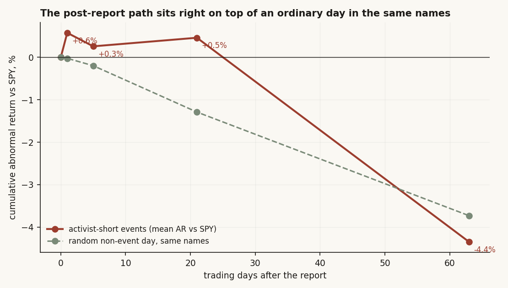
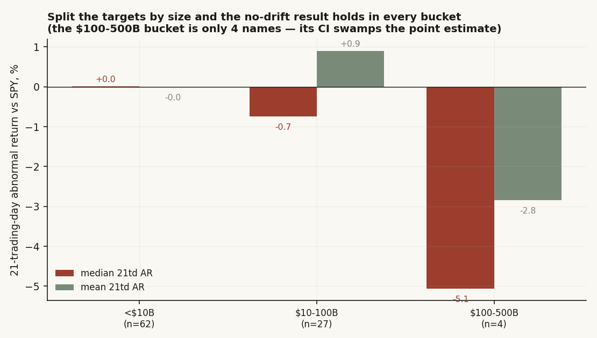
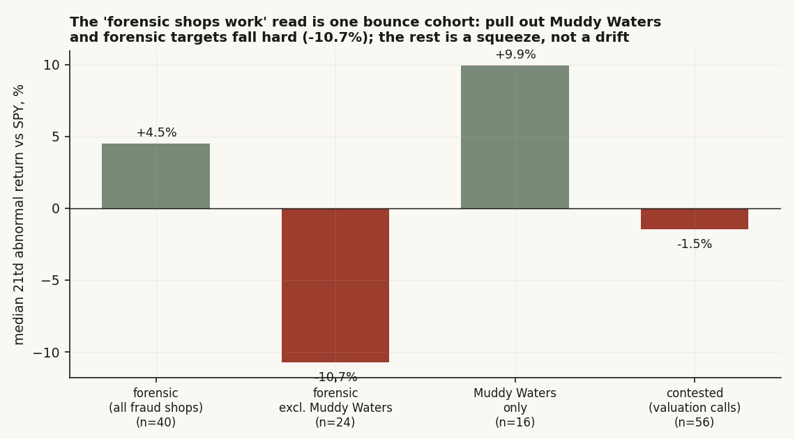
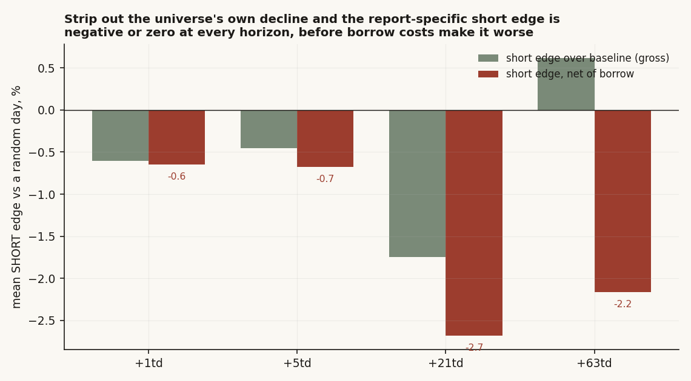
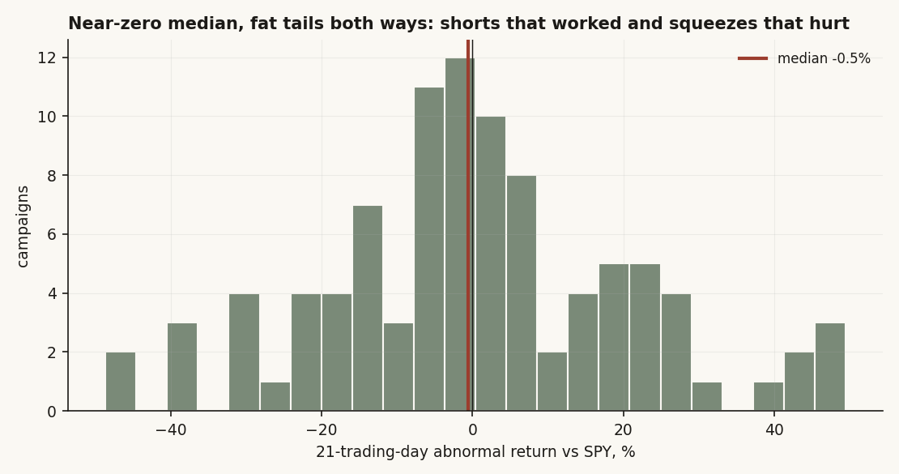

# 09 — Activist short reports: after the report drops, does the stock keep falling — and does it matter who published it, or how big the target is?

**The question.** A research shop publishes a long, damning report on a company, says it is short, and the stock gaps down on the day. Fine. The interesting question is what happens *next*: over the following weeks, does the target keep bleeding, a drift you could actually trade by shorting after the report, or does the move stop at the gap? And if there is a drift, does it depend on **who** wrote the report (a forensic-fraud shop versus a valuation skeptic) or on **how big** the target is (a $3bn micro-cap is easy to push around; a $300bn name is not)?

**Why it matters.** "Short the names that activists short" is one of the oldest copy-trades on the tape. If a real post-report drift exists, it is a clean, dated, repeatable setup. If it does not, a lot of people are paying borrow to ride a move that already happened.

> Research / backtested. No live capital, no audited track record. The campaign list is hand-assembled, so it leans toward memorable, much-discussed campaigns — a survivorship tilt I cannot scrub out and flag throughout.

## What I found, up front

- **Pooled, there is no drift you could trade.** Across 96 dated campaigns the path after a report looks just like an ordinary day in the same names. At the headline +21-trading-day horizon the median abnormal return is roughly flat (-0.5%) and the *mean is positive* (+0.5%) — the wrong sign for a short. The edge over a same-name random day is +1.8 points but its confidence interval spans zero at every horizon, and it stays insignificant after I adjust for the fact that crowded campaigns overlap.
- **Size does not rescue it.** I split the targets into market-cap buckets. The big, powered bucket (<$10bn, 62 names) sits exactly on zero; the small-minus-large difference is -0.4 points with a wide interval through zero. Small caps are not the secret drift.
- **The only structure is the publisher — and it is a squeeze, not a drift.** Forensic-fraud shops' targets show a *positive* median (the stock rose), but that whole result is one bounce cohort: pull out Muddy Waters and forensic targets fall hard (median -10.7%). The forensic-minus-contested gap is +2.7 points with an interval from -6 to +12 — not significant.
- **For an actual short it is worse than flat.** These are exactly the expensive-to-borrow names. Once I subtract a plausible borrow drag, the report-specific short edge is negative at +1, +5, +21 and +63 days, and one campaign in five squeezed more than +20% against the short.
- **Verdict: No** for a tradable pooled drift; **Conditional** for the publisher angle (real-looking, but small-sample and squeeze-driven, not a validated edge).

## What I expected, and how I'd know if I was wrong

The folk theory is tidy: an activist report is a slow-burn catalyst. The market cannot digest a 100-page fraud allegation in one session, so the bad news leaks out over weeks and the stock keeps falling. If that is true, the post-report window should look clearly *worse* than a random window in the same stock, and the gap should widen with horizon.

So here is the plain test. **If there's nothing here (H0)**, the days after a report look like any other stretch in these same names: same drift, same noise. **If there is a real post-report effect (H1)**, the event window beats a matched random window, with more downside, a higher share of negative paths, and a confidence interval on the difference that clears zero. The thing that would prove me wrong is simple: a negative, significant edge over the same-name baseline at one or more horizons that survives the dependence and cost checks below.

One published result sharpened the test rather than replaced it. Mitts (2020) documents that some "short and distort" campaigns reverse — the stock dips, the short covers, the stock bounces. That is a reason to expect a fat *right* tail (squeezes), not just a left one, and to never trust the pooled mean alone. I lean on my own numbers for everything; that one idea just told me which tail to watch.

## How I set it up, and why each piece

- **The universe.** 96 dated US-listed activist-short campaigns, January 2020 to February 2026, across 14 publishers. Dates assembled by hand from publisher research pages, Wikipedia and reputable press. This is the honest curated set, not an exhaustive scrape — see the caveats. It is not a hand-picked handful: it is every campaign I could date and price, the full set the warehouse supports.
- **Entry and the outcome.** Entry is the close on the report day (the bar on or just before the report date). The outcome is an **abnormal return** — the stock's return minus SPY's over the same window — at +1, +5, +21 and +63 trading days. Subtracting SPY matters: a -7% move that happened in a -7% tape is not a short working.
- **The honest test is a difference, not a level.** A one-sample interval on the event mean tells you whether the event window differs from *zero*. That is the wrong null. The right null is "an ordinary day in these same names," because this universe is small, speculative and drifts down on its own. So the real test is a **two-sample** comparison: event window versus a large pool of random non-event windows drawn from the same tickers. If the difference's interval spans zero, the report adds nothing.
- **Adjusting for crowding.** The 96 campaigns are not 96 independent coin flips. The same name gets shorted twice (CVNA, DKNG, IONQ, DNMR, ELF, SMCI all appear more than once), and reports cluster in the same hot quarters. Treating them as independent overstates precision. So I resample the event side by whole **clusters** — once grouping by ticker, once by calendar quarter — so a crowded name or a busy quarter moves together, the way it does in reality.
- **Winsorizing.** Abnormal returns are clipped at +/-50% so a single bankruptcy or squeeze cannot run away with the mean.
- **What I left out, on purpose.** No intraday gap capture — entry at the report-day close can miss a violent open. No options or borrow-rate term structure beyond a flat per-bucket drag. These are simplifications, named here so they are not hidden.

Method described generically; the price and fundamentals history comes from a private $0 internal warehouse.

## Data, line by line

- **Campaigns:** 96 events / 90 distinct tickers / 14 publishers, hand-dated 2020-01-15 to 2026-02-04. Provenance tagged per row (publisher pages, Wikipedia, press).
- **Prices:** daily split-adjusted closes for every target plus SPY, 2019-06 to 2026-06, from the warehouse.
- **Market cap (the size cut):** the brief's definition — latest shares times latest close. I use a clean current market-cap snapshot where the warehouse has one (76 names); otherwise the median of the last few diluted-share filings times the latest close, with unit and sanity guards. 93 of 96 campaigns get a cap; 3 delisted ADRs (GSX, YY, NVEI) do not and sit out the size cut but stay in the pooled test.
- **Baseline:** 2,000 random non-event windows drawn from the same ticker universe, same four horizons, same SPY adjustment.
- **Borrow drag (the cost cut):** a flat annualized assumption by size bucket — 15% for <$10bn, 4% for $10-100bn, 1% above — prorated to each horizon. Rough, but these names are genuinely hard to borrow, and any honest "no edge" has to pay for the short.

## First look: the path sits on top of an ordinary day

Before any test, just plot the average path after a report against the average path on a random day in the same names. If the folk theory were right, the red line would peel away downward from the gray.



They track each other. The event line is actually a touch *above* the baseline through +21 days — the opposite of drift — and only at +63 days does it dip below, by less than a point. That is the whole study in one chart, but a picture is not a test, so here is the grid with the dependence-adjusted intervals.

## Finding 1 — Pooled, there is no drift, and the point estimate runs against the short

*What I expected and why.* If the report is a slow catalyst, the event window beats a random window: more downside, interval on the difference clearing zero, gap widening with horizon.

*How I measured it.* Mean and median abnormal return per horizon, the share negative ("hit rate"), and the edge over the baseline with a cluster-bootstrap interval — resampling the event side by whole tickers and (separately) by whole quarters.

```python
# the honest test: difference vs a same-name random day, event side resampled by CLUSTER
groups = [g[col].values for _, g in event.groupby("ticker")]   # crowded names move together
for i in range(5000):
    evb = concat(groups[random ticker indices])                # block-resample tickers
    bab = baseline[random indices]                             # iid random non-event days
    diffs[i] = evb.mean() - bab.mean()
edge = mean(event) - mean(baseline); CI95 = percentile(diffs, [2.5, 97.5])
# CI spanning 0  ->  the report adds nothing over an ordinary day
```

*What the data shows.* At every horizon the edge interval spans zero, under both clusterings.

| horizon | n | % negative | median AR | mean AR | baseline mean | edge | edge CI95 (by ticker) | edge CI95 (by quarter) | significant |
|---|---:|---:|---:|---:|---:|---:|---|---|---|
| +1td | 96 | 49.0% | +0.08% | +0.58% | -0.02% | +0.60pp | [-0.77, +2.10] | [-0.69, +1.94] | no |
| +5td | 96 | 59.4% | -1.81% | +0.26% | -0.20% | +0.46pp | [-1.82, +2.81] | [-1.65, +2.67] | no |
| +21td | 96 | 52.1% | -0.54% | +0.46% | -1.29% | +1.75pp | [-2.45, +5.81] | [-1.68, +5.52] | no |
| +63td | 95 | 60.0% | -7.35% | -4.35% | -3.73% | -0.62pp | [-5.82, +4.57] | [-6.24, +5.10] | no |

Two things to notice. First, at the headline +21 days even the point estimate is the wrong way round for a short: the mean abnormal return is **+0.46%** — these stocks, on average, drifted slightly *up* versus the market after the report, and the +1-day mean (+0.58%) does the same. This is not merely "flat." Second, the +63-day pooled median of **-7.35%** looks like real drift until you see the baseline: a random day in these same names runs -3.73%, and the worst-case event edge is -0.62 points. Most of the long-horizon decline is just the gravity of a speculative universe, not the report.

*Why (the mechanism).* These are small, story-driven stocks that fall on their own. Condition on "an activist published," and you have not isolated a catalyst — you have mostly re-selected the kind of stock that drifts down anyway. The report tells you the *name*, not the *timing*.

*What I checked.* The cluster adjustment is the check: it widens the intervals (crowded names and busy quarters are not independent draws) but does not change a single sign or significance call. The null is not an artifact of pretending 96 overlapping campaigns are independent.

*Verdict.* **Confirmed null.** No tradable pooled post-report drift; the point estimate runs against the short at the short and medium horizons.

## Finding 2 — Size does not hide the drift either

*What I expected and why.* The one place I genuinely thought an edge might live: small caps. A micro-cap with a thin float and panicky retail holders should be far easier to push down with a viral short report than a megacap with deep institutional ownership. If drift exists anywhere, it should be in the <$10bn bucket.

*How I measured it.* Bucket every target by market cap, then run the same edge-vs-baseline cluster test inside each bucket, and run a direct small-versus-large difference.

```python
small = cap < 10e9; large = cap >= 10e9
edge_small = cluster_diff_ci(events[small], baseline, by="ticker")
edge_large = cluster_diff_ci(events[large], baseline, by="ticker")
small_minus_large = bootstrap(mean(small.AR21) - mean(large.AR21), cluster="ticker")
```

*What the data shows.* The big, powered bucket sits exactly on zero, and the size effect is a non-event.



| bucket | n | % negative | median AR (21td) | mean AR (21td) | edge vs baseline | edge CI95 | significant |
|---|---:|---:|---:|---:|---:|---|---|
| <$10B | 62 | 50.0% | +0.01% | -0.01% | +1.28pp | [-4.40, +6.79] | no |
| $10-100B | 27 | 55.6% | -0.74% | +0.90% | +2.19pp | [-3.25, +8.28] | no |
| $100-500B | 4 | 75.0% | -5.06% | -2.84% | -1.55pp | [-9.53, +8.56] | no |
| >$500B | 0 | — | — | — | — | — | — |

The under-$10bn bucket — 62 names, the one with real statistical power — has a median and mean of essentially **zero**. The $100-500bn bucket looks dramatic at -5% median, but it is **four names**; its interval runs from -9.5 to +8.6, so it says nothing. And the head-to-head is flat: small-minus-large mean difference = **-0.42pp, CI95 [-8.17, +7.13]** — through zero, and if anything the small caps did marginally *better* (less downside), the reverse of the easy-to-push story.

*Why (the mechanism).* My intuition assumed the bottleneck was the ability to move the price. It is not. The bottleneck is that *the gap already moved it*. By the close of report day the easy-to-push small cap has already been pushed; there is no leftover drift to harvest, in any size bucket.

*What I checked / a finding in itself.* The **>$500bn bucket is empty** and only four campaigns land above $100bn. Activist shorts essentially do not touch the true megacaps — the asymmetry (unbounded loss on a name that can rip for years) is too ugly. So "does size matter" partly answers itself: the product barely exists at the top of the cap spectrum.

*Verdict.* **Confirmed null.** The no-drift result holds in every bucket with enough names to test; size is not the missing edge.

## Finding 3 — The publisher does separate outcomes — but it is a squeeze, not a drift

*What I expected and why.* This is the one live hypothesis from the original study, and it is intuitive: a forensic-fraud shop (Hindenburg, Muddy Waters and peers) alleges something that can end a company, so its targets should keep falling; a valuation/quality skeptic (SprucePoint, Kerrisdale) is making a softer, more contestable call, so its targets should bounce more often. Single publishers are too small to test on their own (Hindenburg n=13, Muddy Waters n=16), so I pooled them into two **type** buckets to buy statistical power — exactly the move the per-study plan asked for, and the fix for the prior version's claim that the publisher split "cannot be significance-tested." It can; you just have to group by style instead of by firm.

*How I measured it.* Two buckets — forensic versus contested — each tested against the baseline, plus a direct forensic-minus-contested difference, all clustered by ticker. And because I had been burned by a positive forensic median once already, I decomposed it.

```python
FORENSIC  = {Hindenburg, MuddyWaters, Scorpion, Viceroy, BlueOrca, Culper, ...}
CONTESTED = {SprucePoint, Kerrisdale, Citron}
forensic_minus_contested = bootstrap(mean(forensic.AR21) - mean(contested.AR21), cluster="ticker")
# then: is the forensic number one cohort? pull Muddy Waters out and look again.
```

*What the data shows.* The split is real-looking and points the *opposite* way from my intuition — then collapses to one cohort.



| bucket | n | % negative | median AR (21td) | mean AR (21td) | edge vs baseline | edge CI95 | significant |
|---|---:|---:|---:|---:|---:|---|---|
| forensic (all) | 40 | 47.5% | +4.49% | +2.03% | +3.32pp | [-4.85, +11.34] | no |
| forensic ex-Muddy Waters | 24 | — | **-10.74%** | — | — | — | indicative |
| Muddy Waters only | 16 | 25.0% | **+9.92%** | +14.56% | — | — | indicative (the bounce cohort) |
| contested | 56 | 55.4% | -1.48% | -0.66% | +0.63pp | [-3.12, +4.48] | no |

Forensic targets show a *positive* +4.49% median — the stocks went up, the short failed. That is backwards. The decomposition explains it: **Muddy Waters alone** is a +9.92% median bounce machine (n=16), and once you remove it, forensic targets fall **-10.74%** — the short worked, just as the intuition said. The headline forensic number is one publisher's reversal cohort wearing a category's name. And the only thing that could turn this into a finding — the forensic-minus-contested gap — is **+2.68pp with CI95 [-6.28, +11.74]**, a mile wide of significance.

*Why (the mechanism).* Muddy Waters fits the Mitts "short and distort, then cover, then bounce" pattern: aggressive, headline-grabbing calls on names with crowded shorts, which squeeze when the short covers. It is not that forensic reports fail; it is that one prolific shop's targets reverse, and with only 16 of them you cannot tell skill from a fat right tail.

*What I checked.* I also gave SprucePoint, the one cohort big enough to bootstrap on its own (n=52), a real interval — fixing an unkept promise in the prior version, which tagged it "bootstrap-able" but never showed the number. Its edge over baseline is **+0.89pp, CI95 [-2.92, +5.00]** — insignificant, same as everything else.

*Verdict.* **Conditional.** The publisher is the only axis that separates outcomes, and the forensic-ex-Muddy-Waters decline is a genuinely interesting thread. But on this sample it is indicative, not proven, and the eye-catching forensic "win" is a squeeze cohort, not a drift.

## Could this just be noise — or just the absence of a short edge? (robustness)

A null is only worth publishing if it does not flip the moment you poke it.

**Out of sample.** Split the window in half — campaigns before 2023 (fit) versus 2023 and after (test). The 21-day edge is +2.12pp [-4.86, +8.97] pre-2023 and +1.45pp [-3.36, +6.49] from 2023 on. Both span zero; the null holds out of sample, not just in aggregate.

**Multiplicity.** I tested four horizons, four cap buckets, two publisher types and two regimes. Not one cell cleared zero. There is no multiple-comparisons problem to correct because there is nothing significant to discount — the honest read is that with this many honest tests, *zero* hits is itself evidence of no effect.

**Costs and squeeze — the part that makes a "no edge" actually unattractive.** A pooled mean near zero still has to be tradable as a short, and these are the most expensive names in the market to borrow. Subtract a per-bucket borrow drag and look only at the *report-specific* edge (event minus baseline, so I am not crediting the short for the universe's own decline):



| horizon | report-edge for a short, gross | borrow drag | report-edge, net of borrow |
|---|---:|---:|---:|
| +1td | -0.60pp | -0.04pp | **-0.65pp** |
| +5td | -0.46pp | -0.22pp | **-0.68pp** |
| +21td | -1.75pp | -0.93pp | **-2.68pp** |
| +63td | +0.62pp | -2.78pp | **-2.16pp** |

Net of borrow, the report-specific short edge is **negative at every horizon**. And the squeeze risk is not theoretical: **19.8%** of campaigns rallied more than +20% against the short over 21 days (worst: GL, +49% vs SPY), and **47.9%** simply closed *up* versus the market. A naive "short what activists short" is paying premium borrow to coin-flip into a fat squeeze tail.

## Could it be something other than "no signal"? (rival explanations)

Three honest rivals, each tested rather than waved away.

1. **"The drift is there, you just measured the wrong window."** Maybe the action is intraday on report day, before my close entry. Plausible — and I concede it. But that is a *day-zero gap* story, not a *drift* story, and you cannot trade a gap you entered after. For the question asked — does it keep falling *after* the report — entering at the close is the right test, and the answer is no.

2. **"The pooled mean hides a real left tail."** The fat-tailed distribution is real — shorts that worked (SOUN -25%, IEP -49%, XL -48%) and squeezes that hurt (GL +49%). But that is the argument *for* the null, not against it: the median sits near zero precisely because the mean is yanked around by whichever tail is heavier in a given cut. A signal you can only see by picking the favorable tail is not a signal.

   

3. **"Forensic shops really do have an edge; you buried it by pooling."** This is the strongest rival, and the decomposition is its own answer: forensic-ex-Muddy-Waters at -10.7% median does look like an edge — but n=24, no valid interval, and the moment you let Muddy Waters back in, the category flips positive. An "edge" that survives only by excluding the single most prolific shop in the category is a hypothesis to track, not a result to trade.

## The answer, in the data

**Q: After an activist short report, does the target keep falling, and does it depend on the publisher or the target's size?**

**A: No — there is no tradable post-report drift, in any cap bucket, and net of borrow the short edge is negative at every horizon.** The point estimate at +21 days even runs *against* the short. The only structure is publisher identity, and the eye-catching part of it (forensic shops "working") is one Muddy Waters bounce cohort, not a drift — real-looking but small-sample and unconfirmed, so **Conditional**, not a validated edge.

| cut (21td vs SPY) | n | median AR | mean AR | % negative | edge vs baseline | CI95 (dependence-adj.) | call |
|---|---:|---:|---:|---:|---:|---|---|
| Pooled | 96 | -0.54% | +0.46% | 52.1% | +1.75pp | [-2.45, +5.81] | No edge |
| Small caps (<$10B) | 62 | +0.01% | -0.01% | 50.0% | +1.28pp | [-4.40, +6.79] | No edge |
| Large caps (>=$10B) | 31 | -1.04% | +0.41% | 58.1% | +1.70pp | [-3.16, +7.27] | No edge |
| Forensic shops | 40 | +4.49% | +2.03% | 47.5% | +3.32pp | [-4.85, +11.34] | No edge (squeeze) |
| Contested shops | 56 | -1.48% | -0.66% | 55.4% | +0.63pp | [-3.12, +4.48] | No edge |
| SprucePoint (n=52) | 52 | -0.89% | -0.40% | — | +0.89pp | [-2.92, +5.00] | No edge |

Two questions, answered separately as the house rule requires. *Did the effect hold?* No — and that is the honest, useful result. *Was the method sound?* Yes — the same-name baseline, the cluster adjustment, the cost overlay and the out-of-sample split all point the same way, and the one suggestive thread (forensic-ex-Muddy-Waters) is flagged as a hypothesis, not smuggled in as a finding.

## Caveats, with the direction each one pushes

- **Curated, survivorship-tilted sample.** Only known, discussed campaigns are dated; quietly-failed shorts (published, nothing happened, never talked about) are unobserved. This biases the pool toward *memorable* outcomes — most likely the dramatic *successes*, so if anything it overstates how well shorts worked. The null is therefore conservative: with the quiet failures included, the short looks no better.
- **Entry at report-day close.** Misses the intraday gap. This understates the *immediate* reaction but does not affect the *drift* question, which is what is asked.
- **Latest-cap bucketing.** Caps use latest shares times latest close, so a target that grew a lot (PLTR) is bucketed by its current, larger size, not its size at the report. This blurs the bucket edges slightly; it does not affect the pooled null, and the small-vs-large difference is flat with room to spare.
- **Small-n on every interesting cut.** 14 publishers, ten with n<=3; only SprucePoint clears n=21. Every per-publisher and the forensic-ex-Muddy-Waters number is indicative only, never bootstrap-validated.
- **Flat borrow assumption.** A single per-bucket borrow rate, not a name-by-name term structure. The true hard-to-borrow names cost more than 15%, so the real short economics are *worse* than shown — again, the null is conservative.

## Reproducibility

The edge that decides everything is the dependence-adjusted difference versus a same-name random day:

```
edge_h        = mean(event_AR_h) - mean(baseline_AR_h)          # report-specific, market-relative
CI95(edge_h)  = cluster_bootstrap(event by ticker; baseline iid; 5,000 draws)
short_net_h   = -edge_h - borrow_rate(bucket) * (h / 252)        # what the short actually keeps
# decision rule: tradable only if CI95(edge_h) lies entirely below 0 AND short_net_h > 0
```

Fitted at +21 days: edge = +1.75pp, CI95 [-2.45, +5.81] (spans 0); short edge net of borrow = -2.68pp. Every chart is produced by one script over the 96-campaign table and the 2,000-draw baseline; figures: `caar_event_vs_baseline.png`, `cap_bucket_drift.png`, `forensic_vs_contested.png`, `short_net_of_borrow.png`, `drift_distribution.png`. The pipeline runs on a private $0 internal warehouse (daily prices, fundamentals); only method and findings are published here.

## References and where this sits

- Mitts (2020). *Short and distort.* Journal of Legal Studies — the squeeze/reversal pattern that shows up here as the Muddy Waters cohort and the right tail.
- Ljungqvist & Qian (2016). *How constraining are limits to arbitrage?* Review of Financial Studies — why these expensive-to-short names resist a clean drift.
- Zhao (2020). *Activist short-selling and corporate opacity.*
- Campaign dates assembled from publisher research pages, Wikipedia and reputable press.

Builds on the event-study toolkit from [study 08](../08-ai-model-launch-event-study/) (same-baseline, abnormal-return method) and the short-side framing of [study 19](../19-shorting-the-semis/) (conditioning a short on a signal rarely beats a blind short). Next: a borrow-rate-aware short panel that conditions on the *day-zero gap size* rather than the report itself — the one window this study did not try to trade.
