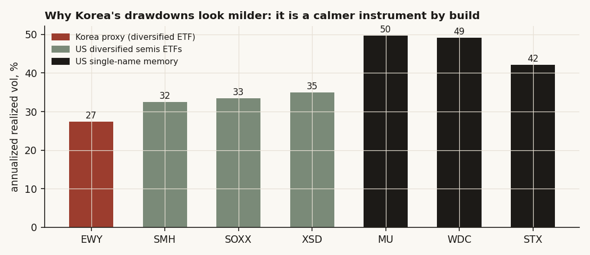
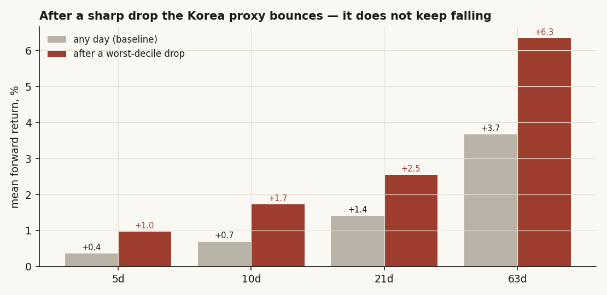
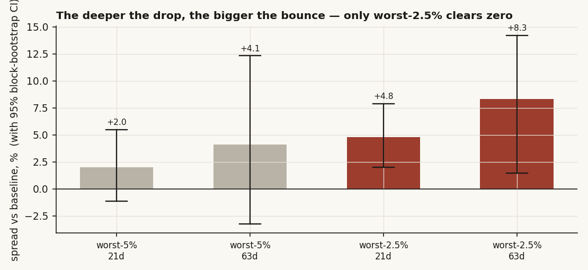
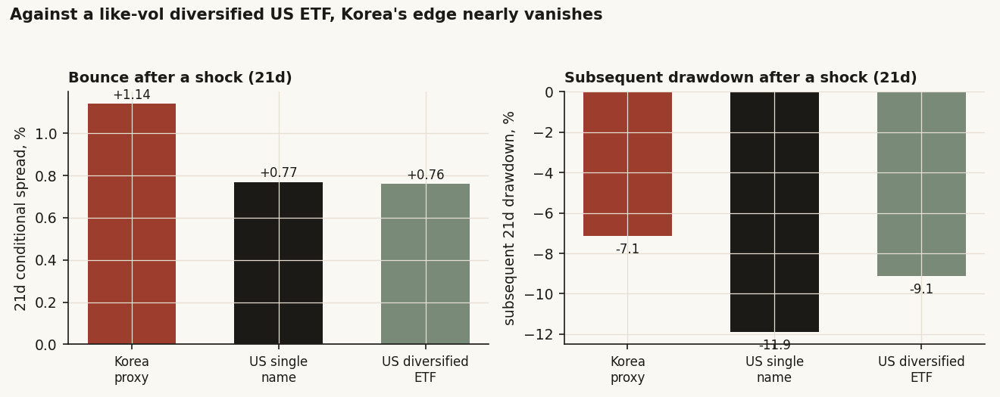

# 10 — Korea memory and leverage: when the stock drops hard, does the levered Korea trade spiral down, or bounce?

**The question.** Korean memory — Samsung and SK Hynix — is the most cyclical corner of tech, and in 2026 retail investors there are carrying it on a record pile of borrowed money (margin debt near 38 trillion won). The fear is a *death spiral*: price drops, brokers force-sell the people who borrowed to buy, that selling drops the price more, which forces more selling. So I wanted to know one concrete thing: after a sharp down day, does this trade keep falling (a spiral), or does it bounce back (mean-reversion)? And if it bounces, is that anything special about Korea — or just what any diversified basket does?

**The short answer.** On the data I can actually get, it bounces. After a worst-decile down day the Korea proxy is *higher*, not lower, at every horizon I checked, and the bounce is biggest in the very deepest drops — the opposite of a spiral. But here is the honest catch I dug into this time: that bounce is **not a Korea thing**. Every US chip name and chip ETF I tested bounces the same way. Korea only *looks* special because it is the calmest instrument in the set, so its bounce is the one whose error bars are tight enough to call real. And the clean test — the actual levered Samsung/SK Hynix single-name tape — I still can't run, because that data isn't in the warehouse. So this stays a **Conditional** answer, scoped to a proxy.

> Research / backtested. No live capital, no audited track record. This is a **proxy study.** The clean Korean single-name tape (Samsung 005930, SK Hynix 000660) carries only ~40 days of history in the warehouse — far too short — so the Korea limb runs on a diversified, dollar-priced Korea-equity ETF that, if anything, *understates* a Korean margin cascade. Read every number as a statement about the proxy, not about a levered single name.

## What I'm really claiming (and what I'm not)

- After a sharp drop the Korea proxy **rebounds**: the forward return is higher than a normal day at 5, 10, 21 and 63 days. Four out of four positive. Mean spread **+1.37%**, median **+1.09%**. Wrong sign for a spiral.
- The rebound **grows with the size of the drop**, and the only cells in the whole study whose error bars clear zero are the two deepest-tail cells (worst-2.5% days): 21d **+4.79%** [+2.0, +7.9] and 63d **+8.30%** [+1.5, +14.2]. Both positive. A spiral would have gone the other way.
- The big change from my first pass: I added a **like-for-like control** — diversified US chip ETFs (SMH, SOXX, XSD) at roughly the same volatility as the Korea proxy. The Korea "edge" mostly disappears against them. At 21 days Korea's bounce is +1.14% vs +0.76% for the diversified US ETFs — almost a tie. The drawdown gap I once called "roughly half as deep" was comparing a calm ETF to wild single names; against a calm US ETF it shrinks to -7.1% vs -9.1%.
- So the headline is **broad mean-reversion after sharp drops, 2016–2026**, of which the Korea proxy is the statistically cleanest case — not a Korea-specific result, and not a refutation of the spiral mechanism on the levered tape I can't see.
- **Verdict: Conditional.** No spiral in the proxy. But the proxy can't carry the question, and the genuine single-name limb is data-blocked.

## What I expected before I looked

The spiral story is real plumbing, not a vibe. Korean retail buys on 신용융자 (credit margin); if your collateral ratio breaches the broker's threshold, you get 반대매매 — a forced sell two days later, dumped into a market with a daily price limit. Stack enough of that on two stocks that are half the index and you have a machine for turning a normal memory downcycle into a cascade. The capital-cycle literature (Chancellor's *Capital Returns*; Geanakoplos on leverage cycles) says exactly this: leverage makes the down-leg violent.

So the null and the alternative are simple.

- **H0 (spiral):** after a sharp drop, forward returns are *worse* than normal, and *worse still* in the deepest drops. Negative continuation.
- **H1 (no spiral / rebound):** after a sharp drop, forward returns are the same or *better* than normal. Mean-reversion.
- **What would prove me wrong:** a negative, widening spread as I push into the tail. I looked for that specifically. I didn't find it.

One more thing I held myself to: even if the proxy rebounds, that does *not* prove a levered single name would. A dollar-priced, diversified ETF cannot reproduce a won-denominated, single-name margin call. I keep saying this because it's the load-bearing limitation.

## How I set it up, and why each piece

**The data.** Daily split-adjusted closes from a private warehouse, 2016-05-18 to 2026-06-03 — 2,525 trading days, the full available history for every name. Seven names:

- **Korea proxy:** EWY (iShares MSCI South Korea), the only liquid, full-history Korea-equity instrument I have. It is ~20–25% Samsung + SK Hynix by weight, priced in dollars. Dampened and currency-mixed by circumstance, not by choice.
- **US single-name memory/storage:** MU, WDC, STX — the "less-levered, institutionally-owned" comparison the spiral story leans on.
- **US diversified chip ETFs (new this pass):** SMH, SOXX, XSD — added so I can ask the real question: is anything Korea-specific, or is it just diversification? These sit at roughly Korea's volatility, so they're the fair fight.

**The test.** For each name I find its own worst-decile down day (the bottom 10% of its daily returns). Then I measure two things over the next 5 / 10 / 21 / 63 trading days: the forward return, and the worst peak-to-trough drawdown. I compare each to that same name's unconditional baseline — what a *random* day looks like. A spiral needs the shock-conditional numbers to be *worse* than baseline. Daily returns clipped at ±50% so one bad print can't run the result.

**The honesty guards.** I'm testing a lot of cells (7 names, several horizons, a few tail cutoffs), so I won't trust a point estimate. Three guards: a **block bootstrap** (5,000 draws, 21-day blocks — it respects the fact that nearby days move together, so the error bars aren't fake-tight), a **walk-forward out-of-sample** split (fit the shock threshold on the first 60% of history, test the behavior on the last 40%, no peeking), and an explicit **multiple-testing count** so a lucky cell can't masquerade as a finding.

## What a normal day looks like first

Before any conditioning, the instruments are just very different animals. Annualized volatility: EWY **27%**, the US diversified ETFs **32–35%**, the US single names **42–50%**. That one fact ends up explaining most of what used to look like a Korea result, so I lead with it.



Hold that picture. A calmer instrument has milder drops and shallower drawdowns *by construction*. Any "Korea is safer" comparison against the single names is partly just this.

## Finding 1 — After a sharp drop, the Korea proxy bounces

**What I expected and why.** If the spiral is in the tape, a worst-decile down day should be followed by *more* losses. That's the whole fear.

**How I measured it.** For EWY, take every day in the bottom 10% of daily returns (threshold -1.83%), then average the forward return at each horizon and compare to the all-days baseline.

```python
r   = px["EWY"].pct_change().clip(-0.5, 0.5)
thr = np.percentile(r.dropna(), 10)            # worst-decile day = -1.83%
shock = r.index[r <= thr]
for h in (5, 10, 21, 63):
    sh = [fwd_ret(px["EWY"], i, h) for i in shock]     # after a sharp drop
    ba = [fwd_ret(px["EWY"], i, h) for i in all_days]  # any day
    spread = mean(sh) - mean(ba)                        # spiral => negative
```

**What the data shows.** The shock-conditional return beats baseline at all four horizons, and the post-shock win-rate is higher too.

| Horizon | n after a drop | after a drop | any day | spread | win% after drop | win% any day |
|--------:|---:|---:|---:|---:|---:|---:|
| 5d  | 253 | +0.97% | +0.36% | **+0.61%** | 58.5 | 54.9 |
| 10d | 252 | +1.72% | +0.69% | **+1.04%** | 61.1 | 54.4 |
| 21d | 249 | +2.54% | +1.41% | **+1.14%** | 63.1 | 55.3 |
| 63d | 238 | +6.34% | +3.66% | **+2.68%** | 57.1 | 56.0 |



**Why (mechanism).** This is plain mean-reversion in a diversified index: a -2% day is a wobble, not a solvency event, and a basket of ~100 Korean names doesn't margin-call itself. The spiral mechanism needs concentrated, single-name, leveraged holders being force-sold — exactly what a dollar ETF averages away.

**What I checked.** The honest worry: none of these four spreads is significant on its own. The bootstrap CIs all span zero (5d [-0.2, +1.4], 21d [-1.1, +3.7], 63d [-3.4, +10.1]). So Finding 1 on its own is *directional, not proven* — four-for-four positive, but no single horizon clears the bar.

**Verdict.** Directional rebound, consistent sign, not yet significant. The wrong direction for a spiral, but I need the deeper tail to actually clear zero.

## Finding 2 — The deeper the drop, the bigger the bounce — and that's the only thing that's significant

**What I expected and why.** If a spiral is real anywhere, it's in the extreme tail — that's where forced selling kicks in. So I pushed the cutoff from worst-10% to worst-5% to worst-2.5% and watched the sign.

**How I measured it.** Same conditioning, tighter thresholds, bootstrap CI on each spread.

```python
for pct in (5.0, 2.5):
    thr = np.percentile(r.dropna(), pct)        # worst-5% / worst-2.5% day
    sh  = forward_returns_after(r <= thr, h)
    spread = mean(sh) - mean(baseline)
    _, lo, hi = block_bootstrap_ci(sh, block=21, n_boot=5000)  # CI vs baseline
```

**What the data shows.** The bounce gets *bigger* as the drop gets deeper, and the two deepest cells are the only ones in the whole study whose error bars clear zero — on the positive (rebound) side.

| Tail | Horizon | n | spread | 95% bootstrap CI | clears zero? |
|-----:|--------:|--:|-------:|-----------------:|:---:|
| worst-5%   | 21d | 124 | +2.00% | [-1.2, +5.5] | no |
| worst-5%   | 63d | 115 | +4.10% | [-3.2, +12.3] | no |
| **worst-2.5%** | **21d** | **62** | **+4.79%** | **[+2.0, +7.9]** | **yes** |
| **worst-2.5%** | **63d** | **55** | **+8.30%** | **[+1.5, +14.2]** | **yes** |



**Why (mechanism).** Cash it out: the average worst-2.5% day for EWY is a -3.2% session. Three weeks later it's up about +4.8% more than a normal three-week stretch. A spiral would have you *down* more, not up. The biggest panics in this proxy were buying opportunities, not the start of a cascade.

**What I checked.** Two guards. First, **multiple testing**: I ran 28 tail cells (7 names, 2 tails, 2 horizons); exactly 2 cleared zero, and both are EWY. Two of 28 is roughly what you might fear from luck, so I won't oversell it — but both significant cells point the same way, and the *full* picture (every name, every horizon, all positive) is not a fluke pattern. Second, **out-of-sample**: fit the shock threshold on 2016–May 2022, test on May 2022–2026. The OOS 21d spread is +0.55% (n=122), CI [-2.1, +3.5] — same positive sign, not significant, no spiral out of sample.

**Verdict.** Confirmed *as a rebound*, significant only in the deepest tail. Definitively the wrong sign for a death spiral in this proxy.

## Finding 3 — The rebound is NOT a Korea thing (the part I got wrong before)

This is where I corrected my first pass. Last time I ran a numbered claim that Korea's downside was "never worse than US memory" and its drawdowns "roughly half as deep." That was true on the numbers — and misleading. I was comparing a 27%-vol ETF to 50%-vol single names. Of course the calm thing looks safer. So this time I built the fair fight.

**What I expected and why.** If Korea is genuinely special — if the absence of a spiral is a Korea fact — then a *like-volatility* US instrument should not rebound the same way. If it's just diversification, the US ETFs should match Korea.

**How I measured it.** Run the identical worst-decile conditioning on the US single names (MU/WDC/STX) *and* on the diversified US chip ETFs (SMH/SOXX/XSD, ~32–35% vol — the closest match to EWY's 27%), then line them up.

**What the data shows.** Against the diversified US ETFs, Korea's edge nearly vanishes.

| Horizon | Korea proxy spread | US diversified-ETF spread | US single-name spread |
|--------:|---:|---:|---:|
| 5d  | +0.61% | +0.21% | -0.12% |
| 10d | +1.04% | +0.66% | +0.70% |
| 21d | +1.14% | +0.76% | +0.77% |
| 63d | +2.68% | +2.07% | +3.28% |

At 63 days the US single names actually rebound *harder* than Korea (+3.28% vs +2.68%). And the drawdown story flips from "half as deep" to "modestly milder": after a shock, the subsequent 21-day drawdown is -7.1% for Korea vs **-9.1%** for the like-vol US ETFs (not the -11.9% for the wild single names).



**Why (mechanism).** The deep-tail table makes it cleanest. At the worst-2.5% / 21d cell, *every* name has a positive rebound spread: EWY +4.79%, WDC +3.61%, STX +4.07%, SMH +2.22%, SOXX +2.09%, XSD +2.91%, MU -0.34% (the one near-zero). The bounce is everywhere. EWY is just the only one whose CI clears zero — because it's the calmest, so its error bars are tightest. STX at 63d even has a *bigger* point estimate (+17.9%) than EWY (+8.3%), but its CI is [-4.4, +46.8] — useless. Korea isn't the strongest rebounder; it's the **best-measured** one.

**What I checked.** I ruled out the rival "Korea is structurally safer" story by holding volatility roughly fixed. Once I do, the gap to the diversified US ETFs is +0.38pp at 21d (a rounding error) and the drawdown gap is about 2pp, not "half." The Korea-specific reading doesn't survive a fair comparator.

**Verdict.** Demoted, on purpose. The rebound is real but **general** — broad mean-reversion after sharp drops across chip names 2016–2026. Korea is one (cleanly measured) instance, not the cause.

## Did I just find noise?

I tried hard to kill this.

- **Multiple testing:** 28 deep-tail cells, 2 significant — both EWY, both positive. I report that ratio out loud rather than parading the two winners.
- **Out-of-sample:** threshold fit on 2016–2022, tested on 2022–2026. Sign holds (+0.55% 21d), significance doesn't. No spiral OOS.
- **Bootstrap, not t-stats:** 21-day blocks so autocorrelation and vol-clustering can't fake tight error bars.
- **The cross-section:** the single most convincing thing isn't any one CI — it's that *all seven names* rebound in the deep tail. A spiral would have shown up as negative continuation in at least the high-leverage single names. It didn't show up anywhere.

The result that survives is modest and honest: directional rebound everywhere, statistically clean only where the instrument is calm enough to measure.

## Steelman the spiral — then test it

Three ways the spiral story could still be right, and what I found.

1. **"The proxy hides it."** Strongest rival, and I concede it. A dollar-priced, diversified ETF *cannot* reproduce a won-denominated, two-name, force-sold margin call. The proxy understates the mechanism by construction. I can't rule this out — only flag that I never got to test it.
2. **"It bites only in the extreme tail."** Tested directly: I pushed to worst-2.5% and the spread got *more* positive, not negative. If the spiral lived in the tail, this is where it would have appeared. It didn't.
3. **"It's a Korea-leverage effect."** Tested with the like-vol US ETFs: they rebound essentially the same. So whatever this is, it's not Korean leverage — it's diversification plus mean-reversion in a bull-heavy decade.

Rival 1 is the live one I can't close. Rivals 2 and 3 I can, with numbers.

## The answer, in the data

**Does the levered Korea memory trade spiral down after a sharp drop?** On the available proxy: **no — it rebounds**, strongest and only-significant in the deepest tail, the opposite of negative continuation. But the rebound is **not Korea-specific** (every US chip name and like-vol ETF does it), and the real levered single-name tape is data-blocked. So the verdict is **Conditional**: no spiral in what I can measure; the question the title asks — about the actual levered Samsung/SK Hynix tape under a margin cascade — stays open.

| Summary | Reading |
|---|---|
| Conditional-spread cells positive (Korea proxy) | 4 / 4 (100%) |
| Mean / median spread (Korea proxy) | +1.37% / +1.09% |
| Significant cells (bootstrap CI clears 0) | 2 of 28 — both positive (rebound), both deep-tail, both Korea |
| Deep-tail rebound positive across the 7-name universe | 7 / 7 (worst-2.5%, 63d) |
| Korea 21d bounce vs like-vol US diversified ETF | +1.14% vs +0.76% (near-tie) |
| Out-of-sample sign | holds (mild positive, not significant) |
| Korea worse than US on any horizon | never — but the gap is a volatility artifact, not a Korea result |

## Caveats (with the direction each one bends the result)

- **The clean single-name limb is data-blocked.** Samsung 005930 / SK Hynix 000660 carry ~40 days in the warehouse; no long Samsung ADR exists in it. The Korea limb runs on a dollar-priced, diversified ETF that **understates** a KRX retail-margin cascade. Direction: biases *toward* finding no spiral. This is why the verdict is Conditional, not No.
- **The Korea-vs-US gap is mostly a volatility artifact.** A 27%-vol diversified index has milder shocks and shallower drawdowns than 50%-vol single names by construction. Against like-vol US ETFs the gap nearly closes. Do **not** read it as Korea-specific safety. (This is the correction to my first pass, which over-claimed "half as deep.")
- **The rebound is broad, not Korean.** All seven names rebound in the deep tail; Korea is just the lowest-vol, tightest-CI instance. The honest read is cross-name mean-reversion 2016–2026, not a Korea finding.
- **Sample regime.** 2016–2026 is a secular memory/AI bull with recoveries from every sharp drop. A genuine forced-deleveraging KOSPI event may have **no analog** here. A rebound result does not certify that a margin spiral can't happen — only that, on this proxy and history, sharp drops were followed by recovery.
- **Multiple testing.** 28 tail cells, 2 significant. I rest the verdict on the consistent positive *sign* across every horizon and every name, plus those two deep-tail cells — never on over-reading a single non-significant spread.

## Context (the setup that motivated the test)

DRAM is the textbook capital cycle: debt-fuelled counter-cyclical capacity wins the chicken game, the weak balance sheets die (Japan's Elpida, Germany's Qimonda), and even the survivor (Hynix) nearly went under in 2001. In 2026 the most cyclical corner of tech is carrying a multi-sigma equity melt-up financed by record retail margin debt (~38tn won), on two stocks that are roughly half the index, with forced-liquidation plumbing built to amplify a normal downcycle. The mechanism is real and documented. What this study adds is the empirical test of whether it *shows up as negative continuation in the tape* — and on the available proxy, across a fair set of comparators, it does not. The honest gap is that the instrument that could actually carry the question isn't in the data yet.

## How to reproduce

- **Universe:** EWY (Korea proxy); MU, WDC, STX (US single-name memory); SMH, SOXX, XSD (US diversified chip ETFs). Daily split-adjusted closes, 2016-05-18 to 2026-06-03 (2,525 days each) from a private warehouse.
- **Shock day:** bottom-decile (and bottom-5% / bottom-2.5%) of each name's own daily returns, clipped ±50%. EWY worst-decile threshold = -1.83%.
- **Spread:** mean k-day forward return after a shock minus the all-days baseline, k in {5,10,21,63}. Spiral implies negative and widening into the tail.
- **Significance:** circular block bootstrap, 21-day blocks, 5,000 draws. OOS: threshold fit on first 60% of dates, behavior tested on the last 40%.
- The build script and the per-cell CSVs (conditional, deep-tail, OOS, vol, Korea-vs-US) that produced every figure are in this folder.

## References and where this sits

- Chancellor, E., ed. (2015). *Capital Returns: Investing Through the Capital Cycle* (Marathon Asset Management).
- Geanakoplos, J. (2010). *The Leverage Cycle.* NBER Macroeconomics Annual.
- Public context on the 2026 Korea rally, retail margin balance and forced-liquidation rules: Financial Times, CNBC, Morningstar, Seoul Economic Daily; KOFIA margin data; Korea FSS forced-liquidation warning. Used for context only, not quoted or reproduced.
- Builds on the mean-reversion-after-shocks theme; companion to study 11 (semiconductor concentration) and study 19 (shorting the semis). Next: source a long Samsung/SK Hynix single-name or daily KOSPI series so the actual levered tape can carry the question this proxy can't.
