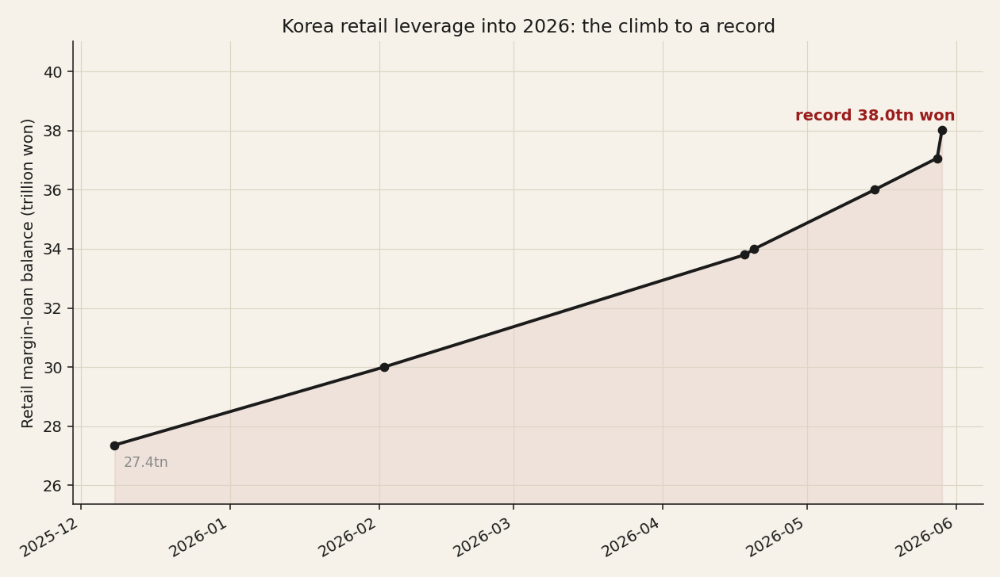

# 10 — Korea's memory empire and the leverage trap

**Question.** Why did the DRAM "empire" rise in Korea and collapse elsewhere, and why is Korean retail leverage a death-spiral risk in 2026?

**Finding.** DRAM is the textbook capital cycle; in 2026 the most cyclical industry in tech carries a record-leveraged Korean retail base, and the forced-liquidation plumbing is built to turn a normal downcycle into a cascade.

> Research brief, web-sourced (2026-06). Korean price and margin series are not in our data, so the death-spiral is presented as mechanism plus documented episodes, not a recomputed regression.

## Claim 1 — DRAM is the textbook capital cycle

Debt-fuelled counter-cyclical capacity wins the chicken game; the losers go bankrupt. Japan's VLSI-Project five (NEC, Toshiba, Hitachi, Fujitsu, Mitsubishi) held ~80% share in 1985; Korea — Samsung's 1983 "Tokyo Declaration", chaebols running 300–500% debt/equity — displaced them. The casualties: Qimonda (insolvent 2009, after DRAM prices fell 85% in 2007 and 58% in 2008), Elpida (bankrupt 2012, bought by Micron). Even the winner nearly died: Hynix lost ~5tn won in 2001 (prices −80%) and survived only on a ~$7bn creditor bailout. The end state is today's three-player oligopoly with pricing power.

## Claim 2 — Korea's retail-leverage death-spiral is structurally primed

Retail trades heavily on credit (신용융자). Breach a 140% collateral ratio, or miss the two-day settlement deadline, and the broker force-sells (반대매매) at the next session, into a ±30% daily price limit (raised from ±15% in 2015). The supervisor has warned the liquidation is blunt — a 2m-won shortfall can trigger a 30m-won forced sale. Forced selling lowers the price, which breaches more accounts, a cascade the price limit caps in speed but does not stop.

## Claim 3 (synthesis) — In 2026 the two cycles converge

The KOSPI roughly doubled to an all-time high (~8,457 on 27 May) on Samsung and SK Hynix (together >50% of the index, each near $1tn, on the HBM/AI memory supercycle), while retail margin debt set an all-time record of **38.0tn won (29 May)**, a 20-year leverage high, with forced-liquidations already firing on dips. The capital cycle (Claim 1) says memory will turn; the leverage machinery (Claim 2) decides whether that is a broadening or a cascade. Hynix 2001 and Qimonda 2009 are what the downside of this industry looks like.

## Caveats & sources

Web-sourced (2026-06); index figures moved fast in late May and press numbers vary (anchors: the 8,457 intraday high and the 38.0tn-won margin record). Korean margin/price series are not in our warehouse. Sources: Goldsea / Nippon.com (Elpida); EveryCRSReport (Hynix 2001 bailout); Qimonda (public record); Seoul Economic Daily (margin records); Korea's FSS (forced-liquidation warning); BusinessKorea (±30% limit); CNBC (memory cyclicality; SK Hynix and Samsung crossing $1tn).
