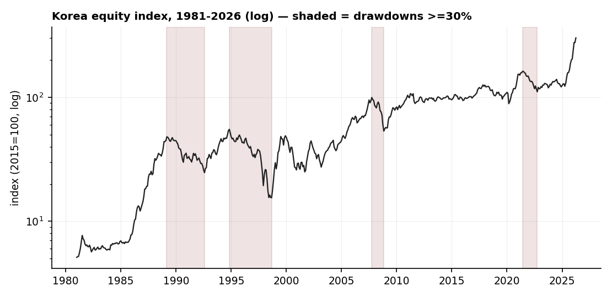
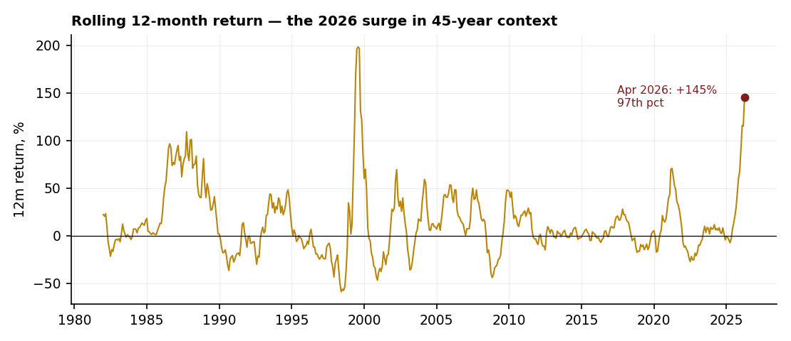
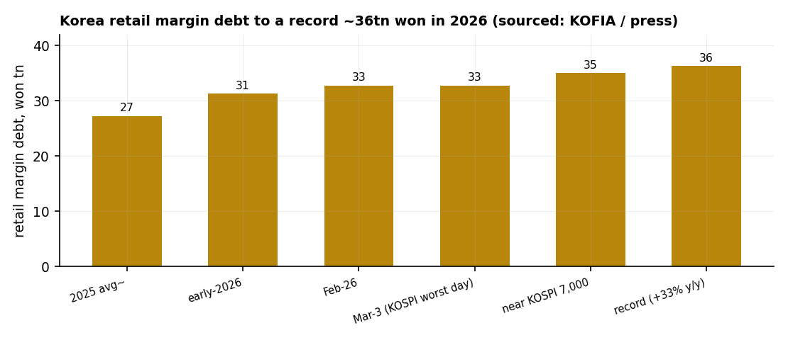

# 10 — Korea's memory empire and the leverage trap

**Question.** Why did the DRAM "empire" rise in Korea, and is the country's record retail leverage a 2026 cascade risk?

**Finding.** DRAM is the textbook capital cycle, and in 2026 the most cyclical corner of tech carries a **3.8-sigma equity melt-up financed by record retail margin debt**. Korea's own 45-year index shows four drawdowns of 30%+ (median −48%, worst −72%); the forced-liquidation plumbing is built to turn the next normal downcycle into a cascade rather than a dip.

> Research. 45-year Korea broad share-price index (OECD via FRED, monthly 1981–2026, n=544) for the cycle and the melt-up; margin-debt, breadth and concentration figures are sourced (KOFIA / Korea Exchange / press). No live capital.

## Data & method

- **Index:** FRED `SPASTT01KRM661N` (OECD Share Prices: All Shares/Broad, Republic of Korea; 2015=100), monthly, **n=544** months.
- **Cycle:** algorithmic peak-to-trough drawdowns ≥30%. **Melt-up:** rolling 12-month return and its percentile / z-score across the full 45 years.
- **Leverage & concentration:** sourced (KOFIA margin-balance, Korea Exchange flows, Korean financial press); DRAM-cycle episodes from the public record.

## Claim 1 — DRAM is the textbook capital cycle

Debt-fuelled counter-cyclical capacity wins the chicken game; the losers go bankrupt. Japan's VLSI-Project five (NEC, Toshiba, Hitachi, Fujitsu, Mitsubishi) held ~80% share in 1985; Korea — Samsung's 1983 "Tokyo Declaration," chaebols running 300–500% debt/equity — displaced them. The casualties: Qimonda (insolvent 2009, after DRAM prices fell 85% in 2007 and 58% in 2008), Elpida (bankrupt 2012, bought by Micron). Even the winner nearly died: Hynix lost ~5tn won in 2001 (prices −80%) and survived only on a ~$7bn creditor bailout. The end state is today's three-player oligopoly with pricing power.

## Claim 2 — Korea's own index confirms the cyclicality: 4 drawdowns, median −48%

On the 45-year index, Korea has had **four drawdowns ≥30%** since 1981 — 1989–92 (−49%), the Asian crisis 1994–98 (**−72%**), the GFC 2007–08 (−46%), and the 2021–22 rate bear (−32%) — a **median −48%**. The most cyclical industry in tech sits in one of the most drawdown-prone equity markets in the developed world.

## Claim 3 — The 2026 melt-up is a 3.8-sigma, 97th-percentile event

The index rose **+145% in the 12 months to April 2026** — the **97th percentile** of every rolling-12-month window since 1982 (z = +3.8). Only one window in 45 years was larger: **+198% into 1999**, immediately before the dot-com bust. The KOSPI set a record close near **8,476** in late May (up ~75% year-to-date), but breadth was thin — **82% of listed stocks fell** in the month it hit that high (Seoul Economic Daily), with the gains concentrated in Samsung and SK Hynix (together >50% of the index, each near $1tn on the HBM / AI-memory supercycle).

## Claim 4 — Record retail leverage meets blunt forced-liquidation plumbing

Retail investors ("ants," 개미) drove margin debt to a record **~36tn won** (about $24bn, +33% year-on-year, at 7–9% interest) — up from roughly **$5bn in 2020** (Morningstar). The mechanism: breach a 140% collateral ratio, or miss the two-day settlement deadline, and the broker force-sells (반대매매) at the next session, into a ±30% daily price limit (raised from ±15% in 2015). The financial supervisor (FSS) has warned the liquidation is blunt — a small shortfall can trigger a far larger forced sale. Forced selling lowers the price, which breaches more accounts: a cascade the price limit caps in speed but does not stop.

## Claim 5 (synthesis) — In 2026 the two cycles converge

The capital cycle (Claims 1–2) says memory will turn; the leverage machinery (Claim 4) decides whether that turn is a broadening or a cascade. Hynix 2001 and Qimonda 2009 are what the industry's downside looks like; a 3.8-sigma melt-up on record leverage is what the upside has built. The early-warning lights are already on — foreign investors sold ~$13bn of Korean equities in a single week in May with KOSPI volatility near records (CNBC).

## The answer, in the data

**Q: Is Korea's 2026 setup a leverage-driven cycle risk?**
**A: Conditional-Yes** — every ingredient is documented and at record extremes; the trigger (a memory downcycle) is historically reliable but unscheduled.

| Metric | Reading |
|---|---|
| Korea drawdowns ≥30% since 1981 | 4 (median −48%, worst −72%) |
| 2026 twelve-month melt-up | +145% (97th percentile, z +3.8) |
| Larger 12m surge in 45 years | only 1999 (+198%, then the dot-com bust) |
| Retail margin debt | record ~36tn won (+33% y/y, 7–9% rate) |
| Breadth at the record high | 82% of listed stocks fell that month |

## Caveats

The FRED series is the OECD broad-market index (monthly, 2015=100) — a proxy for the KOSPI, not the index itself; the late-May record and YTD figures are press-sourced and moved fast. Margin-debt, breadth and concentration figures are sourced (KOFIA / Korea Exchange / press), not recomputed from account-level data. Korean single-stock (Samsung, SK Hynix) and daily index series are not in our warehouse (Yahoo blocked, stooq now key-gated), so single-name contribution is sourced, not computed. The death-spiral is a documented mechanism plus historical episodes, not a probabilistic forecast.

## References

- Chancellor, E., ed. (2015). *Capital Returns: Investing Through the Capital Cycle* (Marathon Asset Management).
- Geanakoplos, J. (2010). *The Leverage Cycle.* NBER Macroeconomics Annual.
- Community & press: r/korea and r/Living_in_Korea (2026 KOSPI-rally threads); Financial Times ("ants pile into leveraged funds"), Axios, Morningstar, CNBC, Seoul Economic Daily; KOFIA margin data; Korea FSS forced-liquidation warning.
