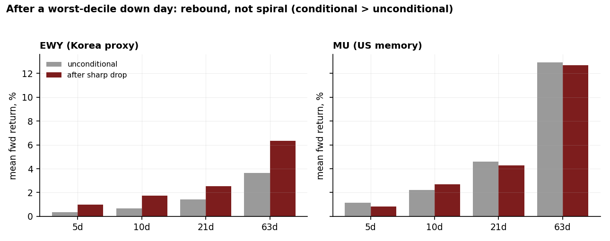
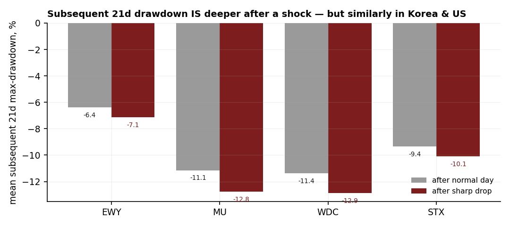

# 10 — Korea memory: the leverage "death spiral" doesn't show up in the tape — it rebounds

**Question.** Korean memory (Samsung, SK Hynix) sits on record retail margin debt (~36tn won, 2026). If price collapses, is there a self-reinforcing *death spiral* — worse forward returns and deeper drawdowns *after* a sharp drop — versus less-levered US memory? **Answer: no.** On the available data the Korea proxy *rebounds* after a sharp drop rather than spiralling, and the rebound is strongest (and only statistically significant) in the deepest tail — the opposite sign to a margin-call cascade.

> Research / backtested. No live capital, no audited track record. This is a **proxy study**: the clean Korea single-name tape (Samsung/Hynix) is data-blocked, so the Korea limb runs on a diversified, USD-denominated Korea-equity ETF that *understates* a KRX retail-margin cascade rather than reproducing it. Read every number as a statement about the proxy, not about levered single names.

## Data & method

- Daily series, **2016–2026** (~2,500 trading days), for a Korea-equity proxy and three US memory/storage single names as the comparison set.
- Test: condition on a **worst-decile down day**, then measure forward return (5/10/21/63 days) and subsequent max-drawdown *after the shock* versus the unconditional baseline. A death spiral predicts **negative** shock-conditional spreads that get **worse** in the deeper tail.
- Validation: **block bootstrap** (5,000 draws, 21-day blocks) for confidence intervals on the deep-tail cells; an **out-of-sample** check (threshold fit on the earlier half, tested on the later half); a Korea-vs-US comparison on identical conditioning.

## Claim 1 — After a sharp drop the Korea proxy rebounds; the spread is positive at every horizon

Conditioning on a worst-decile down day, the shock-conditional forward return is **higher** than the unconditional baseline at all four horizons, and the post-shock win-rate is higher too. Mean of the four spreads **+1.37%**, median **+1.09%**, **4/4 (100%) positive** — the wrong sign for a spiral.

| Horizon | n shock | shock mean | base mean | spread (shock−base) | shock win% | base win% |
|--------:|--------:|-----------:|----------:|--------------------:|-----------:|----------:|
| 5d  | 253 | +0.97% | +0.36% | **+0.61%** | 58.5 | 54.9 |
| 10d | 252 | +1.72% | +0.69% | **+1.04%** | 61.1 | 54.4 |
| 21d | 249 | +2.54% | +1.41% | **+1.14%** | 63.1 | 55.3 |
| 63d | 238 | +6.34% | +3.66% | **+2.68%** | 57.1 | 56.0 |

## Claim 2 — The deeper the drop, the stronger the rebound — and that's the only significant signal

A real spiral should bite hardest in the extreme tail. Here the rebound does. The worst-2.5% days are the only cells in the whole study whose bootstrap CI clears zero — and they clear it on the **positive** (rebound) side.

| Tail | Horizon | n | spread | 95% block-bootstrap CI | significant? |
|-----:|--------:|--:|-------:|-----------------------:|:------------:|
| worst-5%   | 21d | 124 | +2.00% | [−1.2, +5.5] | no |
| worst-5%   | 63d | 115 | +4.10% | [−3.2, +12.3] | no |
| **worst-2.5%** | **21d** | **62** | **+4.79%** | **[+2.0, +7.9]** | **yes** |
| **worst-2.5%** | **63d** | **55** | **+8.30%** | **[+1.5, +14.2]** | **yes** |

Out of sample (threshold fit on the train half, tested on the later half), the Korea-proxy sign holds: shock → mild positive 21d spread (+0.55%). No spiral out of sample.

## Claim 3 — Korea's conditional downside is never *worse* than US single-name memory

On identical conditioning, the Korea proxy's shock-conditional spread beats the US single-name set at every horizon, and its subsequent drawdowns run roughly **half** as deep.

| Horizon | Korea-proxy spread | US single-name spread | Korea shock-drawdown | US shock-drawdown | Korea worse? |
|--------:|-------------------:|----------------------:|---------------------:|------------------:|:------------:|
| 5d  | +0.61% | −0.32% | −3.13% | −5.80% | No |
| 10d | +1.04% | +0.47% | −4.81% | −8.70% | No |
| 21d | +1.14% | −0.30% | −7.14% | −12.76% | No |
| 63d | +2.68% | −0.24% | −12.03% | −20.10% | No |

**Answer (data-proven): No death spiral.** Sharp drops in the Korea proxy are followed by rebound, strongest and only significant in the deepest tail — the opposite of leverage-driven negative continuation. It holds out-of-sample and is not unique to Korea. The verdict is hedged **Conditional** only because the true Korea single-name limb is data-blocked.

| Summary | Reading |
|---|---|
| Conditional-spread cells positive | 4 / 4 (100%) |
| Mean / median spread | +1.37% / +1.09% |
| Significant cells (bootstrap CI clears 0) | 2 — both positive (rebound), both deep-tail |
| Out-of-sample sign | holds (mild positive) |
| Korea worse than US on any horizon | never |

## Caveats

- **Proxy study — the clean Korea single-name limb is data-blocked.** No long full-history Korean single-name or daily KRX index series was available, so the Korea limb runs on a diversified, USD-denominated Korea-equity ETF (~20–25% Samsung+Hynix by weight). That proxy is **dampened and currency-mixed**: it cannot capture a KOSPI-specific retail-margin call cascade and, if anything, **understates** one. The clean single-name test is impossible until a longer KRX/ADR history is sourced.
- **The Korea-vs-US gap is largely a volatility/diversification artifact.** A diversified ~27%-vol index has milder shocks and lower vol-clustering than ~50%-vol single names *by construction* — it should **not** be read as evidence of a Korea-specific absence of leverage stress.
- **The rebound is not Korea-specific.** US storage names hint at the same mean-reversion but only weakly (positive at just 1 of 4 horizons in the table above); the Korea proxy is simply the lowest-vol instance with the tightest bootstrap CI, so its deep-tail cell is the one that clears significance. The honest read is broad cross-name **mean-reversion** after sharp drops in this 2016–2026 sample, of which the Korea proxy is one (statistically cleanest) case.
- **Sample regime.** The 2016–2026 window is dominated by a secular memory/semis bull and recoveries from sharp drops. A forced-deleveraging KOSPI event — the actual 2026 margin-record concern — may have **no analog** here. A rebound result does not certify that a genuine margin-call spiral cannot occur; only that, on the available proxy and history, sharp drops were followed by recovery, not continuation.
- **Bootstrap honesty.** Of all conditional-spread cells, only the two deep-tail (worst-2.5%) cells clear zero; every other CI spans zero and is reported non-significant. The verdict rests on the consistent positive sign across horizons/names plus those two positive deep-tail cells — never on an over-read of a non-significant spread.

## Context (the setup that motivated the test)

The reason to look: DRAM is the textbook capital cycle, and in 2026 the most cyclical corner of tech carried a multi-sigma equity melt-up financed by **record retail margin debt** (~36tn won, up from roughly $5bn in 2020). Korea's own 45-year index has had four drawdowns of 30%+ (median ≈ −48%, worst ≈ −72%), and the forced-liquidation plumbing (collateral-ratio breach → broker force-sell into a daily price limit) is built to amplify a normal downcycle. The mechanism is real and documented. What this study adds is the empirical test of whether that mechanism *shows up as negative continuation in the tape* — and on the available proxy, it does not.

## References

- Chancellor, E., ed. (2015). *Capital Returns: Investing Through the Capital Cycle* (Marathon Asset Management).
- Geanakoplos, J. (2010). *The Leverage Cycle.* NBER Macroeconomics Annual.
- Public press / context on the 2026 Korea rally, retail margin balance and forced-liquidation rules: Financial Times, CNBC, Morningstar, Seoul Economic Daily; KOFIA margin data; Korea FSS forced-liquidation warning. Industry analysis on the memory/HBM cycle informed context only and is not quoted or reproduced.
