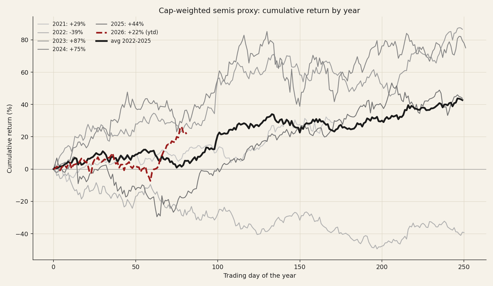
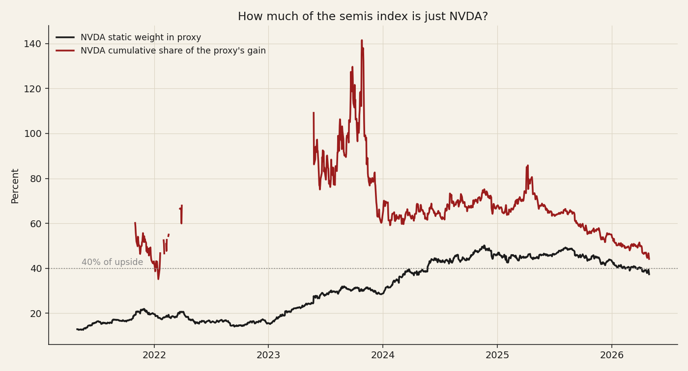
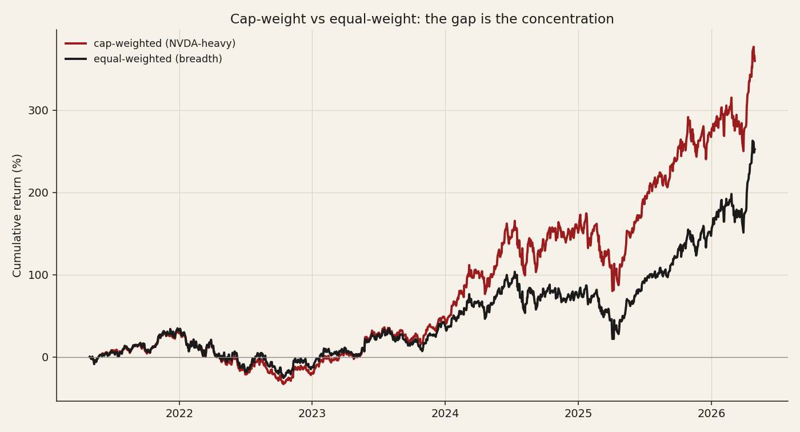

# 11 — Semiconductor concentration: when one stock carries the index

**Question.** When a single mega-cap supplies more than 40% of an index's gain, has it happened, and what comes after? Set against the chart everyone is passing around in 2026: is this a 2000 echo for semiconductors?

**Finding.** On a 23-name cap-weighted semis proxy (2021–2026), NVDA is **37% of the index by weight** and supplied **44% of its entire five-year gain**. Concentration peaked in 2024 (NVDA = 69% of that year's gain; only 17% of names beat the index, the narrowest year in the sample) and then resolved **by broadening, not by a crash** — by 2026, 78% of names beat the index with the index still rising.

> Research / backtested. No live capital, no audited track record. This is a **23-name cap-weighted proxy, not the official PHLX SOX** — no keyless constituent-weight history exists, so the proxy stands in for the index and the multi-decade comparison is sourced, not recomputed. Read this as one cycle, not a powered multi-episode test.

## Data & method

- **Universe:** 23 large semiconductors with full 2021–2026 history (NVDA, TSM, AVGO, AMD, QCOM, TXN, AMAT, MU, ADI, LRCX, KLAC, INTC, MRVL, NXPI, MCHP, MPWR, ON, ASML, TER, ENTG, AMKR, STM, UMC).
- **Window:** 2021-04-30 → 2026-06-01, split-adjusted daily closes.
- **Index:** cap-weighted, `weight_i,t = shares_i × adjusted_close_i,t`, current shares held constant (so weight moves with price; minor error from buybacks/issuance and dividend adjustment).
- **Top-1 share of gain:** `Δ(NVDA market cap) / Δ(index market cap)` over the window or year.
- **Breadth:** the fraction of the 23 names whose return beat the cap-weighted index over the period.

## The concentration is real, and it is the base case

NVDA's weight rose from 12.9% (2021) to 37.3% (2026); its **cumulative share of the proxy's gain is 44%**. Cap-weighted, the proxy returned **+360%**; equal-weighted, **+252%** — the 108-point gap *is* the concentration: the index went up far more than the average semiconductor did.

| Year | Proxy return | NVDA share of gain | % of names beating index |
|---|---:|---:|---:|
| 2021 | +28.7% | 43% | 43% |
| 2022 | −39.3% | 26% | 52% |
| 2023 | +86.5% | 44% | 26% |
| 2024 | +75.0% | **69%** | **17%** |
| 2025 | +43.8% | 37% | 52% |
| 2026 (YTD) | +21.7% | 12% | 78% |

## What happened after peak concentration

2024 was the narrowest year on record here: NVDA supplied 69% of the gain while only 17% of names beat the index. What followed was **not a crash but a broadening** — in 2025 and 2026 the share of names beating the index rose to 52% then 78%, NVDA's share of the gain fell to 37% then 12%, and the index kept rising. In this one cycle, extreme narrowness resolved through the benign branch (laggards catching up), not the leader rolling over.

## Five hypotheses for "narrow leadership, then what?"

### H1 — Narrowness is bearish (mean-reversion)

- **Claim.** Extreme single-name concentration precedes a correction.
- **Evidence for.** The precedent the 2026 chart invokes: into March 2000 the semis were led by a handful of names; the PHLX SOX then fell ~82% to its October 2002 trough (the Nasdaq Composite ~78%), and Intel alone warned in September 2000 and dropped ~40% in a single day. In May 2026 Goldman's Ben Snider flagged S&P 500 breadth as one of the narrowest readings since the dot-com era; BofA's Michael Hartnett warned that AI-stock euphoria and concentration were nearing historic extremes.
- **Evidence against (in-sample).** Peak narrowness (2024) was followed by broadening and further gains, not reversal.
- **Literature.** De Bondt & Thaler (1985) on long-horizon overreaction/reversal.
- **Verdict.** A real historical precedent that did **not** bind this cycle. Narrowness looks necessary-but-not-sufficient for a top.

### H2 — Leadership persists (momentum)

- **Claim.** Concentration is a feature of powerful secular trends, not a timing signal; the leader keeps leading until it doesn't.
- **Evidence for (in-sample).** NVDA's share of the gain was extreme through 2023–2024 (peaking near 69%) and the index kept rising the whole time.
- **Literature.** Jegadeesh & Titman (1993) on momentum.
- **Evidence against.** Momentum regimes end abruptly and the framework says nothing about *when*.
- **Verdict.** The best in-sample description of 2021–2026 so far, but not a risk signal.

### H3 — The bimodal fork (catch-up vs roll-over)

- **Claim.** Extreme concentration resolves one of two ways: laggards broaden in (healthy continuation) or the leader rolls over and concentration unwinds violently.
- **Evidence (in-sample).** This cycle took the **catch-up branch** — breadth went from 17% (2024) to 78% (2026).
- **Proposed selector.** Which branch is taken is plausibly read off the leader's own trend (e.g., NVDA breaking its 21-day EMA) and valuation, rather than the concentration level itself.
- **Verdict.** The most useful framing; 2026 chose the benign branch, but the selector, not the concentration, is what to monitor.

### H4 — Concentration is normal (Bessembinder base-rate)

- **Claim.** A tiny minority of stocks create all long-run wealth, so "a few names drive everything" is the historical norm and has weak stand-alone predictive power.
- **Literature.** Bessembinder (2018, *JFE*), "Do stocks outperform Treasury bills?"
- **Verdict.** A caution to the bears: a 44% top-1 share of the gain is extreme, but extreme is closer to normal than the alarm suggests; concentration alone is not a sell signal.

### H5 — Bearish only when the leader is expensive (the conditioner)

- **Claim.** The interaction term — concentration **×** an expensively-valued leader — carries the signal, not concentration alone.
- **Evidence for.** 2000's leaders (Cisco, Intel) rolled over from extreme multiples; concentration with a reasonably-valued leader can persist.
- **Open question.** Whether NVDA's current multiple sits in the 2000 zone is the live, unresolved variable.
- **Verdict.** The conditioner to watch; it is what would distinguish a 2000 echo from a continuation.

## The answer, in the data

**Q: When one stock supplies >40% of an index's gain, what comes next?**
**A: Conditional — broadening, not a crash, in this cycle.** Peak narrowness did not bind; the signal is the *conditioner* (an expensive leader), not the concentration level.

| Year | NVDA share of gain | % of names beating index |
|---|---:|---:|
| 2024 (peak narrowness) | 69% | 17% |
| 2025 | 37% | 52% |
| 2026 YTD | 12% | 78% |

Extreme narrowness (2024) resolved by laggards catching up, with the index still rising — the benign branch.

## Caveats & reproducibility

A cap-weighted proxy, not the official SOX; current shares held constant; one cycle, not a powered multi-episode test; the 2000 SOX/Nasdaq figures and the 2026 breadth commentary are sourced, not recomputed here. Universe, window, weighting, and metrics are stated above so the result can be challenged.

## References

- Bessembinder, H. (2018). *Do stocks outperform Treasury bills?* Journal of Financial Economics.
- Jegadeesh, N. & Titman, S. (1993). *Returns to buying winners and selling losers.* Journal of Finance.
- De Bondt, W. & Thaler, R. (1985). *Does the stock market overreact?* Journal of Finance.
- PHLX Semiconductor Index (SOX) drawdown, 2000–2002 (public market data); Goldman Sachs (Ben Snider) and BofA (Michael Hartnett) market-breadth commentary, 2026.
- Community: r/stocks and r/investing "is NVDA the whole market?" / breadth-and-concentration debate through 2026.
