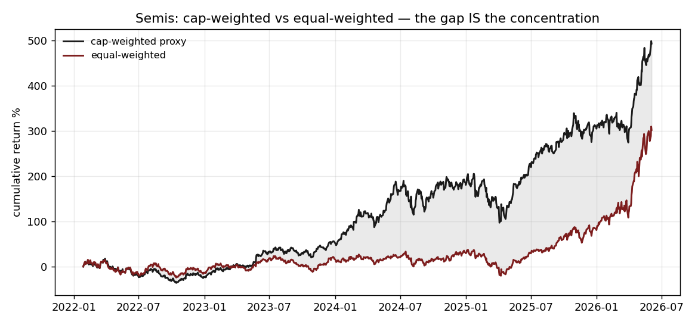
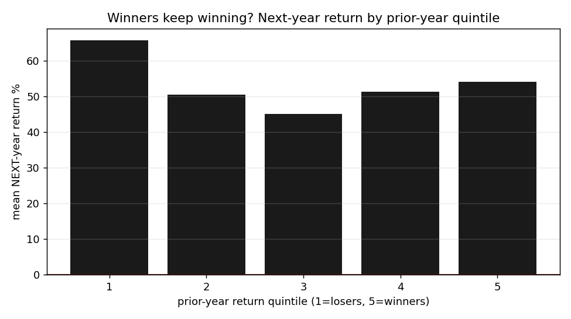
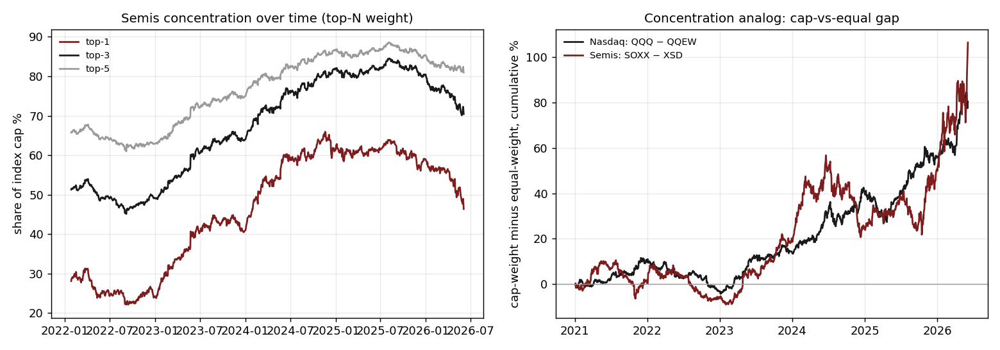

# 11 — One stock is half the semis index, and winners do NOT keep winning

When a cap-weighted semiconductor index is rebuilt from the ground up, a single name (NVDA) supplies half its entire gain and sits at ~46% weight — yet which name leads in one year tells you essentially nothing about which leads the next.

> Research / backtested. No live capital, no audited track record. Cap-weight is a closes-times-shares proxy, not an official index, and the window is one regime (2022–2026), so read concentration as a risk fact, not a timing signal.

## Data & method

- **Universe:** 69 US-listed semiconductors with full history over the window (semiconductor SIC classes, market cap above ~$300M), rebuilt from scratch rather than a hand-picked basket.
- **Window:** 2022-01 → 2026-06, split-adjusted daily closes; the common panel starts when the last constituent began trading.
- **Index:** cap-weighted proxy, weight ∝ implied shares × price; compared against an equal-weighted version of the same 69 names.
- **Persistence test:** rank each name by calendar-year return, then measure the relationship between this-year rank and next-year return (Spearman rank correlation plus next-year outcomes by prior-year quintile). Concentration is also benchmarked against the Nasdaq-100 (cap-minus-equal gap, top-N share, Herfindahl).

## Claim 1 — One name is half the gain; the index is a bet on three stocks

NVDA alone supplied **50.1%** of the index's entire gain and sits at **46.4%** current weight. The top three (NVDA, AVGO, MU) account for **76%** of the gain; the top five, **85%**. Cap-weighted the proxy returned **+493%** versus **+302%** equal-weighted — and that **191-point gap is the concentration**: the index rose far more than the average semiconductor did.

| Bucket | Share of total gain | Current index weight |
|---|---:|---:|
| NVDA (top-1) | **50.1%** | 46.4% |
| Top-3 (NVDA, AVGO, MU) | 76% | 70% |
| Top-5 | 85% | 81% |

## Claim 2 — Winners do NOT keep winning (year over year)

Year-over-year leadership is effectively random: the Spearman rank IC between one year's return rank and the next year's return is **−0.001**. Sorting names into prior-year return quintiles, the prior *losers* (Q1) slightly out-returned the prior *winners* (Q5) the following year — mild reversal, no persistence.

| Prior-year quintile | n | Mean next-yr | Median next-yr | Win-rate |
|---|---:|---:|---:|---:|
| Q1 (losers) | 56 | **+65.8%** | +25.6% | 69.6% |
| Q2 | 56 | +50.5% | +23.1% | 62.5% |
| Q3 | 52 | +45.1% | +26.3% | 69.2% |
| Q4 | 56 | +51.4% | +37.1% | 76.8% |
| Q5 (winners) | 56 | +54.1% | +34.0% | 67.9% |

**Answer: No.** At the annual rebalance horizon, "who carried the index last year" does not predict "who carries it next." (This is the calendar-year horizon — distinct from the 3–12 month intra-year momentum effect in the academic literature, which is a different measurement.)

## Claim 3 — Semis are MORE concentrated than the Nasdaq

Top-1 weight is **46%**, top-3 **70%**, top-5 **81%**, Herfindahl **0.258**. The cap-minus-equal cumulative gap is **+106 points for semis** (SOXX − XSD) versus **+80 points for the Nasdaq-100** (QQQ − QQEW) — semis lean harder on their giants than the broad large-cap tech index does.

## The answer, in the data

- **Is one stock half the index?** **Yes** — NVDA is 50.1% of the gain, 46.4% of weight; three names are 76% of the gain.
- **Do winners keep winning year to year?** **No** — Spearman IC = −0.001; prior losers slightly beat prior winners next year.
- **Are semis more concentrated than the Nasdaq?** **Yes** — Herfindahl 0.258, and a wider cap-vs-equal gap than QQQ.

Net: the semis index is a concentrated bet on a handful of names, that concentration is a **risk-management fact, not a timing signal**, and you cannot predict next year's leader from this year's.

## Caveats

- Cap-weight is a closes-times-shares proxy with shares held at last close — minor error from buybacks, issuance, and dividend adjustment; it is not the official PHLX SOX or any vendor index.
- One regime (2022–2026), a single AI-driven bull leg; the persistence null is annual-horizon only and says nothing about intra-year momentum.
- Survivorship: the 69-name common panel requires full-window history, so names that delisted or IPO'd mid-window are excluded, which can bias the cross-section of returns upward.
- The Nasdaq comparison uses liquid ETF pairs as stand-ins for cap- vs equal-weight, not reconstructed constituent weights.

## References

- Bessembinder, H. (2018). *Do stocks outperform Treasury bills?* Journal of Financial Economics — base rate that a few names drive most long-run wealth.
- Jegadeesh, N. & Titman, S. (1993). *Returns to buying winners and selling losers.* Journal of Finance — the 3–12 month momentum horizon, distinct from the annual-rebalance test here.
- Public market data for SOXX / XSD / QQQ / QQEW and the constituent price histories.
- Industry analysis (e.g., specialist sector research) informed sector context only; no third-party material is reproduced.
