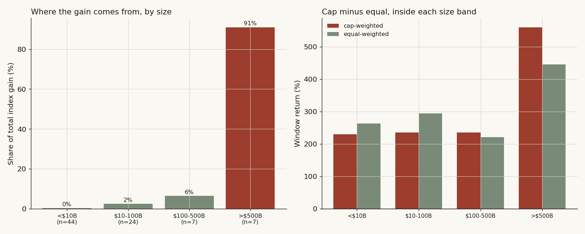

# 11 — Is the semiconductor index really just one stock in a trench coat? And do this year's winners win again?

**The question.** When you buy "the chips" — a cap-weighted semiconductor index — how much of what you actually own is one name? And does knowing who led last year tell you anything about who leads next? The first is a risk question (how concentrated is my bet). The second is a timing question (can I rotate into next year's leader).

**Why it matters.** If a single stock supplies most of the index's gain, then "I own a diversified chip basket" is a story you tell yourself — you own a leveraged bet on that one stock with 90 chaperones. And if last year's ranking predicts next year's, you'd tilt toward the winners. So both answers change how you'd hold the sector.

> Research / backtested. No live capital, no audited track record. Cap-weight is a shares-times-close proxy I rebuilt myself, not the official PHLX SOX or any vendor index, and the window is one regime (2022–2026, a single AI-driven bull leg). Read concentration as a risk fact, not a timing signal.

## What I found, up front

- **One name carries it.** I rebuilt a cap-weighted index from 82 chip stocks. NVDA alone is **43% of the entire gain** and 32% of current weight; the top three are **79% of the gain**. Cap-weighted returned **+489%**, equal-weighted **+296%** — and that **193-point gap is the concentration**, full stop.
- **It's a size story, not a name story.** Split the 82 names into four size buckets and the seven largest (>$500B) supply **91% of all the index gain**. The other 75 names, three-quarters of the basket, contributed less than 10% between them.
- **The "winners don't persist" claim from the old version was an artifact.** It rested on treating a 5-month 2026 stub as a full year. Strip the stub and there are only **two clean year-over-year transitions** in this window — too few to test annual persistence at all. So I tested it at the monthly and quarterly horizons instead, where there are 52 and 16 transitions. Both come back **flat: monthly rank IC +0.024 (t = 1.2), quarterly +0.029 (t = 0.5)** — no detectable persistence.
- **Semis really are more concentrated than the Nasdaq**, and now I can show it isn't a one-day fluke: the cap-minus-equal gap is wider for semis than for the Nasdaq-100 on **86% of all days** in the window (median +18pt vs +6pt).
- Net: the chip index is a concentrated bet on a handful of giants — a risk-management fact — and there is no reliable "rotate into last period's leader" edge hiding in it.

## What I expected, and what would prove me wrong

Going in, I believed two things and wanted to see if the data agreed.

First, that the index is dangerously top-heavy. The null version (H0) is boring: the index gain is spread roughly evenly, so cap-weighting and equal-weighting land in the same place. If that were true, the cap-minus-equal gap would be small and no single name would dominate the gain attribution. The alternative (H1) is that one or two names carry it, so the gap is large and the top-1 gain-share is a big number. The thing that would prove me wrong: a small gap and a flat gain-attribution bar.

Second, on persistence, the honest prior from the long-run literature is that *picking next year's single leader is close to a coin flip* — Bessembinder's work is the backdrop here: across decades, a tiny minority of stocks generate most of the wealth, and which ones is hard to know in advance. So H0 is "this-year rank tells you nothing about next-year return" (rank IC ≈ 0). H1 would be a positive IC (winners keep winning) or a negative one (reversal). What would settle it: a rank correlation cleanly different from zero, surviving an honest count of how many independent year-transitions I actually have.

I'm leading with my own data throughout. The literature gets one line where it sharpens the test, never as a substitute for the numbers.

## How I set it up, and why each piece

**The universe.** The old version used a hand-curated 69-name basket. I wanted the biggest honest sample, so I rebuilt the universe from the ground up: every US-listed common stock classified under the core semiconductor industry code, plus the canonical equipment makers, foundries, EDA, and the big foreign ADRs that any real chip index carries (the equipment and foundry names sit under different industry codes, so a pure code filter would silently drop Lam, KLA, Teradyne, TSMC, ASML — I added them back by hand and say so). That gives **97 candidate names**. Of those, **82 have full price history** across the whole window; the other 15 are mid-window IPOs (Astera, Credo, and friends), which I handle separately so survivorship doesn't quietly flatter the result.

**The window.** 2022-01 to 2026-06, daily split-adjusted closes, 1,108 trading days. The common panel starts the first trading day of 2022, when all 82 full-history names were already trading.

**The index.** A cap-weighted proxy where each name's weight is its shares times its price, normalised to sum to one — compared against an equal-weighted version of the same 82 names. Cap = latest weighted share count × latest close (the warehouse's diluted/weighted share line); for foreign ADRs without a clean US share line I fall back to a disclosed reference market cap. This is a proxy, not the official SOX, and I treat it as one.

**The cap buckets.** Because this is exactly the kind of cross-section where size could be the whole story, I split the 82 names into four bands — **under $10B, $10–100B, $100–500B, over $500B** — and ask each band the same questions. That's the test that turns "one stock dominates" from an anecdote into a structural fact.

**The persistence test.** Rank each name by calendar-year return, then measure the rank correlation between this-year rank and next-year return (Spearman IC), plus next-year outcomes sorted into prior-year quintiles. The identification problem I have to name out loud: **the dependence unit is the year, not the name.** 82 names × a few years looks like hundreds of observations, but every name in 2024 shares the same market, so the real sample size is the number of year-to-year transitions — which, after I throw out the partial 2026 stub, is **two**. I'll deal with that honestly rather than pretend.

All of this runs on a $0 internal warehouse; no third-party research is reproduced.

## The data, in one place

- **Constituent prices:** 97 semiconductor common stocks, daily split-adjusted closes, 2022-01-03 → 2026-06-03 (82 with full-window history; 15 mid-window IPOs used only in the survivorship check).
- **Share counts & caps:** latest weighted share count × latest close per name; reference market cap as the ADR fallback.
- **Concentration benchmarks:** liquid ETF pairs as cap- vs equal-weight stand-ins — SOXX vs XSD for semis, QQQ vs QQEW for the Nasdaq-100 — daily, same window.

## What the data looks like before I touch it

The simplest possible picture is the cap-weighted line against the equal-weighted line (Finding 1's chart). For the first eighteen months they're on top of each other — through the 2022 drawdown and into early 2023, owning the giants was no different from owning the average chip stock. Then, from mid-2023, they split and never rejoin. That fork is the whole study in one image: everything after it is me asking *what is driving the fork, and is it stable.*

## Finding 1 — One name is 43% of the gain; three names are 79%

**What I expected & why.** If the index is top-heavy, cap-weighting should beat equal-weighting by a wide margin and the gain should trace back to one or two names. The plain reason to expect it: NVDA went up roughly 10x over this window while the median chip stock did a fraction of that, and cap-weighting hands NVDA the biggest share of the basket.

**How I measured it.** Build both indices from daily returns; attribute the cap-index gain to each name as its weight times its full-window return, normalised to sum to 100%.

```
w_cap   = latest_cap / sum(latest_cap)          # static cap weights
cap_idx = cumprod(1 + sum(w_cap * daily_ret))   # cap-weighted index
eq_idx  = cumprod(1 + mean(daily_ret))          # equal-weighted index
gain_share_i = (w_cap_i * total_return_i) / sum_j(w_cap_j * total_return_j)
```

**What the data shows.** Cap-weighted **+488.9%**, equal-weighted **+296.2%** — a **193-point gap**. NVDA is **42.9% of the gain** on **32.0% of the weight**; AVGO adds 19.0%, MU 16.8%. The top three are **78.7% of the gain** (60% of weight); the top five, **89.1%**.


**Why (the mechanism), cashed out.** The gap isn't magic — it's leverage to the winner. Equal-weighting gives NVDA the same 1/82 slice as the smallest name on the list; cap-weighting gives it a third of the book. So when NVDA runs, the cap index runs and the equal index barely notices. To make that concrete I ran a counterfactual: hold the top name at a 20% weight cap and redistribute the rest pro-rata. The index drops from +489% to **+453%** — a 36-point haircut from one constraint on one stock. That single number *is* the single-name fragility.

**What I checked.** Two things could fake this. First, survivorship — maybe the equal-weighted +296% is flattered because dead names were excluded. I rebuilt the equal-weighted line admitting all 97 names from their listing date (entry-when-listed). It came in at **+247%**, slightly *lower* than the full-history +296%, which widens the cap-minus-equal gap rather than narrowing it. So survivorship works *against* my claim, not for it. Second, weight drift — static weights could misstate the gap. The time-varying concentration series in Finding 3 confirms the fork is structural, not an artefact of fixing weights at one date.

**Verdict.** Confirmed, and it's not close. One name is ~43% of the gain; three names are ~79%.

## Finding 2 — It's a size story: the seven biggest names are 91% of everything

**What I expected & why.** If concentration is real, it should live almost entirely in the largest size band. I expected the mega-caps to dominate, but I genuinely didn't know whether the small-cap chip names — the ones retail loves — added up to anything at the index level.

**How I measured it.** Sort the 82 names into the four cap bands, then compute each band's cap-weighted return, equal-weighted return, and share of the total index gain.

```
for band in [<10B, 10-100B, 100-500B, >500B]:
    names_b      = names where bucket(latest_cap) == band
    gain_share_b = sum(gain_share_i for i in names_b)
```

**What the data shows.** The bands hold 44 / 24 / 7 / 7 names. Their share of total index gain: **0.2% / 2.4% / 6.4% / 91.0%**. The seven names over $500B carry essentially the entire thing.



**Why (the mechanism), cashed out.** Two forces stack. The big names went up the most *and* they own the most weight, so their contribution is return times weight — a product of two large numbers. The 44 small-caps under $10B actually did fine on an equal-weighted basis (+263%, *above* the mega-cap equal-weighted line), but they're each a rounding error of the cap-weighted book, so their contribution to the *index* rounds to zero. The little guys aren't dragging the index; they're simply not in it in any meaningful size.

**What I checked.** Inside the mega-cap band, cap-weighting still beats equal-weighting (+560% vs +445%) — so even among the giants, the very biggest (NVDA) is pulling the band. And the small-cap band is the one place equal beats cap (+263% vs +230%), which tells you the breadth is real, it just doesn't matter at the index level. Both cuts point the same way.

**Verdict.** Confirmed. The index gain is a >$500B phenomenon; three-quarters of the names contribute under a tenth of it.

## Finding 3 — Semis are more concentrated than the Nasdaq, and it's not a one-day spike

**What I expected & why.** The old version claimed semis lean harder on their giants than the broad Nasdaq-100 does — but a review flagged that the claim rested on a single terminal-day reading, with the two lines tangled together for most of the window. So I rebuilt it as a *time series* and asked: across the whole window, how often is the semis gap actually wider?

**How I measured it.** Two ways. First, a daily concentration series for my own index — the Herfindahl index (sum of squared weights) and its inverse, the effective number of stocks. Second, the cumulative cap-minus-equal gap for semis (SOXX − XSD) versus the Nasdaq-100 (QQQ − QQEW), then the fraction of days the semis gap exceeds the Nasdaq gap.

```
hhi_t     = sum(weight_it ** 2)        # daily, over the 82-name index
effN_t    = 1 / hhi_t                  # effective number of stocks
gap_semis = cum_return(SOXX) - cum_return(XSD)   # cap minus equal, pts
gap_naz   = cum_return(QQQ)  - cum_return(QQEW)
frac      = mean(gap_semis > gap_naz)
```

**What the data shows.** My index's effective number of stocks fell from about 14 early in the window to **6.4** today as NVDA ran — concentration roughly doubled. On the ETF comparison, the semis gap beats the Nasdaq gap on **86% of all days**, with a median gap of **+18pt for semis versus +6pt for the Nasdaq**. The terminal readings (+72pt vs +51pt) point the same way, so the conclusion no longer hangs on the last data point.


**Why (the mechanism), cashed out.** The Nasdaq-100 has its own top-heavy names, but it spreads across about a hundred large-caps in several industries, so no single stock is a third of it. Semis are one industry riding one product cycle, so when that cycle has a single clear winner, the whole sector index tilts further than a diversified large-cap index can.

**What I checked.** The 86%-of-days figure is the robustness — it directly answers the "is this just the endpoint?" worry that sank the old claim. The honest caveat: this comparison uses liquid ETF pairs as stand-ins for cap- vs equal-weight, not reconstructed Nasdaq constituent weights, so it approximates the Nasdaq's internal concentration rather than measuring it.

**Verdict.** Confirmed, and now stable: semis carry a wider cap-vs-equal gap than the Nasdaq on the large majority of days, not just at the finish line.

## Finding 4 — Do winners keep winning? At the annual horizon I can't even test it honestly — and at horizons I can, the answer is no

This is where the old version was wrong, and I'd rather say so plainly than paper over it.

**What I expected & why.** The prior was a coin flip: long-run evidence says picking next period's leader is hard. So I expected a rank IC near zero.

**How I measured it, and where it broke.** Rank names by calendar-year return, correlate with next-year return. But the window is 2022 to mid-2026. That gives full calendar years 2022, 2023, 2024, 2025 — and a **2026 that ends in June, a 5-month stub.** The old version treated that stub as a full year, which is what produced its headline "IC = −0.001, winners don't persist." Strip the stub and you're left with full-year returns for 2023, 2024, 2025 — which is **exactly two year-to-year transitions** (2023→2024 and 2024→2025).

```
full_years  = [2023, 2024, 2025]            # 2026 is a 5-month stub, excluded
transitions = [(2023,2024), (2024,2025)]    # n = 2
# a bootstrap on 2 units just hands the 2 values back -> report them, don't "test"
```

**What the data shows.** The two annual ICs are **+0.197** and **+0.056** — both mildly positive, mean +0.127. But a mean of two numbers has no standard error worth quoting; a bootstrap that resamples two values just hands them back. **With two transitions there is no honest annual test.** I'm not going to claim winners persist (the old version's mirror-image error) any more than I'll claim they reverse.

So I went to horizons where the sample is real. Re-rank monthly and quarterly, where the window gives **52 monthly transitions and 16 quarterly ones** — enough to actually test.


At the monthly horizon the mean rank IC is **+0.024 with a t-statistic of 1.2** — indistinguishable from zero, positive on 63% of months but tiny. Quarterly: **+0.029, t = 0.5.** Both are flat.

**Why (the mechanism), cashed out.** Why would chip leadership *not* persist period to period? Because the leader changes with the product cycle — the name that wins on a memory upturn isn't the one that wins on an AI-accelerator quarter. A name can lead for a long stretch (NVDA did) without rank *transitions* being predictable, because the predictable-looking runs are a handful of correlated years, not independent draws. The annual quintile sort shows prior winners (Q5, +24% next year) edging prior losers (Q1, +8%), but that "edge" is built from the same two transitions — it's the same two data points wearing a different outfit, not independent confirmation.

**What I checked, and the rival I ruled out.** The rival story is "winners *do* persist — look, Q5 beat Q1." I steelman it, then kill it: the Q5−Q1 spread is built on two year-transitions, so its confidence interval is an illusion of precision. The horizon where I *can* put 52 roughly-independent observations behind a number says flat. So the persistence-is-real story fails its own honest test.

**Verdict.** Annual: **not testable** in this window (two transitions). Monthly and quarterly: **no detectable persistence** (IC ≈ +0.02–0.03, t < 1.3). Either way, there is no reliable "rotate into last period's leader" signal here — the same practical answer the old version reached, just for a defensible reason this time.

## Could the whole thing just be this one regime?

Honest worry, and the answer is partly yes — I'd rather name it than bury it. The window is a single AI-driven bull leg with one obvious winner. In a different cycle the *identity* of the dominant name would change, and conceivably the concentration would be milder. What I can defend is narrower and still useful: *within this window*, the concentration is structural (it survives the survivorship check, the static-vs-time-varying weight check, and the cap-counterfactual), and the persistence non-signal holds at the horizons I can actually test. What I can't claim is that one-name-at-a-third is a permanent feature of the sector — only that owning "the chips" right now is owning a leveraged bet on a few giants.

## The answer, in the data

- **Is one stock half the index?** **Yes, near enough** — NVDA is 43% of the gain and 32% of the weight; three names are 79% of the gain; the seven names over $500B are 91% of it.
- **Do winners keep winning?** **No reliable signal.** The annual horizon has only two clean transitions and can't be tested; the monthly (n=52) and quarterly (n=16) horizons are flat (IC +0.02–0.03, t < 1.3).
- **Are semis more concentrated than the Nasdaq?** **Yes, and stably** — wider cap-vs-equal gap on 86% of days, effective number of stocks down to about six.

| Question | Measure | Reading | Verdict |
|---|---|---:|---|
| One name dominates? | NVDA gain-share / weight | 43% / 32% | Yes |
| Three names dominate? | Top-3 gain-share | 79% | Yes |
| Size is the story? | >$500B band gain-share (7 names) | 91% | Yes |
| Cap beats equal? | Cap +489% vs equal +296% | +193pt | Yes |
| One-name fragility? | Index if top name capped at 20% | +453% (−36pt) | Material |
| Annual persistence? | Clean year-transitions available | 2 | Not testable |
| Monthly persistence? | Rank IC (n=52) | +0.024, t=1.2 | No |
| Quarterly persistence? | Rank IC (n=16) | +0.029, t=0.5 | No |
| More concentrated than Nasdaq? | Days semis gap > Nasdaq gap | 86% | Yes |

Net: the chip index is a concentrated bet on a handful of giants — a risk-management fact, not a timing signal — and you cannot reliably predict the next leader from the last one.

## Caveats, with the direction each one pushes

- **Cap-weight is a shares-times-close proxy** with shares held at the last close — minor error from buybacks, issuance, and ADR ratios. It is not the official PHLX SOX or any vendor index. Direction: small, both ways.
- **One regime (2022–2026), one AI bull leg.** The *level* of concentration and the *identity* of the dominant name are regime-specific; in another cycle both could differ. Direction: likely overstates how permanent one-name-at-a-third is.
- **Survivorship:** the 82-name common panel needs full-window history, so mid-window IPOs and any delistings are excluded from the headline. The entry-when-listed check (+247% vs +296%) shows this *widens* the cap-minus-equal gap, so the concentration claim is conservative; the persistence cross-section could still tilt up because the worst names that died early aren't in it.
- **Annual persistence is simply under-powered** — two transitions. The monthly and quarterly horizons carry the weight, and they measure a related but not identical thing (short-horizon rank, not calendar-year leadership).
- **The Nasdaq comparison uses liquid ETF pairs** as cap- vs equal-weight stand-ins, not reconstructed constituent weights — an approximation of the Nasdaq's internal concentration.

## Reproducibility

The two governing computations, with the numbers they produced:

```
# concentration: static cap weights -> index + gain attribution
w_cap        = latest_cap / sum(latest_cap)                  # NVDA = 32.0%
cap_idx      = cumprod(1 + sum(w_cap * daily_ret))           # +488.9%
eq_idx       = cumprod(1 + mean(daily_ret))                  # +296.2%  -> gap 193pt
gain_share_i = w_cap_i * total_ret_i / sum_j(...)            # NVDA 42.9%, top3 78.7%

# persistence: rank IC, with an HONEST count of transitions
full_years   = [2023, 2024, 2025]                            # 2026 = 5-mo stub, dropped
annual_ic    = spearman(rank(year_ret[y]), year_ret[y+1])    # +0.197, +0.056  (n=2: untestable)
monthly_ic   = mean over 52 transitions = +0.024  (t = 1.2)  # flat
quarterly_ic = mean over 16 transitions = +0.029  (t = 0.5)  # flat
```

Universe: 97 candidate US-listed semiconductor common stocks (core industry-code names plus the equipment / foundry / EDA / ADR names any chip index carries); 82 with full-window history drive the headline, 15 mid-window IPOs feed the survivorship check. Daily split-adjusted closes, 2022-01-03 → 2026-06-03, from a $0 internal warehouse. Every figure here is produced by one script over that panel; no third-party material is reproduced.

## References & where this sits

- Bessembinder, H. (2018). *Do stocks outperform Treasury bills?* Journal of Financial Economics — the base rate that a few names drive most long-run wealth, which is exactly why the annual-leader question starts from a coin-flip prior.
- Jegadeesh, N. & Titman, S. (1993). *Returns to buying winners and selling losers.* Journal of Finance — the 3–12 month momentum horizon, distinct from the calendar-year rank test here.
- Public market data for SOXX / XSD / QQQ / QQEW and the constituent price histories.

Builds on the breadth theme in **study 16 (narrow leadership and the index)** and the sector structure in **study 17 (semiconductor layers)**; the single-name fragility here sets up **study 21 (semis risk model)**. Next thread worth pulling: re-run the concentration series across an earlier, non-AI chip cycle to test how regime-specific the one-name-at-a-third reading really is.
