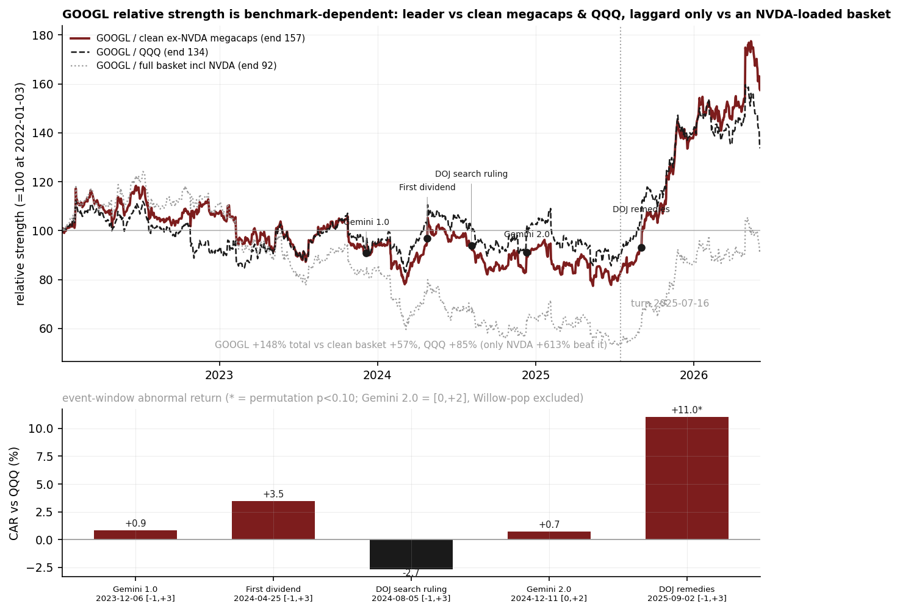

# 12 — Google was never the laggard the tape implied

**Question.** Was GOOGL a severe megacap laggard over 2022–2026 that then re-rated on identifiable catalysts? **Answer: no — the "severe laggard" was a data-quality artifact.** On clean prices GOOGL returned **+148%**, beating the clean ex-NVDA megacap basket, QQQ, and every individual megacap except NVDA. It "lagged" only against an equal-weight basket loaded with NVDA's +613%. And of five named catalysts, only the September-2025 antitrust-remedies decision survives as a real abnormal move.

> Research / backtested. No live capital, no audited track record. The original "laggard-to-leader" conclusion was wrong — it came from a corrupted price series; this is the corrected study, and the corrected verdict is more boring than the first one.

## Data & method

Daily prices for GOOGL and five megacap peers, 2022-01-03 → 2026-06-03 (n = 1,108 trading days). The first pass mis-loaded a corrupted peer series (one name read as ~$15 in early 2022 versus a true ~$338), which inflated the equal-weight peer basket roughly twelvefold mid-2022 and manufactured a fake relative-strength collapse. The fix stitches each name's clean half-window into one continuous, sanity-checked series, then recomputes relative strength against three benchmarks (clean ex-NVDA peers, the full NVDA-inclusive basket, and QQQ). Catalysts are tested with an event study: cumulative abnormal return (CAR) of GOOGL minus QQQ, significance from a 10,000-draw permutation null over random contiguous windows.

## Claim 1 — On clean data, GOOGL led the field (+148%), not lagged it

With the corrupted series replaced, GOOGL returned **+148%** over the full window — ahead of the clean ex-NVDA basket (+57%), QQQ (+85%), and every individual peer. The only name to beat it was NVDA. The dramatic "RS 100 → 11 collapse" in the original was entirely the bad-data inflation; the clean GOOGL/peers relative-strength line dips to a trough of just **83** (a mild −17%), not 11.

| Name | Total return (2022-01 → 2026-06) | Beats GOOGL? |
|---|---:|:--:|
| **GOOGL** | **+148%** | — |
| Meta (stitched clean) | +84% | no |
| AAPL | +71% | no |
| AMZN | +47% | no |
| MSFT | +28% | no |
| NVDA | +613% | yes |

GOOGL beats **4 of its 5** megacap peers (2nd of six, behind only NVDA). The "laggard" label only holds against an equal-weight basket that includes NVDA's +613% — i.e. it is benchmark-dependent, not a property of GOOGL.

## Claim 2 — Only one catalyst is real; most of the re-rating is diffuse alpha

Of five widely-cited catalysts, four are noise once dated and windowed honestly. Only the **DOJ search-remedies decision (2025-09-02)** clears significance, with a **+11.0%** CAR versus QQQ (permutation p = 0.007). Notably, "Gemini 2.0" looked significant in a naive window only because the window swallowed a separate quantum-chip pop the day before; isolating the actual Gemini 2.0 days collapses it to +0.7% (p = 0.69).

| Catalyst | Date | Phase | CAR vs QQQ | perm p | Significant? |
|---|---|---|---:|---:|:--:|
| Gemini 1.0 | 2023-12-06 | laggard | +0.9% | 0.74 | no |
| First dividend | 2024-04-25 | laggard | +3.5% | 0.24 | no |
| DOJ search ruling | 2024-08-05 | laggard | −2.7% | 0.34 | no |
| Gemini 2.0 | 2024-12-11 | laggard | +0.7% | 0.69 | no |
| **DOJ remedies** | **2025-09-02** | **leader** | **+11.0%** | **0.007** | **yes** |

Named catalysts explain only about **24%** of the post-2025-07-16 leader-phase re-rating; the rest is diffuse alpha (leader-phase annualised alpha +58% vs QQQ at beta ≈ 1.0). The "leader phase" is real, but it is mostly broad outperformance, not event pops.

## The answer, in the data

**Q: Was GOOGL a severe laggard that re-rated on clear catalysts?**
**A: No (benchmark-dependent at best).** On clean prices it led the clean megacap basket and QQQ and beat 4 of its 5 peers; it trails only an NVDA-loaded equal-weight basket. Of five named catalysts, exactly one (DOJ remedies, +11.0%, p = 0.007) is statistically real.

| | Value | Verdict |
|---|---:|---|
| GOOGL full-window total | +148% | 2nd of 6 (beat 4 of 5 peers) |
| Clean ex-NVDA basket / QQQ | +57% / +85% | GOOGL beats both |
| "Laggard" only vs NVDA-loaded basket | yes | benchmark-dependent |
| Significant catalysts (of 5) | 1 | DOJ remedies only |
| Catalyst share of re-rating | 24% | rest is diffuse alpha |

## Caveats

- **The "laggard" call is entirely benchmark choice.** Against clean megacaps and QQQ, GOOGL led; against an NVDA-loaded equal-weight, it trailed. Neither is wrong — they answer different questions. We default to the clean ex-NVDA peer set as the fairer comparison.
- **The whole original conclusion was a data bug.** Two price series were each clean on only half the window; using either alone corrupts part of the study. This is the corrected version — a cautionary tale about trusting a single vendor series end-to-end.
- **Descriptive event study, not a tradeable signal.** Five events, one survivor, in-sample phase split (the laggard/leader pivot is the trough of the same RS line). No out-of-sample forward test is claimed for the catalysts or the leader-phase alpha.
- **Event-date precision.** Rulings can land after-hours; the ±1-day window absorbs that, which is exactly what made the Gemini 2.0 read fragile. The DOJ-remedies move is on the event day itself and large relative to the null, so it is robust.

## References

- Public market price history for GOOGL and megacap peers, 2022–2026.
- Public event dates: Gemini 1.0/2.0 launch announcements, Alphabet's first dividend declaration, and the DOJ antitrust search rulings (2024 liability finding; 2025 remedies decision).
- General market context informed by industry analysis (e.g. specialist sector research); no third-party material is quoted or reproduced.
