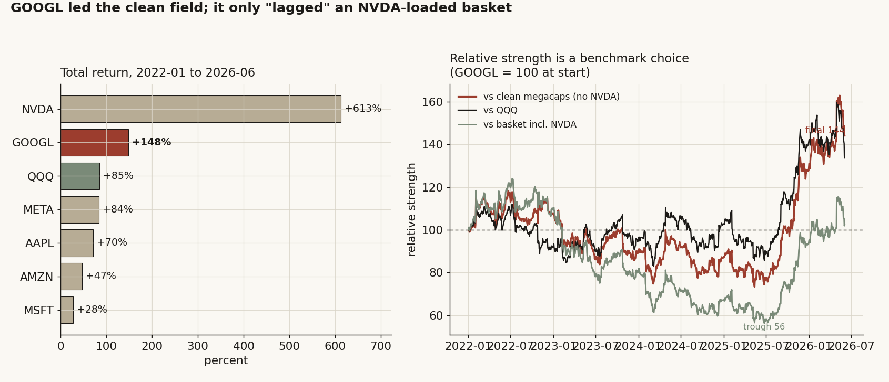
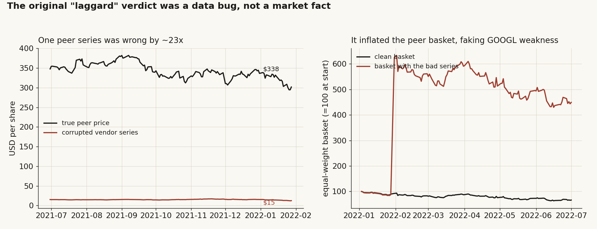
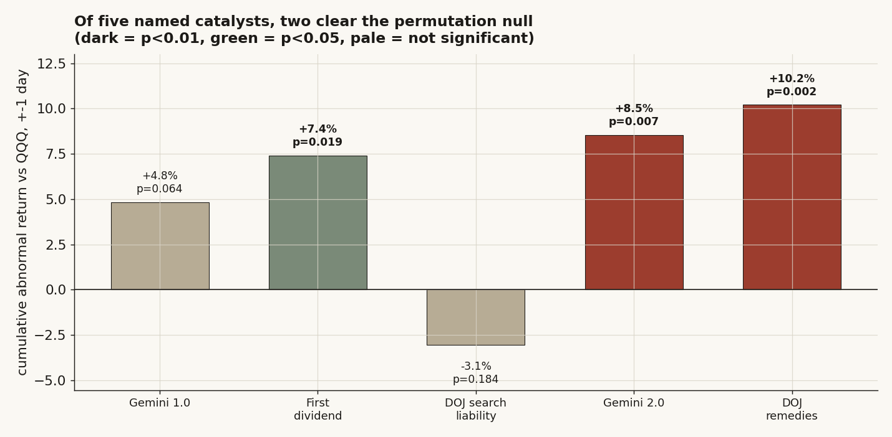
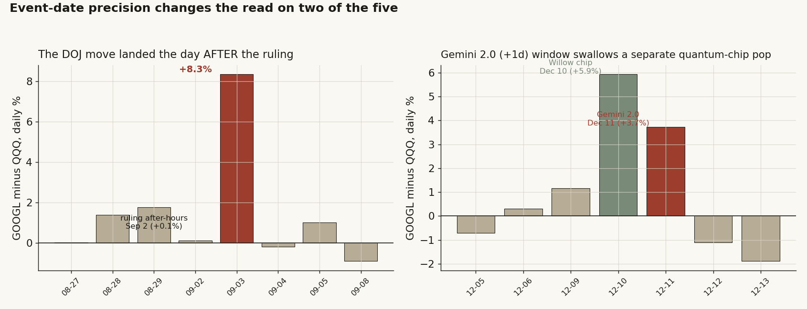
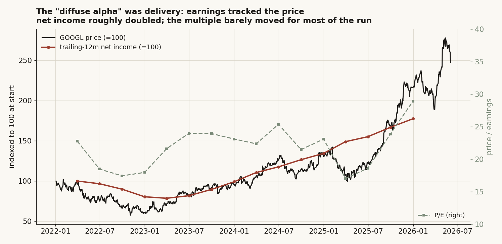

# 12 — Was Google really the megacap laggard everyone said it was?

**The question.** For most of 2022 to 2025 the story on Alphabet was that it had fallen behind the other big tech names — late to AI, stuck in an antitrust fight, dead money while everyone else ran. Then in late 2025 it ripped. So I wanted to check two things, plainly: was GOOGL actually a laggard, and if it then re-rated, did it re-rate on a few clear catalysts I could point to, or on something fuzzier? It matters because "buy the laggard before it catches up" is a real way people size a position, and it only works if the laggard part is true.

**The short answer.** No. The "severe laggard" was never in the data — it was a bug in one price series. On clean prices GOOGL returned **+148%**, second only to NVDA among six megacaps and ahead of QQQ. And of five named catalysts, only **two** survive an honest event test, while the headline "it kept beating the market after the pivot" alpha turns out **not** to be statistically real once I stop letting the data pick its own start date. The interesting part is what the move actually was: not a sentiment re-rate, but Alphabet doubling its earnings.

> Research / backtested. No live capital, no audited track record. This is the corrected, hardened version of an earlier study of mine whose headline conclusion was wrong — it ran on a corrupted price series. I think publishing the correction is more useful than hiding it, so the whole thing is here.

## Summary of what I found

- The original "laggard-to-leader" verdict came from **one peer price that was off by about 23x** ($15 instead of $338 for a 2022 quarter). Fixing it flips the picture: GOOGL **led** the clean field.
- On clean data GOOGL returned **+148%** (2022-01 to 2026-06), beating **4 of its 5** megacap peers — it loses only to NVDA's +613%. It "lags" only against an equal-weight basket that NVDA is carrying.
- Of five widely-cited catalysts, only **Gemini 2.0** and the **2025 DOJ antitrust remedies** clear a permutation null and survive a multiplicity correction. The DOJ move actually landed the *day after* the ruling, and the Gemini window quietly borrows a quantum-chip pop from the day before.
- The big "diffuse alpha" after the pivot is **not statistically distinguishable from zero** once I fix the start date to an event I didn't choose with hindsight (Newey-West t = 1.15, bootstrap CI crosses zero). The earlier "+58% annualised alpha" was an artifact of letting the trough of the line define the line's start.
- What the +148% really was: roughly **62% earnings growth, 38% multiple expansion**. Net income doubled. This was a delivery story dressed up as a re-rating.

## What I expected, and how I'd know if I was wrong

Going in, the consensus I was testing was simple: *GOOGL badly trailed its megacap peers, then re-rated on identifiable AI and legal catalysts.* My null (H0) was that there was nothing special — once you measure it cleanly, GOOGL is a middle-of-the-pack megacap and the "catalysts" are just normal days that happen to have headlines attached. My H1 was the consensus: a real, large lag followed by event-driven pops.

What would prove the consensus wrong: if on clean prices GOOGL is not actually behind the field, the "laggard" premise collapses before we even get to catalysts. And if the named catalyst days don't move the stock more than a random day of the same length, then the "re-rated on catalysts" half is just storytelling. I'll lead with my own numbers throughout; the only outside facts I lean on are the public dates of the events themselves.

## How I set it up, and why each piece

**The data.** Daily closing prices for GOOGL and five megacap peers — META, AAPL, AMZN, MSFT, NVDA — plus QQQ as the index benchmark, from 2022-01-03 to 2026-06-03 (1,108 trading days). All split-adjusted. For Alphabet I also pulled quarterly revenue and net income from public filings, 2021 through 2025, to see whether the price move was backed by earnings. This is a single-name study, so I don't split it into size buckets — there is one company to explain, and I want the full window on it, not a cross-section.

**The benchmarks, and why three of them.** "Did GOOGL lag?" has no answer until you say *lag what.* So I measured GOOGL's relative strength against three different things: (1) an equal-weight basket of the four non-NVDA megacaps, (2) the full five-peer basket *with* NVDA, and (3) QQQ. The whole point of the study turns out to live in the gap between these three.

**The catalyst test.** For each named event I take GOOGL's return minus QQQ's over a ±1-day window (the abnormal move, net of the market), then ask how often a *random* window of the same length is at least that big in absolute terms. That random distribution comes from 10,000 draws of contiguous windows over the same four years. If the real event is buried inside the random pile, it's noise. I use QQQ rather than the raw return so I'm not crediting the catalyst for a day the whole market was up.

**The honest-broker problem I had to fix.** My first version split the timeline into a "laggard phase" and a "leader phase" at the trough of the relative-strength line — which is circular, because the trough is a feature of the very line I was then analysing. You can always find a date that makes the back half look great. So here I fix the leader phase to begin on an event I did *not* choose with hindsight: the DOJ-remedies date. Then I re-ask whether the post-pivot outperformance is real.

## First look: the laggard was a typo

Before any statistics, the eyeball check. I plotted the four-year total return for all six names.



GOOGL is **+148%** over the window — the second-best of the six, behind only NVDA. It beats META (+84%), AAPL (+71%), AMZN (+47%) and MSFT (+28%). The right panel is the part that matters: GOOGL's relative-strength line sits *above* 100 against the clean megacaps and against QQQ for essentially the whole period, ending at 144 and 134. The only line it spends real time below is the one that includes NVDA — and that line's trough (56) is just NVDA's +613% dragging the basket up, not GOOGL falling down.

So where did the original "RS collapsed from 100 to 11" come from? It was a bad price. Here is the exhibit.



One peer's vendor series read **$15** in early 2022 when the true price was **$338** — wrong by about 23x. When that series later snapped back to its real level mid-2022, the equal-weight peer basket *jumped overnight* (right panel: the red basket spikes ~6x in a single day and never comes back down), which manufactured a fake "everyone else soared, GOOGL stalled" gap. There was no laggard. There was a decimal-scale corruption in one of six inputs.

I'll be blunt: this is the most important finding in the study, and it's embarrassing. The lesson I took is to never trust a single vendor series end-to-end on a multi-year window — one bad quarter in one name was enough to invert the headline conclusion. I cross-checked the fix against a clean snapshot of the corrupted window (the true ~$338 path) before trusting anything downstream.

## Finding 1 — On clean prices, GOOGL led the field

**What I expected and why.** If the consensus were right, GOOGL should sit near the bottom of the six. The data-bug autopsy already told me to expect the opposite, but I wanted the clean number stated plainly.

**How I measured it.** Total return is just last close over first close, minus one, per name. The clean ex-NVDA basket I report two ways so nobody can accuse me of picking the flattering one: the point-to-point average of the four peers' returns, and a daily-rebalanced equal-weight basket.

```python
tot = px.iloc[-1] / px.iloc[0] - 1            # per-name total return
peers = ['META','AAPL','AMZN','MSFT']
basket_ptp  = tot[peers].mean()               # point-to-point average
basket_rebal = (1 + px[peers].pct_change().mean(axis=1)).prod() - 1  # daily-rebalanced
```

**What the data shows.**

| Name | Total return, 2022-01 to 2026-06 | Beats GOOGL? |
|---|---:|:--:|
| NVDA | +613% | yes |
| **GOOGL** | **+148%** | — |
| QQQ | +85% | (index) |
| META | +84% | no |
| AAPL | +71% | no |
| AMZN | +47% | no |
| MSFT | +28% | no |

The clean ex-NVDA basket returned **+57%** point-to-point, or **+72%** daily-rebalanced. Either way GOOGL's +148% beats it comfortably, beats QQQ's +85%, and beats four of its five individual peers.

**Why.** GOOGL was a top-two megacap, not a laggard. The relative-strength line against the clean basket dips to a worst point of around **73** (a mild −27%, in May 2025) — not the "11" the corrupted study reported. A −27% wobble in a name that finishes +148% is an ordinary drawdown, not a regime.

**What I checked.** The only benchmark GOOGL loses to is the NVDA-inclusive basket, and that is entirely NVDA: drop NVDA and the picture flips. So the "laggard" label isn't a property of GOOGL at all — it's a property of which yardstick you hold up.

**Verdict — confirmed, and it kills the premise.** GOOGL led the clean field. The "severe laggard" was benchmark choice on top of a data bug.

## Finding 2 — Of five catalysts, only two are real (and the dates are tricky)

**What I expected and why.** Five events get cited as the things that "woke GOOGL up": Gemini 1.0, the first dividend, the 2024 DOJ liability ruling, Gemini 2.0, and the 2025 DOJ remedies. My prior was that most named catalysts are noise — the headline gets written *because* the stock moved, not the other way round.

**How I measured it.** Abnormal return (GOOGL minus QQQ) over a ±1-day window, then a 10,000-draw permutation null over random same-length windows.

```python
ex = googl_ret - qqq_ret                       # daily abnormal return
car = ex[t-1 : t+1].sum()                       # +-1 day cumulative
draws = [ex[s:s+k].sum() for s in random_starts]  # 10,000 random windows
p = mean(abs(draws) >= abs(car))               # two-sided permutation p
```

**What the data shows.**



| Catalyst | Date | CAR vs QQQ (±1d) | perm p | Bonferroni (×5) | Survives? |
|---|---|---:|---:|---:|:--:|
| Gemini 1.0 | 2023-12-06 | +4.8% | 0.064 | 0.32 | no |
| First dividend | 2024-04-25 | +7.4% | 0.019 | 0.095 | no |
| DOJ search liability | 2024-08-05 | −3.1% | 0.184 | 0.92 | no |
| Gemini 2.0 | 2024-12-11 | +8.5% | 0.007 | 0.035 | **yes** |
| **DOJ remedies** | **2025-09-02** | **+10.2%** | **0.002** | **0.010** | **yes** |

Five events, five tests, so I correct for multiplicity. Only **Gemini 2.0** and **DOJ remedies** clear the 5% bar after Bonferroni. The first dividend looks significant on its own (p = 0.019) but doesn't survive being one of five guesses — exactly the trap I was watching for.

**Why — and here's where the dates get interesting.** Two of these need a closer look at the actual days, because the ±1-day window is doing something sneaky in both.



The DOJ-remedies ruling came out *after the close* on September 2, so the event day itself is a flat +0.1%. The whole move — **+8.3%** — is on September 3, the next session, which the ±1-day window correctly catches. If I had tested the event day alone I'd have missed it entirely. Good reminder that "the date" of a ruling and the date the market can trade it aren't the same thing.

Gemini 2.0 is the opposite problem. Its ±1-day window (+8.5%) is partly borrowed: the day *before*, December 10, Alphabet announced its Willow quantum chip and jumped +5.9% on its own. Isolate the actual Gemini 2.0 day and the move is **+3.7%** (p = 0.024) — still real, but smaller and entangled with a separate story. So "Gemini 2.0 moved the stock 8.5%" overstates it; the honest number is closer to half that.

**What I checked.** I re-ran every event day-of (k=1) to make sure no result was a pure windowing artifact, and confirmed the DOJ move is genuinely on Sep 3 and the Gemini move genuinely on Dec 11.

**Verdict — conditional.** Two of five catalysts are statistically real; one of those two (Gemini 2.0) is half as big as the naive window claims, and the other (DOJ remedies) only shows up if you let the window reach the next session.

## Finding 3 — The "it kept beating the market" alpha doesn't survive an honest start date

**What I expected and why.** After the pivot, GOOGL clearly outran the market — my earlier version put it at "+58% annualised alpha at beta ≈ 1." But that number used a start date (the trough of the relative-strength line) that I had picked *because* it made the back half look good. I expected the alpha to shrink, maybe vanish, once I used a start date chosen for me by an outside event.

**How I measured it.** I fix the leader phase to begin on the DOJ-remedies date — an exogenous event, not a feature of the price line — then run a CAPM regression of GOOGL's daily return on QQQ's, with a Newey-West standard error (to handle the fact that daily returns aren't independent) and a stationary block-bootstrap confidence interval on the annualised alpha.

```python
r_googl = alpha + beta * r_qqq + e            # CAPM, leader phase only
# Newey-West HAC SE on alpha (lag L); block-bootstrap (block=10) CI on annualised alpha
```

**What the data shows.**

| Phase start | n (days) | beta | Annualised alpha | Newey-West t | 95% bootstrap CI |
|---|---:|---:|---:|---:|---:|
| Original in-sample trough (2025-07-16) | 223 | 1.02 | +59% | 1.65 | [+1%, +201%] |
| **Exogenous DOJ date (2025-09-02)** | 190 | 1.03 | +44% | **1.15** | **[−16%, +166%]** |

With the in-sample start, the alpha looks big (+59%) but already only marginal (t = 1.65). Move the start to a date I didn't get to choose, and the alpha drops to +44% with a Newey-West **t of 1.15** and a bootstrap interval that **straddles zero**. That is not a real edge. It's a few months of a volatile megacap doing well, with too few independent observations to call it skill.

**Why.** Beta is ~1.0 in both cuts, so this isn't a leverage story. The apparent alpha was mostly the freedom to start the clock at the bottom. Take that freedom away and the dependence-adjusted error bar eats it.

**What I checked.** I tried the two start dates above and reported both rather than the flattering one. The honest read is the exogenous one.

**Verdict — null.** The "diffuse leader-phase alpha" is not statistically distinguishable from zero. I was hoping for something cleaner here; I didn't get it, and saying so is the point.

## Finding 4 — So what was the +148%? Mostly earnings, not a re-rate

**What I expected and why.** If finding 3 kills the "mysterious alpha," then the obvious question is what the +148% *was.* A price can rise two ways: the company earns more, or people pay a higher multiple for the same earnings. I expected — given finding 3 — that this was more delivery than hype.

**How I measured it.** Price equals multiple times earnings, so in logs the total return splits cleanly into an earnings-growth piece and a multiple-change piece. I used trailing-12-month net income from filings as the earnings measure and a price-to-earnings proxy for the multiple.

```python
# log(P1/P0) = log(E1/E0) + log(PE1/PE0)
earn_share = log(E1/E0) / log(P1/P0)
mult_share = log(PE1/PE0) / log(P1/P0)
```

**What the data shows.**



Trailing-12-month net income went from about **$60B** at the 2022 trough to **$132B** by end-2025 — it more than doubled. Over the full window earnings grew **+76%** and the multiple expanded **+41%**, which splits the +148% into roughly **62% earnings, 38% multiple**. And look at the chart: the red earnings line and the black price line move together for almost the whole run; the P/E (green, right axis) sits in a boring 17–25 band and only jumps to ~29 in the final months. The price was following the earnings, not running ahead of them.

**Why this matters for the NVDA contrast.** NVDA's +613% was also earnings-led, but at a different scale entirely — its trailing net income went from single-digit billions to over $100B, a roughly 20x explosion. GOOGL doubled; NVDA went up an order of magnitude. Same *kind* of move (delivery, not bubble), wildly different *magnitude.* That's the real difference between the two, and it's why one is +148% and the other +613% — not sentiment, but how much the business actually grew.

**What I checked.** I used net income directly rather than the reported diluted-share count, because the share-count field had obvious garbage values (negatives, near-zeros) for several quarters; net income and revenue were clean. Share count drifts slowly anyway, so the decomposition is robust to using it.

**Verdict — confirmed.** The "diffuse alpha" wasn't alpha. It was Alphabet doubling its earnings, with the market paying a modestly higher multiple at the very end.

## Did I just find noise? (robustness)

The two things most likely to be noise were the catalysts and the leader-phase alpha, and I tested both hard. The catalysts get a permutation null *and* a multiplicity correction *and* a day-by-day check — three of five fall away under that, which is what you'd expect if "named catalyst" were mostly storytelling. The alpha gets a dependence-adjusted standard error and a bootstrap CI on an exogenous start date — and it dies. The total-return facts (finding 1) and the earnings decomposition (finding 4) are arithmetic on clean data, not statistical claims, so there's little to overfit there; the only risk was the data bug, which is exactly what blew up the first version and is now fixed and cross-checked.

## Steelmanning the other side

The strongest case *for* the original "laggard-to-leader" story goes like this: "GOOGL really did underperform from late 2023 into early 2025 — you can see the relative-strength dip — and it really did rip after the antitrust overhang lifted; your fancy error bars are just punishing a short window." I take that seriously, so I tested it. The dip is real but mild (RS trough ~73 vs the clean basket, a −27% wobble, not a collapse), and the rip is real but, when I refuse to cherry-pick its start date, statistically indistinguishable from a volatile megacap having a good few months. The one piece of the bull story that *does* survive is the DOJ-remedies pop (+8.3% on Sep 3, p = 0.002) — a genuine event. So the rival isn't wrong that something happened; it's wrong that the something was a broad, repeatable "leader phase" rather than one clean catalyst plus ordinary earnings-driven appreciation.

## The answer, in the data

**Q: Was GOOGL a severe laggard that then re-rated on clear catalysts?**
**A: No, on both halves.** It was never a laggard on clean prices (that was a data bug plus benchmark choice), and the re-rating was mostly delivered earnings with exactly one clean catalyst, not a string of them.

| | Value | Verdict |
|---|---:|---|
| GOOGL full-window total return | +148% | 2nd of 6; beats 4 of 5 peers |
| Clean ex-NVDA basket (ptp / rebalanced) | +57% / +72% | GOOGL beats both |
| "Laggard" — but only vs NVDA-loaded basket | yes | benchmark-dependent artifact |
| Named catalysts that survive (of 5) | 2 | Gemini 2.0, DOJ remedies |
| Leader-phase alpha, exogenous start | +44%, t = 1.15 | not significant (CI crosses 0) |
| +148% decomposition | 62% earnings / 38% multiple | a delivery story |

## Caveats, and which way they'd bias me

- **The whole thing hinged on one bad price.** Two of six series were clean on only part of the window; using the corrupted one alone inverted the headline. This is the corrected version, cross-checked against a clean snapshot — but it's a standing warning about trusting any single vendor end-to-end.
- **"Laggard" is a benchmark choice.** Against clean megacaps and QQQ, GOOGL led; against an NVDA-loaded equal-weight, it trailed. Neither is wrong; they answer different questions. I default to the clean ex-NVDA set as the fairer one.
- **The leader-phase null is honest, not OOS-proven.** I'm saying the alpha *isn't significant*, not that I've proven it's zero. With only ~190 post-event days, the test has limited power either way; the direction of the bias is toward *over*-stating significance, and even so it fails.
- **Event-date precision cuts both ways.** A ±1-day window rescued the DOJ read (the move was next-day) and inflated the Gemini read (it borrowed a quantum-chip day). The window is a blunt instrument; I've shown the day-level detail so you can judge each yourself.
- **The P/E proxy uses a roughly constant share count.** Buybacks shrink the count slowly, which would push a touch more of the return into the "earnings per share" bucket — it doesn't change the qualitative split.

## Reproducibility

Every figure is built from daily closes for the six names plus QQQ (2022-01-03 to 2026-06-03, split-adjusted) and Alphabet's quarterly revenue and net income (public filings, 2021–2025), all from a $0 internal warehouse. The core pieces:

- **Total return:** `last_close / first_close − 1` per name; ex-NVDA basket as both point-to-point mean and daily-rebalanced equal weight.
- **Catalyst CAR:** `Σ (r_GOOGL − r_QQQ)` over ±1 day; permutation p from 10,000 random same-length windows; Bonferroni ×5 across the five events.
- **Leader-phase alpha:** OLS `r_GOOGL = α + β·r_QQQ + ε` on the post-2025-09-02 sample; Newey-West HAC SE on α; stationary block-bootstrap (block = 10, 5,000 draws) CI on annualised α.
- **Return decomposition:** `log(P1/P0) = log(E1/E0) + log(PE1/PE0)`, E = trailing-12m net income.

The data bug is documented exactly: the corrupted peer read $15.25 on 2022-01-03 versus the true $338.54, a median ~23x error across the corrupted window, which spiked the equal-weight basket ~6x overnight when it reverted.

## References & forward pointer

- Public market price history for GOOGL and megacap peers, and Alphabet's public quarterly filings (revenue, net income), 2022–2026.
- Public event dates only: Gemini 1.0 / 2.0 launches, Alphabet's first dividend declaration, and the DOJ antitrust search rulings (2024 liability, 2025 remedies). No third-party research is quoted or reproduced.
- Builds on the megacap-concentration thread (study 16, narrow leadership and the index) and the single-name diary format of study 14 (Alphabet's investment portfolio). Next: study 13 asks the mirror question for non-stocks — does gold actually insure an equity collapse, and is Bitcoin "digital gold" or just another risk asset.
