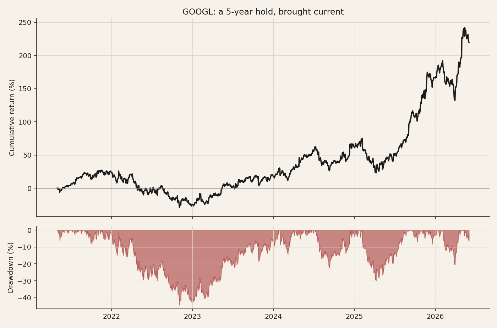

# 12 — GOOGL: a five-year equity hold, brought current

**Question.** If you had bought GOOGL five years ago and held, what is the return — and where does it sit now?

**Finding.** **+220% total (≈26% CAGR)**: $10,000 became about $32,000. A strong hold, but it *lagged* the NVDA-driven semiconductor complex (+360% over the same window), and it carried a −44% drawdown along the way.

> Research / backtested buy-and-hold. Split-adjusted daily closes, extended to the live close (2026-06-01). No live capital, no transaction costs.

## Data & method

- Buy 2021-04-30 at **$117.67**; mark to 2026-06-01 at **$376.37** (warehouse history extended with the live close). Split-adjusted (the 2022 20:1 split is handled).
- Total return, CAGR over 5.09 years, annualized volatility, and max drawdown (peak-to-trough on close).

## Claim 1 — A five-year hold returned ~+220% (26% CAGR)

$10,000 invested at the start is worth about **$31,984** today. 2026 year-to-date **+19.4%**; annualized volatility 31.1%.

## Claim 2 — It lagged the semiconductor complex

GOOGL +220% versus the cap-weighted semis proxy **+360%** (NVDA-driven) over the same window (see study 11). This cycle, the AI-megacap trade was in the chips, not the platform.

## Claim 3 — The compounding carried a real drawdown

A **−44.3%** peak-to-trough drawdown (trough 2022-11-03) was the price of the return; the position now sits near, but a touch below, its April-2026 high.

## Caveats

A single-name buy-and-hold; no transaction costs; adjustment beyond splits is not modeled. The semis-proxy comparison is from study 11 (a 23-name cap-weighted proxy, not the official PHLX SOX).
