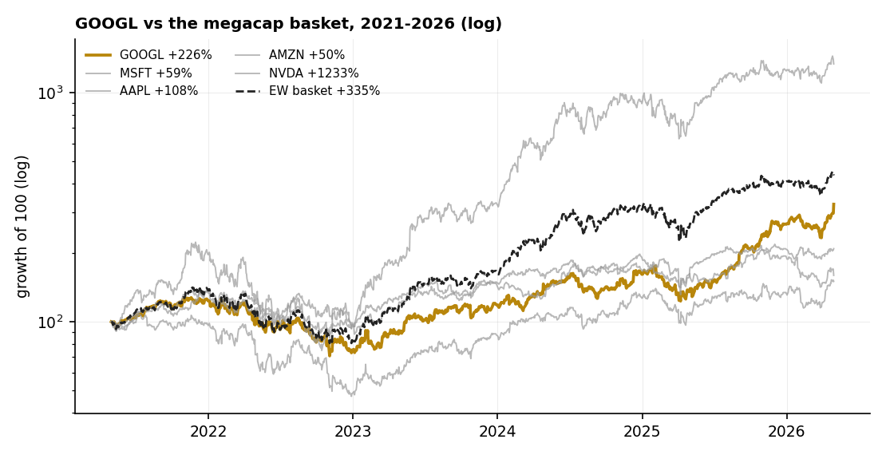

# 12 — GOOGL: a five-year hold, in the megacap pack

**Question.** What did a five-year GOOGL hold return — and how does it rank against the other megacaps on return *and* risk?

**Finding.** A strong hold — **+225% (≈27% CAGR), Sharpe 0.92** — but **#2 of five megacaps**, lapped by NVDA (+1,233%), and *beaten by simply holding the five equal-weight* (+335%, Sharpe 1.11). The lesson is less "GOOGL was great" than "the basket beat the pick, and NVDA was the cycle."

> Research / backtested buy-and-hold; split-adjusted daily closes, 2021-04-30 → 2026-04-30 (5.0y). Benchmark is an equal-weight basket of the five names (SPY/QQQ are not in the warehouse). No live capital, no transaction costs.

## Data & method

- `daily_bars` split-adjusted close; GOOGL, MSFT, AAPL, AMZN, NVDA (META is not in the warehouse).
- Per name: total return, CAGR, annualised volatility, Sharpe (rf = 0), maximum drawdown. An equal-weight buy-and-hold basket of the five is the in-sample benchmark.

## Claim 1 — GOOGL returned +225% (27% CAGR), Sharpe 0.92

$10,000 became about **$32,500**. Annualised volatility 31%; a −44% maximum drawdown (2022) was the price of the ride. A genuinely strong five-year compounding.

## Claim 2 — But it was #2 of five, and the basket beat it

Ranked among the five, GOOGL is **#2 on total return and #2 on Sharpe** — behind NVDA on both. Holding all five equal-weight returned **+335% at a higher Sharpe (1.11)** with the same −44% drawdown: diversifying across the megacaps beat the single pick on return *and* risk-adjusted return.

| Name | Total | CAGR | Vol | Sharpe | Max DD |
|---|---:|---:|---:|---:|---:|
| NVDA | +1,233% | 68% | 52% | 1.27 | −66% |
| **EW basket** | **+335%** | **34%** | **33%** | **1.11** | **−44%** |
| **GOOGL** | **+225%** | **27%** | **31%** | **0.92** | **−44%** |
| AAPL | +108% | 16% | 28% | 0.74 | −33% |
| MSFT | +59% | 10% | 26% | 0.52 | −38% |
| AMZN | +50% | 8% | 36% | 0.40 | −56% |

## Claim 3 — NVDA was the cycle

NVDA's +1,233% (Sharpe 1.27, but a −66% drawdown en route) dwarfs the field. It, not the platform names, was the AI-megacap trade of 2021–2026 — consistent with the concentration finding in study 11.

## The answer, in the data

**Q: Was a five-year GOOGL hold a good outcome?**
**A: Yes — but not the best.** It was #2 of five and was beaten by the equal-weight basket on both return and Sharpe.

| | Total | Sharpe | Rank (of 5) |
|---|---:|---:|---:|
| GOOGL | +225% | 0.92 | #2 / #2 |
| EW basket | +335% | 1.11 | — |
| NVDA | +1,233% | 1.27 | #1 / #1 |

## Caveats

Buy-and-hold, no costs or taxes; rf = 0 for Sharpe. META, SPY and QQQ are not in the warehouse, so the benchmark is an in-sample equal-weight basket of five, not the index. The window ends at the 2026-04-30 data cutoff, so figures differ slightly from a live-close mark.

## References

- Bessembinder, H. (2018). *Do stocks outperform Treasury bills?* Journal of Financial Economics — a few names create most long-run wealth; the basket-beats-the-pick result here is the same phenomenon.
- Community: the recurring r/investing / Bogleheads debate — index-or-basket vs single-name megacap picking.
