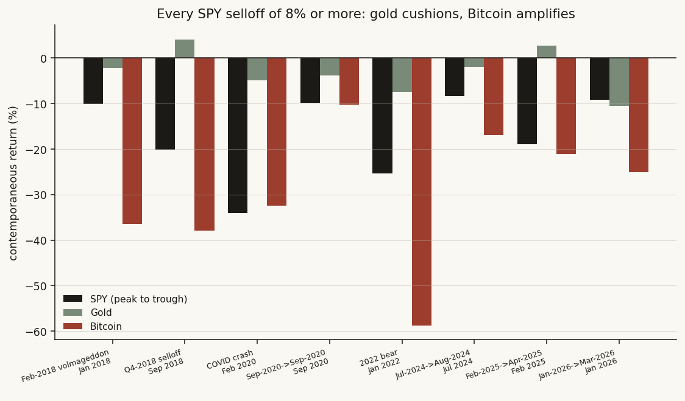
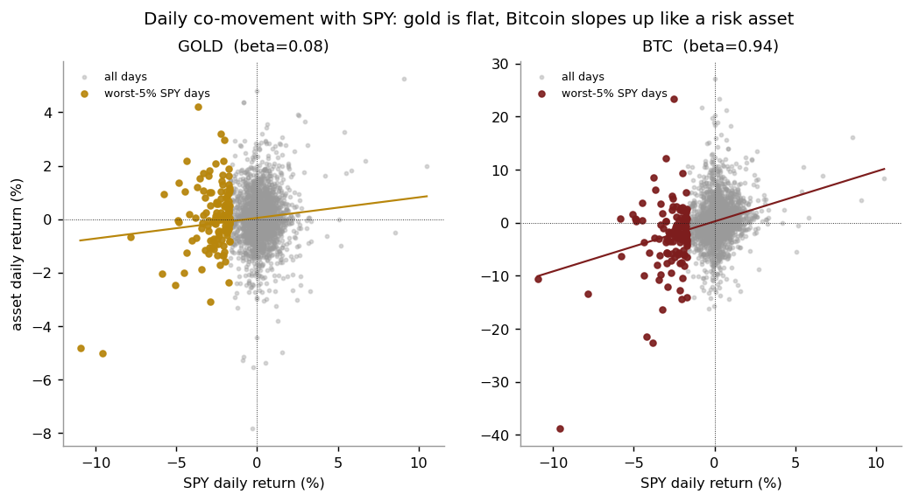
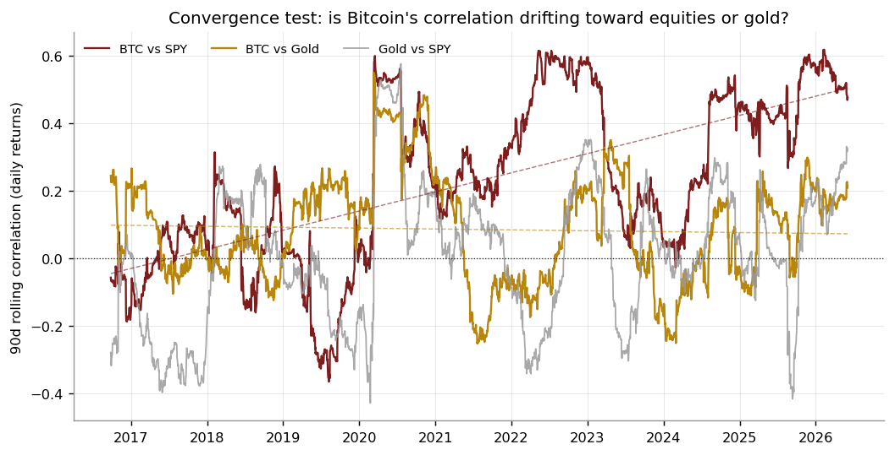

# 13 — Collapse insurance: gold cushions, Bitcoin is a risk asset (not digital gold)

**Question.** In equity selloffs, does Bitcoin behave like GOLD (a safe haven with low or negative crash beta) or like a RISK ASSET — and over time, is its behavior converging toward equities or toward gold? **Answer:** Bitcoin is a high-beta risk asset converging toward equities. Gold is the better crash diversifier, though not the always-up haven its reputation implies.

> Research / backtested. No live capital, no audited track record. The per-selloff read rests on only eight episodes; the statistical weight is in the ~2,500-day daily-beta and rolling-correlation tests.

## Data & method

- **Panel:** a single aligned daily series for SPY, gold, and Bitcoin from 2016-05-18 to 2026-06-03 — about **2,525 trading-day rows / 2,524 daily-return observations**. The window is **data-availability-limited, not chosen**: it is simply the full overlap for which all three series exist, so it is not a cherry-picked regime.
- **Selloff episodes:** every SPY peak-to-trough drawdown of **8% or more** (walk the running peak; open on the first 8% breach, close on a new high). Eight episodes. For each, gold's and Bitcoin's contemporaneous peak-to-trough return.
- **Crash beta:** OLS beta of each asset's daily return on SPY's — computed full-sample, on down-days only, and on the worst-5% SPY tail days. Returns winsorized at ±50% as a bad-tick guard.
- **Convergence test:** 90-day rolling correlation of daily returns for BTC-SPY, BTC-gold, and gold-SPY, with a per-year OLS slope and a first-half vs second-half split. Significance of the shift checked with **block-bootstrap confidence intervals** (63-day blocks) on the half-means.

## Claim 1 — In selloffs, gold cushions and Bitcoin amplifies

Across eight SPY selloffs (≥8% peak-to-trough), gold beat SPY (fell less or rose) in **7 of 8**; Bitcoin fell in **8 of 8** and fell *more than SPY* in **7 of 8**. In the COVID and 2022 episodes Bitcoin amplified the equity drawdown rather than cushioning it. Gold is the better diversifier — but not a clean always-up haven: it was outright positive in only 2 of 8 selloffs (median −3.0%).

| Asset | n | % positive | % beat SPY | Median | Mean |
|---|--:|--:|--:|--:|--:|
| **Gold** | 8 | 25% (2/8) | 88% (7/8) | **−3.0%** | −3.0% |
| **Bitcoin** | 8 | 0% (0/8) | 12% (1/8) | **−28.8%** | −29.9% |
| (SPY, ref.) | 8 | 0% | — | −14.6% | −17.0% |

## Claim 2 — Bitcoin's crash beta is equity-like and rises into stress

On daily returns, gold's beta to SPY is statistically indistinguishable from zero, while Bitcoin's is equity-like and *grows* as conditions worsen.

| Asset | beta (all) | 95% CI | beta (down-days) | beta (tail-5%) |
|---|--:|--:|--:|--:|
| **Gold** | 0.08 | [−0.02, 0.15] | 0.09 | **+0.37** |
| **Bitcoin** | 0.94 | [0.70, 1.14] | 1.19 | **1.68** |

n = 2,524 daily-return observations; down-days n = 1,124; worst-5% tail n = 127. Gold's *tail* beta is **positive (+0.37)** — in the worst equity days it tends to slip *with* equities, not rally against them, so "negative-beta hedge" overstates it; "low beta, falls far less" is the honest framing. Bitcoin's beta climbs from ~0.94 all-days to ~1.19 on down-days to ~1.68 in the tail. The popular "3× Nasdaq" label overstates typical co-movement: average crash beta is ~0.9–1.2, and even the tail is ~2×, not 3×.

## Claim 3 — Bitcoin is converging toward equities, away from gold

Splitting the panel in half by time, Bitcoin's 90-day correlation to SPY roughly **quadruples**, from **0.08 [0.00, 0.18]** to **0.37 [0.30, 0.45]** — the two bootstrap CIs are **disjoint**, so the rise is a real shift, not noise. Over the same horizon its correlation to gold drifts the *other* way, down toward ~0.04.

| Pair | Mean | 1st half | 2nd half | Slope/yr |
|---|--:|--:|--:|--:|
| **BTC vs SPY** | 0.23 | 0.08 | **0.37** | +0.057 |
| BTC vs Gold | 0.09 | 0.13 | 0.04 | −0.003 |
| Gold vs SPY | 0.01 | −0.01 | 0.03 | +0.020 |

**Answer — No, Bitcoin is not digital gold.** It is a high-beta risk asset whose equity correlation is rising over time. Gold remains the better (if imperfect) crash diversifier — it falls far less than equities and beats SPY in most selloffs, without reliably rallying. A **conditional No**: gold cushions, Bitcoin amplifies, and Bitcoin is converging toward equities.

## Caveats

- **Small episode count.** Eight selloffs is the natural sample over ~10 years of joint data; the per-episode read (medians, % positive) is directional, not high-power. The daily-beta and rolling-correlation results (n ≈ 2,500) carry the statistical weight.
- **Gold is not a clean always-up haven.** Positive in only 2 of 8 selloffs, median −3.0%, with a positive tail beta. It failed outright in the most recent episode (down more than SPY). "Falls far less, beats SPY in 7/8" is the defensible claim, not "always rallies."
- **"3× Nasdaq" is a tail descriptor only.** It captures the direction (amplification into stress) but overstates the magnitude of typical co-movement.
- **Survivorship / regime risk.** Bitcoin's history is one asset over one decade of mostly ultra-loose then tightening policy. The convergence trend is consistent with maturation into a macro/risk asset, but a single-asset history cannot rule out a future regime decoupling it again.

## References

- Baur & Lucey (2010). Is gold a hedge or a safe haven? An analysis of stocks, bonds and gold. *Financial Review.*
- Erb & Harvey (2013). The Golden Dilemma. *Financial Analysts Journal.*
- Price data: public daily closes for SPY (split-adjusted), the LBMA London gold fix, and BTC-USD.
