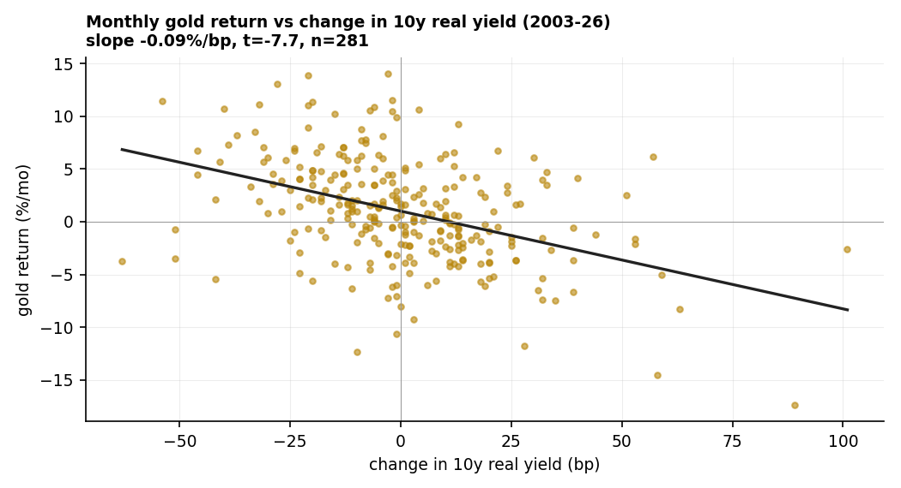
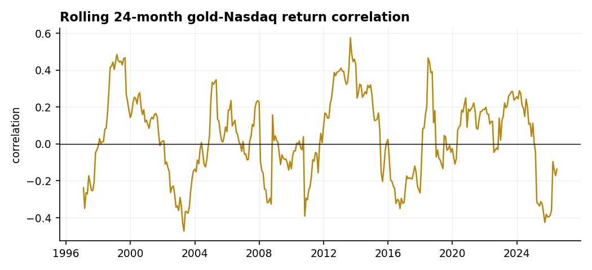

# 13 — Is gold collapse insurance? It's a real-rate trade, not a crash hedge

**Question.** Anchored on the 2000 dot-com top: when equities collapse, does gold rise — is it insurance you can hold *through* a crash? Today gold looks toppy, yet if a collapse is feared it "should" be bid. Which reading is right?

**Finding.** Gold is **not** a clean intra-crash hedge. What actually drives it is the **real interest rate**: monthly gold returns fall about **0.09% for every basis point** the 10-year real yield rises (t = −7.7, p ≈ 3e-13, n = 281). Across all eight Nasdaq drawdowns ≥15% since 1990, gold's median return *during* the decline was only **+3%**, and it fell in three of them. Gold is a post-easing, falling-real-rate reflation trade — not collapse insurance. Today (real 10y ≈ +2%, VIX ≈ 16) is the macro *opposite* of the 2000–02 and 2008 setups in which gold worked.

> Research / backtested. Monthly LBMA gold vs US Treasury real yields (TIPS, 2003+) and a CPI-based real-rate proxy (1995+); algorithmic drawdown detection on the Nasdaq Composite. No live capital.

## Data & method

- **Gold:** LBMA PM fix (USD), month-end. **Real yield:** US Treasury 10-year TIPS (DFII10); pre-2003 proxy = nominal 10y (DGS10) − trailing CPI YoY (BLS). **Equity:** Nasdaq Composite. **Volatility:** CBOE VIX.
- **Regression:** OLS of monthly gold return on the monthly change in the real yield; reported with t-stat, R², p-value.
- **Drawdowns:** programmatic detection of every Nasdaq peak-to-trough ≥15% since 1990 (8 episodes); gold's return and worst intra-episode drawdown measured over each window.

## Claim 1 — Gold is priced off the real rate (t = −7.7)

Monthly gold return regressed on the change in the 10-year real yield: slope **−0.093%/bp** (t **−7.7**, R² 0.17, p ≈ 2.5e-13, n = 281). A CPI-proxy real rate back to 1995 agrees in sign (slope −0.019, t −3.5, n = 365). Real rates, not equity fear, set the trend.

## Claim 2 — It does not move *against* equities

The monthly gold–Nasdaq return correlation is **+0.03** (n = 377) — essentially zero, not negative. On a rolling 24-month basis it swings from roughly −0.4 to +0.6 depending on the regime; there is no stable hedge to lean on.

## Claim 3 — Through the crashes, gold's record is mixed (median +3%)

Across all eight Nasdaq drawdowns ≥15% since 1990, gold's median return during the decline was **+3%** — positive in **5/8** but negative in three (incl. COVID-2020 −5% and the 2022 rate bear −3%), and it drew down more than 5% intra-episode in five of eight (−20% in 2022). Where gold *did* work — 2000–02 (+10%) and 2008 (+17% over the full window) — real rates were falling hard. Where real rates rose (2022), gold fell alongside stocks.

| Nasdaq drawdown | equity DD | gold during | gold max DD |
|---|---|---|---|
| 1996 | −17% | −1% | −2% |
| 1998 | −30% | +2% | −7% |
| 2000–02 | −78% | +10% | −12% |
| 2015–16 | −18% | +12% | −11% |
| 2018 | −24% | +4% | −3% |
| 2020 (COVID) | −30% | −5% | −12% |
| 2021–22 (rate bear) | −36% | −3% | −20% |
| 2024–25 | −24% | +14% | −4% |
| **median** | **−27%** | **+3%** | **−9%** |

## Claim 4 — Today is the inverse of the setups where gold worked

Gold sits near its multi-decade real highs but about 18% below its 52-week peak, with the 10-year real yield near **+2%** and VIX near **16**. The conditions that powered gold in 2000–02 and 2008 — deeply falling real rates and panic-level volatility — are absent. The "topping vs. should-be-bid" tension resolves toward the real rate: absent a real-rate decline, an equity wobble alone has not historically been sufficient to bid gold. Own it as a real-rate / debasement position, most useful *after* easing begins — not as first-leg-down insurance.

## Caveats

Monthly frequency misses sharp intra-month spikes (gold often catches a bid in the first days of a panic, then fades — see COVID). The TIPS real series starts in 2003; the pre-2003 proxy is coarser (R² 0.03). "Safe haven" here is a monthly-horizon, USD-denominated test; in non-USD terms the picture differs.

## References

- Baur & Lucey (2010). Is gold a hedge or a safe haven? An analysis of stocks, bonds and gold. *Financial Review.*
- Erb & Harvey (2013). The Golden Dilemma. *Financial Analysts Journal.*
