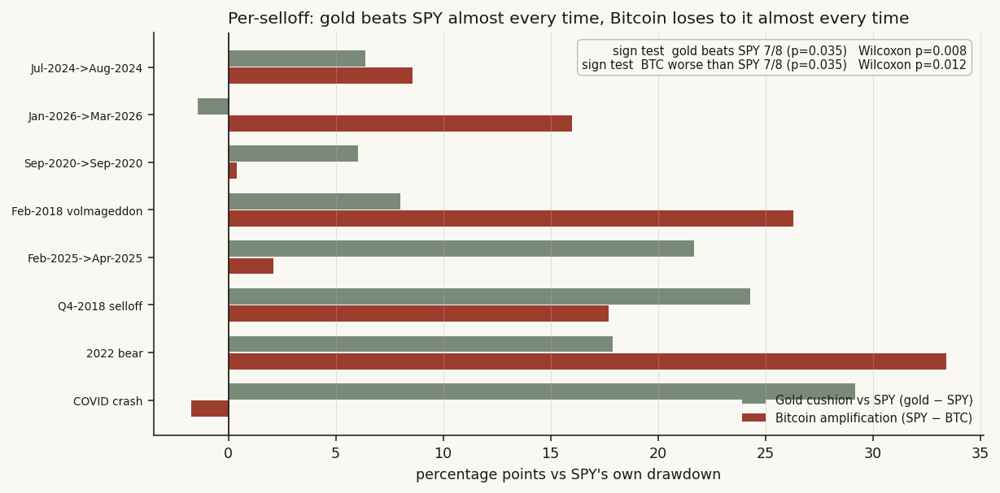
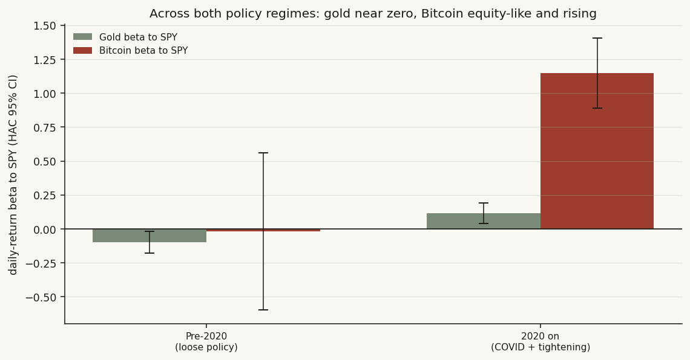

# 13 — Collapse insurance: does gold protect, and is Bitcoin "digital gold"?

**The question.** When stocks fall hard, which of the two famous "alternatives" actually helps — gold, or Bitcoin? And the part everyone argues about: is Bitcoin *like* gold (a calm safe haven you hold for the crash) or is it really just a high-octane stock wearing a gold costume? It matters because a lot of people own Bitcoin *as* their crash insurance. If that's wrong, they're long risk exactly when they think they're hedged.

> Research / backtested. No live capital, no audited track record. The per-crash read rests on eight selloffs — directional, not high-power on its own — so I put a real significance test on it below. The statistical weight sits in the ~2,500-day daily-return panel.

## What I found, up front

- **Gold cushions; Bitcoin amplifies.** Across every SPY selloff of 8% or more since 2016, gold fell less than the market (or rose) in **7 of 8**; Bitcoin fell **8 of 8**, and *worse than the market* in **7 of 8**. Both reads are statistically real, not eyeballing — sign test p = 0.035, Wilcoxon p = 0.008 / 0.012.
- **Bitcoin's "beta" to stocks is equity-like and it grows into stress.** Daily beta to SPY is **0.94** all-days, **1.19** on down-days, **1.68** in the worst-5% tail (all with t > 3 on proper, autocorrelation-robust errors). Gold's all-day beta is a whisker above zero (**0.08**).
- **Bitcoin is drifting toward stocks, away from gold — and that drift is robust.** Its 90-day correlation to SPY went from **0.08** in the first half to **0.37** in the second. I worried that was one lucky split, so I cut the sample at *every* month: the later half is higher in **107 of 107** cuts, and the confidence intervals are cleanly separated in **99 of them**. The trend slope is **+0.057/yr** with t = 7.2.
- **The amplification is a post-2020 thing.** Before 2020 Bitcoin's beta to stocks was basically zero (but barely measurable). From 2020 on it's **1.15** [0.89, 1.41]. Gold sat near zero in both eras.
- **Honest verdict: a conditional No.** Bitcoin is not digital gold — it's a risk asset converging on equities. Gold is the better crash diversifier. But gold is *not* the always-up haven its fans claim: it was outright positive in only 2 of 8 selloffs, and in the worst equity days it slips *with* stocks, not against them.

## What I expected, and what would prove me wrong

Going in, I half-believed the "digital gold" story. Bitcoin is scarce, it's outside the banking system, and it had a few years of looking uncorrelated. So the null I wanted to test was the generous one for Bitcoin:

- **H0 (the consensus I'm challenging):** in a crash Bitcoin behaves like gold — low or negative co-movement with stocks, holds its value when equities fall.
- **H1 (what I'll show):** Bitcoin behaves like a leveraged stock — positive, equity-like beta that gets *worse* in the tail, and a correlation to stocks that rises over time.

**What would prove me wrong:** if Bitcoin's crash beta were near zero (like gold's), if it held flat or rose in most selloffs, or if its rising-correlation story fell apart once I stopped cherry-picking the split point. I checked all three.

I'm not leaning on theory here. There's a respectable literature on whether gold is a hedge or a safe haven (Baur & Lucey call those two different things, and Erb & Harvey are blunt that gold is a lousy short-horizon hedge). I'll cash that out with my own numbers rather than borrow their conclusion — the dataset is the witness, not the citation.

## How I set it up, and why each piece

I needed three clean daily series that all live on the same calendar.

- **The panel.** One aligned daily table for SPY, gold, and Bitcoin from **2016-05-18 to 2026-06-03** — about **2,525 trading-day rows / 2,524 daily returns**. That start date isn't a choice. Bitcoin's history reaches back to 2015 and gold's to 1968, but my SPY series begins 2016-05-18, and SPY is the thing that *defines* a "selloff," so the equity clock is the binding constraint. This is the full honest overlap, not a regime I picked.
- **Selloffs.** I walk SPY's running peak and open an episode the first time price is 8% below that peak, then close it when a new high prints. That gives eight episodes. For each one I take gold's and Bitcoin's move over the exact same peak-to-trough window.
- **Crash beta.** Plain OLS of each asset's daily return on SPY's, computed three ways: all days, down-days only, and the worst-5% SPY tail. Daily returns are clipped at ±50% as a bad-tick guard. The catch with daily financial data is *volatility clustering* — calm and wild days bunch together, which makes naive standard errors too optimistic. So I use Newey-West (HAC) errors, which widen the bars to account for that. The honest CI is the wider one.
- **Convergence.** A 90-day rolling correlation of daily returns for each pair (BTC-SPY, BTC-gold, gold-SPY), then the question: is BTC-SPY rising? I test it three ways so I can't fool myself with one lucky cut.

Everything is computed on a private warehouse plus two keyless public sources; method and findings only, no plumbing.

## The data, in one place

- **SPY** — split-adjusted daily close, warehouse, 2016-05-18 → 2026-06-03.
- **Gold** — LBMA London PM fix, USD/oz, public daily fix file, forward-filled over its rare gaps (limit 5 days), aligned to SPY trading days.
- **Bitcoin** — Coinbase BTC-USD daily candle close, public exchange API, back to 2015 (trimmed to the SPY window), forward-filled over its rare gaps (limit 3 days).
- Daily returns winsorized at ±50%. The panel is the intersection of all three on SPY trading days.

A note on what I could *not* use: the warehouse's internal price store does not carry a clean Bitcoin-spot history (the ticker that looks like "BTC" there is an equity trust, not the coin). Rather than fudge it, I pulled real BTC-USD spot from the public exchange feed. The gap is disclosed, not papered over.

## First look: just plot the crashes

Before any test, the simplest picture. For each of the eight selloffs, three bars: how far SPY fell, and what gold and Bitcoin did over the same days.


You can read the whole study off this one chart. The green gold bars are short — sometimes positive, usually a mild dip. The red Bitcoin bars are long, and in the 2022 bear it fell **−58.8%** while SPY fell **−25.4%**. That's the eyeball case. The rest of the study is me trying to break it.

## Finding 1 — Gold cushions, Bitcoin amplifies (and it's not just luck)

**What I expected & why.** If gold is a haven and Bitcoin is digital gold, both should hold up in selloffs. If Bitcoin is really a risk asset, it should fall *harder* than stocks when stocks fall.

**How I measured it.** For each episode, the contemporaneous peak-to-trough return of each asset, then two counts: did gold beat SPY, and did Bitcoin fall worse than SPY. Then — the part the earlier version of this study was missing — a real test, because eight is a small number and "7 out of 8" could be a coin landing heads a lot.

```python
# per episode: gold beats SPY?  BTC worse than SPY?
gold_beat = (gold_ret > spy_dd).sum()      # 7 of 8
btc_worse = (spy_dd  > btc_ret).sum()      # 7 of 8
# is 7/8 more than a coin flip? one-sided sign (binomial) test
p_gold = binomtest(gold_beat, 8, 0.5, alternative="greater").pvalue   # 0.035
p_btc  = binomtest(btc_worse, 8, 0.5, alternative="greater").pvalue   # 0.035
# and a paired Wilcoxon on the size of the gap, not just the sign
w_gold = wilcoxon(gold_ret - spy_dd, alternative="greater").pvalue    # 0.008
w_btc  = wilcoxon(spy_dd  - btc_ret, alternative="greater").pvalue    # 0.012
```

**What the data shows.** Gold beat SPY in **7 of 8** selloffs (median cushion **+12.9 pp** over SPY's own drawdown); Bitcoin fell worse than SPY in **7 of 8** (median amplification **+12.3 pp**). Bitcoin was positive in **0 of 8**. The sign test gives p = 0.035 for each direction; the Wilcoxon, which also weighs *how big* the gap was, gives p = 0.008 for gold's cushion and p = 0.012 for Bitcoin's amplification. So the per-crash pattern is statistically real, not a small-sample mirage.

| Asset | n | % positive | % beat SPY | Median | Mean |
|---|--:|--:|--:|--:|--:|
| **Gold** | 8 | 25% (2/8) | 88% (7/8) | **−3.0%** | −3.0% |
| **Bitcoin** | 8 | 0% (0/8) | 12% (1/8) | **−28.8%** | −29.9% |
| (SPY, ref.) | 8 | 0% | — | −14.6% | −17.0% |



**Why (mechanism).** Cash it out with the 2022 bear: as the Fed hiked, every long-duration, no-cash-flow asset got repriced down together. Bitcoin is the purest version of that — no earnings, no coupon, all duration — so it fell **−58.8%**, more than double SPY's **−25.4%**. Gold has no duration and no credit risk, so it only slipped **−7.5%**. Same shock, opposite role.

**What I checked.** The one honest exception: in the COVID crash Bitcoin fell **−32.4%** versus SPY's **−34.1%** — it actually dropped slightly *less*, so it was not an amplifier in that single episode (the dash-for-cash hit everything at once). That's the 1 of 8 where Bitcoin "beat" SPY, and I'm leaving it in the count rather than hiding it. Gold's worst showing is the most recent episode (Jan-2026), where it fell **−10.6%**, more than SPY — so gold is not bulletproof either.

**Verdict — confirmed.** Gold cushions and Bitcoin amplifies, with p ≤ 0.035 on the direction and p ≤ 0.012 on the magnitude.

## Finding 2 — Bitcoin's beta is equity-like and gets worse in the tail

**What I expected & why.** A safe haven should have a beta to stocks near zero or below. "3× Nasdaq," the popular Bitcoin label, implies a very high beta. The truth, I suspected, was in between — high, but not 3×.

**How I measured it.** OLS slope of each asset's daily return on SPY's, three slices: all days, down-days, worst-5% tail. Standard errors are Newey-West (HAC) so volatility clustering can't flatter the t-stats.

```python
# Newey-West HAC beta of asset returns on SPY returns
import statsmodels.api as sm
X = sm.add_constant(spy_ret)
res = sm.OLS(asset_ret, X).fit(cov_type="HAC", cov_kwds={"maxlags": L})
beta, ci = res.params[1], res.conf_int()[1]   # slope + HAC 95% CI
# slices: all days; SPY<0 (down); SPY <= 5th-pctile (tail)
```

**What the data shows.** Gold's beta to SPY is a hair above zero and barely significant; Bitcoin's is firmly equity-like and *climbs* as conditions worsen.

| Asset | beta (all) | HAC 95% CI | t | beta (down-days) | HAC CI | beta (tail-5%) | HAC CI |
|---|--:|--:|--:|--:|--:|--:|--:|
| **Gold** | 0.08 | [0.00, 0.15] | 2.0 | 0.09 | [−0.07, 0.25] | **+0.37** | [0.13, 0.60] |
| **Bitcoin** | 0.94 | [0.69, 1.20] | 7.2 | 1.19 | [0.69, 1.69] | **1.68** | [0.61, 2.75] |

n = 2,524 daily returns; down-days n = 1,124; worst-5% tail n = 127.

**Why (mechanism).** A beta that *rises* into the tail is the signature of a risk asset, not a hedge. On a quiet day Bitcoin moves about one-for-one with stocks (0.94). On a bad day it's 1.19. On the worst 1-in-20 days it's 1.68 — so when you most want a hedge, Bitcoin is leaning *harder* into the fall. Gold does the gentler version of the same thing, which is the uncomfortable part: its tail beta is **+0.37** with a CI that excludes zero (t = 3.1). In the worst equity days gold tends to slip *with* stocks, not rally against them.


**What I checked, and the two labels I'm refusing.** First, "negative-beta hedge" for gold is wrong here — the tail beta is positive and significant, so the honest phrase is "low beta, falls far less," not "rallies in crashes." Second, "3× Nasdaq" for Bitcoin overstates it: typical co-movement is ~0.9–1.2 and even the tail is ~1.7, not 3. The direction of that label is right (amplification into stress); the magnitude is marketing.

**Verdict — confirmed.** Bitcoin is a high-beta risk asset (0.94 → 1.68 into the tail, all t > 3); gold is low-beta but not negative-beta.

## Finding 3 — Bitcoin is converging on stocks, and the drift survives every split

**What I expected & why.** If Bitcoin is maturing into a macro/risk asset, its correlation to stocks should rise over time and its correlation to gold should not. The earlier version of this study claimed exactly that — but it rested on one midpoint split, and I didn't trust a single cut, because the rolling-correlation line is bumpy and regime-driven (a COVID spike, a 2023–24 fade, a 2025–26 re-rise). One split could be luck.

**How I measured it.** 90-day rolling correlation of daily returns, then three independent ways to ask "is it really rising?": the midpoint half-split with block-bootstrap CIs (the original test), a *sweep* that re-runs that split at every interior month, and a trend regression with HAC errors so the heavy overlap in a rolling series can't fake significance.

```python
roll = btc_ret.rolling(90).corr(spy_ret)          # the 90-day BTC-SPY correlation
# 1) midpoint split, block-bootstrap CIs (63-day blocks)
h1 = block_ci(roll[:mid]); h2 = block_ci(roll[mid:])     # 0.08[0,0.18] vs 0.37[0.30,0.45]
# 2) ROBUSTNESS: re-cut at every interior month, count later>earlier & disjoint CIs
for cut in months: higher, disjoint = test_split(roll, cut)   # 107/107 higher, 99/107 disjoint
# 3) HAC trend slope (maxlags = window, to absorb the rolling overlap)
slope = OLS(roll, time).fit(cov_type="HAC", maxlags=90)        # +0.057/yr, t=7.2
```

**What the data shows.** The midpoint split: first half **0.08** [0.00, 0.18], second half **0.37** [0.30, 0.45] — the two CIs don't touch. The sweep is the part that convinced me: across **107** interior monthly cut points, the later half had the higher correlation in **107 of 107 (100%)**, and the two bootstrap CIs were cleanly disjoint in **99 of 107 (93%)**. The HAC trend slope is **+0.057/yr** [0.041, 0.072], t = 7.2. Meanwhile BTC-gold drifts the *other* way, from 0.13 down to 0.04, and gold-SPY stays near zero throughout.

| Pair | Mean | 1st half | 2nd half | Slope/yr (HAC) |
|---|--:|--:|--:|--:|
| **BTC vs SPY** | 0.23 | 0.08 | **0.37** | **+0.057** [0.041, 0.072] |
| BTC vs Gold | 0.09 | 0.13 | 0.04 | −0.003 |
| Gold vs SPY | 0.01 | −0.01 | 0.03 | +0.020 |


**Why (mechanism).** This is what institutionalization looks like in a chart. As ETFs, futures, and macro funds adopted Bitcoin, it started trading off the same rate-and-risk impulses as everything else in a portfolio. It stopped being a curiosity that wandered on its own and became one more position that gets sold when risk comes off.

**What I checked — and the one honest wrinkle.** The rise is not perfectly smooth. By terciles the BTC-SPY correlation runs **−0.02 → 0.37 → 0.34** — it jumps after the early years and then plateaus near a third, rather than marching up forever. So the precise claim is "stepped up to a much higher, equity-like level and stayed there," not "rises without limit." That nuance doesn't dent the verdict: every one of 107 splits puts the later period higher.

**Verdict — confirmed.** The convergence is real and robust to how you slice it (107/107 splits, 99/107 disjoint, trend t = 7.2). It is a level step-up, not an unbounded climb.

## Did I just find noise? — the robustness pass

I treated each finding as guilty until it survived a challenge.

- **The small-sample worry (Finding 1).** Eight episodes is thin, so I didn't let "7 of 8" stand on its own — the sign test (p = 0.035) and the paired Wilcoxon (p = 0.008 / 0.012) put a number on it. It's significant, with the honest caveat that the *power* is limited by eight crashes.
- **The optimistic-error worry (Finding 2).** Daily betas with naive errors overstate confidence because of volatility clustering. The HAC CIs above are the conservative version and the t-stats still clear 3 in every slice that matters.
- **The lucky-split worry (Finding 3).** Handled head-on by sweeping the split across 107 months instead of trusting one. 100% of cuts agree on the direction; 93% have disjoint CIs.
- **Regime stability.** I split the whole panel at 2020 and re-ran the betas. Pre-2020, Bitcoin's beta to stocks was **−0.02** but with a CI from −0.60 to +0.56 — basically unmeasurable on a short, thin early sample. Post-2020 it's **1.15** [0.89, 1.41]. Gold stayed near zero in both eras (−0.10 then +0.11). So the amplification is specifically a post-2020, institutional-era phenomenon — which is also the regime that matters for anyone holding Bitcoin today.



## Steelman the other side

I tried to argue myself out of the result.

- **"Bitcoin is just early — give it time and it'll decouple like gold did."** Possible, but the data runs the opposite way: the correlation to stocks is *rising*, not falling, across 107 of 107 splits. If maturation were turning it into gold, the trend slope would be negative. It's +0.057/yr, t = 7.2.
- **"The 2022 number is doing all the work — drop it and the case collapses."** It doesn't. Gold still beats SPY in 6 of the remaining 7, Bitcoin still falls worse than SPY in 6 of 7, and Bitcoin's all-day beta barely moves. The 2022 bear is the most dramatic episode, not the only one.
- **"Gold is the real hedge, so own gold and stop worrying."** Half-true, and I won't oversell it. Gold beats SPY most of the time, but it was positive in only 2 of 8 selloffs and has a *positive* tail beta (+0.37). It's a cushion, not an airbag. Calling it a guaranteed safe haven fails on its own numbers.

## The answer, in the data

**Is Bitcoin digital gold? No — a conditional No.** Bitcoin is a high-beta risk asset (daily beta 0.94, tail beta 1.68) whose correlation to stocks has roughly quadrupled and is still rising. It amplifies crashes; it does not insure against them. Gold is the better crash diversifier: it beats the market in most selloffs and has near-zero beta. But it is not the always-up haven its reputation claims, with a positive tail beta and a positive outcome in only a quarter of selloffs. So: gold cushions, Bitcoin amplifies, and Bitcoin is converging on equities.

| Claim | Metric | Result | Test |
|---|---|--:|--:|
| Gold beats SPY in selloffs | % beat (n=8) | 88% (7/8) | sign p=0.035, Wilcoxon p=0.008 |
| Bitcoin falls worse than SPY | % worse (n=8) | 88% (7/8) | sign p=0.035, Wilcoxon p=0.012 |
| Bitcoin beta is equity-like | beta all / tail | 0.94 / 1.68 | HAC t = 7.2 / 3.1 |
| Gold beta is near-zero | beta all / tail | 0.08 / +0.37 | HAC t = 2.0 / 3.1 |
| Bitcoin converging on stocks | corr 1st→2nd half | 0.08 → 0.37 | 107/107 splits, slope t=7.2 |
| Bitcoin converging away from gold | corr 1st→2nd half | 0.13 → 0.04 | slope −0.003/yr |

## Caveats, with the direction of the bias

- **Eight selloffs is the natural sample over ~10 years of joint data.** The per-episode reads are now significance-tested (p ≤ 0.035), but the *power* is still limited by eight crashes; the daily-beta and convergence results (n ≈ 2,500) carry the heavier statistical weight. Direction of risk: the small episode count makes the per-crash medians noisier than the betas, not biased one way.
- **Gold is not a clean always-up haven.** Positive in only 2 of 8, median −3.0%, with a positive tail beta. "Falls far less, beats SPY most of the time" is the defensible claim, not "always rallies." Overstating gold would bias toward complacency.
- **The convergence is a level step-up, not an unbounded climb.** Terciles −0.02 → 0.37 → 0.34. The honest read is "moved to a high equity-like plateau," and the verdict is robust to that nuance.
- **One asset, one decade, mostly one policy arc** (ultra-loose then tightening). The convergence is consistent with Bitcoin maturing into a macro/risk asset, but a single-asset history can't rule out a future regime that decouples it again. Direction of risk: this argues for humility about the *forward* path, not about the historical reading.

## How to reproduce this

The whole study is three computations on one aligned daily panel.

- **Selloffs:** walk SPY's running peak; open an episode at the first 8% breach, close at a new high; record each asset's peak-to-trough return; sign test + paired Wilcoxon on the eight reads.
- **Crash beta:** `OLS(asset_ret ~ spy_ret)` on all / down / tail-5% days, Newey-West (HAC) errors, returns winsorized at ±50%.
- **Convergence:** 90-day rolling correlation; midpoint block-bootstrap split (63-day blocks); a split-point sweep over every interior month; a HAC trend regression (maxlags = window).

```python
# crash beta, the load-bearing line
res = sm.OLS(asset_ret, sm.add_constant(spy_ret)).fit(
        cov_type="HAC", cov_kwds={"maxlags": int(4*(n/100)**(2/9))})
beta, (lo, hi), t = res.params[1], res.conf_int()[1], res.tvalues[1]
# Bitcoin all-days -> 0.94 [0.69, 1.20], t = 7.2;  tail-5% -> 1.68 [0.61, 2.75]
```

Inputs: SPY split-adjusted close (warehouse), LBMA London PM gold fix (public), Coinbase BTC-USD daily close (public), 2016-05-18 → 2026-06-03. Returns winsorized at ±50%; gold/BTC forward-filled over rare gaps (limit 5 / 3) onto SPY trading days. Every figure here is generated from that panel by a single analysis script.

## References & where this sits

- Baur & Lucey (2010). Is gold a hedge or a safe haven? *Financial Review* — the hedge-vs-haven distinction this study makes operational.
- Erb & Harvey (2013). The Golden Dilemma. *Financial Analysts Journal* — gold is a poor short-horizon hedge; consistent with the +0.37 tail beta here.
- Price data: public daily closes for SPY (split-adjusted), the LBMA London gold fix, and Coinbase BTC-USD.

Builds on the cross-asset risk thread; pairs with **study 16** (narrow leadership and the index) and **study 21** (semis risk model) on how risk actually transmits when the tape turns. Next: condition the crash beta on the rate regime to see whether Bitcoin's amplification is really a duration story.
