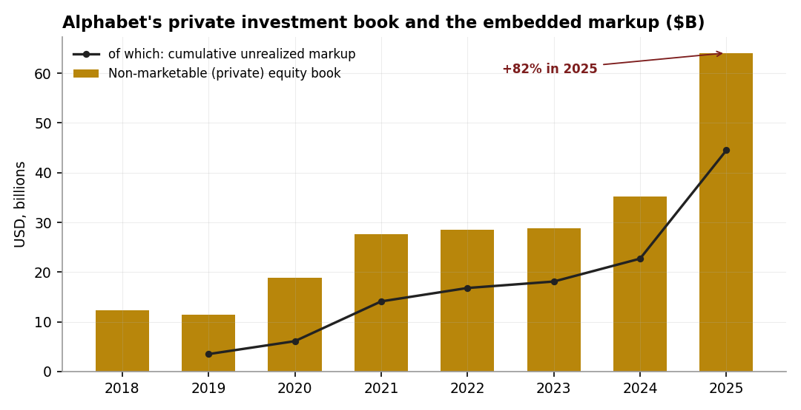
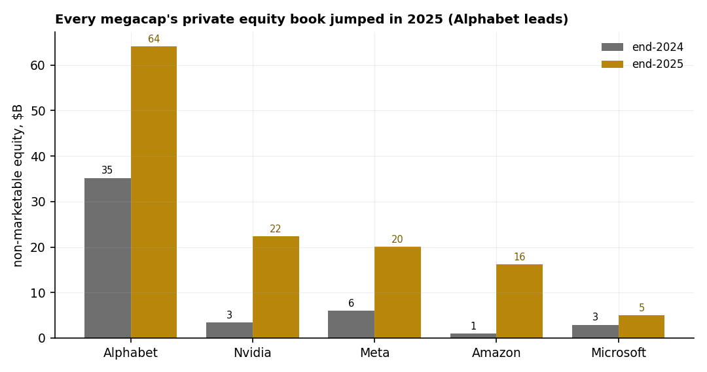

# 14 — Alphabet is, increasingly, a venture fund: is the investment book material?

**Question.** Beyond search and cloud, Alphabet holds large stakes in private companies (Anthropic, SpaceX) and a venture portfolio (CapitalG, GV). Is that investment book *material* to the equity story, or a rounding error?

**Finding.** **Material.** Gains on equity securities added roughly **+$24bn — about 18% of 2025 net income** — and Alphabet's non-marketable (private) equity book grew from **$35bn to $64bn** in a single year. The same line jumped across every megacap, so this is a **sector-wide, balance-sheet AI-venture surge**, not an Alphabet quirk. The catch: those gains are mark-to-model and pro-cyclical — the very line printed **−$3.5bn in 2022**.

> Research. Figures from Alphabet's 10-K (SEC EDGAR XBRL) and peer 10-Ks. Stake-level attribution (Anthropic / SpaceX) is reasoned from public reporting, not a filing line item. No live capital.

## Data & method

- **Source:** SEC EDGAR XBRL company facts — `EquitySecuritiesWithoutReadilyDeterminableFairValueAmount` (year-end non-marketable book) and gain/(loss) on equity securities, against net income, for Alphabet and the four other megacaps.
- **Window:** FY2021, 2022, 2024, and 2025 year-ends.

## Claim 1 — Private-stake mark-ups are now ~18% of net income

| Year | gain/(loss) on equity securities | % of net income |
|---|---|---|
| 2021 | +$12.4bn | +16% |
| 2022 | −$3.5bn | −6% |
| 2024 | +$3.7bn | +4% |
| 2025 | +$24.1bn | +18% |

Record earnings now carry a sizeable, swing-prone investment component.

## Claim 2 — The private book nearly doubled toward $64bn

Non-marketable equity securities grew **$35.2bn → $64.1bn** in 2025, led by re-rated private-AI stakes. Public reporting describes a roughly 14% economic interest in Anthropic and about 7% of SpaceX, alongside CapitalG's growth book and GV's 1,000-plus company roster.

## Claim 3 — Every megacap did the same thing

The non-marketable book jumped sector-wide in 2025 — Nvidia $3→$22bn (with +$8.9bn of gains), Meta $6→$20bn, Amazon $1→$16bn, Microsoft $3→$5bn. A systemic private-AI-valuation exposure now sits *inside* megacap earnings.

| Company | private equity book, end-2025 | 2025 gain on equity securities |
|---|---|---|
| Alphabet | $64.1bn | +$24.1bn |
| Nvidia | $22.3bn | +$8.9bn |
| Meta | $20.1bn | n/a |
| Amazon | $16.2bn | +$1.2bn* |
| Microsoft | $5.0bn | −$0.3bn |

\*Amazon's largest swings (its Rivian stake) are tagged on a separate line and understated here.

## Claim 4 — The circular-financing critique

Alphabet is Anthropic's investor *and* one of its largest compute suppliers (reporting describes a multi-year, ~$200bn-scale Google Cloud commitment). Skeptics liken the loop — fund the lab, sell it compute, mark up the stake, book the gain — to Nortel-era vendor financing (Tomasz Tunguz; UBS), and it is actively debated in the community (r/Economics on the AI "self-investment spree," r/stocks "is the AI boom built on fake revenue"). Powerful, but exposed to the same reflexivity if AI capex slows. Treat the private book as embedded AI / space beta, not recurring profit; judge the core on operating income *ex* securities gains, and read the next Anthropic round — or a SpaceX / Anthropic IPO — as the forward tell.

## Caveats

Marks are model-based and move on the last observable round, not live prices; a funding freeze stalls mark-ups and a down-round forces write-downs — 2022 showed it. Stake-level attribution is inferred from filings and reporting, not a 10-K breakout. Private-round figures are reported pre-close and can change before they settle.
