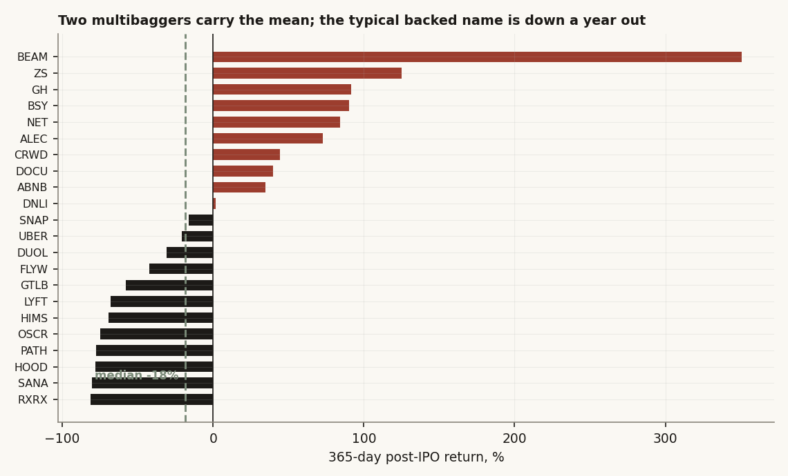
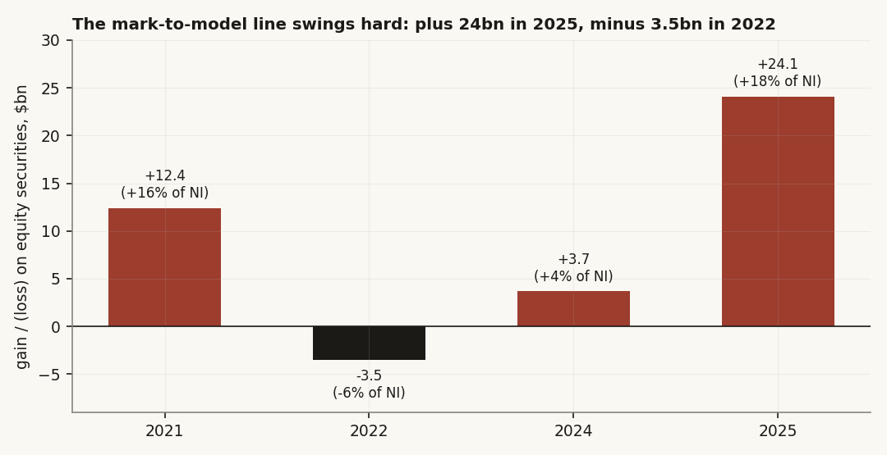
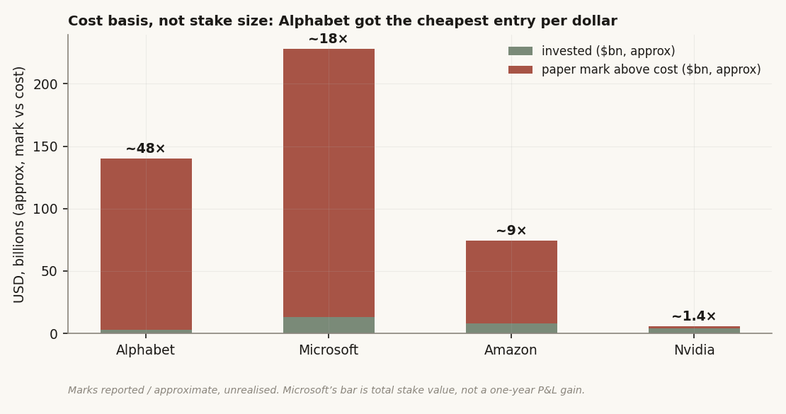
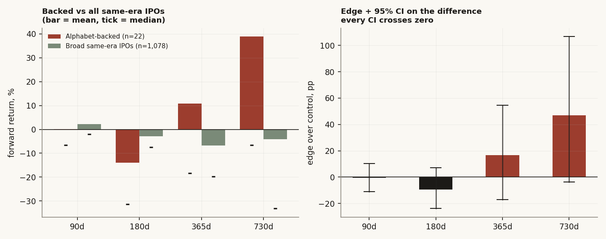
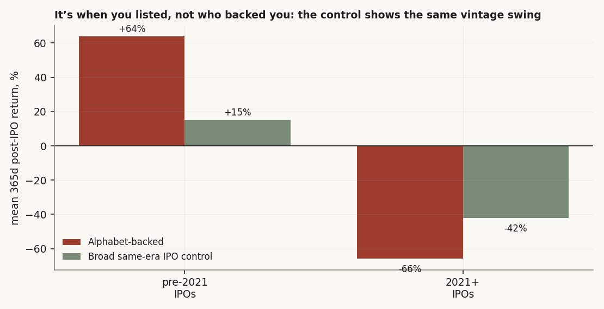

# 14 — Is Alphabet actually a good investor, or just early into a good cycle?

**The question.** Alphabet is sitting on a pile of investment gains. A roughly $0.9bn cheque into SpaceX back in 2015, an early Anthropic stake, a venture book through CapitalG and GV — and in 2025 those marks added about **+$24bn**, near a fifth of net income. So the obvious story writes itself: Alphabet is a great corporate investor. I wanted to know if that story survives contact with the data, because "great investor" and "owns two things that went up a lot" are not the same claim — and only one of them is repeatable.

**The short answer. Conditional, and the boring half is the true half.** On *cost basis* Alphabet really is the standout megacap: it bought its two big private winners earlier, cheaper, and larger per dollar than Microsoft, Amazon, or Nvidia did. That part holds. But on the one slice of the book I can actually mark against a live tape — the CapitalG/GV names that became public tickers — I find **no statistically detectable picking skill at any horizon** once the test is done honestly. The numbers that *look* like skill turn out to be a property of *when* a company listed, not who backed it. Best cost basis among the megacaps, yes. A demonstrably better *picker*, no.

> Research / backtested. No live capital, no audited track record. The private marks are mark-to-model, unrealised, and move on the last funding round rather than on cash. The public test is, by construction, generous to Alphabet — it only ever sees the bets that survived all the way to an IPO — and it *still* doesn't beat a plain IPO baseline.

## What I'll show, in order

1. The private marks are real and material, but pro-cyclical — the same line printed a loss in 2022.
2. Per dollar invested, Alphabet's entry was the cheapest of the four megacaps. This is the defensible part of the bull case.
3. On the public names I can price, the backed basket shows no edge over a broad same-era IPO control — every confidence interval crosses zero.
4. The thing that *looked* like an edge is listing vintage. I show this by construction: the control swings the exact same way.
5. The one "significant" number in the original cut was a single multibagger and a too-optimistic standard error. Fixed, it disappears.

A note on what changed from the first version of this study. The original tested the same idea but against a hand-built 216-name control and used a block bootstrap — a tool meant for autocorrelated time series, not a cross-section of independent names. I rebuilt it against **every genuine post-2016 IPO in the warehouse that listed in the same window (1,078 names)**, and switched to a plain name-level bootstrap, which is the right unit here (each forward return is one company, drawn once). The verdict is the same — no priceable skill — but it now rests on a five-times-larger control and a standard error that isn't quietly cheating.

## How I set it up

I split the question into the part I can measure cleanly and the part I can only source and caveat.

**The measurable part.** I can't price Anthropic or SpaceX — they're private, and their "value" is just whatever the last round implied. But CapitalG and GV between them backed dozens of companies that later went public, and once a name has a ticker it has a tape I can't argue with. So I take every CapitalG/GV-backed name that became a public US stock, and I measure how it did *after* it listed.

- **Entry.** First trading day at least five days after the IPO. The five-day skip is deliberate: day one is a pop driven by allocation scarcity, not by the company, and I don't want to credit Alphabet for that.
- **Forward returns** at 90, 180, 365, and 730 calendar days, winsorized at the 2nd/98th percentile so one berserk name can't run the whole average.
- **The control.** Not a hand-picked basket — *all* genuine post-2016 IPOs in the warehouse that listed in the same 2017–2021 window the backed names live in, minus the backed names themselves. That's 1,078 companies. This is the "what would any IPO from this era have done?" benchmark.
- **The test that matters.** Not "is the backed mean different from zero?" but "is the backed mean different from the *control* mean?" Those are different questions, and only the second one is about skill. I bootstrap the difference of the two means directly.

**The sourced part.** For the private book — Alphabet's, plus Microsoft–OpenAI, Amazon–Anthropic, and Nvidia's startup stakes — I pull cost, reported paper mark, and the FY-2025 P&L hit from filings and public reporting. These are approximate, given as ranges where the position is undisclosed. I keep them clearly walled off from the statistical test, because they cannot bear the same weight.

## The data

- **Backed universe:** 26 CapitalG/GV names that became public US tickers. Four of them (EDIT, NTLA, CDXS, XENE — all GV biotech) listed *before* the price history starts, so their first available bar is a mid-life price, not an IPO; an "IPO+5d" entry off that floor would be measuring something else, so I drop them. That leaves **22 clean post-IPO names**, listing March-2017 to October-2021. (One more, Cloudera, was taken private in 2021 and has no surviving public tape.) The full 22-name list with per-horizon returns is in `data/backed_names.csv`; the dropped names and why are in `data/backed_dropped.csv`.
- **Control universe:** **1,078** US common stocks whose first trading bar falls in 2017–2021, with at least 120 bars of history, excluding the backed names. Listed in `data/control_names.csv`.
- **Prices:** split-adjusted daily closes from the warehouse, each name from its own first trading day. No survivorship filter applied to prices beyond the 120-bar minimum.
- **Private marks & P&L:** Alphabet and peer 10-K/10-Q filings plus major financial-press reporting on private rounds. Approximate; ranges where undisclosed.

## What the raw data looks like, before any test

Here's the thing that surprised me first. Eyeballing the 22 backed names a year after they listed, the *average* is mildly positive — but the *typical* name is down. Ten of 22 are positive at 365 days; the median return is **−18%**. The mean is dragged up to roughly +11% by two names that ran hard (BEAM +350%, ZS +125%). That gap between mean and median is the whole study in one picture: a couple of winners, a long tail of losers, and an average that flatters the book.



That's the starting point, not the finish. A skewed basket of recent IPOs doesn't tell me anything until I ask: compared to *what*?

## Finding 1 — The private marks are big, but they're a weathervane

Before the skill test, the easy part. Alphabet's gains on equity securities are now a real chunk of reported profit. In 2025 that line was **+$24.1bn**, about **18%** of the year's $132bn net income. Impressive — until you look at the run of years around it.

| Year | gain / (loss) on equity securities | net income | % of net income |
|---|---:|---:|---:|
| 2021 | +$12.4bn | $76.0bn | +16% |
| 2022 | −$3.5bn | $60.0bn | −6% |
| 2024 | +$3.7bn | $100.1bn | +4% |
| 2025 | +$24.1bn | $132.2bn | +18% |



The same line that added 18% to profit in 2025 *subtracted* from it in 2022. That's because these are marks, not cash — they re-rate when private valuations re-rate, and in 2022 private valuations fell. So this is a real number and a material one, but it is pro-cyclical and reversible. It tells me the book is large and the cycle is currently kind. It does not tell me anyone is *skilled*. (Net income figures here are reconciled to Alphabet's reported annual filings; the equity-gains line is the disclosed gain/(loss) on equity securities.)

**Verdict:** confirmed and material, but it's a cycle read, not a skill read.

## Finding 2 — On cost basis, Alphabet genuinely is the best of the four

This is the part of the bull case I think actually holds. Stake *size* is not the same as stake *cleverness*. Microsoft's OpenAI position is the biggest headline mark of the four, but Microsoft also paid up — it bought into already-expensive rounds. Alphabet's edge is that it got in **early, cheap, and large per dollar**: roughly $2.9bn deployed across the SpaceX and Anthropic positions, against a reported paper mark in the ballpark of $140bn.

| Firm | Lead stake(s) | Invested ($bn) | Reported paper mark ($bn) | Approx multiple | FY25 equity-securities P&L ($bn) |
|------|---------------|---:|---:|---:|---:|
| Alphabet | Anthropic + SpaceX | ~2.9 | ~120–160 | **~40–55×** | +24.1 |
| Microsoft | OpenAI ~27% | ~13.0 | ~228 | ~17.6× | −3.1 (equity-method loss) |
| Amazon | Anthropic | ~8.0 | 74.2 | ~9.3× | +9.5 (est.) |
| Nvidia | CoreWeave + xAI + others | ~4.0 | ~5.7 (public marks) | **~1.5×** | small + |



A worked example makes the point concrete. The SpaceX cheque was about $0.9bn in 2015, when SpaceX was valued near $12bn; the reported mark today is somewhere around $85–110bn. That is the kind of entry you cannot engineer after the fact — it's a function of being early and willing. Microsoft, by contrast, took a $3.1bn *equity-method loss* on OpenAI in FY25, a reminder that even the headline-biggest stake cuts both ways.

(One arithmetic fix from the earlier cut: Nvidia's multiple. Its public marks — CoreWeave 13F around $3.7bn plus an xAI position near $2bn — sum to roughly $5.7bn against about $4bn invested, so the multiple is **~1.5×**, not the ~3× the old table printed. The mark divided by the cost has to be the multiple, and now it is.)

**Verdict:** confirmed. Alphabet has the best cost basis of the four. But notice what this is — a statement about two specific, unrealised, private positions. It is not evidence that Alphabet *picks* well in general. For that I need the names I can actually price.

## Finding 3 — On the part I can price, there is no detectable picking skill

So I line up the 22 backed public names against the 1,078-name same-era IPO control, at all four horizons. The honest test is the difference of means, with a confidence interval. If Alphabet can pick, the backed basket should beat the field, and the interval on that gap should sit clear of zero.

It never does.

```python
# the test that matters: is backed different from control?
# resample NAMES (not days) with replacement — each forward return is one company
def boot_diff_ci(backed, control, n_boot=10000):
    backed, control = winsorize(backed), winsorize(control)   # 2%/98% clip
    diffs = []
    for _ in range(n_boot):
        b = backed[rng.integers(0, len(backed),  len(backed))]
        c = control[rng.integers(0, len(control), len(control))]
        diffs.append(b.mean() - c.mean())
    return np.percentile(diffs, [2.5, 97.5])   # 95% CI on the edge
```

| horizon | n backed | n control | backed mean % | control mean % | edge (pp) | **edge-diff 95% CI** | clears zero? |
|---:|---:|---:|---:|---:|---:|:--:|:--:|
| 90d  | 22 | 1,078 | −0.2 | +0.4 | −0.6 | [−11.1, +10.2] | **no** |
| 180d | 22 | 1,078 | −15.1 | −5.7 | −9.5 | [−23.9, +7.1] | **no** |
| 365d | 22 | 1,070 | +6.5 | −10.3 | +16.8 | [−17.1, +54.5] | **no** |
| 730d | 22 | 1,060 | +32.7 | −14.3 | +47.0 | [−3.6, +106.7] | **no** |



Look at the 365d and 730d rows. The point estimate of the edge is large and positive — +16.8pp and +47pp. If I stopped there I'd write a triumphant note. But the confidence intervals are enormous: [−17, +55] and [−3.6, +107]. With only 22 names and a couple of them swinging hundreds of percent, I simply cannot tell a +47pp edge apart from zero. The data is consistent with Alphabet being a great picker, an average one, or a below-average one. That's not a finding of skill; it's a finding of *not enough evidence to claim skill* — and the honest label for that is no.

**Verdict:** null at every horizon. No detectable edge over a broad same-era IPO baseline.

## Finding 4 — What looked like an edge is *when they listed*, not *who backed them*

The +47pp at 730d bugged me even though its interval crossed zero. Where was it coming from? The answer is vintage. Split the backed names by listing date and the pattern is brutal: the ones that IPO'd before 2021 averaged **+64%** a year out (10 of 13 positive); every single one of the nine that listed in or after January 2021 was **down** a year out, by 31% to 81%.

That could be Alphabet getting worse at picking. Or it could just be that 2017–2020 was a good time to be a new listing and 2021 was the top of a bubble. To tell those apart, I ran the same split on the 1,078-name control — companies Alphabet had nothing to do with.



The control does the exact same thing. Same-era IPOs that listed before 2021 averaged **+15%**; those that listed in 2021+ averaged **−42%**. The swing is universal — it's the IPO cycle, not a portfolio. Alphabet's backed names happened to be split across both vintages, and that split, not selection, drives the cohort numbers.

I pushed this one step further to nail it down. For each backed name I subtracted the average return of the control companies that listed within three months of it — its own IPO-quarter peers. If the apparent edge is really just vintage, these within-cohort differences should center on zero.

| horizon | n | backed minus own-quarter peers (pp) | median (pp) | 95% CI | clears zero? |
|---:|---:|---:|---:|:--:|:--:|
| 90d  | 22 | −3.0 | −8.3 | [−11.9, +6.2] | no |
| 180d | 22 | −11.6 | −21.2 | [−23.6, +2.4] | no |
| 365d | 22 | +17.6 | −5.4 | [−8.9, +47.6] | no |
| 730d | 22 | +31.3 | −3.3 | [−10.0, +78.6] | no |

Once you hold listing vintage fixed by matching each name to its own IPO quarter, the backed-versus-peers difference still can't clear zero at any horizon, and the *median* difference is negative or roughly nil at three of four. The mean is positive only because of the same two multibaggers. So the cohort story isn't selection; it's calendar.

**Verdict:** the apparent edge is listing vintage. Confirmed by an independent construction — the control reproduces the swing, and the within-vintage paired difference is indistinguishable from zero.

## Finding 5 — The one positive flag was a single name and a generous standard error

There's a loose end worth closing because it's exactly the kind of thing that turns a null into a false positive. In the earlier cut, the 730-day backed mean *did* clear zero on its own (a CI of roughly [+9, +48]). That was the headline-y survivor. Two problems killed it.

First, the standard error was too small. That CI came from a block bootstrap — resampling 21-day blocks of returns, which makes sense for one autocorrelated time series but is the wrong model for 22 separate companies. Switch to the right unit (resample the *names*) and the 730d backed-mean CI widens to **[−17, +91]** and crosses zero on its own.

Second, even taking the old number at face value, it leaned on one name. Drop Cloudflare (NET, +571% at two years) and watch it fall apart:

| set | n | 730d mean % | 95% CI | clears zero? |
|-----|---:|---:|:--:|:--:|
| all 22 | 22 | +32.7 | [−17.2, +91.1] | no |
| drop NET (Cloudflare) | 21 | +13.5 | [−26.7, +59.4] | no |

A result that halves when you remove one company out of twenty-two was never a result. It was a multibagger wearing a confidence interval that fit too tightly.

**Verdict:** the lone positive flag was a standard-error artifact plus single-name fragility. Gone.

## Did I just find noise? And the rival stories

I tried hard to make a real edge appear and couldn't, but let me be explicit about the checks and the alternative explanations, because a null is only worth trusting if you attacked it.

- **Survivorship — and it cuts *toward* Alphabet, not against.** The public test only sees CapitalG/GV bets that made it all the way to an IPO. The two arms have made on the order of 400 disclosed deals over their lives; the 26 that became priceable public tickers are roughly the top **6%**. Every bet that was acquired below cost, written down, or quietly died is invisible here. That makes the test *generous* — I'm grading Alphabet on its survivors only — and it still doesn't beat baseline. A complete book, with the failures included, would look worse, not better.
- **Is it just the two arms differing?** No. CapitalG (growth) averaged −6% at 365d on a −23% median; GV (venture/biotech) averaged +25% but on a −9% median. Neither arm's *typical* name is positive; both means are the same two or three winners. Splitting by arm doesn't rescue a skill story.
- **"Post-IPO drift isn't Alphabet's real return."** True, and it's the most important caveat. Alphabet bought these names *private*, years before the IPO, at far lower prices — so their realised return to Alphabet is almost certainly positive on the survivors. But that realised return is a function of buying early and cheap (Finding 2), which I've already credited. What post-IPO drift measures is *name quality at the public tape* — a directional proxy for whether the companies were genuinely better than peers. They weren't, measurably.
- **Small sample.** 22 names, 9 in the 2021 cohort. I treat every cohort mean as directional, not precise, which is exactly why the confidence intervals are wide and the verdict is "no detectable edge" rather than "proven no edge."

## The answer, in the data

**Is Alphabet a better corporate investor than Microsoft, Amazon, and Nvidia?**

**Conditional — and the part that holds is cost basis, not picking.**

- **On cost basis / private marks: yes, narrowly.** Earlier, cheaper, larger entries on two generational private winners (~40–55× on the flagship cheques versus ~18× for Microsoft and ~9× for Amazon). Real, sourced, material: ~$24bn, about 18% of FY25 net income. Also pro-cyclical — the same line lost money in 2022.
- **On demonstrable, priceable picking skill: no.** The only slice I can mark to a live tape shows no significant edge over a broad same-era IPO baseline at any horizon, the apparent edge is listing vintage (the control swings identically), and the one positive flag was a too-tight standard error plus a single multibagger.

| | Value | Verdict |
|---|---:|---|
| Backed public names tested | 22 | listed 2017–2021 |
| Median 365d return (backed) | −18% | typical name is down |
| Edge over 1,078-name control, 365d | +16.8pp, CI [−17, +55] | not distinguishable from zero |
| Edge over control, 730d | +47pp, CI [−3.6, +107] | not distinguishable from zero |
| Within-vintage paired diff | ≈0 at all horizons | edge is calendar, not skill |
| 730d edge after dropping NET | +13.5%, CI crosses zero | one-name fragile |
| Survivors as share of disclosed bets | ~6% | test is generous; still nulls |
| Private cost-basis multiple | ~40–55× | best of the four megacaps |

Best read: Alphabet is **the megacap with the best cost basis on two generational private winners — not a demonstrably superior picker.** The 2025 P&L glow is a cheaply-acquired book being revalued by the AI-and-space funding cycle. Pro-cyclical, and reversible, as 2022 already showed.

## Caveats, with the direction each one bends

- **The public test is generous and still doesn't beat baseline.** It only sees names that reached an IPO — a positive selection that excludes every failed or written-down private bet. *Bias direction: flatters Alphabet.*
- **Post-IPO drift is not Alphabet's realised return.** They bought private, years earlier, far cheaper; this measures name quality at the tape, a proxy for selection, not their IRR. *Bias direction: understates realised gains, but those come from cost basis, already credited.*
- **Private marks are opaque, dated, reflexive.** Anthropic/SpaceX/OpenAI marks move on the last round, not on cash; they lag, lurch, and (2022) reverse. Stake-level figures are reported or inferred, given as ranges where undisclosed. *Bias direction: ambiguous; currently up-cycle.*
- **Small n.** 22 public names, 9 in the 2021+ cohort. Cohort means are directional. *Bias direction: widens the intervals, weakens any claim either way.*
- **Circularity not priced.** Alphabet is simultaneously Anthropic's investor *and* one of its largest compute suppliers; the mark and the revenue lean on the same counterparty. *Bias direction: inflates the apparent independence of the win.*

## Reproducibility

The whole skill test is four moving parts: entry rule, control, the difference-of-means bootstrap, and the vintage match.

- **Entry / forward return:** buy at the first close ≥ IPO+5 calendar days; forward return at 90/180/365/730 days; winsorize the cross-section at 2%/98%.
- **Control:** every US common stock whose first bar is in 2017–2021 with ≥120 bars, minus the backed names (n = 1,078). Listed in `data/control_names.csv`.
- **Edge test:** name-level bootstrap (10,000 draws) of mean(backed) − mean(control) — resample *companies*, not days, because each forward return is one independent company. The 95% CI is the 2.5/97.5 percentiles of those draws.
- **Vintage match:** subtract from each backed name the mean return of control names that listed within ±90 days of it; bootstrap that paired difference.

Shipped here: `data/backed_names.csv` (the 22 names + per-horizon returns), `data/backed_dropped.csv` (the 4 floor-pinned + Cloudera, with reasons), `data/control_names.csv` (all 1,078 control tickers + IPO dates), `data/edge_broad.csv`, `data/paired_vintage.csv`, `data/fragility_730d.csv`, `data/walkforward_cohorts.csv`, `data/by_arm.csv`. Every chart is built from these.

## References & where this sits

- Builds on **study 12 (GOOGL five-year hold)** — that one tested Alphabet's *own* stock and found the "laggard" story was a data artifact; this one tests Alphabet as an *allocator of other people's IPOs*.
- Sits beside **study 15 (IPO chase)**, which finds buying new listings at the day-1 close and holding a year loses to the market — the same IPO-cycle gravity that swallows the "edge" here.
- Sources: Alphabet and peer 10-K/10-Q filings (non-marketable equity book, gain/(loss) on equity securities, net income); public reporting on private rounds (Anthropic, SpaceX, OpenAI valuations and stake sizes) from major financial press; private multiples and stake sizes are approximate where undisclosed.
- Next: a realised-IRR reconstruction for the named private winners (private round price out to the current mark), to put a number on the cost-basis advantage that the public-tape test can only gesture at.
