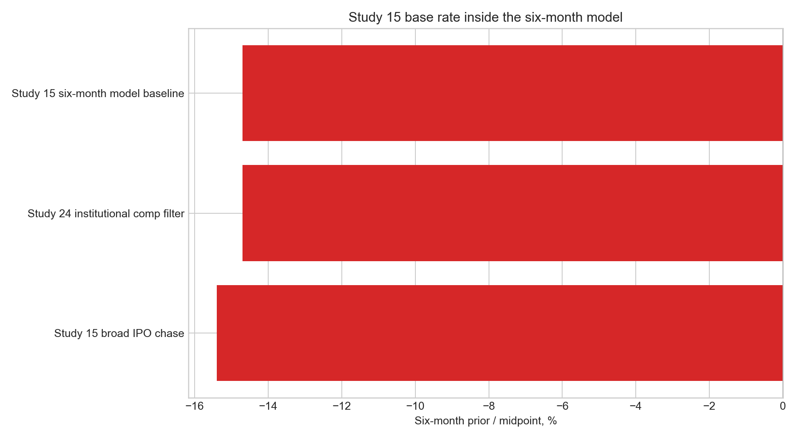

# 15 - IPO chase and six-month price-action model

**Question.** New listings are exciting and often "pop" on day one. If you chase them in the aftermarket - buying at the first day's close, the price retail can actually get - does it pay? And can that base rate become a reusable first-six-month scorecard for institutional-scale IPOs?

**Finding.** **No for broad IPO chasing; useful as a transparent scorecard for six-month setup work.** Across 760 US IPOs since late 2022, buying the day-1 close and holding one year delivered a median **-28.4% excess return versus SPY**, and only **19% of names beat the market**. At the six-month horizon, the broad IPO-chase prior was **-15.4% median excess versus SPY**, with only **25% beating SPY**. The six-month model keeps that harsh base rate, filters toward institutional-scale IPOs using Study 24, and then adjusts for offering mechanics, underwriters, holder/control risk, market setup, index flow, lock-up supply and business quality.

> Research / backtested. No live capital, no audited track record. Sample is the 2022-10-onward IPO vintage only - an unusual, mostly-poor cohort - so treat the magnitude as period-specific even though the direction matches decades of published IPO research. The six-month model is a scorecard, not a price oracle.

## Data & method

- **Base-rate sample:** 760 US IPOs priced since October 2022 with sufficient post-listing price history; entry filtered to >= $2 to exclude untradeable names.
- **Entry:** day-1 close. Offer allocations and first-day pops accrue to allocation holders, not aftermarket buyers.
- **Base-rate horizons:** absolute and SPY-excess returns at 30 / 60 / 90 / 180 / 365 days; win-rate, median, mean and share beating SPY; cut by vintage and sector.
- **Six-month model:** first listed close to roughly six months. Features use information known by IPO date or first close: offering size, float, lock-up pool, underwriters/stabilization proxy, holder/control risk, market setup, index-flow flags and business quality.
- **Validation:** the headline 365-day excess return carries a block-bootstrap 95% CI of **[-42.9%, -25.3%]**. The model also emits `validation_checks.csv` to guard against lookahead leakage.

## Claim 1 - The longer you hold the chase, the worse it gets

Win-rate stays near a coin flip in absolute terms, but the share beating SPY collapses from 39% at 30 days to 19% at one year.

| Horizon | n | % positive | Median | Mean | Median excess vs SPY | % beating SPY |
|---|---:|---:|---:|---:|---:|---:|
| 30d | 760 | 53.2% | +0.2% | -2.1% | -1.9% | 39% |
| 90d | 731 | 52.8% | +0.3% | -1.6% | -6.6% | 29% |
| 180d | 641 | 47.6% | -1.1% | -11.3% | **-15.4%** | **25%** |
| 365d | 474 | 45.6% | -4.1% | -16.2% | **-28.4%** | **19%** |

At one year the median IPO is down 4% outright and down 28% relative to simply owning the index. The mean is even worse because occasional winners cannot offset a long left tail of names that lost most of their value.


## Claim 2 - The base rate differs sharply by sector

The class average hides a sharp split. Stable-income listings and profitable software held up; biotech and the large micro-cap / unclassified bucket were the destroyers.

| Sector | n | % positive 90d | Median 90d | Median 365d | Six-month model action |
|---|---:|---:|---:|---:|---|
| Software / IT | 30 | 65.5% | +3.4% | **+9.1%** | Keep as a high-quality business analog when scale and disclosure pass. |
| Real Estate / REIT | 192 | 79.8% | +1.0% | **+4.9%** | Survivor bucket, but not a SpaceX valuation comp. |
| Biotech / Pharma | 53 | 32.1% | -13.0% | -30.3% | Exclude from the comp universe. |
| Industrials | 21 | 47.4% | -4.7% | -63.4% | Context only unless scale and underwriting pass. |
| Micro-cap / unclassified | 324 | 43.8% | -8.3% | -63.7% | Exclude from the comp universe. |

That is the merge logic: **Study 15 supplies the broad base rate and sector screen; Study 24 supplies the institutional-quality filter; this folder now turns both into the six-month IPO scorecard.**



## Six-month price-action scorecard

The model is intentionally simple:

```text
six-month prediction = IPO base prior
                     + business / IPO quality
                     + underwriter and stabilization quality
                     + index-flow and scarcity support
                     - lock-up supply risk
                     - holder/control risk
                     - valuation risk
```

Pre-listing, the public liquidity source is usually the bookrunner and stabilization disclosure, not true symbol-level market-maker identity. The model therefore uses **underwriters/stabilization agent as the liquidity-support proxy** and treats actual market-maker data as post-listing monitoring only.

| Output | Purpose |
|---|---|
| [study15_ipo_chase_base_rate](data/study15_ipo_chase_base_rate.csv) | Horizon base rates for 30 / 90 / 180 / 365 days. |
| [study15_sector_base_rate](data/study15_sector_base_rate.csv) | Sector base rates and six-month quality-screen actions. |
| [six_month_model_bridge](data/six_month_model_bridge.csv) | Reconciliation from broad IPO-chase prior to filtered six-month baseline. |
| [ipo_master](data/ipo_master.csv) | IPO universe, role, inclusion and data quality. |
| [ipo_price_targets](data/ipo_price_targets.csv) | Actual six-month targets when available. |
| [model_predictions](data/model_predictions.csv) | Six-month buckets, midpoint and beat-SPY/QQQ probabilities. |
| [spacex_prediction](data/spacex_prediction.csv) | SpaceX contribution bridge. |
| [feature_dictionary](data/feature_dictionary.csv) | Feature definitions, source table and no-lookahead status. |

Workbook: [ipo_six_month_price_action_model.xlsx](ipo_six_month_price_action_model.xlsx)

## SpaceX worked example

| Factor | Contribution | Read |
|---|---:|---|
| Base prior | -14.7 pts | Study 15 broad 180-day excess was -15.4%; filtered institutional IPO comp median was -14.7%. |
| Business / IPO quality | +5.0 pts | Strong business and offering quality, but governance lowers the score. |
| Underwriters / liquidity support | +6.0 pts | Goldman Sachs and Morgan Stanley-led global book; Morgan Stanley stabilization proxy. |
| Nasdaq / index flow | +9.0 pts | Nasdaq-100 fast-entry path can create forced demand. |
| Float scarcity | +4.0 pts | Immediate float is only about 4.25% of basic shares. |
| Market setup | 0.0 pts | 2026 mega-IPO setup is treated as neutral/frothy. |
| Unlock risk | -12.0 pts | Potential tradable supply reaches about 9.4x IPO float by day 180. |
| Holder / control risk | -7.5 pts | Musk voting control about 84.4%; Class B voting power 88.5%. |
| Valuation risk | -10.0 pts | About $1.77tn implied basic market cap and high sales multiple. |
| **Model output** | **-20.2%** | Negative bucket; trade-only / wait-for-unlock bias. |


The model does not try to forecast exact closing prices. It produces a six-month bucket, midpoint and probability of beating SPY/QQQ.

| Ticker | Prediction bucket | Midpoint | Beat SPY | Beat QQQ | Actual 6m return if known |
|---|---|---:|---:|---:|---:|
| SPCX | Negative | -20.2% | 22.4% | 18.4% | n/a |
| V | Range-bound | +4.0% | 41.6% | 37.6% | +13.6% |
| META | Negative | -12.9% | 31.6% | 27.6% | -40.0% |
| UBER | Negative | -17.1% | 23.1% | 19.1% | -34.1% |
| ABNB | Negative | -14.6% | 26.0% | 22.0% | +3.1% |
| ARM | Negative | -12.1% | 29.6% | 25.6% | +99.7% |
| SNOW | Negative | -23.8% | 17.8% | 13.8% | -14.7% |
| RIVN | Severe fade | -32.2% | 14.1% | 10.1% | -75.9% |
| CRWD | Range-bound | -6.1% | 29.8% | 25.8% | -18.0% |
| DDOG | Range-bound | -8.4% | 27.6% | 23.6% | -11.1% |


ARM is the obvious exception: it screened as negative because of controlled-company/float/valuation risk, then produced a very strong six-month move. That is why the output is a bucket and probability, not a certainty.

## Answer

**Should you chase IPOs at the open for a one-year hold? No.** The base rate is roughly -28% versus SPY with only a one-in-five chance of beating the index.

**Can the same IPO research stack help with six-month IPO decisions? Yes, as a structured scorecard.** Start with the negative six-month IPO-chase prior, exclude the low-quality/noisy buckets, and then explicitly score float scarcity, lock-up supply, underwriters, index flow, holder control, valuation and business quality.

## Caveats

- **Period.** Coverage starts 2022-10, an unusual and mostly-poor IPO vintage. The direction is consistent with decades of academic work, but the -28% magnitude is specific to this window.
- **No offer price.** Offer prices were not available for the broad chase table, so entry is the day-1 close rather than allocation price.
- **Curated model set.** The six-month model uses a curated institutional IPO set plus SpaceX, not a full EDGAR-scale scrape.
- **No lookahead.** Six-month realized returns and post-IPO 13F holder data are targets/monitoring fields, not IPO-day prediction features.
- **Small sub-samples.** Sector and vintage cells are thin; read those as directional, not precise.

## Rebuild

```bash
python3 15-ipo-chase/build_model.py
```

## References

- Ritter, J. *Initial Public Offerings: Updated Statistics* (University of Florida).
- Loughran & Ritter (1995). The New Issues Puzzle. *Journal of Finance.*
- Greenwood & Sammon. *The Disappearing Index Effect.*
- [Study 02 - IPO-anchored VWAP](../02-ipo-anchored-vwap/)
- [Study 22 - Equity issuance as a market-top signal](../22-equity-issuance-top-signal/)
- [Study 24 - SpaceX IPO quality model](../24-spacex-ipo-quality-model/)
