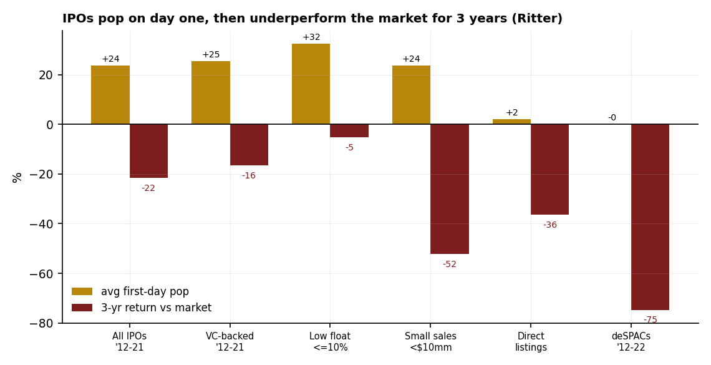

# 15 — Should you chase IPOs? First-day pop, then years of underperformance

**Question.** New listings are exciting and often "pop" on day one. Does buying IPOs — in the aftermarket, as a retail investor — actually pay over the following years?

**Finding.** **No.** Across thousands of US IPOs (Jay Ritter's dataset), the average first-day pop is large (≈ +24% for 2012–21) but the *three-year* return is **−21.6% versus the market**. The worst cohorts — tiny-revenue deals (−52%) and de-SPACs (−75%) — are exactly the ones retail can actually buy. And the old "get in before index inclusion" trade has decayed to roughly **zero**.

> Reference study. First-day and long-run buy-and-hold figures from Jay Ritter (University of Florida) IPO statistics; three-year returns are market-adjusted (vs the CRSP value-weighted index). No live capital.

## Data & method

- **Source:** Jay Ritter's *Initial Public Offerings: Updated Statistics* — first-day return and three-year buy-and-hold market-adjusted return by cohort (2012–21 issuance; de-SPACs 2012–22).
- **Index effect:** Greenwood & Sammon, *The Disappearing Index Effect.*

## Claim 1 — Pop on day one, lag the market for three years

| Cohort | n | first-day pop | 3-yr vs market |
|---|---|---|---|
| All IPOs '12–21 | 1,479 | +23.6% | −21.6% |
| VC-backed '12–21 | 909 | +25.4% | −16.5% |
| Low float ≤10% | 186 | +32.4% | −5.3% |
| Small sales <$10mm | 1,739 | +23.6% | −52.3% |
| Direct listings | 12 | +2.1% | −36.4% |
| de-SPACs '12–22 | 451 | −0.0% | −74.7% |

## Claim 2 — The pop is mostly unreachable; the underperformance is not

The first-day pop accrues to allocation holders at the *offer* price — which retail rarely gets. Buying in the aftermarket (the realistic path) means paying the popped price and then riding the multi-year fade. The lowest-float deals pop hardest (+32%) precisely because float is scarce — a microstructure squeeze, not a quality signal.

## Claim 3 — The index-inclusion trade has died

The classic "buy before S&P / Nasdaq inclusion" pop has faded from roughly **+7% abnormal return in the 1990s to under +1% in 2010–20** (Greenwood-Sammon), as passive AUM made the event crowded and pre-positioned. Nasdaq's 2026 "fast-entry" rule (a large IPO can enter the Nasdaq-100 after roughly 15 trading days) and its 2025 listing-standard tightening (higher public-float minimums) further compress any inclusion edge.

## Claim 4 — What to do instead

Don't chase the open. If a name interests you, let the lock-up expire and the float normalize, judge it on fundamentals once there is public trading history, and treat the first-day pop as someone else's allocation rather than your edge. As a class, IPOs are a sell-the-pop, not a buy-and-hold; regime and cohort (size, float, vintage) dominate, and the occasional positive headline is outlier-driven.

## Caveats

Returns are buy-and-hold from the first close (not the offer price) and market-adjusted versus the CRSP value-weighted index; cohorts overlap (a deal can be both VC-backed and small-sales). Survivorship is handled in Ritter's construction. This is a base-rate statement about the class — individual names vary widely.

## References

- Ritter, J. *Initial Public Offerings: Updated Statistics* (University of Florida).
- Loughran & Ritter (1995). The New Issues Puzzle. *Journal of Finance.*
- Greenwood & Sammon. *The Disappearing Index Effect.*
