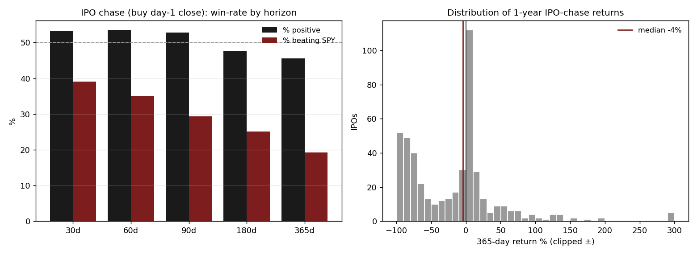

# 15 — Chasing IPOs loses to the market by ~28% a year

**Question.** New listings are exciting and often "pop" on day one. If you chase them on the tape — buying at the first day's close, the price retail can actually get — does it pay over the next year?

**Finding.** **No.** Across 760 US IPOs since late 2022, buying the day-1 close and holding one year delivered a median **−28.4% excess return versus SPY**, and only **19% of names beat the market**. The chase is a base-rate loser; the only buckets that survived were REITs and profitable software, while biotech and sub-dollar micro-caps were wealth destroyers.

> Research / backtested. No live capital, no audited track record. Sample is the 2022-10-onward IPO vintage only — an unusual, mostly-poor cohort — so treat the magnitude as period-specific even though the direction matches decades of published IPO research.

## Data & method

- **Sample:** 760 US IPOs priced since October 2022 with sufficient post-listing price history (entry filtered to ≥ $2 to exclude un-tradeable names).
- **Entry:** day-1 close — you can't get the offer allocation, so you chase it on the tape. The first-day pop accrues to allocation holders, not to you.
- **Tested:** absolute and SPY-excess returns at 30 / 60 / 90 / 180 / 365 days; win-rate, median, mean, and share beating SPY at each horizon. Cut by vintage and by sector.
- **Validation:** the headline 365-day excess return carries a block-bootstrap 95% CI of **[−42.9%, −25.3%]** — firmly negative, never crossing zero. The result reproduces Ritter's long-run IPO-underperformance puzzle on an independently assembled name-level sample.

## Claim 1 — The longer you hold the chase, the worse it gets

Win-rate stays near a coin-flip in absolute terms but the share beating SPY collapses monotonically with horizon — from 39% at 30 days to 19% at one year.

| Horizon | n | % positive | Median | Mean | Median excess vs SPY | % beating SPY |
|---|---|---|---|---|---|---|
| 30d | 760 | 53.2% | +0.2% | −2.1% | −1.9% | 39% |
| 90d | 731 | 52.8% | +0.3% | −1.6% | −6.6% | 29% |
| 180d | 641 | 47.6% | −1.1% | −11.3% | −15.4% | 25% |
| 365d | 474 | 45.6% | −4.1% | −16.2% | **−28.4%** | **19%** |

At one year the median IPO is down 4% outright and down 28% relative to simply owning the index. The mean is even worse (−34.4%) because the right tail of occasional winners cannot offset a long left tail of names that lost most of their value.

## Claim 2 — "IPOs lose" is really "everything except REITs and software loses"

The class average hides a sharp split. Stable-income listings (REITs) and profitable software held up; biotech and the large "micro-cap / unclassified" bucket were the destroyers.

| Sector | n | win 90d | Median 90d | Median 365d |
|---|---|---|---|---|
| Software / IT | 30 | 65.5% | +3.4% | **+9.1%** |
| Real Estate / REIT | 192 | 79.8% | +1.0% | **+4.9%** |
| Biotech / Pharma | 53 | 32.1% | −13.0% | −30.3% |
| Industrials | 21 | 47.4% | −4.7% | −63.4% |
| Micro-cap / unclassified | 324 | 43.8% | −8.3% | −63.7% |

Vintage matters too: the 2023 cohort was brutal (−53.5% median at one year), 2024 was −13.2%, and the 2025–26 listings are still too young to judge (positive medians, but small one-year samples).

## Answer

**Should you chase IPOs at the open for a one-year hold? No.** The base rate is roughly −28% versus SPY with only a one-in-five chance of beating the index, and the bootstrap CI never touches zero. If you must participate, the only survivable buckets historically were REITs and profitable software — not biotech and not sub-dollar micro-caps. As a class, IPOs are a sell-the-pop, not a buy-and-hold.

## Caveats

- **Period.** Coverage starts 2022-10, an unusual and mostly-poor IPO vintage. The direction is consistent with decades of academic work, but the −28% magnitude is specific to this window.
- **No offer price.** Offer prices were not available, so there is no first-day-pop cut; entry is the day-1 close (the realistic retail path) rather than the allocation price.
- **Survivorship.** Price coverage of delisted names is imperfect; missing dead names would make the true result *worse*, not better — so the finding is, if anything, conservative.
- **Small sub-samples.** Sector and vintage cells (e.g. Software n=30, 2022 n=9) are thin; read those as directional, not precise.

## References

- Ritter, J. *Initial Public Offerings: Updated Statistics* (University of Florida) — for the long-run underperformance benchmark this sample reproduces.
- Loughran & Ritter (1995). The New Issues Puzzle. *Journal of Finance.*
- Greenwood & Sammon. *The Disappearing Index Effect* — context on why the related "buy before index inclusion" trade has decayed toward zero.
