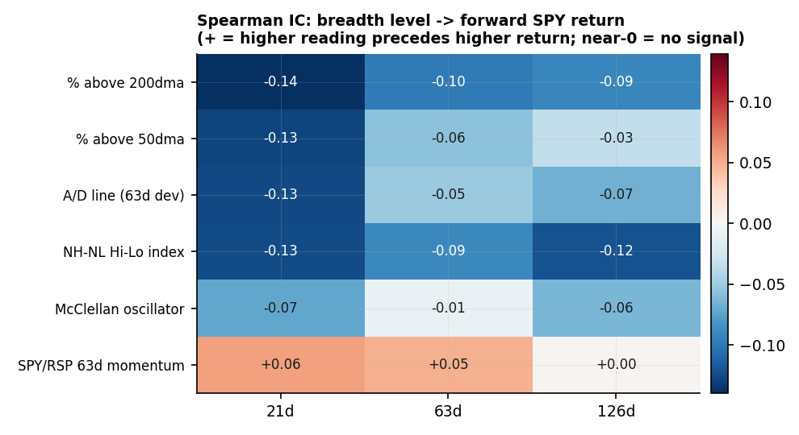
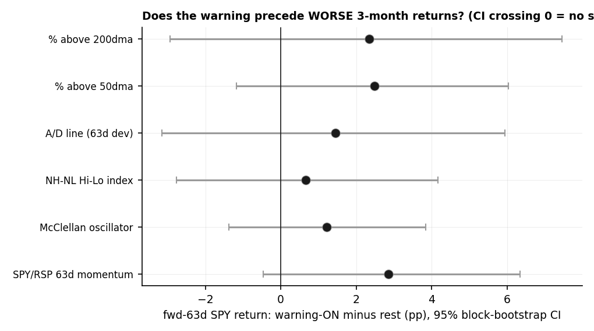
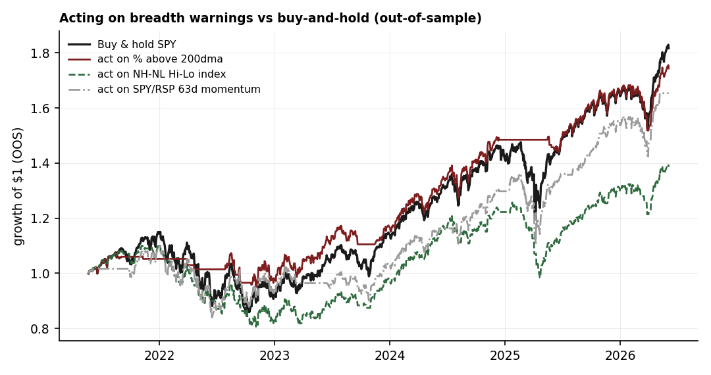

# 16 — No popular breadth warning survives an honest test

**Question.** Narrow leadership, a weak advance-decline line, the McClellan oscillator rolling over, new-high/new-low deterioration, cap-over-equal momentum, a bearish A/D divergence — does *any* of the breadth "warnings" that get cited every cycle actually predict forward S&P returns? **Answer: no.** Across the whole battery, the signs are mostly the *opposite* of the folklore, the magnitudes are economically small, and every conditional difference has a confidence interval that crosses zero.

> Research / backtested. No live capital, no audited track record. The one faint residue (a de-risking overlay) rests on a single crash, so it cannot be called a robust, repeatable edge.

## Data & method

- **Sample.** ~10 years of daily data (2016–2026, current to 2026-06). Forward returns measured on the S&P at 21 / 63 / 126-day horizons. Breadth gauges built from a broad liquid-name panel; index-level momentum from a cap-weight-vs-equal-weight pair.
- **Indicators tested** (each oriented so a *low* reading is the bearish warning): % of stocks above their 200-day average, % above 50-day, advance-decline line, new-high/new-low index, McClellan oscillator, cap-vs-equal-weight 63-day momentum, and the classic A/D-line bearish-divergence event (price at a 20-day high while the A/D line is not).
- **Tests.** (a) Spearman information coefficient of each level vs forward return; (b) conditional forward return when the warning is on (bottom-quintile reading) vs the rest, with a **95% block-bootstrap CI** on the difference to handle overlapping windows; (c) a **walk-forward, no-look-ahead out-of-sample** overlay that goes to cash on warning days, benchmarked against buy-and-hold.

## Claim 1 — The breadth level points the *wrong way* (or nowhere)

If "narrow breadth is a warning," a *high* breadth reading should precede *higher* returns. It does the opposite, weakly: the information coefficients for every breadth gauge are tiny and **negative** — high breadth weakly precedes *lower* forward returns, because breadth is high precisely when the market has already run. The only positive-IC series is cap-vs-equal momentum, and it is near zero. None of these is a usable directional signal.

| Indicator | IC 21d | IC 63d | IC 126d |
|---|---:|---:|---:|
| % above 200dma | −0.14 | −0.10 | −0.09 |
| % above 50dma | −0.13 | −0.06 | −0.03 |
| A/D line (63d dev) | −0.13 | −0.05 | −0.07 |
| NH-NL Hi-Lo index | −0.13 | −0.09 | −0.12 |
| McClellan oscillator | −0.07 | −0.01 | −0.06 |
| Cap-vs-equal 63d momentum | +0.06 | +0.05 | +0.00 |

## Claim 2 — When the warning is ON, forward returns are if anything *higher* — and never significant

Conditioning on the warning being on (bottom-quintile reading), the 63-day forward S&P return is on average **higher** than the rest of the sample, not lower — the diffs are *positive*. And every single one is statistically insignificant: the 95% block-bootstrap CI on the warning-minus-rest difference crosses zero in all six cases. The warnings do not even point the right way, let alone clear the bar.

| Indicator (warning = low reading) | n_warn | % positive | mean fwd 63d | vs rest | diff [95% CI] | significant? |
|---|---:|---:|---:|---:|---:|:--|
| % above 200dma | 473 | 68.5% | +5.2% | +2.9% | +2.3pp [−2.9, +7.5] | No (ns) |
| % above 50dma | 475 | 73.9% | +5.3% | +2.9% | +2.5pp [−1.2, +6.0] | No (ns) |
| A/D line (63d dev) | 483 | 69.4% | +4.5% | +3.1% | +1.4pp [−3.2, +5.9] | No (ns) |
| NH-NL Hi-Lo index | 453 | 68.2% | +3.9% | +3.2% | +0.7pp [−2.8, +4.2] | No (ns) |
| McClellan oscillator | 487 | 76.4% | +4.3% | +3.1% | +1.2pp [−1.4, +3.8] | No (ns) |
| Cap-vs-equal 63d momentum | 474 | 81.6% | +5.7% | +2.8% | +2.9pp [−0.5, +6.3] | No (ns) |

The much-cited A/D-line bearish-divergence *event* (price at a 20-day high while the A/D line is not) fares no better — its forward return is statistically indistinguishable from an ordinary day at every horizon (63d: +2.8% on event days vs +3.3% on all days, diff −0.6pp [−2.3, +1.2], ns).

## Claim 3 — Acting on the warnings loses to just holding the index

The honest test is out-of-sample: go to cash on warning days, walk forward, compare to buy-and-hold. **Five of six** overlays make both Sharpe and total return *worse* than simply holding the index. Only the %above-200dma overlay improves risk-adjusted return — and that one fails the robustness check (see Caveats).

| Overlay (cash on warning days) | Sharpe (strat vs B&H) | Max drawdown (strat vs B&H) | CAGR (strat vs B&H) |
|---|---:|---:|---:|
| % above 200dma *(only residue, see caveat)* | 1.06 vs 0.78 | −12% vs −25% | +11.7% vs +12.7% |
| % above 50dma | 0.96 vs 0.78 | −20% vs −25% | +11.2% vs +12.7% |
| A/D line (63d dev) | 0.76 vs 0.78 | −30% vs −25% | +8.8% vs +12.7% |
| NH-NL Hi-Lo index | 0.57 vs 0.78 | −27% vs −25% | +6.7% vs +12.7% |
| McClellan oscillator | 0.33 vs 0.78 | −26% vs −25% | +3.7% vs +12.7% |
| Cap-vs-equal 63d momentum | 0.71 vs 0.78 | −23% vs −25% | +10.6% vs +12.7% |

## The answer, in the data

| Question | Answer | Proof |
|---|---|---|
| Does a low breadth reading predict lower forward returns? | **No — wrong sign** | breadth ICs all ≤ 0; high breadth weakly precedes *lower* returns |
| When the warning is on, are forward returns worse? | **No — if anything higher, never significant** | 63d diffs all positive; every 95% CI crosses 0 |
| Does the bearish A/D-divergence event carry an edge? | **No** | event vs all-days diff ≈ 0 at 21/63/126d, all ns |
| Can you trade these warnings profitably? | **No** | 5 of 6 OOS overlays beaten by buy-and-hold |

**Verdict: NO.** The popular breadth warnings do not work as directional signals on forward S&P returns in this sample — wrong sign, tiny magnitude, no significance. The single thing that looks helpful (% above 200dma as a *de-risking* overlay, not a directional bet) is one-crash evidence that largely duplicates plain price-trend-following and has no significance test behind it. Concentration / narrow leadership is a **risk-management** matter — own the exposure knowingly, size positions — not a market-timing signal.

## Caveats

1. **The one residue is one-crash evidence.** The %above-200dma de-risking benefit is concentrated in a single bear market: the in-cash days cluster overwhelmingly in 2022 (172 days, vs 38 in 2023 and 14 in 2024). Re-running the overlay with 2022 excluded collapses the edge — the Sharpe gap shrinks from +0.28 to a negligible +0.09 — and there is no significance test on a sample of essentially one drawdown. It cannot be called a repeatable overlay.
2. **It is mostly trend-following, not a distinct breadth edge.** A dumb price-only rule (cash when the index is below its own 200-day average) gets a comparable Sharpe with no breadth panel at all, and overlaps the breadth overlay's risk-off days heavily. Both rules are really just "step aside in a sustained downtrend"; the breadth panel adds little.
3. **Survivorship bias overstates past breadth.** The breadth panel is a survivor roster backfilled in time, with essentially no delistings before 2024 — a true point-in-time panel would show a steady trickle of failures. This makes breadth (especially new-low counts) look *better* in past busts than it really was, so the bias works *for* the warnings and still leaves them with no edge; a clean panel would only weaken them further.
4. **Overlapping-window inference is anti-conservative.** Forward windows overlap across adjacent days, so the effective sample is far smaller than the row counts and ordinary significance stars overstate significance. The block-bootstrap CIs partly correct for this — and they already cross zero. The honest p-values are *larger* than nominal, which deepens the null.
5. **Single index, limited regime mix.** Forward returns are measured on one index over one ~10-year window (2016–2026) that contains only a handful of true bear episodes (2018Q4, 2020, 2022), all relatively V-shaped. Absence of evidence here is strong but is not a claim that breadth is useless across all future regimes — especially a 2000- or 2008-style grinding bear.

## References

- Welch & Goyal (2008, RFS; 2024 update). *A Comprehensive Look at the Empirical Performance of Equity Premium Prediction* — most timing predictors fail out-of-sample.
- Faber (2013); Moskowitz, Ooi & Pedersen (2012, JFE). Trend / time-series momentum for drawdown control (the price-only benchmark in Caveat 2).
- Bessembinder (2018, JFE). *Do stocks outperform Treasury bills?* — extreme concentration of returns is the historical norm, not an anomaly.
- Hindenburg-Omen reliability studies (~20% accuracy, false-positive-prone) and breadth research showing breadth predicts the *cross-section*, not index timing.
- General market-technician sources for the canonical breadth gauges (advance-decline line, McClellan oscillator, new-high/new-low index); concentration-as-risk framing from broad industry commentary, used for context only.
