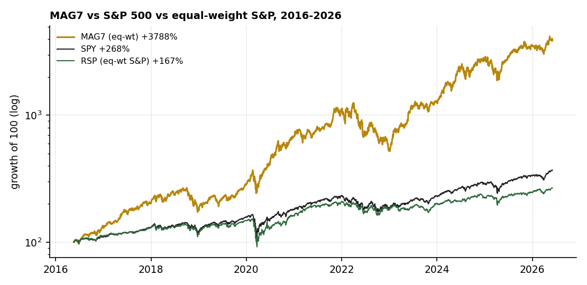
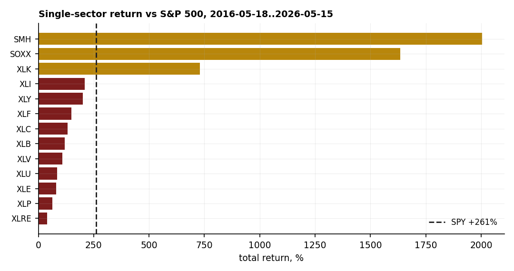
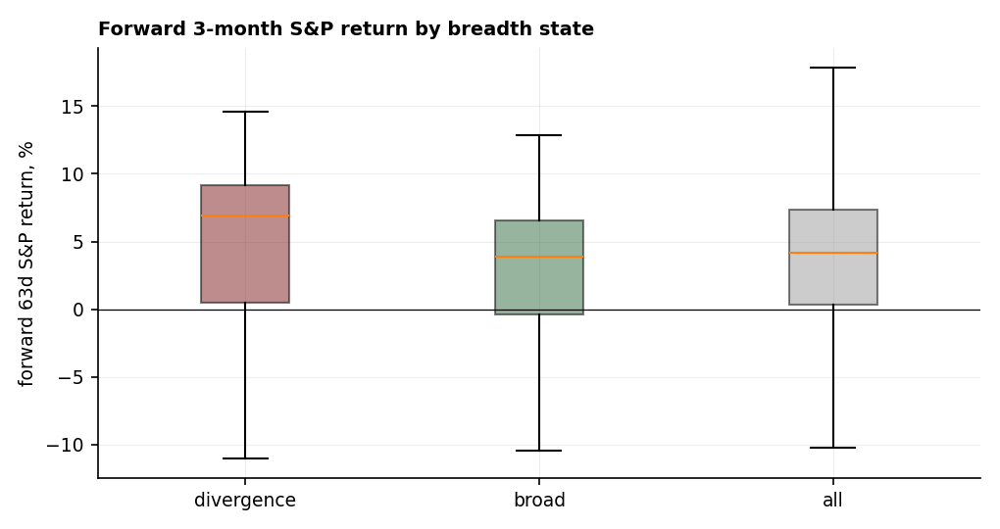
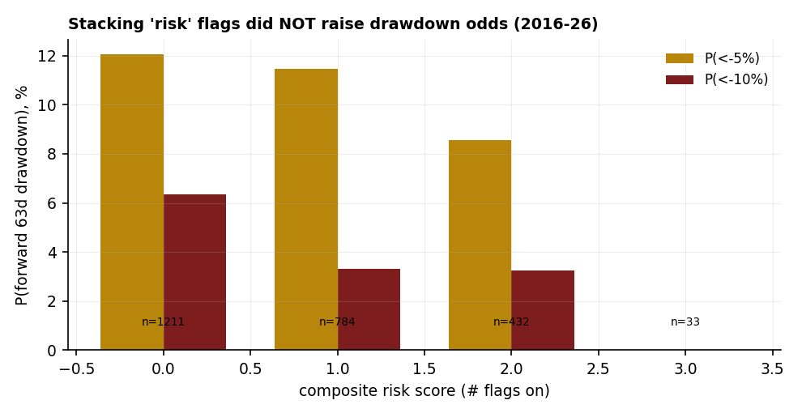
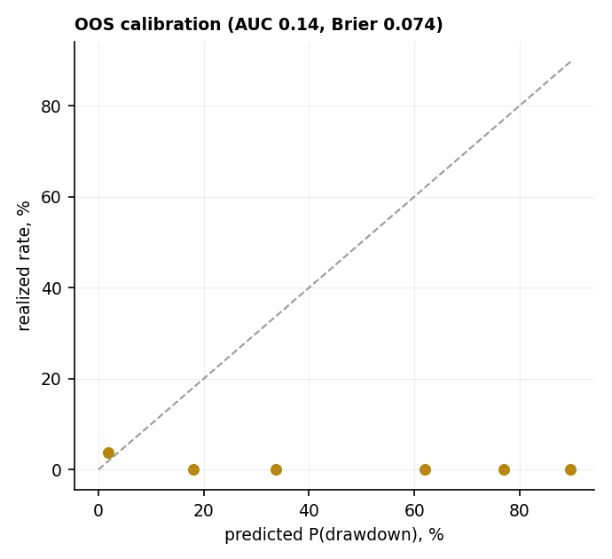

# 16 — Narrow leadership and the index: does concentration predict the market?

**Question.** When a handful of mega-caps carry the index — MAG7 outrunning the market, one sector dominating, breadth thinning while price makes new highs — is that bullish, bearish, or just noise for forward returns?

**Finding.** Mostly noise. Concentration is a **risk-management** issue, not a **timing** signal. Tested three ways over 10 years (2016–2026, current to 2026-06-03): (1) MAG7 relative strength has **no forward-predictive edge** for the index (3-month IC +0.01, bootstrap CI [−0.20, +0.22]); (2) betting on a single sector beats the index only **3 times in 13**, with **zero winner-persistence**; (3) "index near highs while most stocks sit below their 200-day trend" is **not bearish** — forward returns ran *slightly higher* than baseline (not significant), and a model stacking the canonical recession/drawdown flags **failed out-of-sample** (AUC 0.14, Brier worse than the base rate). A textbook Goyal-Welch result.

> Research / backtested. Daily data 2016–2026 (current to 2026-06-03) from a ~24,700-ticker warehouse; breadth from a 2,312-name liquid universe; macro from US Treasury + CBOE + FRED. Block-bootstrap CIs, walk-forward out-of-sample, calibration. No live capital, no costs.

## Data & method

- **Prices:** SPY / QQQ / RSP + MAG7 + 13 sector/semis ETFs, 10 years. **Breadth:** % of 2,312 liquid names above their own 200-day SMA. **Macro flags, each with an academic anchor:** trend (price < 200-day MA — Faber; Moskowitz-Ooi-Pedersen), yield-curve term spread 10y−3m (Estrella-Mishkin), credit spread (HY OAS — Gilchrist-Zakrajšek, recent-window only), breadth divergence.
- **Discipline:** features are point-in-time (no look-ahead); overlapping forward windows handled with a 63-day **block-bootstrap**; the drawdown model uses **walk-forward out-of-sample** + a calibration check; every conditional result is shown against the unconditional base rate.

## Claim 1 — MAG7 leadership doesn't predict the index

MAG7 (equal-weight) returned **+3,788%** over the decade versus the S&P's +268% — but its *relative strength* carries no forward signal: the 3-month information coefficient of MAG7-RS vs forward S&P return is **+0.01** (bootstrap 95% CI [−0.20, +0.22]; top-minus-bottom quintile +0.1pp, t 0.2). A strong −0.49 reading on a 2-year window evaporated on the full decade — it was a 2024–25 regime artifact, not a law.

## Claim 2 — One sector: huge upside if right, but the index wins the base rate

Over 10 years only **3 of 13** sectors beat the S&P (SMH +2,005%, SOXX, XLK); the *average* sector trailed on risk-adjusted return (Sharpe **0.61 vs 0.81**). The best-minus-worst single-window spread is wide (+32 / −25pp at 12 months), but winner **persistence is ~zero** (quarter-to-quarter rank IC +0.04) — the upside is a timing bet, not a capturable edge.

## Claim 3 — "Narrow at highs" is not bearish (it cries wolf)

Conditioning on the divergence state — S&P within 5% of its 52-week high while **more than half of stocks are below their 200-day MA** (124 such days) — forward returns were *slightly higher* than baseline, not lower: 3-month **+4.0% vs +3.3%** base (median +6.9% vs +4.2%), and forward drawdown was identical (−4.9% vs −4.5%). The block-bootstrapped mean-difference is **not significant** at any horizon (3-month +0.7pp, 95% CI [−4.1, +3.5]). This matches the Hindenburg-Omen evidence (~20% accuracy, false-positive-prone) and the "narrow markets aren't a bad omen" research.

## Claim 4 — Stacking the canonical risk flags failed out-of-sample

Counterintuitively, the *more* risk flags that were on (trend-below-200, curve-inverted, breadth-divergent, VIX-elevated), the **lower** the forward drawdown rate — because those flags fire near oversold lows, not tops. A walk-forward logistic model for P(S&P down >10% over 3 months) **underperformed the base rate** out-of-sample (Brier 0.074 vs 0.034; **AUC 0.14** — the in-sample relationship inverted). This is the Goyal-Welch lesson made concrete: most timing predictors do not survive honest out-of-sample testing.

## The answer, in the data

| Question | Answer | Proof |
|---|---|---|
| Does MAG7 leadership predict the index? | **No** | 3m IC +0.01, boot CI [−0.20, +0.22] |
| Is one sector worth concentrating in? | **No — a timing bet** | 3/13 beat S&P; avg Sharpe 0.61 < 0.81; persistence +0.04 |
| Index up + majority below trend — bearish? | **No — a false alarm** | fwd 3m +4.0% vs +3.3% base; diff ns |
| Can a model time drawdowns off these signals? | **No — fails OOS** | AUC 0.14; Brier 0.074 vs 0.034 base |

**Verdict: narrow breadth / concentration is a risk-management concern, not a market-timing signal.** Own the exposure knowingly — diversify, size positions — but don't sell the index *because* leadership is narrow. On a decade of data, that's a false alarm.

## How to read this (and why "narrow-market" warnings cry wolf)

A state with a scary name only matters if it beats the **unconditional base rate** — the market is up ~75% of 3-month windows regardless, so a bearish signal has to do better than that, and "narrow at highs" doesn't. Overlapping daily windows make ordinary t-stats look far more significant than they are, so we use a **block-bootstrap**. And the real test of any timing rule is **out-of-sample** (fit on the past, predict the untouched future) with a **calibration** check — the bar Goyal-Welch showed most published predictors fail. A handful of historical "analogs" is a story, not a probability, until it has the sample size and confidence interval to back it.

## Current reading (2026-06-03)

S&P near highs, breadth **57% above the 200-day** (so *not* a divergence today), yield curve un-inverted (+0.69), VIX ~16, composite risk score 0 — benign on this framework. The only mild caution: the 20 nearest historical analogs to today's full macro/breadth state averaged −4% over the next quarter (n=20, low confidence).

## Caveats

The breadth/MAG7 window is 10 years and **recovery-heavy** — it spans 2018, 2020 and 2022, all V-shaped, but not a 2000- or 2008-style grinding bear, so "distress flags marked buying opportunities" may be regime-specific. Full-universe breadth exists only from 2016; the credit spread is recent-window only. The divergence sample is 124 (overlapping) days. This is a base-rate framework, not a forecast.

## References

- Welch & Goyal (2008, RFS; 2024 update). *A Comprehensive Look at the Empirical Performance of Equity Premium Prediction* — most predictors fail out-of-sample.
- Estrella & Mishkin (1996, 1998). The yield curve as a recession predictor (the NY Fed model).
- Gilchrist & Zakrajšek (2012, AER). *Credit Spreads and Business Cycle Fluctuations* (the excess bond premium).
- Faber (2013); Moskowitz, Ooi & Pedersen (2012, JFE). Trend / time-series momentum for drawdown control.
- Bessembinder (2018, JFE). *Do stocks outperform Treasury bills?* — concentration of returns is the historical norm.
- Hindenburg-Omen reliability studies (~20% accuracy); "Market breadth and the cross-section of global equity returns" (breadth predicts the cross-section, not index timing).
- Community: r/stocks & r/investing (equal-weight vs MAG7 debate); VanEck and Commonfund framing narrow leadership as a concentration risk, not a timing signal.
