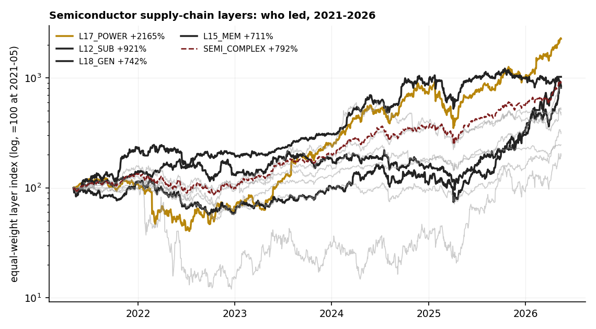
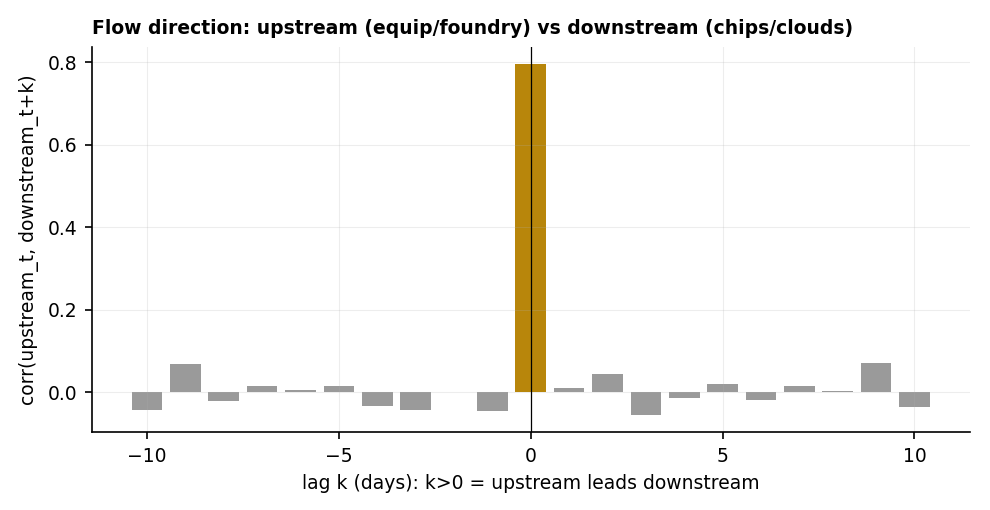
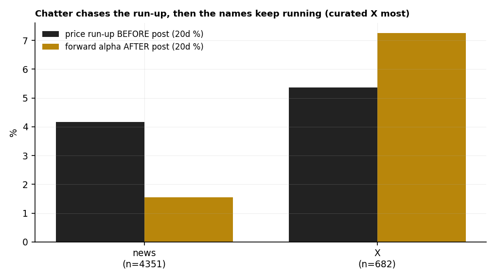
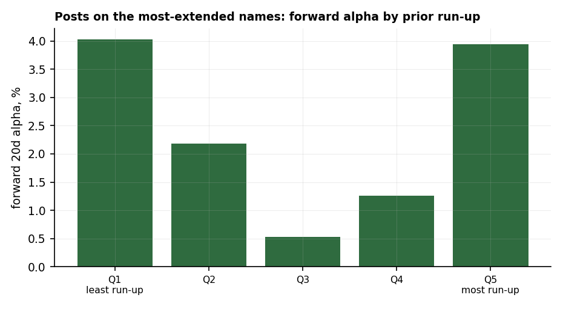

# 17 — Semiconductor supply-chain layers: who leads, how money flows, and does price drive the chatter?

**Question.** Slice the semiconductor complex into its **supply-chain layers** — hyperscalers, fabless, foundry, equipment, memory, substrate, ODM, power/cooling, power-gen, neoclouds — and ask three things: which layer *leads*, how does capital *rotate* across them, and when you overlay news / X / Reddit, does **price drive the discussion or the discussion drive price**?

**Finding.** Three answers on 2021–2026 data: (1) **leadership rotates around the chain's *periphery*** — power/cooling (**VRT +2,165%**), substrate, power-gen and memory led, while the famous **hyperscalers (+146%) and foundry (+211%) lagged**; (2) the layers **co-move — there's no tradable lead-lag** up or down the chain (upstream vs downstream peaks at lag 0, corr +0.80; Granger ≈ 0 both ways); (3) **price drives the chatter** — posts cluster *after* run-ups (+3–22% prior; curated-X experts post on names already **+35% above their 200-day MA**), but the discussed names keep running (**+2.4% forward 20-day alpha; +7.3% for curated X**) — attention *rides momentum*, it doesn't predict reversals.

> Research / backtested. Layer map from a supply-chain graph; equal-weight layer price indices (US + Taiwan), 2021–2026; ~9k X + 5k news + (thin) Reddit posts, each carrying the ticker's run-up / RSI / %-above-200d **at post time** plus forward 5/20-day alpha vs SPY. Fabricated `x_kimi` excluded. No live capital; data sourced at **$0** (internal warehouse).

## Data & method

- **Layers** (members, US via daily bars + Taiwan via TWSE): HYPER (AMZN/GOOGL/META/MSFT), L3 fabless (NVDA/AMD/AVGO/MRVL/QCOM/MediaTek), L6 equipment (AMAT/ASML/KLAC/LRCX), L7 foundry (TSM/INTC), L12 substrate (Unimicron), L14 ODM (Hon Hai/Quanta/Wiwynn/SMCI), L15 memory (Micron), L16 neoclouds (APLD/CRWV/NBIS), L17 power/cooling (Vertiv), L18 power-gen (CEG/VST). Equal-weight daily-return indices.
- **Social/news:** ticker-tagged posts (news / X-curated-analysts / Reddit) joined to each ticker's post-time technical state and forward alpha — the **reactive-vs-predictive** test.

## Claim 1 — Leadership rotates around the periphery, not the famous names

Over 2021–2026 the **picks, shovels and *electricity*** of the AI build-out led; the obvious mega-caps lagged.

| Layer | Total return | | Layer | Total return |
|---|---:|---|---|---:|
| L17 power/cooling | **+2,165%** | | L6 equipment | +414% |
| L12 substrate | +921% | | L14 ODM | +360% |
| L18 power-gen | +742% | | L7 foundry | +211% |
| L15 memory | +711% | | HYPER hyperscalers | +146% |
| L3 fabless | +699% | | L16 neoclouds | +94% |

Quarter-to-quarter the *leader* cycles through the periphery — substrate → power → neoclouds → ODM → memory — rarely the famous fabless. **Currently** (3-month relative strength): substrate (+62), memory (+38), fabless (+27) lead; hyperscalers (−23) and power-gen (−51) lag.

## Claim 2 — The layers co-move; no tradable lead-lag up or down the chain

Do equipment/foundry (upstream) lead fabless/hyperscalers (downstream), or vice versa? Neither. Their daily returns peak in correlation **at lag 0 (+0.80)**, and a Granger-style test is symmetric and negligible (extra-R² ≈ 0.003 both directions). A common AI-capex factor moves the whole chain together; leadership shows up in *magnitude* (who outperforms), not in *timing* (who moves first) — consistent with an efficient, well-understood supply chain.

## Claim 3 — Price drives the chatter — and the chatter rides momentum

The discussion is **reactive**: posts arrive *after* a run-up (+4.2% prior 20-day for news, +5.4% for X — on names already **+35% above their 200-day MA**). But it isn't a dead end — the discussed names keep outperforming: forward 20-day alpha **+1.5% (news), +7.3% (curated X)** (t = 11.5, 68% positive). So **price leads attention, and attention then rides continued momentum** (Da-Engelberg-Gao) rather than signalling a top. Layer exceptions: hyperscaler (−1.2%) and power-gen (−5.1%) chatter preceded mild *under*performance.

## The answer, in the data

| Question | Answer | Proof |
|---|---|---|
| Which layer leads? | **The periphery** (power / substrate / memory / neoclouds) — not hyperscaler/foundry | VRT +2,165% vs HYPER +146% |
| Does money flow up or down the chain? | **Neither — the layers co-move** | corr +0.80 at lag 0; Granger ≈ 0 both ways |
| Price → chatter, or chatter → price? | **Price → chatter** (reactive), which then rides momentum | posts after +3–22% run-up; +2.4% (X +7.3%) forward alpha |

**Verdict:** to read the semis, watch the *periphery* (power, substrate, memory) for leadership, treat the layers as one co-moving complex (no chain-timing edge), and read social/news as **confirmation of momentum, not a leading or contrarian signal** — the curated expert accounts are the ones whose discussed names keep running.

## How to read this (reactive vs predictive)

A signal "works" only if it *precedes* the move. We split each post into **before** (the ticker's run-up / RSI / distance above its 200-day MA at post time) and **after** (forward alpha vs SPY). Chatter that only appears *after* a rally with no forward alpha is pure noise; chatter that precedes alpha is informative. Here it's in between — reactive entry, momentum continuation — which the attention literature (Da-Engelberg-Gao) predicts: attention spikes follow price and extend short-horizon momentum. The curated-account edge is partly **selection** (these are vetted expert voices), not proof that posting *causes* the move.

## Caveats

Layer membership is small (substrate = a single name; memory excludes Korea's Samsung/SK Hynix, absent from our data; neoclouds are recent IPOs); 2021–2026 was a momentum-heavy bull, so "names keep running" is regime-flavoured; co-movement does not mean the layers carry no information about each other, only that it isn't a daily price lead-lag; Reddit coverage is thin (directional only); the curated-X alpha reflects source quality (selection), not causation.

## References

- Da, Engelberg & Gao (2011, *JF*). *In Search of Attention* — investor attention predicts short-run returns and continuation.
- Tetlock (2007, *JF*). *Giving Content to Investor Sentiment* — media tone moves prices temporarily.
- Antweiler & Frank (2004, *JF*). *Is All That Talk Just Noise?* — message-board volume vs returns/volatility.
- Granger (1969). Investigating causal relations by econometric models (lead-lag testing).
- Community: curated semi analysts on X (supply-chain specialists); r/hardware, r/wallstreetbets semi threads (thin in-sample).
