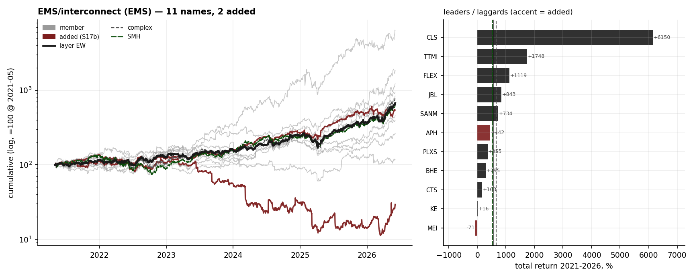
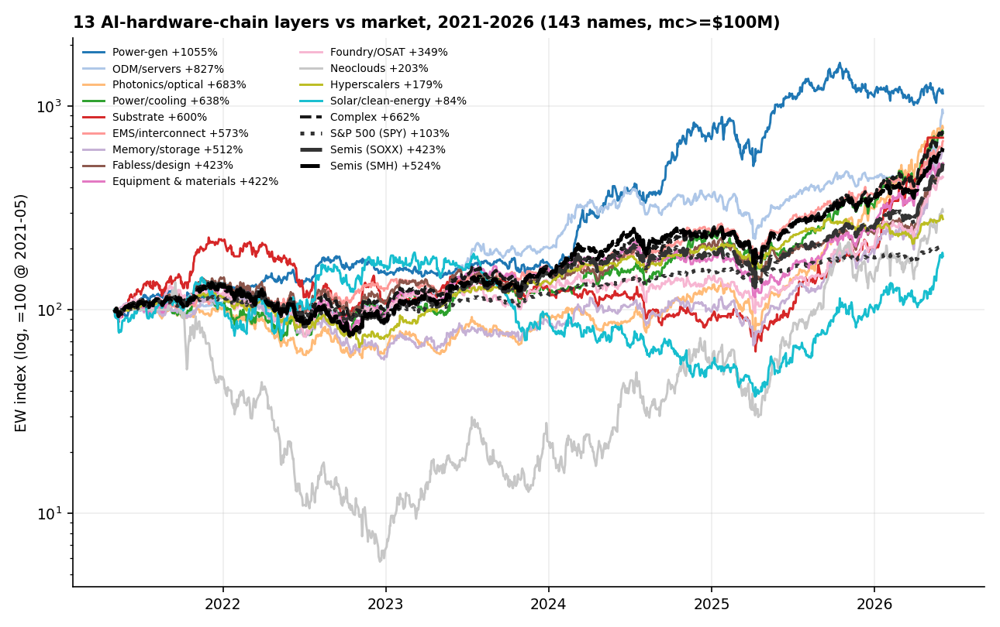
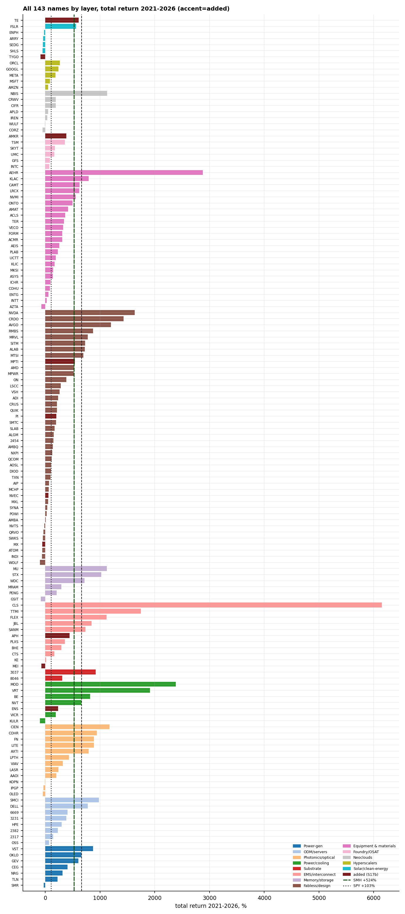

# 17 — Completing the AI-hardware-chain roster barely moves the leaderboard, and only 6 of 13 layers beat the semis ETF

**Question.** Slice the AI-hardware complex into 13 supply-chain layers (fabless, equipment, foundry, memory, substrate, photonics, EMS, solar, ODM/servers, power/cooling, power-gen, hyperscalers, neoclouds), then ask: does adding the chain participants the first roster missed change *which layer leads* — and read market-relative, how many layers actually beat the semiconductor ETF? **Answer:** completing the roster (133 → 143 names) leaves the ranking near-stable (Spearman rho 0.962; the top two are unchanged), and read against SMH the headline is sobering — **only 6 of 13 layers beat the semis ETF**; the rest are tracking semiconductor beta.

> Research / backtested. No live capital, no audited track record. Layer indices are equal-weighted, clipped, non-tradeable proxies; membership is a curated analyst hand-classification, not a reproducible automated sweep.

## Data & method

- **Universe:** 13 layers, **143 names** with market cap ≥ $100M and ≥200 daily observations, over a fixed window **2021-05-03 → 2026-06-03**. The starting roster (133 names) is extended by 10 curated additions (e.g. Amkor, Amphenol, Methode, EnerSys, T1 Energy, Tigo, plus four analog/timing fabless names); a proposed 11th with no price history is dropped transparently.
- **What was tested:** (1) whether the additions re-order the layer leadership; (2) where each layer's equal-weight index sits **relative to SPY, SOXX and SMH** over the same window.
- **Validation:** both the 133-name and 143-name rankings are computed from **one** price panel over the **same** window and the **same** clip/alignment, so the base→complete delta isolates the membership effect (an earlier draft had confounded it with ~3 extra weeks of price action). Returns are clipped at ±50%/day to suppress bad ticks. Rank stability is summarized by Spearman rho.

## Claim 1 — Completing the roster leaves the leaderboard near-stable

Holding the window fixed, the top two layers (power-gen #1, ODM/servers #2) do not move, and the overall ranking is near-identical between the two rosters (**Spearman rho = 0.962**, 3 of 13 layers move). The only layer the additions *materially* move is **EMS/interconnect**: Amphenol (+346%) and Methode (−71%) sit below the high-flying base EMS names and pull the equal-weight average down, dropping it from rank 3 to rank 6. The other two rank shifts (Photonics 5→3, Substrate 6→5) are passive consequences of EMS falling, not effects on those layers.

| layer | base # | complete # | rank Δ | added |
|---|---:|---:|---:|---|
| Power-gen | 1 | 1 | 0 | — |
| ODM/servers | 2 | 2 | 0 | — |
| Photonics/optical | 5 | 3 | +2 | — (passive) |
| Power/cooling | 4 | 4 | 0 | ENS |
| Substrate | 6 | 5 | +1 | — (passive) |
| EMS/interconnect | 3 | 6 | −3 | APH, MEI (dilution) |
| Memory/storage | 7 | 7 | 0 | — |
| Fabless/design | 8 | 8 | 0 | MX, PI, NVEC, MPTI |
| Equipment & materials | 9 | 9 | 0 | — |
| Foundry/OSAT | 10 | 10 | 0 | AMKR |
| Neoclouds | 11 | 11 | 0 | — |
| Hyperscalers | 12 | 12 | 0 | — |
| Solar/clean-energy | 13 | 13 | 0 | TE, TYGO |

**Answer: NO** — adding the missed chain participants does not re-order the leaderboard except for one layer (EMS, a dilution effect). The leadership read is robust to completing the roster.

## Claim 2 — Read market-relative, only 6 of 13 layers beat the semis ETF

The whole complex (equal-weight, 143 names) returned **+662%** over the window, beating SPY (+103%) and both semis ETFs. But layer by layer the picture thins out: 12 of 13 layers beat SPY, 8 of 13 beat SOXX, and **only 6 of 13 beat SMH (+524%)**. Hyperscalers (+179%) and neoclouds (+203%) trail SMH badly; equipment, fabless and foundry only roughly match it. So roughly half the "leading" layers are not generating alpha over a semiconductor index — they are the semis beta.

| benchmark / scope | total return |
|---|---:|
| S&P 500 (SPY) | +103% |
| Semis ETF (SOXX) | +423% |
| Semis ETF (SMH) | +524% |
| Whole complex (EW, 143 names) | +662% |
| Layers beating SPY | 12 / 13 |
| Layers beating SOXX | 8 / 13 |
| **Layers beating SMH** | **6 / 13** |

Per-name buy-and-hold totals confirm the dispersion behind the layer averages:

| scope | n | % positive | median | mean |
|---|---:|---:|---:|---:|
| All names | 143 | 85% | +232% | +427% |
| Power/cooling (L17) | 7 | 86% | +658% | +872% |
| Substrate (L12) | 2 | 100% | +614% | +614% |
| Memory/storage (L15) | 6 | 83% | +505% | +546% |
| EMS/interconnect | 11 | 91% | +442% | +1072% |
| Power-gen (L18) | 7 | 86% | +405% | +436% |
| Photonics (PHOT) | 12 | 75% | +377% | +483% |
| ODM/servers (L14) | 8 | 100% | +342% | +410% |
| Equipment & materials (L6) | 23 | 96% | +308% | +406% |
| Hyperscalers (HYPER) | 5 | 100% | +186% | +166% |
| Foundry/OSAT (L7) | 6 | 100% | +169% | +206% |
| Fabless/design (L3) | 42 | 83% | +150% | +303% |
| Neoclouds (L16) | 7 | 71% | +51% | +219% |
| Solar/clean-energy | 7 | 29% | −40% | +132% |

Per-name median/mean differ from the equal-weight index level because the index is the cumulative path of equal-weighted *daily* returns (sensitive to compounding and to a few short-history high-flyers), whereas median/mean are per-name buy-and-hold totals. Both are reported; neither is a tradeable backtest.

**Answer: CONDITIONAL** — yes the AI-hardware complex broadly outran the market, but only 6 of 13 layers beat the semis ETF, so "leading layer" is not the same as "generating alpha over semis."

## Caveats

- **EW-proxy, not an index.** Every "layer" level is an equal-weighted average of clipped daily member returns — megacaps and micro-floats count equally; it is not cap-weighted, not tradeable, and ignores names that delisted before the window. Treat levels as a coarse leadership read.
- **Short-history distortion.** Recent listings (e.g. a solar name listed ~2025) contribute a clipped total over only part of the window, inflating their layer's average. One such name single-handedly lifts solar's index from negative to positive even though 5 of 7 solar names are deeply negative (29% positive).
- **Curated, not automated.** Layer membership and the keep/exclude calls are analyst judgment. Reasonable analysts would classify borderline names (e.g. Amphenol, EnerSys) differently; the EMS result in particular is sensitive to whether those names "belong."
- **No formal significance test on the ranking shift.** rho = 0.962 with 3/13 moves is descriptive; with only 13 layers and a curated membership change this illustrates robustness, it is not an inferential claim.
- **Window dependence.** Holding the window constant removes the confound between rosters, but the absolute ranking is still specific to 2021-05 → 2026-06 and would differ over other windows. Korea (Samsung/SK Hynix) is absent from the data.

## References

- Public market data: SPY, SOXX, SMH total returns over the study window as benchmarks; US and Taiwan listed equities by industry (SIC) classification.
- Jegadeesh & Titman (1993, *JF*); Moskowitz, Ooi & Pedersen (2012, *JFE*) — momentum / time-series momentum, context for the layer-leadership read.
- Layer membership informed by general industry analysis of the AI-hardware supply chain (e.g. specialist sector research); no proprietary or third-party confidential content is reproduced here.
