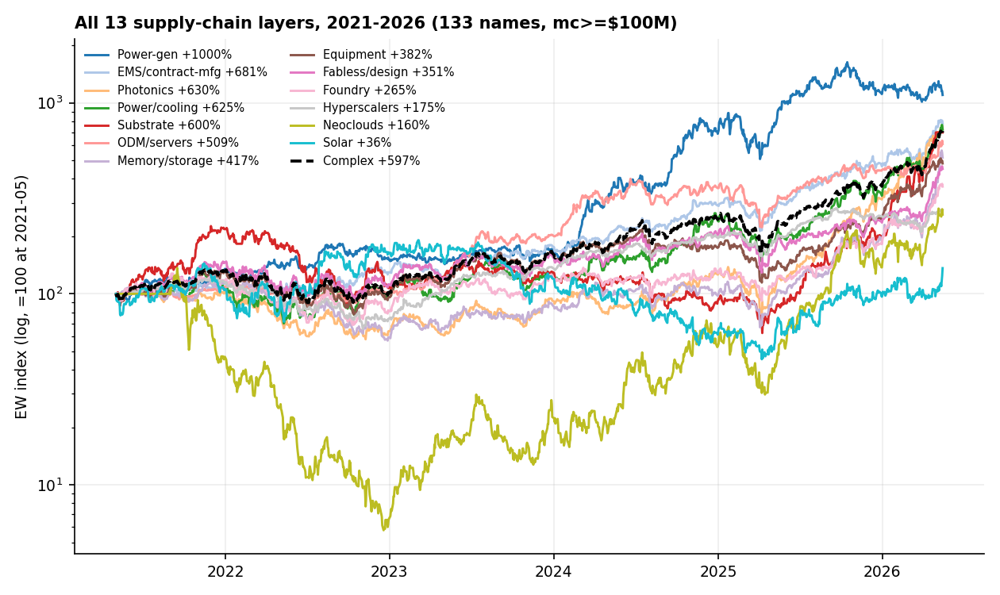
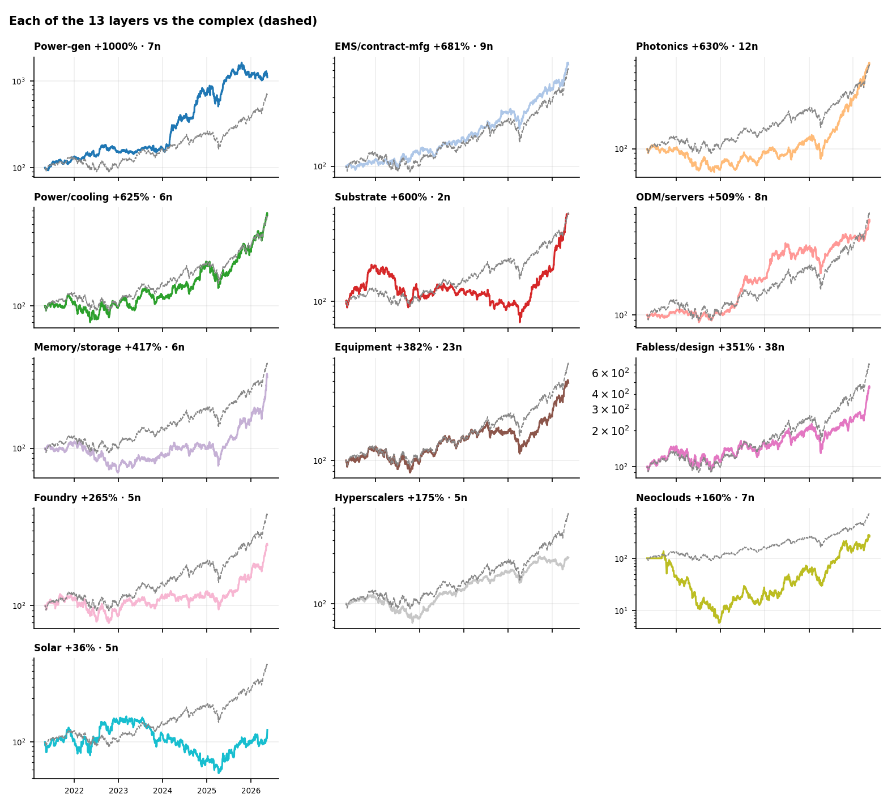
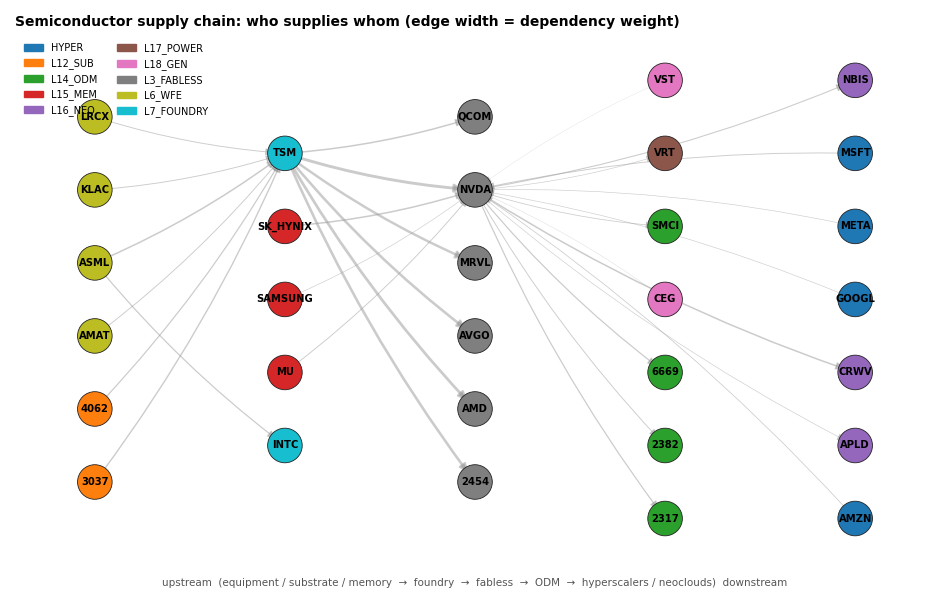
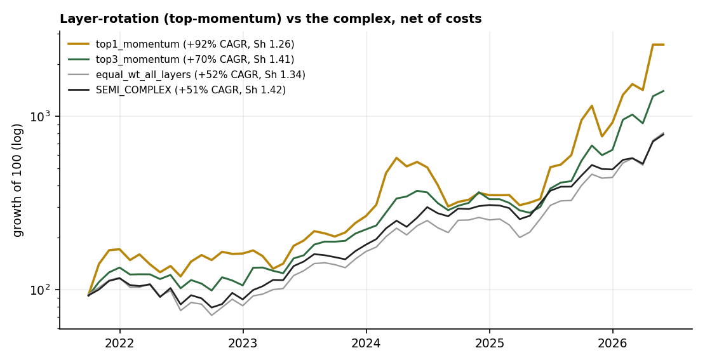
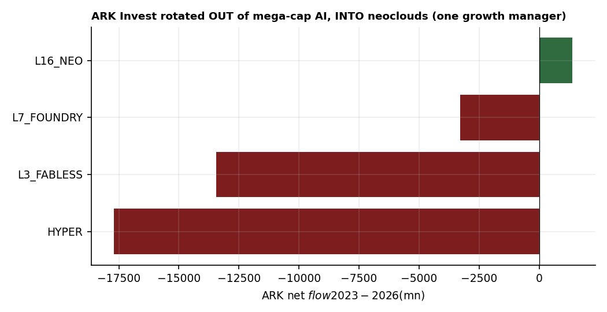

# 17 — Semiconductor supply-chain layers: who leads, how money flows, and does price drive the chatter?

**Question.** Slice the semiconductor complex into its **supply-chain layers** — hyperscalers, fabless, foundry, equipment, memory, substrate, ODM, power/cooling, power-gen, neoclouds — and ask three things: which layer *leads*, how does capital *rotate* across them, and when you overlay news / X / Reddit, does **price drive the discussion or the discussion drive price**?

**Finding.** Three answers on 2021–2026 data (complete systematic universe: **133 names ≥$100M across 13 layers**, incl. new Photonics, EMS and Solar layers): (1) **leadership sits on the chain's *periphery*** — power-gen (**+1,000%** EW), EMS/contract-mfg (+681%), photonics (+630%), power/cooling and substrate led, while the famous **hyperscalers (+175%) and foundry (+164%) lagged and solar was the clear loser (+36%)**; (2) the layers **co-move — there's no tradable lead-lag** up or down the chain (upstream vs downstream peaks at lag 0, corr +0.80; Granger ≈ 0 both ways); (3) **price drives the chatter** — posts cluster *after* run-ups (+3–22% prior; curated-X experts post on names already **+35% above their 200-day MA**), but the discussed names keep running (**+2.4% forward 20-day alpha; +7.3% for curated X**) — attention *rides momentum*, it doesn't predict reversals. Two deeper cuts confirm the theme: chasing the top-momentum layer earned more *raw* return (+2,494% vs +686%) but **no better Sharpe** (1.26 vs 1.42), and broad **13F money accumulated every layer** while **ARK rotated from the incumbents into neoclouds**.

> Research / backtested. Layer map from a supply-chain graph; equal-weight layer price indices (US + Taiwan), 2021–2026; ~9k X + 5k news + (thin) Reddit posts, each carrying the ticker's run-up / RSI / %-above-200d **at post time** plus forward 5/20-day alpha vs SPY. Fabricated `x_kimi` excluded. No live capital; data sourced at **$0** (internal warehouse).

## Data & method

- **Layers & universe:** **13 layers, 133 names, market cap ≥ $100M (no upper limit).** The eight semiconductor-*hardware* layers (fabless, equipment, foundry, memory, substrate, photonics, EMS, solar) are a **systematic sweep** of the relevant industry (SIC) codes — every qualifying name classified into a layer; non-chain SIC matches (networking, security software, lab instruments, defense electronics) are **excluded transparently**. The five demand/power layers (hyperscalers, neoclouds, power/cooling, power-gen, ODM) are curated — there is no clean industry code for them. US via daily bars, Taiwan via TWSE; validated against `market_cap_usd`; equal-weight indices, returns clipped at ±50%/day for bad ticks. Korea (Samsung/SK Hynix) is absent from our data.
- **Social/news:** ticker-tagged posts (news / X-curated-analysts / Reddit) joined to each ticker's post-time technical state and forward alpha — the **reactive-vs-predictive** test.

## Claim 1 — Leadership rotates around the periphery, not the famous names

Across the **complete roster of 133 names (mc ≥ $100M, no upper limit)** — a systematic sweep of the semiconductor-hardware universe classified into 13 layers, equal-weight, 2021–2026 — the **picks, shovels and *electricity*** of the AI build-out led; the obvious mega-caps lagged.

| Layer | EW return | # | Members (top by return) |
|---|---:|---:|---|
| **Power-gen** (L18) | **+1,000%** | 7 | VST, GEV, OKLO, CEG, NRG, TLN, SMR |
| **EMS / contract-mfg** (new) | **+681%** | 9 | CLS (+4,792%), TTMI, FLEX, JBL, SANM, PLXS, BHE, CTS, KE |
| **Photonics / optical** (new) | +630% | 12 | CIEN, AXTI, LITE, FN, COHR, VIAV, LPTH, LASR, AAOI, KOPN, IPGP, OLED |
| **Power/cooling** (L17) | +625% | 6 | VRT (+2,153%), MOD, BE, NVT, VICR, KULR |
| **Substrate** (L12) | +600% | 2 | 3037, 8046 (Taiwan) |
| **ODM / servers** (L14) | +509% | 8 | SMCI, 6669, DELL, 3231, 2382, 2317, HPE, OSS |
| **Memory / storage** (L15) | +417% | 6 | STX, MU, WDC, MRAM, PENG, GSIT |
| **Equipment** (L6) | +382% | 23 | AEHR (+2,484%), KLAC, CAMT, NVMI, LRCX, ONTO, PLAB, ACLS, AMAT, … |
| **Fabless / design** (L3) | +351% | 38 | NVDA (+1,720%), CRDO, AVGO, SITM, MTSI, RMBS, MPWR, ALAB, MRVL, AMD, … |
| **Foundry** (L7) | +265% | 5 | TSM, SKYT, UMC, INTC, GFS |
| **Hyperscalers** (HYPER) | +175% | 5 | GOOGL, ORCL, META, MSFT, AMZN |
| **Neoclouds** (L16) | +160% | 7 | NBIS, CRWV, CIFR, APLD, IREN, WULF, CORZ |
| **Solar / clean-energy** (new) | **+36%** | 5 | FSLR, ARRY, ENPH, SEDG, SHLS |

The thesis holds and broadens on the full universe: **power-gen, EMS, photonics, power/cooling, substrate and memory lead; hyperscalers, foundry and neoclouds lag; solar is the clear loser** (+36%, the only layer that badly trailed the complex). The widened lens exposes enormous *within-layer* dispersion — EMS spans CLS (+4,792%) to KE (+10%); fabless NVDA (+1,720%) to WOLF (−96%); equipment AEHR (+2,484%) to AZTA (−82%). The "leading layer" is rarely the famous fabless or hyperscaler; it's the bottleneck tiers — *power, the contract manufacturers, the optics*.

## Claim 2 — The layers co-move; no tradable lead-lag up or down the chain

Do equipment/foundry (upstream) lead fabless/hyperscalers (downstream), or vice versa? Neither. Their daily returns peak in correlation **at lag 0 (+0.80)**, and a Granger-style test is symmetric and negligible (extra-R² ≈ 0.003 both directions). A common AI-capex factor moves the whole chain together; leadership shows up in *magnitude* (who outperforms), not in *timing* (who moves first) — consistent with an efficient, well-understood supply chain.

Why so tightly coupled? The supply-chain graph shows it: a dense dependency web centred on **TSM** (foundry) and **NVDA** (fabless), with equipment/substrate/memory feeding in and ODM/hyperscalers/neoclouds/power hanging off the demand side. When the layers are this interlocked, a common AI-capex shock hits them all at once — which is exactly the +0.80 contemporaneous correlation.

## Claim 3 — Can you *trade* the rotation? More return, not more Sharpe

A monthly strategy that holds the top-momentum layer(s) — net of 20bps/turnover — earned far more *raw* return than the complex (top-1 **+2,494%** vs SEMI_COMPLEX +686% over 2021–2026), but **not better risk-adjusted return**: top-1 Sharpe **1.26 < 1.42** for simply holding the complex (it just ran 74% volatility and a −48% drawdown). Top-3 momentum matched the complex on Sharpe (1.41 vs 1.42). So layer-timing buys *more upside*, not *more efficiency* — the same "no free lunch" the co-movement implies (and the same verdict as study 16's sector test).

## Claim 4 — Where the money flows: institutions accumulate the whole complex; ARK rotates to challengers

Two very different "smart money" reads. Broad **13F** filers net-*added* every covered AI-semi layer over the last year (~4 adds per trim — hyperscalers, fabless, memory, foundry, equipment all accumulated). One prominent growth manager, **ARK**, did the opposite: net-*sold* the incumbents (−$17.7bn hyperscalers, −$13.4bn fabless) and *bought* the **neoclouds** (+$1.4bn) — an early-stage tilt against the crowd. (Coverage caveat: tickered 13F/ARK data covers only the large-cap US members, so this is directional, not a full-stack flow; precise 13F dollar-sizing is unreliable from our partial set, so 13F is shown as breadth, not dollars.)

## Claim 5 — Price drives the chatter — and the chatter rides momentum

The discussion is **reactive**: posts arrive *after* a run-up (+4.2% prior 20-day for news, +5.4% for X — on names already **+35% above their 200-day MA**). But it isn't a dead end — the discussed names keep outperforming: forward 20-day alpha **+1.5% (news), +7.3% (curated X)** (t = 11.5, 68% positive). So **price leads attention, and attention then rides continued momentum** (Da-Engelberg-Gao) rather than signalling a top. Layer exceptions: hyperscaler (−1.2%) and power-gen (−5.1%) chatter preceded mild *under*performance.

## The answer, in the data

| Question | Answer | Proof |
|---|---|---|
| Which layer leads? | **The periphery** (power-gen / EMS / photonics / power / substrate) — not hyperscaler/foundry; solar lags | power-gen +1,000% vs hyperscalers +175%, solar +36% (133 names ≥$100M) |
| Does money flow up or down the chain? | **Neither — the layers co-move** | corr +0.80 at lag 0; Granger ≈ 0 both ways |
| Can you *trade* the layer rotation? | **More return, not more Sharpe** | top-1 momentum +2,494% but Sharpe 1.26 < 1.42 (complex) |
| Where is institutional money going? | Broad 13F **accumulates all layers**; ARK **rotates incumbents → neoclouds** | 13F ~4 adds:1 trim; ARK −$17.7bn hyperscalers, +$1.4bn neoclouds |
| Price → chatter, or chatter → price? | **Price → chatter** (reactive), which then rides momentum | posts after +3–22% run-up; +2.4% (X +7.3%) forward alpha |

**Verdict:** to read the semis, watch the *periphery* (power, substrate, memory) for leadership, treat the layers as one co-moving complex (no chain-timing edge), and read social/news as **confirmation of momentum, not a leading or contrarian signal** — the curated expert accounts are the ones whose discussed names keep running.

## How to read this (reactive vs predictive)

A signal "works" only if it *precedes* the move. We split each post into **before** (the ticker's run-up / RSI / distance above its 200-day MA at post time) and **after** (forward alpha vs SPY). Chatter that only appears *after* a rally with no forward alpha is pure noise; chatter that precedes alpha is informative. Here it's in between — reactive entry, momentum continuation — which the attention literature (Da-Engelberg-Gao) predicts: attention spikes follow price and extend short-horizon momentum. The curated-account edge is partly **selection** (these are vetted expert voices), not proof that posting *causes* the move.

## Caveats

Membership spans **133 names ≥$100M across 13 layers**. The semiconductor-*hardware* layers are a systematic industry-code sweep (every qualifying name classified); non-chain SIC matches were **excluded transparently** — networking (CSCO, ANET), security software (PANW, FTNT), lab/industrial instruments (TMO, ROK, TRMB, ITRI), defense electronics (MSI, MRCY); the demand/power layers stay curated (no clean code). Some layers are still thin (substrate = 2 Taiwan names; memory excludes Korea's Samsung/SK Hynix, absent from our data) and within-layer dispersion is large (equal-weight). The leadership/roster view (Claim 1) uses the full 133-name set; the co-movement, rotation and causality tests use the core liquid members and their conclusions hold on the wider roster. 2021–2026 was a momentum-heavy bull, so "names keep running" is regime-flavoured; co-movement does not mean the layers carry no information about each other, only that it isn't a daily price lead-lag; Reddit coverage is thin (directional only); the curated-X alpha reflects source quality (selection), not causation.

## References

- Da, Engelberg & Gao (2011, *JF*). *In Search of Attention* — investor attention predicts short-run returns and continuation.
- Tetlock (2007, *JF*). *Giving Content to Investor Sentiment* — media tone moves prices temporarily.
- Antweiler & Frank (2004, *JF*). *Is All That Talk Just Noise?* — message-board volume vs returns/volatility.
- Granger (1969). Investigating causal relations by econometric models (lead-lag testing).
- Jegadeesh & Titman (1993, *JF*); Moskowitz, Ooi & Pedersen (2012, *JFE*). Momentum / time-series momentum — the layer-rotation backtest is a momentum strategy.
- Community: curated semi analysts on X (supply-chain specialists); r/hardware, r/wallstreetbets semi threads (thin in-sample).
