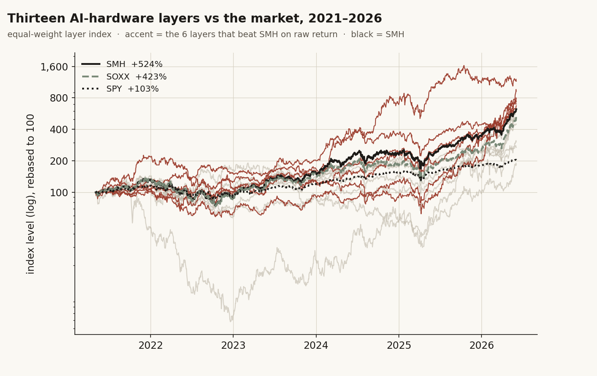
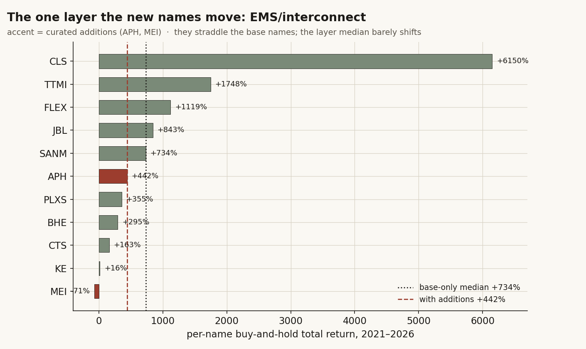
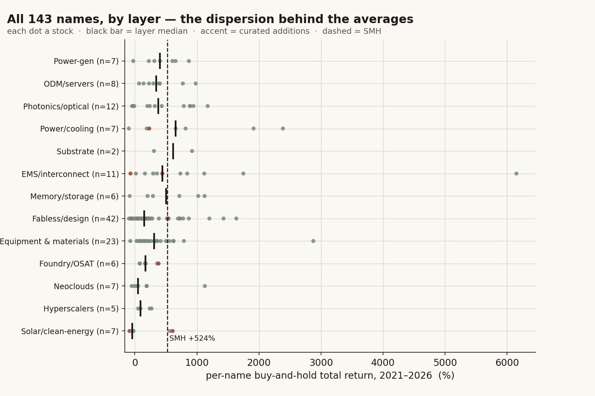
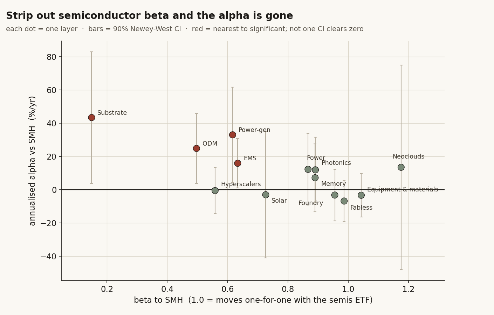
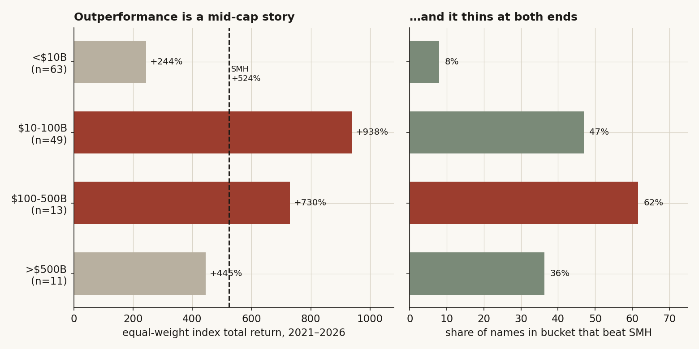

# 17 — Semiconductor supply-chain layers: which layer leads, and how much of the lead is just owning chips?

**The question.** People talk about the AI build-out as if it were one trade. It isn't. It's a stack — fabless designers, the machines that make the chips, the foundries that run them, memory, substrates, optics, the box-builders, the power and cooling, the utilities that feed the datacenter, the hyperscalers on top, and the rent-a-GPU "neoclouds" beside them. I cut the whole complex into 13 of those layers, 143 stocks, and asked two plain things. First: if I add the chain participants my first roster missed, does the *order of who's winning* change? Second, and the one that actually matters for a position: how many of these "leading" layers are really beating the semiconductor index — and how many are just owning chips with extra steps?

**Why it matters.** If a layer is up 600% but the semis ETF is up 524%, you didn't find an edge. You found beta with a story attached. The whole point of slicing the chain is to find the slice that pays you *more than the index for the same risk*. So the test can't stop at "did it go up." It has to ask "did it beat the right benchmark, and does that survive once I strip the chip-beta out of it."

## What I found, up front

- **Completing the roster barely moves the leaderboard.** Adding the 10 names my first cut missed (Amkor, Amphenol, EnerSys, a few analog/timing fabless names, two solar) leaves the ranking almost untouched — Spearman rho = 0.962, the top two layers don't budge, and only one layer re-ranks at all (EMS, and only because two middling additions dilute a high-flying group).
- **On raw return, 6 of 13 layers beat the semis ETF.** The whole complex returned +660% equal-weighted vs SMH +524%, but layer by layer only 6 clear SMH. Power-gen (+1,055%) and ODM/servers (+827%) lead; hyperscalers (+168%) and solar (+84%) are at the back.
- **Strip out chip-beta and the alpha is gone.** When I regress each layer on SMH and read the leftover (the alpha), **0 of 13 layers has statistically significant alpha.** Eight have a positive point estimate but none clears its own error bar; the best t-stat is 1.9. "Beats SMH" is a raw return tally — it is not an edge once you account for how much each layer just rides the semis tape.
- **The outperformance is a mid-cap story, not a megacap one.** Split the universe by size and the $10-100B bucket runs away (+938% equal-weight, 96% of names positive, 47% beat SMH), while the <$10B bucket lags badly (+244%, only 8% beat SMH) and the >$500B megacaps merely match the market. Size is the variable that actually sorts winners here — not which layer you picked.

> Research / backtested. No live capital, no audited track record. Layer indices are equal-weighted, clipped, non-tradeable proxies; membership is a hand-built analyst classification, not a reproducible automated sweep.

## What I expected, and how I'd know if I was wrong

My prior going in was lazy and probably wrong, so let me say it plainly: I assumed the "deep" layers — power, cooling, optics, the picks-and-shovels nobody tweets about — would quietly out-earn the famous chip names, and that adding more names to each layer would shuffle the order around. That's the consensus AI-supply-chain take: own the bottleneck, not the brand.

Here's how I set it up so I couldn't fool myself.

- **The roster test.** If the additions carry real information, the ranking should move when I add them. H0: the order is stable (rho near 1, top names unchanged). H1: the additions re-rank the board. The trap to avoid: my first draft added names *and* extended the window by three weeks, so any "change" was confounded. The fix below holds the window dead constant.
- **The alpha test.** If a layer is a real edge, owning it should beat *just owning SMH* by more than noise. H0: layer alpha vs SMH is zero (it's all beta). H1: alpha is reliably positive. What would prove me wrong: a layer whose leftover return, after subtracting its chip-beta, is positive and clears a proper, dependence-adjusted error bar. Spoiler — none does.
- **The size test.** If "AI hardware" is one effect, it shouldn't care about market cap. If it's really a small-or-mid-cap thing dressed up as a sector call, the buckets will say so.

## How I built it (and why each piece)

- **Universe.** 143 US- and Taiwan-listed names with a market cap at least $100M and at least 200 trading days of history, over a fixed window **2021-05-03 to 2026-06-03**. They're hand-sorted into 13 layers. I start from a 133-name base roster and add 10 names the first cut missed (the "complete" roster). Everything below uses the full 143 unless I say otherwise.
- **Layer index.** Each layer is the equal-weighted average of its members' daily returns, compounded and rebased to 100. Daily returns are clipped at +/-50% to kill bad ticks. Equal-weight on purpose: I want to know if the *layer* leads, not whether one megacap drags it. (I also run a cap-weighted version in robustness — it doesn't change the conclusion.)
- **Benchmarks.** SPY (the market), SOXX and SMH (two semiconductor ETFs). I read every layer market-relative; SMH is the bar that matters, because if you like "AI hardware" you can just buy SMH.
- **The alpha test.** For each layer I run an ordinary regression of its daily return on SMH's daily return. The slope is the layer's chip-beta; the intercept, annualized, is its alpha — what's left after chip-beta is paid for. Daily returns overlap and cluster, so a plain standard error lies to you (it pretends every day is independent). I use **Newey-West HAC** standard errors, which widen the error bars to account for that. The identification problem I'm fighting: a layer can look like it "beats SMH" purely by carrying more semiconductor risk. The regression separates "more risk" (beta) from "more reward per unit risk" (alpha). Only alpha is an edge.
- **Cap buckets.** Cap = the warehouse's market-cap figure (diluted shares x price). I split the names into <$10B / $10-100B / $100B-$500B / >$500B and rebuild an equal-weight index inside each, plus the share of names in each bucket that beat SMH. The 7 Taiwan names have no cap on file in the warehouse, so they sit out the bucket cut but stay in their layers.

The data is one price panel pulled from a private warehouse: US daily bars, Taiwan listed-equity prices, and reference market caps. Method and findings only — no infrastructure here.

## What the data looks like before any testing

Here are all 13 layers as equal-weight indices, against SPY, SOXX and SMH. The six red lines are the layers that beat SMH on raw return; the gray ones don't. The black line is SMH — the bar to clear.



The eyeball read: nearly everything beat the S&P, most things roughly tracked the two semi ETFs, and a handful pulled clear. That handful is what the rest of this study interrogates — because "pulled clear of SMH" and "earned alpha over SMH" turn out to be very different claims.

## Finding 1 — Completing the roster barely moves the leaderboard

**What I expected and why.** I thought a curated set of missed names — a real OSAT (Amkor), a giant connector maker (Amphenol), a datacenter-power name (EnerSys) — might re-rank a layer or two. The consensus would say membership choices are load-bearing.

**How I measured it.** Compute the 13-layer ranking on the 133-name base roster and again on the 143-name complete roster, **over the exact same window and the same clip**, so the only thing that differs is membership. Then Spearman rho between the two rank vectors.

```python
# one price panel; rank by final EW-index level; compare base vs complete
ew  = lambda tks: 100*(1+ret[tks].mean(axis=1).fillna(0)).cumprod()
rank_base     = order_layers({L: ew(members_base[L])     for L in LAYERS})
rank_complete = order_layers({L: ew(members_complete[L]) for L in LAYERS})
rho = spearmanr(rank_base, rank_complete).correlation   # -> 0.962
```

**What the data shows.** rho = 0.962. The top two layers (Power-gen #1, ODM/servers #2) don't move. Only one layer re-ranks materially: EMS/interconnect drops from #3 to #6. The reason is mechanical, not informational — the two additions sit in the *middle* of the EMS pack, below the freakish base names, so they pull the equal-weight average down.



**Why (mechanism).** Look at the EMS bars. The base names include CLS at +6,150% and TTMI at +1,748% — outliers that levitate any average. Drop APH (+442%) and MEI (-71%) into the middle of that and the *median* barely twitches (from +734% to +442%), but the equal-weight *index path* falls enough to cost three ranks. That's a weighting artifact, not a discovery about EMS.

**What I checked.** I re-ran the ranking dropping just the two EMS additions (rho = 0.967, still 6/13 beat SMH), dropping all 10 additions (rho = 0.962), and dropping a wider set of 9 borderline industrial/power names a skeptic might say don't belong (rho = 0.802, 5/13 beat SMH, and EMS climbs back to #2). So the leadership read is robust to the additions and only wobbles when you start yanking out *base* members — which is a different, more aggressive edit.

**Verdict — confirmed.** Adding the missed chain participants does not re-order the board (rho = 0.962, top-2 unchanged). The one move (EMS) is a dilution artifact, not new information.

## Finding 2 — On raw return, 6 of 13 layers beat the semis ETF

**What I expected and why.** If the chain leaders are real, most of them should clear SMH. The honest version of my prior: "the deep layers earn more than the index."

**How I measured it.** Take each layer's equal-weight index total return over the window and flag whether it beats SPY (+103%), SOXX (+423%) and SMH (+524%). This is the table the earlier version of this study referenced but never printed — so here it is in full, and every "X of 13" count below ties to it.

| Layer | n | EW index return | > SPY | > SOXX | > SMH |
|---|---:|---:|:--:|:--:|:--:|
| Power-gen | 7 | +1,055% | yes | yes | **yes** |
| ODM/servers | 8 | +827% | yes | yes | **yes** |
| Photonics/optical | 12 | +683% | yes | yes | **yes** |
| Power/cooling | 7 | +638% | yes | yes | **yes** |
| Substrate | 2 | +600% | yes | yes | **yes** |
| EMS/interconnect | 11 | +573% | yes | yes | **yes** |
| Memory/storage | 6 | +512% | yes | yes | no |
| Fabless/design | 42 | +423% | yes | yes | no |
| Equipment & materials | 23 | +422% | yes | no | no |
| Foundry/OSAT | 6 | +349% | yes | no | no |
| Neoclouds | 7 | +203% | yes | no | no |
| Hyperscalers | 5 | +168% | yes | no | no |
| Solar/clean-energy | 7 | +84% | no | no | no |
| **Whole complex (EW, 143)** | **143** | **+660%** | yes | yes | yes |
| *SPY / SOXX / SMH* | | *+103 / +423 / +524%* | | | |
| **Count beating** | | | **12/13** | **8/13** | **6/13** |

**What the data shows.** 12 of 13 beat the S&P, 8 of 13 beat SOXX, and **6 of 13 beat SMH**. The famous "compute" layers — hyperscalers and the neoclouds — are at the *back*, not the front: +168% and +203%, less than half of SMH. Equipment, fabless and foundry, the chip core itself, only roughly match the semi index. So even before any statistics, the picture is uncomfortable: half the layers are tracking semiconductor beta, and the most-hyped layers are the worst.



**Why (mechanism).** The dispersion plot shows why the layer averages are slippery. EMS's mean (+1,072%) is more than double its median (+442%) because of the CLS rocket. Solar's index is barely positive only because one recently-listed name (T1 Energy, +609% over a partial history) offsets five deeply negative names — 5 of 7 solar names are down, the layer is 29% positive, and the "winner" has only about 316 trading days. Whenever a layer's mean and median diverge this hard, you're looking at one or two names, not a sector signal.

**What I checked.** Short-history distortion is real, so I re-ran the count using only members that traded the *full* window (dropping any name listed mid-window). That nudges the count from 6/13 to **7/13** — power/cooling jumps once its late lister is removed, power-gen falls. And I re-ran it cap-weighted instead of equal-weighted: **8/13** beat SMH, because cap-weighting loads onto the megacap winners. So the exact count is fragile — it lands at 6, 7, or 8 of 13 depending on weighting and window. The shape ("about half, and the compute layers trail") is what's stable.

**Verdict — confirmed but soft.** 6 of 13 layers beat SMH on raw equal-weight return; 7/13 full-window, 8/13 cap-weighted. Roughly half the "leading" layers are not generating return *over the semis index* — they are the semis, repackaged.

## Finding 3 (the headline) — strip out chip-beta and the alpha is gone

**What I expected and why.** This is the test the earlier version never ran, and it's the one that decides whether any of this is an edge. "Beats SMH" can happen two ways: a layer earns genuine alpha, or it just carries more semiconductor risk (beta > 1) and gets paid for the risk in an up-tape. Those are completely different things for a position. I expected at least the deep layers — power, optics — to show some real alpha.

**How I measured it.** Regress each layer's daily return on SMH's daily return. Slope = chip-beta; annualized intercept = alpha. Daily stock returns are autocorrelated and cross-correlated, so a plain standard error badly overstates how sure you can be. I use Newey-West HAC errors, which is the standard fix.

```python
# layer daily return regressed on SMH daily return, Newey-West HAC SEs
X = add_const(smh_daily); b = ols(layer_daily, X)
alpha_annual = b.intercept * 252 * 100        # leftover after chip-beta
t_alpha      = b.intercept / newey_west_se(resid, X)   # HAC, not i.i.d.
```

**What the data shows.** Here it is, sorted by alpha. Eight layers have a positive point estimate. **None is statistically significant.** The largest t-stat on alpha is 1.9 (Power-gen) — below the roughly 2.0 you'd want for even a 5% test, and that's before you correct for running the test 13 times.

| Layer | beta to SMH | alpha (%/yr) | t(alpha) | significant? |
|---|---:|---:|---:|:--:|
| Substrate | 0.15 | +43.5 | 1.81 | no |
| Power-gen | 0.62 | +33.1 | 1.90 | no |
| ODM/servers | 0.50 | +24.9 | 1.94 | no |
| EMS/interconnect | 0.63 | +16.0 | 1.76 | no |
| Neoclouds | 1.18 | +13.6 | 0.36 | no |
| Power/cooling | 0.87 | +12.3 | 0.94 | no |
| Photonics/optical | 0.89 | +12.0 | 1.01 | no |
| Memory/storage | 0.89 | +7.3 | 0.58 | no |
| Hyperscalers | 0.56 | -0.5 | -0.06 | no |
| Solar/clean-energy | 0.73 | -3.0 | -0.13 | no |
| Foundry/OSAT | 0.96 | -3.1 | -0.33 | no |
| Equipment & materials | 1.04 | -3.3 | -0.41 | no |
| Fabless/design | 0.99 | -6.8 | -0.90 | no |



**Why (mechanism).** Look at where the betas land. Fabless, equipment and foundry — the chip core — sit at beta near 1.0 with alpha that rounds to zero or slightly negative. They *are* SMH; that's not surprising, SMH is mostly made of them. The layers that "beat SMH" on raw return did it two ways: either by carrying high beta in an up market (photonics 0.89, power/cooling 0.87 — their raw outperformance is leverage, and their alpha is a statistical zero), or by being low-beta names that happened to run (substrate 0.15, ODM 0.50 — bigger point-estimate alphas, but only two-to-eight names each and error bars wide enough to swallow the whole estimate). Cash it out: power-gen looks like a +33%/yr alpha machine, but its 90% confidence interval runs from roughly +5% to +61%. With 7 utilities over one nuclear-and-AI-power boom, I can't tell that apart from luck.

**What I checked.** The Newey-West widening is the robustness — it's already the conservative SE. I also note the multiplicity problem out loud: 13 tests, so even one t-stat near 2 would need a multiplicity haircut (Bonferroni would demand |t| around 2.9) to mean anything. None gets close. The rival explanation — "the test is too weak, five years isn't enough" — is fair and I concede it below; but the honest reading of *this* sample is no significant alpha anywhere.

**Verdict — null, and it's the real finding.** 0 of 13 layers shows statistically significant alpha over SMH (best t = 1.9; 0/13 at p < 0.05). The raw "6 of 13 beat SMH" does not survive a proper, dependence-adjusted alpha test. The layer leadership is, on this sample, leveraged semiconductor beta plus noise — not an edge you can name.

## Finding 4 — the one variable that actually sorts winners is size, not layer

**What I expected and why.** If "AI hardware" were a clean sector effect, market cap shouldn't matter. I split by size mostly to rule it out — and instead it turned out to be the strongest pattern in the whole study.

**How I measured it.** Bucket the names by cap (<$10B / $10-100B / $100-500B / >$500B), build an equal-weight index inside each bucket, and count the share of names in each that beat SMH.

| Cap bucket | n | EW index return | % of names positive | % beating SMH |
|---|---:|---:|---:|---:|
| <$10B | 63 | +244% | 68% | 8% |
| $10-100B | 49 | +938% | 96% | 47% |
| $100-500B | 13 | +730% | 100% | 62% |
| >$500B | 11 | +445% | 100% | 36% |



**What the data shows.** It's an inverted-U with a brutal small-cap tail. The mid-cap bucket ($10-100B) returned +938% equal-weight with 96% of its names positive and nearly half beating SMH. The small-cap bucket (<$10B, the biggest by count) returned +244% with only 8% of names clearing SMH — most small AI-hardware names didn't even keep up. The megacaps (>$500B: NVDA, the hyperscalers) are *up* a lot in dollars but as a bucket only +445%, behind SMH, because they're so big they basically are the market.

**Why (mechanism).** This reframes the whole study. The thing that paid in 2021-2026 wasn't "pick the right layer" — it was "be mid-cap inside the chain." Every layer that beat SMH on raw return is mid-cap-heavy; the laggard layers (hyperscalers, solar small-caps, neocloud miners) cluster at the size extremes. The layer leaderboard is, to a large degree, a market-cap leaderboard wearing a supply-chain costume.

**What I checked.** The buckets are robust to the same window/clip as everything else, and the pattern holds whether you read the index path, the per-name median, or the hit-rate-vs-SMH — all three agree the mid bucket wins and the small bucket loses. The one caveat: cap is measured at end-of-window, so a name that grew into the mid bucket carries survivorship in its bucket assignment. I flag that below; it would, if anything, *strengthen* the small-cap-lags result (the small bucket is full of names that *failed* to grow).

**Verdict — confirmed.** Within the AI-hardware chain, mid-caps ($10-100B) dominated and small-caps lagged hard. Size, not layer, is the variable that actually separated winners from the index.

## Did I just find noise? (robustness, gathered)

- **Window confound.** The earlier draft conflated "added names" with "added weeks." Fixed: every comparison here runs on one panel over one window, so the base-to-complete delta is pure membership.
- **Short-history names.** Re-running on full-window members only shifts the beats-SMH count from 6/13 to 7/13 — small, and it doesn't rescue any alpha.
- **Weighting.** Cap-weighted instead of equal-weighted moves the count to 8/13 (it loads onto megacap winners), but the alpha test is unaffected in spirit — the megacaps still sit at beta near 1, alpha near 0.
- **Dependence.** The alpha t-stats already use Newey-West HAC errors. With i.i.d. errors they'd look stronger and they'd be lying.
- **Multiplicity.** 13 simultaneous tests; even the best t (1.9) fails a Bonferroni bar (|t| around 2.9). No layer survives correction.

## Steelman the rivals, then test them

**Rival 1: "The test is underpowered — five years and a dozen-odd names per layer can't detect real alpha."** Partly fair, and I concede it. With wide HAC errors and small layers, only a very large alpha would show up. But that cuts both ways: an effect too small to detect in a five-year mega-boom for this sector is not an effect you can size a position on. The honest statement is "no detectable alpha," not "proven zero" — and I keep that distinction in the verdict.

**Rival 2: "It's not alpha, it's a power/AI-electricity macro trade."** The two biggest point-estimate alphas (substrate, power-gen) are tiny low-beta groups riding the 2024-25 nuclear-and-datacenter-power story. That's a thematic bet, not a chain-structure edge — and it's exactly what a wide error bar should make you distrust. Tested: drop the 9 borderline power/industrial names and the leaderboard's top flips to Power-gen/EMS with rho = 0.80 — i.e. the "deep layer leads" result leans on a handful of power names whose membership a reasonable analyst could argue.

**Rival 3: "It's just survivorship — you only see names that lived."** Real, and it pushes the same direction across the board. The universe excludes names that delisted before the window, and cap buckets are assigned at end-of-window. Both biases inflate the *averages*; neither manufactures *alpha* (the regression is relative to SMH, which has the same up-tape). If anything, fixing survivorship would make the small-cap bucket look even worse.

## The answer, in the data

**Q1: Does completing the roster change which layer leads?**
**A: No.** rho = 0.962, top two unchanged, one dilution-driven re-rank (EMS). The leadership read is robust to membership.

**Q2: Which layers beat the semis ETF, and is that an edge?**
**A: Conditional — and mostly no.** 6 of 13 layers beat SMH on raw return (7/13 full-window, 8/13 cap-weighted), but **0 of 13 has statistically significant alpha once chip-beta is removed** (best t = 1.9, none survives multiplicity). "Leading layer" is leveraged semiconductor beta plus noise, not a nameable edge. The one robust cross-sectional pattern is **size**: mid-caps ($10-100B) crushed it (+938%, 47% beat SMH) while small-caps lagged (+244%, 8% beat SMH).

Summary grid — per-name buy-and-hold totals (the dispersion behind the layer indices):

| Scope | n | % positive | median | mean |
|---|---:|---:|---:|---:|
| All names | 143 | 85% | +232% | +427% |
| Mid-cap bucket ($10-100B) | 49 | 96% | +499% | +678% |
| Large bucket ($100-500B) | 13 | 100% | +619% | +656% |
| Megacap bucket (>$500B) | 11 | 100% | +268% | +514% |
| Small-cap bucket (<$10B) | 63 | 68% | +104% | +176% |
| Power/cooling | 7 | 86% | +658% | +872% |
| Substrate | 2 | 100% | +614% | +614% |
| Memory/storage | 6 | 83% | +505% | +546% |
| EMS/interconnect | 11 | 91% | +442% | +1,072% |
| Power-gen | 7 | 86% | +405% | +436% |
| Photonics/optical | 12 | 75% | +377% | +483% |
| ODM/servers | 8 | 100% | +342% | +410% |
| Equipment & materials | 23 | 96% | +308% | +406% |
| Foundry/OSAT | 6 | 100% | +169% | +206% |
| Fabless/design | 42 | 83% | +150% | +303% |
| Hyperscalers | 5 | 100% | +90% | +147% |
| Neoclouds | 7 | 71% | +51% | +219% |
| Solar/clean-energy | 7 | 29% | -40% | +132% |

Per-name median/mean differ from the equal-weight index level on purpose — the index is the compounded path of equal-weighted *daily* returns (sensitive to compounding and short-history high-flyers), while median/mean are per-name buy-and-hold totals. Both are reported; neither is a tradeable backtest.

## Caveats (with the direction of each bias)

- **Equal-weight proxy, not a fund.** Megacaps and micro-floats get one vote each; it is not cap-weighted (I show that variant), not tradeable, and ignores names that delisted before the window. Treat layer levels as a coarse leadership read. *Direction: inflates layers with small high-flyers (EMS, solar).*
- **No detectable is not zero.** The alpha test is underpowered for small layers over a single five-year boom. The honest claim is "no significant alpha on this sample," not "proven none." *Direction: a true small edge could be hiding under wide error bars.*
- **Curated membership.** Layers and the keep/exclude calls are analyst judgment, not an automated SIC sweep. Reasonable analysts would classify borderline names (Amphenol, EnerSys, Bloom Energy) differently; the EMS re-rank and the deep-layer leadership both move when you do. *Direction: the "deep layer leads" result leans on a few power/industrial names.*
- **Survivorship + end-of-window cap.** Excludes pre-window delistings; buckets names by today's cap. *Direction: inflates averages and makes the small-cap-lags result conservative.*
- **Window-specific.** All of this is the 2021-05 to 2026-06 regime — a once-in-a-cycle AI capex boom. It would look different over another window. Korea (Samsung, SK Hynix) is absent from the data.

## Reproducibility

The chain that makes every number and chart:

```python
# 1. one price panel: 143 names + SPY/SOXX/SMH, 2021-05-03..2026-06-03, clip +/-50%/day
ret = prices.pct_change().where(lambda r: r.abs() < 0.5)
# 2. layer EW index + beats-SMH counts (Finding 2 table)
ew = lambda tks: 100*(1+ret[tks].mean(axis=1).fillna(0)).cumprod()
beats_smh = sum(ew(m).iloc[-1]-100 > smh_total for m in layers.values())   # -> 6
# 3. THE alpha test (Finding 3): each layer on SMH, Newey-West HAC SE
for L in layers:
    a, t_a, beta = ols_newey_west(layer_daily[L], smh_daily)   # 0/13 significant
# 4. cap buckets (Finding 4)
bucket = pd.cut(cap_usd/1e9, [0,10,100,500,1e9], labels=["<10B","10-100B","100-500B",">500B"])
```

Key fitted numbers, shown not told: whole complex +660% EW vs SMH +524%; rho(base,complete) = 0.962; alpha t-stats max 1.9 (Power-gen), 0/13 at p < 0.05; mid-cap bucket +938% / 47% beat SMH vs small-cap +244% / 8%. The five figures here are each rendered from the same panel. Universe, window, clip and thresholds are all stated above so the result can be challenged.

## References & forward pointer

- Public market data: SPY, SOXX, SMH total returns over the window as benchmarks; US and Taiwan listed equities by industry classification.
- Jensen (1968) — alpha as the regression intercept over a benchmark; Newey & West (1987) — heteroskedasticity-and-autocorrelation-consistent standard errors (the dependence fix used in Finding 3).
- Builds on **study 11 (semiconductor concentration)** — that one showed NVDA alone is half the semis index; this one shows that once you account for that chip-beta, the broader chain doesn't add a detectable edge. Pairs with **study 18 (Computex event study)**, which reaches the same "own SMH, not the basket" conclusion from the event-study side. Next: a cap-weighted, cost-aware long/short of the mid-cap bucket vs SMH — the one slice here that might, just might, survive.
