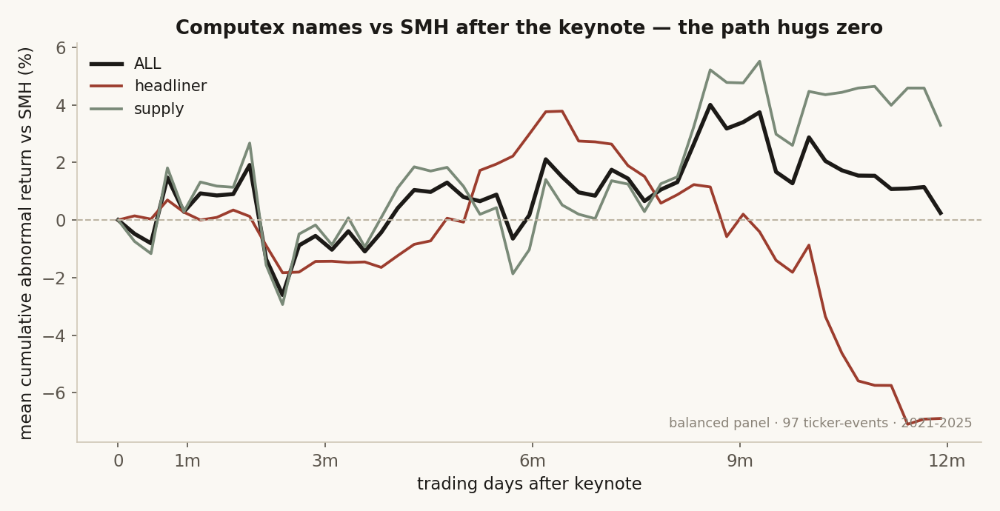
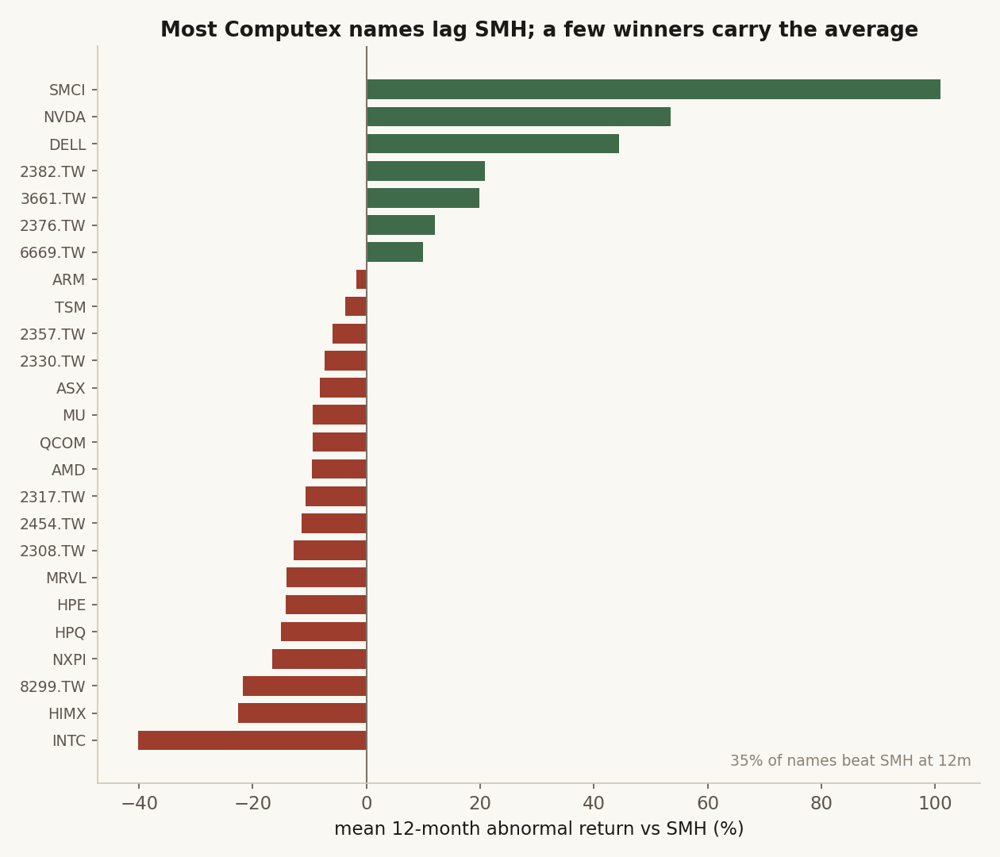
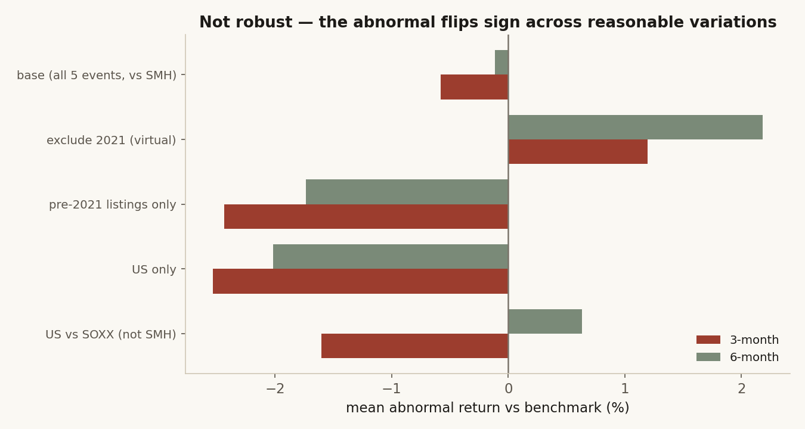

# 18 — Computex: does the chip complex outperform after the keynote?

**Question.** Computex Taipei is the year's set-piece for the semiconductor and AI-hardware industry — Jensen Huang, Lisa Su and the Taiwan supply chain on one stage. Does owning the names that headline or supply the show *beat the semiconductor tape* in the weeks and months after the keynote, or is the post-event run-up just sector beta you could get cheaper in an ETF?

**Finding.** No robust alpha. Across **five keynote events (2021–2025)** the post-event abnormal return versus the **SMH** semis ETF is near zero and **statistically insignificant at every horizon** (no cut × horizon cell reaches |t| ≥ 2 in the underlying run; the full per-cell t-grid is not enumerated in this README). It is also **not robust**: the point estimate *flips sign* under reasonable variations of the test (excluding the 2021 virtual show turns the 3-month abnormal **+1.2%**; restricting to names listed before 2021 turns it **−2.4%**; the base case is **−0.6%**, t ≈ −0.3). The one model-independent fact is that the **median Computex name beats SMH less than half the time** (35–41% across horizons): the complex's gains are carried by a handful of winners on a rising semis tape, not a Computex edge. The blunt version: **own SMH, not "the Computex basket."**

> Research / backtested. Five Computex keynotes (2021–2025) on a fixed, hand-cleaned **25-name** chip / AI-hardware complex (chip vendors + foundry / memory / components / server-OEM + Taiwan supply chain). **Total-return** event study versus SMH — US names use split-adjusted price plus USD cash dividends, Taiwan uses adjusted close. Reported with t-stats, a **robustness panel** and an **independent recompute** cross-check. Keynote transcripts self-collected; market data from the internal warehouse at $0. No live capital, no audited track record.

## Data & method

- **Universe.** A fixed set of 25 semiconductor / AI-hardware names that headline or supply Computex — held constant across all five years (chip headliners NVDA / AMD / INTC / QCOM / ARM / MRVL / NXP / MediaTek; supply chain TSMC, Foxconn, Quanta, ASUS, Gigabyte, Delta, Wiwynn, SMCI, Micron and peers). Pure-software mega-caps and off-topic tickers are excluded. Because the membership is today's complex applied to earlier years, the long-horizon (18–24m) results carry mild look-ahead and ride the AI bull — flagged where it matters.
- **Events & entry.** Each year's *verified keynote date* (2021-05-31 virtual · 2022-05-23 · 2023-05-29 · 2024-06-03 · 2025-05-19); entry is the next trading day's close. 122 ticker-events in total (25 names × 5 keynotes, less a handful of name-years a stock had not yet listed).
- **Return & benchmark.** Close-to-close **total return** at T+1d / 1w / 1m / 3m / 6m / 12m / 18m / 24m; **abnormal = name total return − SMH total return**. (SMH pays one annual December distribution versus the names' quarterly payouts, so short-horizon abnormal carries a sub-percent timing residual.)
- **Honesty checks.** The event-study cumulative-abnormal-return path is computed on a **balanced panel** (a constant 97-event sample with a full 12-month window) — i.e. only the ticker-events that have a complete 12-month forward return are retained, which drops the most recent keynote cohort and any not-yet-listed names and takes the 122 down to 97 — so the curve is not a composition artifact; t-stats use the sample standard deviation; a **robustness panel** re-runs the headline under drop-2021 / pre-2021-listings / US-only / SMH→SOXX; and one observation is **recomputed end-to-end independently** as a cross-check (it matches).

## Claim 1 — The post-keynote path hugs zero

Averaged across all five keynotes, the cumulative total return *minus SMH* drifts within roughly ±2% for the first six months and ends the year essentially flat (**+0.2%** for the whole complex). There is no persistent post-event drift up or down — the keynote does not buy you a sector-relative edge. The only visible divergence is late and lopsided: the **supply chain** grinds a few points above SMH while the **headliner chip vendors** crack lower at the long end — but that tail is the 2021–2023 cohorts riding (and then giving back) the AI melt-up, on a thinning sample, not a repeatable keynote effect.

## Claim 2 — Most names lag SMH; a few winners carry the average

The reason any "Computex basket" looks fine in raw terms is a textbook right-skew. At 12 months only **35%** of the names beat SMH; the *median* name lags. A small number of winners (the AI-cycle leaders) pull the mean up, while the broad middle and the OEM tail trail the index. An equal-weight basket therefore inherits the sector's beta and a bit of drag — exactly what you would *not* pay an active fee for.

## Claim 3 — And the effect isn't robust

A real edge survives reasonable changes to the test. This one doesn't. The 3-month and 6-month abnormal **change sign** depending on whether the 2021 virtual show is included and whether recent listings (e.g. the post-IPO names) are kept — and no variation clears significance. The US-only cut is the most negative (−2.5% at 3m, t ≈ −1.5 — a *suggestive* sell-the-news, but not significant); excluding 2021 is the most positive. When the answer depends this much on defensible judgment calls and never separates from chance, the honest read is *no effect*.

## So what

Computex is a genuine information event for the *industry* — products, roadmaps, supply-chain reads. It is not a tradable edge for the *stocks*: post-keynote, the complex is SMH with idiosyncratic noise, and the median name underperforms the ETF. If you want the semis exposure, buy the ETF; if you want alpha, it isn't in "buy the names that showed up at Computex." The one thread worth a longer look — the headliner chip vendors lagging the supply chain over 12 months-plus — is directional only and confounded by the cycle, not a finding.

*Research / backtested. Not investment advice.*
