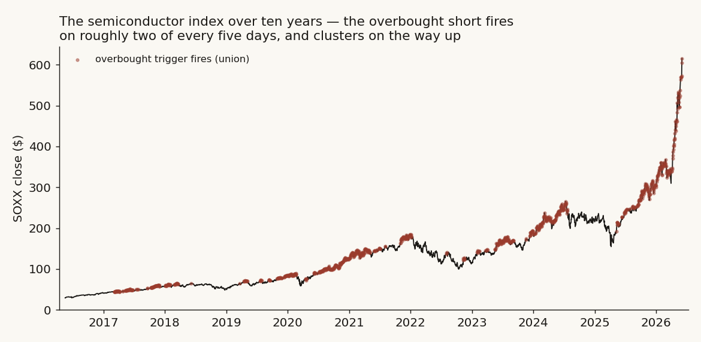
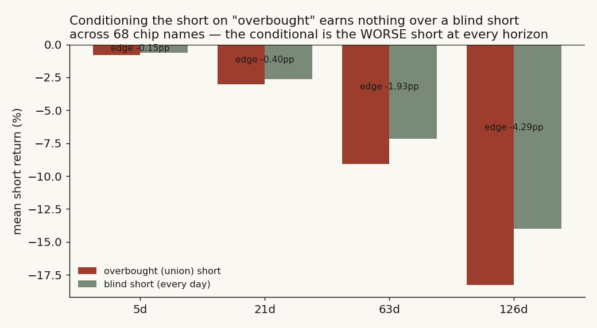
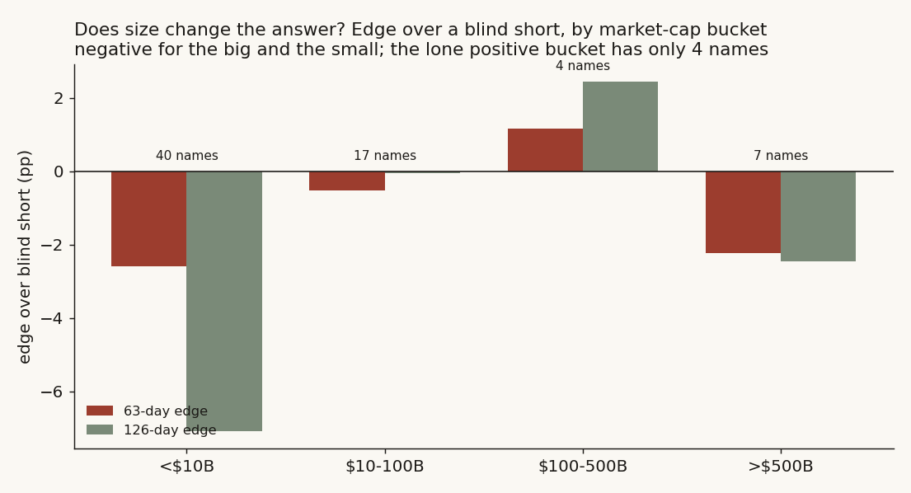
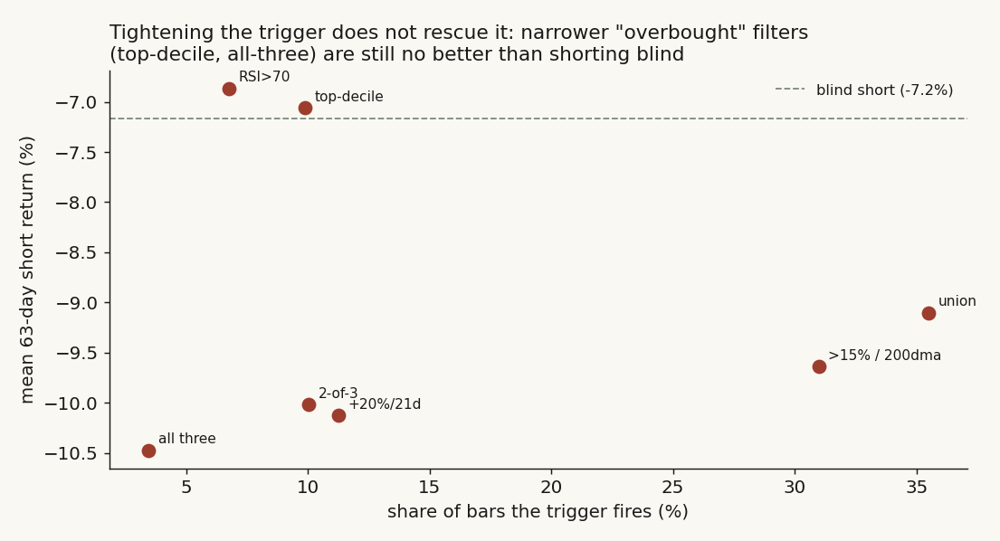
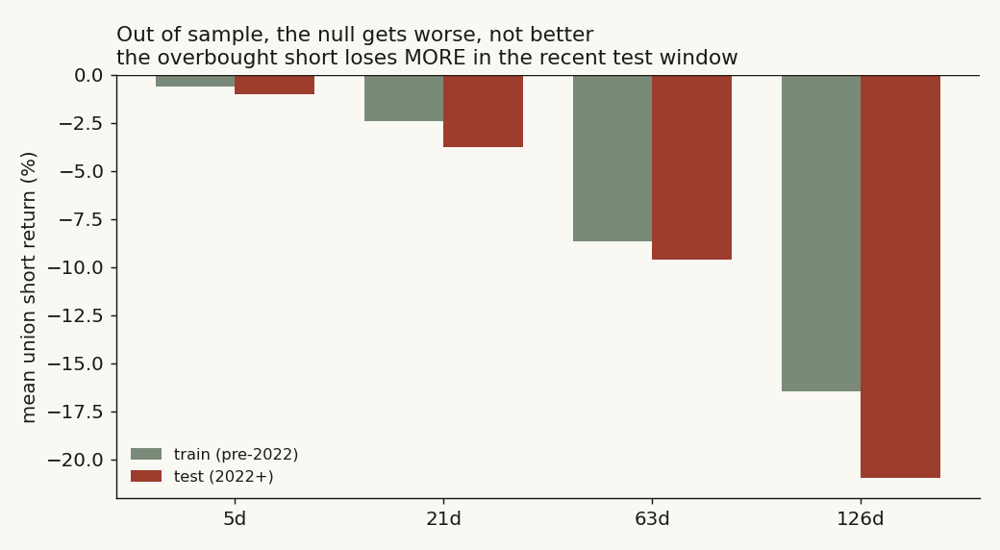

# 19 — Shorting the semis: does an "overbought" reading tell you when a short pays?

**The question.** Chip stocks run hot. Every few months one of them, or the whole index, looks stretched: the RSI is north of 70, the price is way above its 200-day line, it just ran +20% in a month. The folk wisdom says *that's* the moment to fade it. I wanted to know if the folk wisdom is worth anything. Does shorting a semiconductor *because* it looks overbought beat just shorting it on any random day? **Short answer: no — and once I tested it properly across 68 chip names instead of one index, the overbought short turned out to be the *worse* short.**

Why it matters: "fade the overbought chip" is one of the most repeated retail setups there is. If it has no edge, that is worth knowing before you put on the trade. And the only honest thing to do with a setup that everyone believes is to test it on the biggest pile of data you can find and see if it survives.

> Research / backtested. No live capital, no audited track record. Returns are point-to-point and the figures below carry no borrow cost or slippage (I add a borrow haircut later and it does not change the verdict). A real short of a hot chip can be margin-called by an interim spike that an endpoint return never shows, so the lived experience is worse than every number here.

## What I found, up front

- Across **68 US-listed semiconductor stocks** over ten years, conditioning a short on "overbought" earns **nothing** over shorting blind. The edge is **negative at every horizon** (−0.15 / −0.40 / −1.93 / −4.29 percentage points at 5 / 21 / 63 / 126 days). The overbought short is not a better short — it is a slightly worse one.
- The reason is mechanical and a little funny: overbought chips keep going up. Deep-negative short returns are **melt-up risk**, not a strong sell signal. The setups that look *most* extreme produce the *deepest* short losses.
- **Size does not save it.** Split into four market-cap buckets, the edge is negative for the giants (>$500B) and negative for the minnows (<$10B). The only bucket with a positive edge — $100–500B, +2.45pp at 126d — has just **four names**, so I am not going to pretend that is a finding.
- **Narrowing the trigger does not save it either.** Going from a loose "any of three" filter (fires 36% of days) down to "all three at once" (fires 3.5% of days) makes the short *more* negative, not less. A selective overbought short is still a bad short.
- It holds **out of sample** (worse in the 2022+ test window than in training) and the original index-only version reproduces **exactly** on both SOXX and SMH.
- The honest verdict: **No.** Overbought tells you when shorts *hurt most*, not when they pay.

## What I expected, and how I'd know if I was wrong

My prior, going in, was the lazy one: surely something that has gone up too far and too fast is more likely to fall back. Mean reversion. If that were true, a short opened on an overbought bar should beat a short opened on a normal bar.

So the clean test is a race between two shorts:

- **H0 (the null I expected to reject):** an overbought short does no better than a blind short — same expected return.
- **H1 (the mean-reversion story):** the overbought short earns *more* than the blind short, because stretched names snap back.

What would prove me wrong about H1: if the overbought short's mean return is no higher than the blind short's (or lower), the setup has no edge. I am not testing "does the short make money" — in a market that mostly goes up, every short loses on average. I am testing **edge**: overbought versus blind. That subtraction is the whole point, because it strips out the fact that chips drift up. The same drift hits both legs, so what's left is whatever the "overbought" label actually adds.

One honest worry I had before I started: if "overbought" is defined loosely enough, it fires almost every day, and then it *is* the blind short, and a zero edge would be a tautology, not a discovery. I deal with that head-on below by reporting how often the trigger fires and by tightening it until it fires rarely.

## How I set it up

**The triggers.** Three standard "overbought" reads, the ones people actually quote:

- **(a)** RSI(14) > 70 — the classic momentum oscillator running hot.
- **(b)** price more than **15% above** its 200-day moving average — stretched versus trend.
- **(c)** trailing **21-day return above +20%** — a one-month melt-up.

I test each alone, their **union** (any of the three — the loosest, most-tradeable version), and three *narrowed* versions: **2-of-3**, **all three at once**, and a per-name **top-decile** of the 200-day band.

**The trade.** On every bar where the trigger is live, open a short and hold it 5, 21, 63, or 126 trading days. The short return is just the negative of the stock's forward return over that window. Daily moves are winsorized at ±50% to kill bad ticks. Every name gets a 200-day warm-up before it is eligible, so the moving average is real.

**The baseline — this is the load-bearing piece.** Every conditional cohort is raced against the **blind short**: a short opened on *every* eligible bar of the same name. Edge = conditional mean − blind mean. If overbought is doing any work, the conditional has to beat the blind. The identification problem here is drift: chips go up, so any short loses, and you can fool yourself into thinking a losing short "works" if you forget what the unconditional baseline is. The blind short is that baseline.

**Inference, honestly.** The long-horizon windows overlap heavily — a 126-day hold opened today shares 125 days with the one opened tomorrow — so the printed sample size badly overstates the independent information. I do two things about it: (1) I report confidence intervals from a **cluster bootstrap that resamples (name, calendar-month) blocks**, not individual days, so overlapping bars inside a month travel together; and (2) I count **distinct overbought episodes** (runs of trigger days separated by a 10-day gap) so the reader sees how few independent events really sit behind each cell.

## The data

- **Universe:** every US-listed semiconductor common stock and ADR in the SIC "semiconductors & related devices" group, plus four obvious foreign chip names the tag misses (TSM, ASML, UMC, STM), keeping only names with at least ~3 years of daily history after the 200-day warm-up. That leaves **68 names**. This is the full set the warehouse supports, not a hand-picked basket.
- **Cap buckets:** because this is a cross-section where size plausibly matters, I split the 68 into four buckets by market cap (a clean vendor snapshot; the per-filing diluted-share route is unreliable for ADRs and carries unit errors, so I use the snapshot and say so):
  - **>$500B (7):** NVDA, TSM, AVGO, MU, AMD, ASML, INTC
  - **$100–500B (4):** AMAT, TXN, ADI, MRVL
  - **$10–100B (17):** MPWR, NXPI, STM, MCHP, ON, UMC, CRDO, MTSI, FSLR, SITM, AMKR, LSCC, AAOI, RMBS, SMTC, VIAV, SWKS
  - **<$10B (40):** FORM, MXL, CRUS, QRVO, ALGM, SLAB, ENPH, KLIC, SYNA, DIOD, IPGP, POWI, UCTT, SEDG, AMBA, WOLF, PLAB, ICHR, and 22 more
- **Index anchor:** two large semiconductor index ETFs (SOXX, SMH), ~10 years of daily bars each, used to reproduce the original index-only study and as a second-index cross-check.
- **Series:** daily OHLC from the warehouse, May-2016 to Jun-2026; the only transform is the ±50% daily winsorization and the 200-day warm-up.

## What the data looks like before any test

Here is the index with every overbought (union) trigger marked. Two things jump out, and they frame the whole study. First, the triggers **cluster on the way up** — overbought is a feature of an uptrend, not a top. Second, the union fires on **roughly two of every five days** (40% of SOXX bars). That second fact is the one I worried about: a filter that is on 40% of the time is barely different from "always."



So before any clever statistics, the picture already whispers the answer: if "overbought" is mostly just "in an uptrend," shorting it is mostly just shorting an uptrend.

## Finding 1 — Conditioning on "overbought" earns nothing, and is the worse short

**What I expected & why.** If mean reversion is real, the overbought short should beat the blind short. That's H1.

**How I measured it.** Pool all 68 names. For each horizon, take the mean short return on union-triggered bars and subtract the mean short return on all eligible bars (the blind short).

```python
# per name: union = (RSI14>70) | (price/sma200 - 1 > 0.15) | (ret_21 > 0.20)
# short_ret(h) = -(P[t+h]/P[t] - 1), daily moves winsorized at +/-50%
edge_h = mean(short_ret[h] over union bars) - mean(short_ret[h] over ALL eligible bars)
# CI from a (ticker, year-month) cluster bootstrap so overlapping bars move together
```

**What the data shows.** The union short loses at every horizon, the blind short loses at every horizon (because chips go up), and the *difference* — the only thing I care about — is **negative everywhere**.



| Horizon | union n | % short won | median union | mean union | blind mean | **edge vs blind** | cluster CI on mean | distinct episodes |
|--------:|--------:|------------:|-------------:|-----------:|-----------:|------------------:|-------------------:|------------------:|
| 5d   | 50,642 | 48.0% | −0.26% | −0.80%  | −0.65%  | **−0.15pp** | [−1.0%, −0.6%]   | 1,492 |
| 21d  | 49,672 | 46.7% | −1.03% | −3.04%  | −2.65%  | **−0.40pp** | [−3.7%, −2.4%]   | 1,486 |
| 63d  | 47,877 | 44.7% | −2.90% | −9.10%  | −7.17%  | **−1.93pp** | [−10.7%, −7.7%]  | 1,453 |
| 126d | 45,089 | 42.4% | −6.22% | −18.29% | −14.00% | **−4.29pp** | [−21.3%, −15.5%] | 1,414 |

**Why (mechanism).** These are short returns, so a *more-negative* number is a *worse* short. The overbought short is more negative than the blind short, which means the bars labelled "overbought" were, on average, **followed by bigger up-moves** than ordinary bars. Cash it out: short SOXX after a hot +20% month and hold a quarter, and on average you lost about 9% — versus 7% if you'd shorted on a coin-flip day. The label cost you two points. It pointed you at the names about to melt up.

**What I checked.** The mechanism predicts the union short fires disproportionately right before the index's strongest stretches — and the trigger map above shows exactly that clustering ahead of the 2020–21 and 2024–26 climbs. The base rate is the other check: the union is live on **35.5% of pooled bars**, so it is mechanically close to the blind short by construction. That makes the ~0 (negative) edge partly a definitional fact — "overbought" as commonly defined does not isolate a distinct state. I tighten the definition in Finding 3 to make sure the null is not just an artifact of a near-always-on filter.

**Verdict.** **Confirmed null, and then some.** Edge is negative at all four horizons; the cluster-bootstrap CI on the union mean sits entirely below zero (the short loses), and the edge over blind is at best a rounding error and at worst −4.3pp. H1 (mean reversion pays) is rejected.

## Finding 2 — Does size change the answer? Mostly no

**What I expected & why.** Maybe the null is a big-cap thing — the megacaps trend so hard that nothing fades them, but smaller, jumpier names might actually mean-revert when they get hot. So I split the 68 into four cap buckets and ran the same race in each.

**How I measured it.** Same edge calculation, restricted to the names in each bucket, with its *own* blind-short baseline so I am comparing like with like inside each size class.

**What the data shows.** Size does not rescue the setup. The edge is negative for the giants and negative for the minnows. There is one positive bucket — but read the name count before getting excited.



| Bucket | names | base rate | 21d edge | 63d edge | 126d edge | 126d cluster CI (union mean) |
|---|---:|---:|---:|---:|---:|---:|
| <$10B    | 40 | 32.4% | −0.36pp | −2.58pp | **−7.09pp** | [−24.8%, −14.0%] |
| $10–100B | 17 | 37.7% | −0.27pp | −0.52pp | −0.04pp     | [−19.1%, −12.6%] |
| $100–500B | 4 | 32.3% | +0.41pp | +1.16pp | **+2.45pp** | [−13.7%, −6.5%]  |
| >$500B    | 7 | 47.4% | −0.68pp | −2.23pp | −2.45pp     | [−27.5%, −19.6%] |

**Why (mechanism).** The pattern actually fits the melt-up story. The minnows (<$10B) have the fattest right tails — when a small chip name rips, it *really* rips — so the overbought short there is the most dangerous, −7pp at 126d. The megacaps (>$500B) are the strongest trenders, so fading them also loses. The middle is where the only positive edge shows up, and it is a four-name bucket (AMAT, TXN, ADI, MRVL); +2.45pp from four names that happen to be slightly more cyclical and less melt-up-prone is not something I would trade or even call real.

**What I checked.** The four-name bucket is the obvious place to get fooled, so I leaned on the cluster CI: even there the *union short itself* still loses money (126d mean −10.0%, CI [−13.7%, −6.5%]) — a positive *edge* over a losing blind short is not a profitable trade, just a less-bad loss. And with four names the bucket is one cyclical wobble away from flipping sign.

**Verdict.** **Conditional, leaning null.** The answer does not depend on size in any way you could trade: three of four buckets are negative, the positive one is four names and still loses in absolute terms. The size cut sharpens the mechanism (melt-up risk is worst in the smallest names) without producing an edge anywhere.

## Finding 3 — Tightening the trigger doesn't help; it hurts

**What I expected & why.** The fair objection to Finding 1 is that the union is too loose — 36% of days is barely a filter. A real trader would wait for a *genuinely* extreme reading. So maybe a selective overbought short pays even if the sloppy one doesn't. I tested that directly by ratcheting the filter from "any one trigger" down to "all three at once," cutting the base rate from 36% toward 3.5%.

**How I measured it.** Run the same short for each trigger flavour and plot mean 63-day short return against how often the trigger fires, with the blind short as the reference line.

**What the data shows.** Selectivity makes the short *worse*, not better. Every narrower filter sits at or below the blind-short line.



| Filter | base rate | 5d | 21d | 63d | 126d |
|---|---:|---:|---:|---:|---:|
| RSI14 > 70           |  6.7% | −0.73% | −2.86% | −6.86%  | −17.45% |
| > 15% above 200dma   | 31.0% | −0.81% | −3.29% | −9.64%  | −18.86% |
| 21d return > +20%    | 11.2% | −1.19% | −3.92% | −10.12% | −22.20% |
| union (a or b or c)  | 35.5% | −0.80% | −3.04% | −9.10%  | −18.29% |
| 2-of-3               | 10.0% | −1.07% | −4.07% | −10.01% | −21.76% |
| top-decile band      |  9.9% | −0.58% | −2.48% | −7.06%  | −16.17% |
| **all three at once**|  **3.5%** | **−1.21%** | **−4.82%** | **−10.47%** | **−25.20%** |

**Why (mechanism).** This is the cleanest confirmation in the whole study. The *more* extreme the overbought reading, the *more* you are standing in front of a melt-up, and the worse the short does. "All three at once," the rarest and most-stretched 3.5% of bars, is the single worst short on the board at −25% over 126 days. The one filter that even *touches* the blind line is the top-decile band, and it sits right on it (−7.06% vs −7.17% blind, +0.11pp edge): selective, and still no edge.

**What I checked.** This also disposes of the earlier worry that the union null was just "a 40%-on filter is basically the blind short." It isn't a definitional artifact: a 3.5%-on, genuinely selective filter has *zero* edge too (actually negative). The null survives a real filter, which is the version of the test that matters.

**Verdict.** **Confirmed null on the selective filter.** Even a genuinely picky overbought short does not pay — a stronger statement than the original index study could make.

## Did I just find noise? Out of sample, and after costs

Two ways the null could be fake: it could be one regime, or it could flip once you add the costs the headline ignores.

**Out of sample.** Split the union short into a training window (pre-2022) and a test window (2022+). If the null were a quirk of one era, the test would look different. It looks *worse*: the union short loses more in the test window at every horizon (126d mean −16.4% in training, −21.0% in the test), and the edge over blind drops from roughly flat in training to clearly negative in the test (−2.3pp falling to −7.1pp at 126d). The setup did not work before and worked even less afterward.



**Costs.** The headline carries no borrow fee, and the caveat-only "a real short prints worse" promise needed numbers. So I applied a borrow haircut at 0.5% / 2% / 5% annualized to **both** legs (cost drags the short, and it drags the blind short equally). The absolute loss deepens — the 126d union short goes from −18.3% to −20.8% at a punishing 5% borrow — but because the cost hits both legs, the **edge over blind is unchanged to two decimals** (still −0.15 / −0.40 / −1.93 / −4.29pp). That is the clean argument: costs cannot turn a no-edge short into an edge; they only make every short hurt more.

## Steelman the other side

Three honest rivals to "the setup has no edge," and what kills each:

1. **"You defined overbought too loosely; a real signal is in there."** Tested directly in Finding 3 — the narrowest, all-three filter (3.5% of days) is the *worst* short on the board. A selective definition does not hide an edge.
2. **"It's a megacap distortion — NVDA-style trenders drown a real small-cap reversion."** Tested in Finding 2 — the smallest bucket has the *most* negative edge (−7pp), the opposite of the rival's prediction. Reversion is not hiding in the small names; melt-up risk is worst there.
3. **"The point-to-point return hides a real intraday reversion you'd capture with stops."** I can't fully exclude this with daily endpoint data — and it cuts against the short, not for it. The path risk (an interim spike) makes a held short *worse* than its endpoint, so a real, stop-constrained shorter does worse than these tables, not better. This is a limit, and it pushes the verdict deeper into the null.

## The answer, in the data

**Q: Does conditioning a semiconductor short on "overbought" beat shorting blind?**
**A: No.** Across 68 chip names and ten years, the overbought short earns a negative edge at every horizon, the effect does not depend on size in any tradeable way, a genuinely selective filter is the *worst* short of all, and the null is worse out of sample and unmoved by borrow costs. Overbought is a melt-up warning, not a short signal.

| Scope (union short) | cells tested | how often the edge is negative | best edge seen | worst edge seen |
|---|---:|---:|---:|---:|
| Pooled, 68 names | 4 | 4 of 4 negative | −0.15pp (5d) | −4.29pp (126d) |
| By cap bucket | 16 (4×4) | 12 of 16 negative | +2.45pp (4-name bucket) | −7.09pp (<$10B, 126d) |
| Narrowed filters | 24 (6×4) | 24 of 24 no-better-than-blind | ≈0 (top-decile) | the all-three short is the deepest loss |
| OOS test (2022+) | 4 | 4 of 4 negative | −0.36pp (5d) | −7.13pp (126d) |
| Index anchor (SOXX/SMH) | 8 | reproduces original; edge ≈ 0 | +0.61pp (SOXX 21d) | −1.81pp (SMH 126d) |

The index-only anchor reproduces the original study to the decimal (SOXX edge +0.22 / +0.61 / +0.59 / −0.33pp; 27 distinct episodes over ten years), and SMH gives the same shape (+0.11 / +0.31 / −0.31 / −1.81pp). The single-name cross-section pushes the verdict from "≈0 edge" to "negative edge," because the per-name melt-up tails are fatter than the index's diversified one.

## Caveats, with the direction of the bias

- **No execution path.** Returns are endpoint-to-endpoint; a real short held 126 days can be margin-called by an interim spike the endpoint never shows. Direction: the realized result is **worse** than these tables, deeper into the null.
- **Overlap inflates n.** The printed n (tens of thousands) is overlapping bars; the honest count is the **distinct-episode** column (~1,400–1,500 pooled, 27 at the index level). The long-horizon cells rest on far fewer independent events than n suggests; I report cluster-bootstrap CIs and episode counts so the reader weights them accordingly. Direction: tighter-looking intervals than reality.
- **Cap snapshot, not point-in-time.** Bucket assignment uses a recent market-cap snapshot, so a name that grew across the decade is bucketed by its current size. Direction: blurs the bucket edges slightly; unlikely to flip the all-negative pattern given how lopsided it is.
- **Survivorship.** The universe is names that survived to today with 3+ years of history; chips that delisted or blew up are absent. Direction: their tails would make shorts look *better*, so the true null may be marginally less negative — but it does not create an edge.
- **No present-day analog.** The index is currently stretched far beyond anything in the sample (well past +40–50% above the 200-day, the prior peaks). There is no in-sample state this extreme, so the tables **bound** the question rather than forecast today. The only honest guide for now is the negative base rate.

## How to reproduce this

The governing rule, with the fitted numbers:

```text
For each name n and bar t (after a 200-day warm-up):
  union[t]   = RSI14[t] > 70  OR  (close[t]/SMA200[t] - 1) > 0.15  OR  ret21[t] > 0.20
  short_h[t] = -(close[t+h]/close[t] - 1),  daily moves winsorized at +/-50%, h in {5,21,63,126}
  edge_h     = mean(short_h | union) - mean(short_h | all eligible bars)   # vs blind short
Pooled fit (68 names): edge = [-0.15, -0.40, -1.93, -4.29] pp at h = [5,21,63,126]
CIs from a (ticker, calendar-month) cluster bootstrap, 2,000 resamples; episodes = runs of
trigger bars separated by a >10-day gap.
```

Universe: 68 US-listed semiconductor common stocks/ADRs (SIC semiconductors group + TSM/ASML/UMC/STM), ≥3y daily history, May-2016→Jun-2026, from a private warehouse. Index anchor: SOXX, SMH. The full pipeline (signal construction, bucketing, bootstrap, figures) lives in a notebook; the box above is the load-bearing logic.

## References & where this sits

- Public daily price history for US semiconductor equities and two large-cap semiconductor index ETFs.
- RSI(14), the 200-day moving-average band, and trailing-return triggers are standard technical definitions; no third-party analysis is reproduced.
- Builds on **study 11** (semiconductor concentration — winners don't persist) and **study 17** (the chip-chain roster) for the universe, and shares the melt-up theme with **study 16** (narrow leadership).
- Next: a path-aware version (stops and interim drawdown, not endpoint returns) to put a number on how much worse the lived short is than the point-to-point one.
