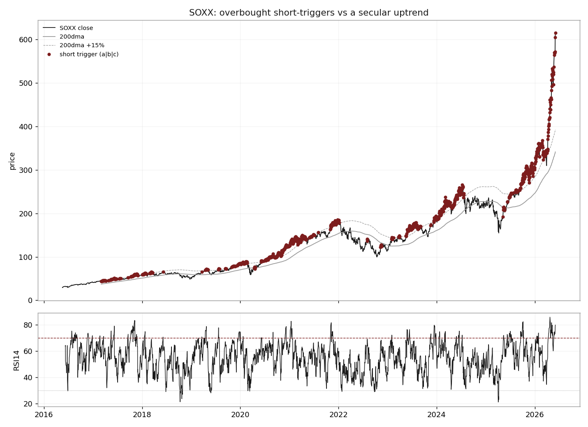
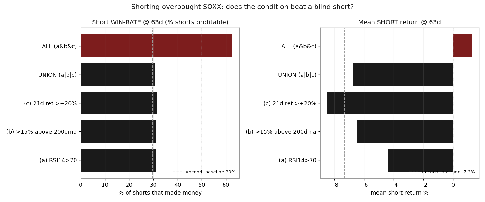

# 19 — Shorting overbought semiconductors does not pay

**Question.** Does conditioning a short on the semiconductor index on an "overbought" reading — RSI(14) > 70, price > 15% above its 200-day average, or a trailing 21-day return above +20% — earn anything over a blind short? **Answer:** No. Every condition at every horizon loses money, and the edge over a blind short rounds to zero. The setup tells you *when shorts hurt most*, not when they pay.

> Research / backtested. No live capital, no audited track record. Returns are point-to-point and carry no borrow cost — a real short of a hot semi ETF would print *worse* than every number here, and a long hold can be margin-called by an interim spike the endpoint never shows.

## Data & method

The semiconductor index over ~10 years (May-2016 to Jun-2026, 2,326 daily bars after a 200-day warm-up). Three "overbought" triggers are tested individually and as a union; a short is opened on each triggered bar and held 5 / 21 / 63 / 126 trading days, with the short return defined as the negative of the forward index return (daily returns winsorized at +/-50% to kill bad ticks). Each conditional cohort is compared against the **blind-short baseline** — a short on *every* valid bar — so the question is edge, not raw P&L. Validation: a walk-forward train/test split (pre-2022 vs 2022+), a cross-check that re-runs the whole study on a second semiconductor index, and block-bootstrap confidence intervals (read for sign, not significance — see Caveats).

## Claim 1 — Every condition loses, and the edge over a blind short is ~0

The tradable trigger is the **union** of the three conditions. Across horizons the share of profitable shorts falls from ~45% at one week to ~17% at six months; the median and mean short return are negative everywhere; and the edge over a blind short is a fraction of a point — even slightly *negative* at six months.

| Horizon | n | % positive (short won) | Median short ret | Mean short ret | Blind-short mean | Edge vs blind |
|--------:|--:|----------------------:|-----------------:|---------------:|-----------------:|--------------:|
| 5d   | 938 | 44.9% | -0.35%  | -0.44%  | -0.66%  | +0.22pp |
| 21d  | 922 | 40.1% | -2.09%  | -2.07%  | -2.67%  | +0.60pp |
| 63d  | 884 | 30.5% | -7.14%  | -6.73%  | -7.32%  | +0.59pp |
| 126d | 821 | 17.4% | -12.76% | -14.80% | -14.46% | -0.34pp |

The blind short already loses (-2.7% / -7.3% / -14.5% at 21d / 63d / 126d) because the index simply goes up. The conditions do not meaningfully separate from that. **Answer: No** — shorting the overbought index carries essentially no edge over shorting it blindly, and both lose.

## Claim 2 — The "strongest-looking" condition is the worst short, not the best

These are **short** returns, so a more-negative mean is a *worse* short. The condition that looks most aggressive — a +20% one-month burst — produces the deepest-negative means and a *negative* edge, because those bursts cluster right before the biggest melt-ups, which crush shorts.

| Condition | 5d | 21d | 63d | 126d |
|---|---:|---:|---:|---:|
| (a) RSI14 > 70 | -0.30% | -3.45% | -4.36% | -10.94% |
| (b) > 15% above 200dma | -0.44% | -2.03% | -6.45% | -14.07% |
| (c) 21d return > +20% | -2.25% | -8.36% | -8.46% | -24.32% |
| Union (a or b or c) | -0.44% | -2.07% | -6.73% | -14.80% |
| All three at once | -3.06% | -15.67% | +1.26% | -11.17% |

The lone positive cell (all-three at 63d, +1.26%) rests on a handful of overlapping bars — effectively one or two episodes — and is noise. Deeply-negative short returns should be read as **melt-up risk**, not as a stronger short signal. **Answer: No** — there is no "real" short condition hiding in the cuts; the deepest-loss ones are the worst to trade.

## Claim 3 — The null is robust out-of-sample and on a second index

Walk-forward, union-style shorting loses in **both** halves and loses *more* in the recent test window (126d mean -12.2% train vs -18.9% test) — this is not a one-regime artifact; it got worse. Re-running the entire study on a second semiconductor index reproduces the same sign and magnitude (union short returns -0.6% / -2.5% / -8.4% / -18.1%) with the same ~zero separation from its own blind-short baseline. **Answer: No** — the result replicates.

A note on the present: the union setup *is* live on the latest bar, but at an unprecedented +80% above the 200-day average — far beyond anything in the sample (the prior peak topped near +40-50%). There is **no in-sample analog** for an extension this stretched, so the tables bound the question rather than forecast today. The only honest guide is the negative base rate: across ten years, shorting this index lost money on average, overbought or not.

## Caveats

- **No costs.** No borrow/financing fee, no slippage, no live execution. Real shorting of a hot semi ETF carries a borrow cost that pushes every number further negative.
- **Point-to-point hides path risk.** A 126-day return is endpoint-to-endpoint; a short held that long can be margin-called or stopped out by an interim spike the endpoint never shows. The realized loss for a constrained shorter is typically worse than these tables.
- **Overlap inflates n.** At 63d/126d the trigger windows overlap almost completely, so the effective independent sample is a few distinct melt-up episodes, not the printed n. Read the long-horizon cells as a handful of episodes.
- **Significance stars are not trustworthy.** Some long-horizon cells flag a CI that excludes zero, but the bootstrap block is shorter than the holding window, so those CIs come out too tight. Trust the **sign** (short loses, edge ~0), not the stars.
- **No present-day analog.** The current +80%-above-200dma extension is off the sample's scale; the tables describe milder overbought states.
- **Survivorship.** This is about surviving index ETFs, not single-name semis, whose short tails differ.

**Bottom line:** Shorting overbought semis does not pay — the edge over a blind short is ~0, the blind short itself loses, and the result holds out-of-sample and on a second index. The setup is live today at an extension with no historical precedent, so the negative base rate, not the in-sample point estimates, is the only honest guide.

## References

- Public daily price history for two large-cap US semiconductor index ETFs.
- RSI(14), 200-day moving-average band, and trailing-return triggers are standard technical definitions.
- Industry context on the semiconductor up-cycle informed framing only; no third-party analysis is reproduced.
