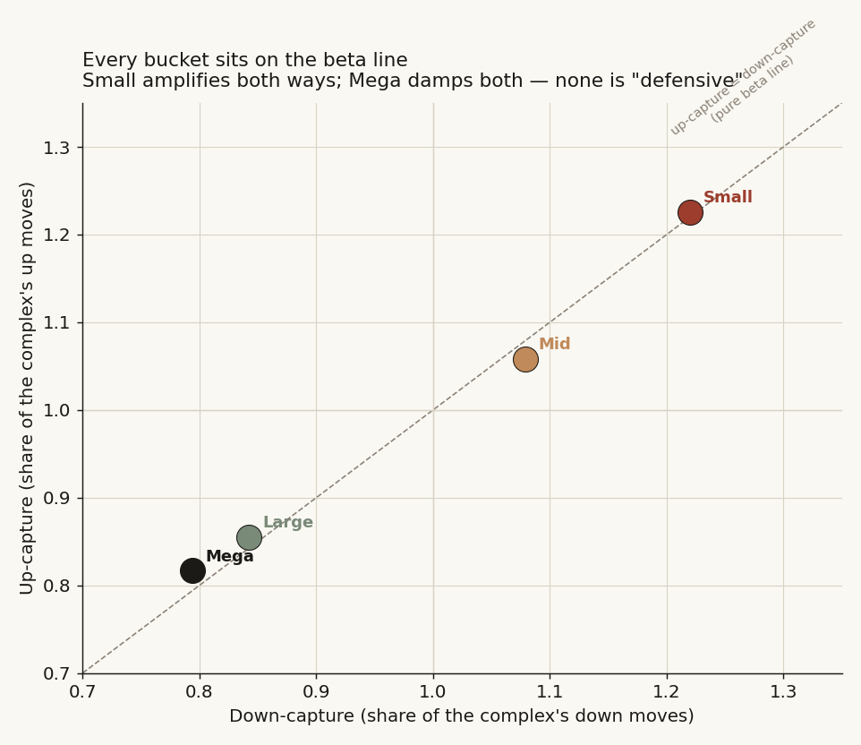
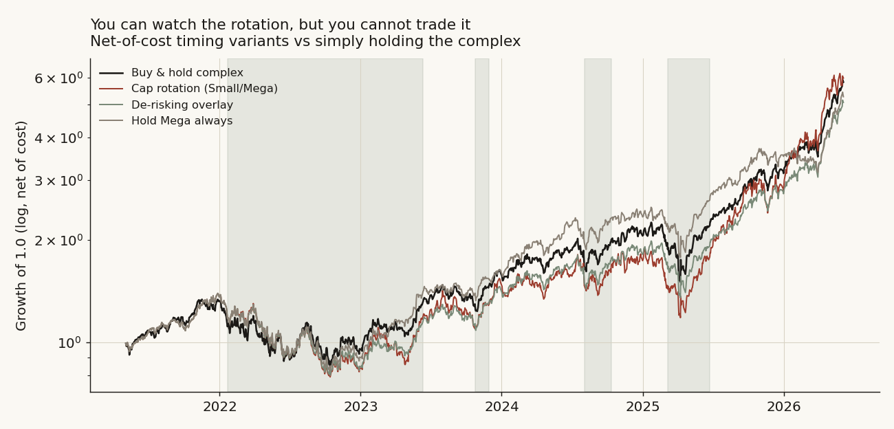
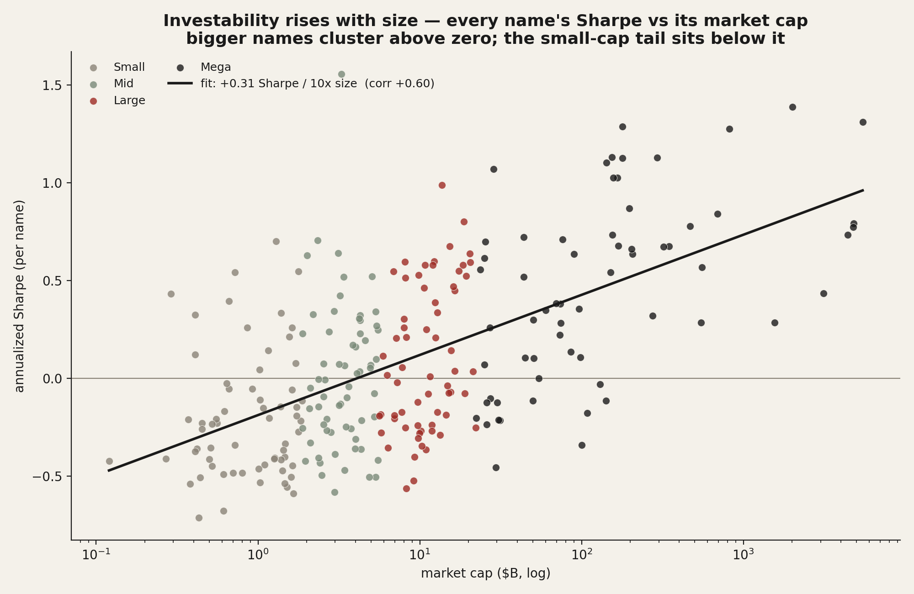
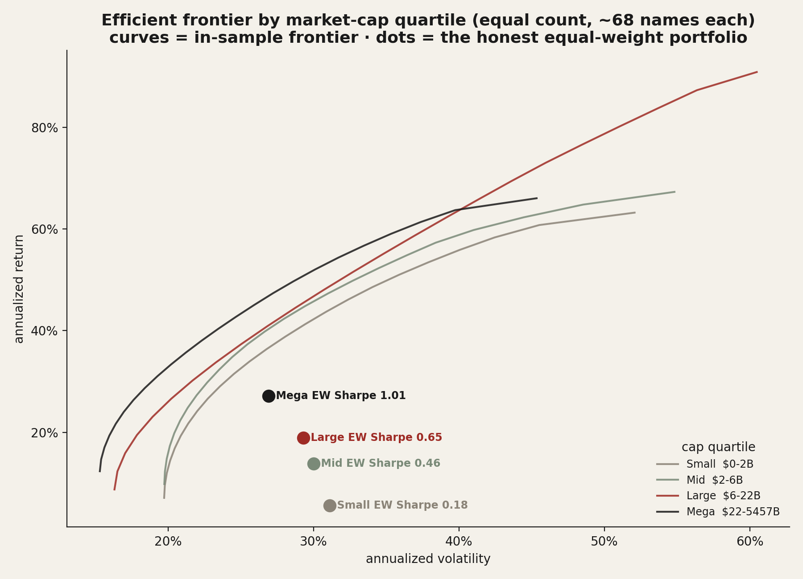
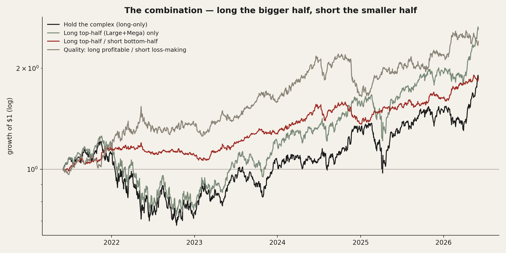

# 20 — Sector rotation: does money rotate with the market cycle, and can you trade it?

There is a tidy story traders tell about market cycles. When the index is climbing, money chases the risky, fast-moving stuff — tech, small caps, the dream. When it turns down, money runs for shelter — staples, utilities, the giants with real cash flow. "Risk-on, risk-off." I wanted to know whether that rotation is actually *there* in the prices, and — the part that pays the bills — whether you can trade it.

I came at it three ways, on two different datasets, because one cut can fool you and three agreeing cannot. First **by sector** (the nine SPDR sector funds, the textbook cyclical-vs-defensive split). Then **by size** (the AI/tech complex carved into market-cap tiers, since inside one sector "size" is the cleanest version of risk-on/risk-off). And finally, when the timing answer came back "no," I asked the question that actually matters for a portfolio: if you can't *time* the rotation, **which slice of the market is simply worth owning** — and is the obvious trade (own the giants, avoid the minnows) real?

**The short version:** the rotation is real where a genuine factor separates the groups (defensive vs cyclical sectors) and absent where the only difference is beta (size). But you cannot *time* it in either cut — every causal rule loses to just holding the index. What you *can* do is pick the right slice: investability climbs cleanly with size, the typical small AI/tech name is a bad bet (negative Sharpe, deep drawdowns, often loss-making), and a static "own the giants, short the minnows" tilt earned the best risk-adjusted return in the sample — though that last one is a regime-specific factor bet, not a timing edge.

> Research / backtested. No live capital, no audited track record. "Money flow" is read as **relative price strength** and **up/down-capture** — the price footprint of demand — not literal fund creation/redemption, which is not in the data. Regime episode counts are small (three bears for the sector cut, four drawdowns for the size cut), so descriptive magnitudes are economically clear but statistically wide.

## Summary of results

- **By sector — rotation is real and large, but not tradeable.** Inside bear markets the defensive basket (staples, utilities, health care) beat the market by 15–20 points annualized; cyclicals led by a similar margin in bulls; energy marched to the inflation cycle instead. Yet a causal 200-day rotation netted **0.61 Sharpe vs 0.77 for buy-and-hold**, cut no drawdown, and the probability of backtest overfitting was **94%**.
- **By size — there is no rotation at all, just beta.** Every cap bucket's up-capture equals its down-capture (spreads on zero, p ≥ 0.11); the "defensive small-cap in bears" reading is a calendar artifact (measured peak-to-trough, small caps fell *hardest* in 4 of 4 drawdowns, −32% vs −23%). The causal cap rotation lost to buy-and-hold and to its own random-timing placebo.
- **Investability climbs monotonically with size — a clean line.** Across 253 names in equal-count cap quartiles, a name's Sharpe rises **+0.31 for every 10× of market cap** (correlation +0.60). Median single-name Sharpe runs Small **−0.25** → Mid −0.04 → Large +0.02 → Mega **+0.52**; the share of "investable" names runs **14% → 32% → 40% → 71%**; loss-makers run **28 of 64** smallest down to **7 of 63** largest; median drawdown −84% (smallest) vs −56% (largest).
- **The efficient frontier is a trap when buckets are unbalanced.** With 143 small vs 11 mega, in-sample optimization crowns the small bucket purely because it has more names to cherry-pick from (its max-Sharpe inflated to 5.18). With **equal-count quartiles** the artifact vanishes and even the optimized frontier is monotonic with size (Small 1.43 → Mega 1.74); the honest equal-weight read agrees (Small 0.18 → Mega 1.01).
- **The combination — own the bigger half, short the smaller half — worked in-sample.** Long top-half / short bottom-half earned the best Sharpe (**1.29**, +13%/yr, a third of the volatility, drawdown −14% vs −44%), positive in both walk-forward halves [1.18, 1.40]. But it is a regime-specific size/quality *factor* bet (one mega-cap-tech bull, gross of borrow), not the *rotation timing* the study set out to find.
- **The spine:** measure the rotation two ways → find it's real-but-untimeable (sectors) and not-even-real (size) → pivot to "what is worth owning" → frontier + per-name quality + the long/short → graded verdict.

## What I expected, and why

The plain prior is one sentence: **if money rotates with the cycle, defensive groups should beat the market when it falls and lag when it rises, and the flip should be reliable enough to trade.** For the size cut the same sentence reads: small, high-beta names lead in up-legs and get dumped in down-legs, megas are the shelter.

I lean on exactly one published idea because it sharpens the test: up/down-**capture** (the Morningstar convention) asks "in down months, what fraction of the market's loss did this thing take?" A genuinely defensive asset has down-capture well below 1 and up-capture near 1. A pure-beta asset has up-capture and down-capture roughly *equal*. That single comparison — is the up/down spread different from zero? — is the cleanest "defensive?" test there is, so I lead with it in both cuts.

- **H0 (the null):** a group's behaviour relative to the market is the same in bulls and bears — just its beta, scaled. No rotation.
- **H1 (rotation):** defensives show a protective tilt that *appears in bears and was not there in bulls* (down-capture below up-capture), and a causal rule can harvest it.
- **What would prove rotation tradeable:** a causal, lagged regime rule that beats buy-and-hold net of cost and survives a random-timing placebo. Neither cut delivers it.

## Method, and why each piece

Two regimes, kept in physically separate code paths, because mixing them is how you fool yourself:

- A **descriptive** regime — a drawdown state machine (20% on the S&P for sectors, 15% on the complex for size) that dates the bears in hindsight. Its exit (a new all-time high) is only knowable after the fact, so it is allowed to *describe* and never to trade.
- A **causal** regime — price vs its own 200-day average, computed through the prior close and acted on the next day, charged 20 bps when it rotates. This is the only thing allowed to claim "tradeable."

Inference is dependence-robust throughout: daily returns are autocorrelated and the groups share days, so every confidence interval is a moving-block / stationary bootstrap (≈5–21-day blocks), never an i.i.d. t-test. The tradeable tests are benchmarked against a **random-timing placebo** (the trend signal circularly shifted) so I measure the edge of the *timing*, not of being long high-beta names in a bull. For the investability cut, the efficient frontier is a long-only Ledoit-Wolf-covariance optimization (20%/name cap, SLSQP); the honest comparison is the equal-weight portfolio and the median name, because an in-sample frontier optimized over more names will always look better and that is a trap, not an edge.

## The data

Two universes, both from a private price + reference warehouse; daily split-adjusted closes, returns winsorized at ±50%/day to kill the rare bad tick (0.019% of observations; the worst raw print was an +8,128% one-day artifact).

| Cut | Universe | Window | Benchmark |
|---|---|---|---|
| By sector | 9 SPDR sector ETFs (XLP/XLV/XLU/XLF/XLI/XLE/XLY/XBI/XLK) + SPY, RSP | 2016-05 → 2026-06 (2,525 days) | cap-weight SPY + equal-weight RSP |
| By size (rotation) | A curated **78-name** AI/tech complex with reported diluted-share history, in four cap buckets | 2021-05 → 2026-06 (~1,280 days) | equal-weight complex |
| Investability (frontier) | The full liquid AI/tech complex, **253 US names** in four equal-count market-cap quartiles (~63 each: Small $0.1–1.9B, Mid $1.9–5.5B, Large $5.6–22B, Mega $22B+; only 11 names exceed $500B), px ≥ $5, median \$-volume ≥ $3M | 2021-06 → 2026-06 (~1,250 days) | equal-weight complex |

Caps come from reported shares × price; profitability from the last four quarters of filed income statements. RSP (equal-weight) is the primary relative-strength benchmark for the sector cut because one sector (XLK) is ~30% of cap-weight SPY, so "leadership" measured against SPY is partly a concentration mirror.


---

# Part 1 — By sector: rotation is real, and you still can't trade it

### Finding 1 — Bulls reward cyclicals, bears reward defensives

- **What I expected & why.** If risk-on/risk-off is real, the cyclical sectors should beat the market when it rises and the defensives should beat it when it falls — a clean sign flip.
- **What the data shows.** It is a clean mirror. Measured as annualized excess return over the equal-weight market, the sign flips sector by sector between regimes.


  | Regime | Leads (excess vs RSP) | Lags |
  |---|---|---|
  | Bull | XLK +15.5%, cyclicals positive | XLP −10.0%, XLV −5.5%, XLU −4.8% |
  | Bear | XLP +19.9%, XLU +15.6%, XLV +15.4%, XLE +5.3% | XBI −5.7%, XLF −4.2%, cyclicals negative |

  Across the three bears the defensive basket fell far less than the cyclical basket — a pooled cushion of **+11.5 points** (Q4-2018 +13.3, COVID +7.5, 2022 +13.7). The relative-strength lines make it visible: defensives climb against the market inside the shaded bears, cyclicals reclaim it through the bulls.


- **What I checked.** XLK's bull excess is +15.5% but its beta-residual is only +5.2% — most of tech's "leadership" is high beta and index concentration, not alpha.
- **Verdict.** **Confirmed.** Money demonstrably rotates cyclical-in-bulls, defensive-in-bears.

### Finding 2 — Down-capture sorts the sectors textbook; energy is the exception; the cushion thins in crashes

- **How I measured it.** Geometric down-capture per sector against SPY, with a block-bootstrap on the defensive-minus-cyclical spread.
- **What the data shows.** Defensives capture far less of the downside: defensive basket down-capture **0.80** vs cyclical **1.04** (spread **−0.24**, 90% CI [−0.36, −0.14], p = 0.001). Ranking all nine recovers the textbook defensive→offensive order (Spearman **+0.90**).


  Two honest dents in the defensive story. **Energy** is off-axis — the only ETF ever positive in a bear (the 2022 inflation bear), with the largest positive sensitivity to the 10-year yield (+0.057) while the other defensives are bond-proxies; a one-factor model leaves XLE a +91% annualized residual in 2022, and a rates factor only absorbs it to +73%. And the **cushion thins when wanted**: average pairwise sector correlation rises from **0.43 in bulls to 0.70 in bears** (gap +0.15, CI [0.09, 0.22]; +0.57 with the VIX).


- **Verdict.** **Confirmed, with caveats** — the ordering is robust, energy breaks the single risk axis, and diversification shrinks in the fastest declines.

### Finding 3 — You can watch the rotation live, but you cannot trade it

- **How I measured it.** Swap the hindsight regime for a causal 200-day trend filter (cyclicals when the S&P is above its average, defensives below, 20 bps per rotation).
- **What the data shows.** The edge collapses. No causal use of the filter beats buy-and-hold, and none cuts the drawdown.

  | Strategy (net of cost) | Sharpe | CAGR | Max drawdown |
  |---|---:|---:|---:|
  | Rotation (cyclical / defensive) | 0.61 | +9.8% | −37.2% |
  | De-risking overlay (market / defensive) | 0.65 | +10.0% | −35.2% |
  | Buy-and-hold S&P 500 | **0.77** | +13.3% | −34.1% |
  | Hold defensives always | 0.48 | +6.3% | **−29.9%** |

  The worst drawdown was COVID — too fast for a 200-day filter to dodge, and defensives fell ~30% in it anyway. The shallowest drawdown comes from simply *holding* defensives, but at half the index's return: protection is in the assets, not the timing. The probability of backtest overfitting across the de-whipsaw variants is **94%**, and rotation does not warn of tops either (defensive strength rising into the three dated peaks was indistinguishable from random, placebo p = 0.39).


- **Verdict.** **No.** The sector rotation is a regime/positioning lens, not a market-timing signal.

---

# Part 2 — By size: there is no rotation, only beta

Inside one corner of the market — the AI/tech complex — the cleanest version of risk-on/risk-off is size. If rotation is real, the small high-octane names should lead the complex when it rises and get dumped when it falls; the giants should be the shelter. I split the complex into four cap buckets and asked the same questions.


### Finding 4 — Every bucket sits on the beta line: nothing is defensive

- **What the data shows.** Up-capture equals down-capture for every bucket. Small captures 1.23 of the complex's up moves and 1.22 of its down moves (spread +0.01); Mega is 0.82 up / 0.79 down (+0.02). Every spread's confidence interval straddles zero (p ≥ 0.11). Plotted, the buckets land on the 45-degree pure-beta line, not above it.



- **Verdict.** **Null.** Size is a symmetric beta dial. No bucket is asymmetrically protective.

### Finding 5 — The "defensive small-cap in bears" signal is a calendar artifact

- **What the data shows.** Slice the cycle into peak-to-recovery windows and the small bucket *looks* like it beats the complex by +17 points a year in bears — a trap. Measure the actual peak-to-trough decline instead and small caps fell **hardest in all four drawdowns** (median −32% vs Mega −23%). The +17% was the violent recovery rally averaged into a window still labelled "bear." And no bucket's bull-vs-bear excess difference is significant (p = 0.27 to 0.71).


- **Verdict.** **Rejected.** On the metric that matters to a holder — how far down it took you — smaller is *worse*, every time.

### Finding 6 — Same verdict: the cushion thins, and you can't trade it

- **What the data shows.** Average pairwise correlation across the 78 names jumps from 0.28 in bulls to 0.53 in bears, and the buckets are already 0.80-correlated in calm — barely any diversification to rotate into. A causal cap rotation (small in up-trends, mega in down-trends) earned Sharpe 1.13 vs **1.26 for holding the complex**, cut no drawdown, and beat its own random-timing placebo only 35% of the time (p = 0.65).




- **Verdict.** **No.** No size rotation, and nothing to trade. (Consistent with Part 1: you cannot time the cycle by reshuffling what you own.)

---

# Part 3 — So which slice is worth owning?

If you can't *time* the rotation, the question that actually matters is which part of the market is simply worth holding. I took the **full liquid AI/tech complex — 253 names** — and split it into **four equal-count market-cap quartiles** (~63 names each, so it is a balanced contest, not 143 minnows against 11 giants) and asked it three ways: every name's risk-adjusted return against its size, the efficient frontier per quartile, and the trade your idea points at — own the bigger half, short the smaller half. (The true >$500B giants are only **11 names** — the entire real population — so a fair test has to compare *quartiles*, not that handful. Daily returns are winsorized at ±50%/day and names with an implausible >150% annualized volatility are dropped; here that removes zero, so the volatility numbers are real.)

### Finding 7 — Investability rises with size, in a clean line

- **What I expected & why.** The desk intuition is that small caps are where the alpha hides — more inefficiency, more room to run. So smaller should pay more per unit of risk, if anything.
- **How I measured it.** Two honest reads and one fair frontier. Regress every name's annualized Sharpe on the log of its market cap (the whole 253-name sample, no bucketing). Then per quartile, the **equal-weight** portfolio and the **median name**. Then a long-only Ledoit-Wolf efficient frontier per quartile — which is now a *fair* contest because every bucket has the same name count.

  ```python
  # the line: does risk-adjusted return depend on size? (full sample)
  slope, intercept = polyfit(log10(market_cap_b), per_name_sharpe, 1)   # +0.31, corr +0.60
  # per quartile, the honest reads:
  ew_sharpe     = annualize(quartile.mean(axis=1)).sharpe
  median_sharpe = per_name_sharpe(quartile).median()
  ```

- **What the data shows.** It is a line, and it points the opposite way to the desk intuition: a name's Sharpe rises **+0.31 for every 10× of market cap** (correlation **+0.60** across 253 names). The quartile reads are monotonic on every metric:

  | Quartile (cap) | Names | Median name Sharpe | % investable | Loss-makers | Median max-DD | Equal-weight Sharpe |
  |---|---:|---:|---:|---:|---:|---:|
  | Small $0.1–1.9B | 64 | **−0.25** | 14% | 28 | −84% | 0.18 |
  | Mid $1.9–5.5B | 63 | −0.04 | 32% | 22 | −74% | 0.46 |
  | Large $5.6–22B | 63 | +0.02 | 40% | 16 | −69% | 0.65 |
  | Mega $22B+ | 63 | **+0.52** | 71% | 7 | −56% | **1.01** |



- **Why (mechanism).** The typical small AI/tech name is simply a bad investment: a negative median Sharpe, an **−84%** median drawdown, and a **44%** chance (28 of 64) it is outright loss-making. The giants compound; the minnows churn and crash. "Investable" is not spread evenly — it is concentrated at the top of the cap scale.
- **What I checked — and what the balance fixed.** In an earlier, imbalanced cut (143 small vs 11 mega) the *optimized* frontier crowned the small bucket — but that was a pure sample-size artifact: with 143 names to cherry-pick from, the in-sample max-Sharpe inflates (it hit 5.18 before bad-tick winsorizing). With **equal counts**, that artifact disappears and even the optimized frontier max-Sharpe is now monotonic with size (Small 1.43 → Mega 1.74). Both the honest reads and the fair frontier now agree.



- **Verdict.** **Bigger is more investable**, on every metric, as a clean +0.31-per-decade line. Inside any quartile only the top names clear the bar; the loss-making tail does not.

### Finding 8 — Own the bigger half, short the smaller half: it worked — as a factor bet, not a timing edge

- **What I expected & why.** Your idea, stated plainly: small and mid AI/tech are mostly unprofitable names unlikely to compound, so go long the bigger half and short the smaller half. Under Part 2's "pure beta" finding this should *lose* (you'd be net short the higher-beta names in a bull) — unless the larger names carry real quality/alpha over the smaller ones.
- **How I measured it.** Equal-weight legs: long the top half (Large+Mega quartiles, 126 names, $5.6B+), short the bottom half (Small+Mid, 127 names, <$5.6B), net of the trade; plus a quality-screened version (long the *profitable* big, short the *loss-making* small), benchmarked against holding the complex, with a walk-forward split.

  | Strategy (net) | Sharpe | CAGR | Vol | Max drawdown |
  |---|---:|---:|---:|---:|
  | Hold the complex (equal-weight) | 0.46 | +13% | 29% | −44% |
  | Long top-half (Large+Mega) only | 0.76 | +21% | 28% | −42% |
  | **Long top-half / short bottom-half** | **1.29** | +13% | 10% | **−14%** |
  | Quality: long profitable / short loss-making | 1.04 | +19% | 19% | −25% |



- **What the data shows.** It worked: the long/short earned the best Sharpe (**1.29**) with a third of the volatility (10% vs 29%) and a third of the drawdown (−14% vs −44%) of holding the complex, and it was positive in **both** walk-forward halves (Sharpe 1.18 then 1.40). Just *owning* the bigger half long-only returned +21%/yr at a much shallower drawdown than the complex. The smaller names really are the drag your idea suspected.
- **Why (mechanism).** This is not Part 2's beta talking. The larger names delivered genuine quality — superior return *per unit of risk* — over a smaller-cap cohort riddled with loss-makers and −80%-ish drawdowns. Long-big / short-small harvested that quality spread with low net market exposure (vol fell to 10%).
- **What I checked / the honest dents.** Three. (1) This is **one 5-year window dominated by a historic mega-cap-tech bull** — the big-over-small spread is regime-specific and a small-cap mean-reversion would punish it. (2) The short leg is **gross of borrow cost**, and shorting ~127 small caps is neither free nor always possible. (3) It is a **static size/quality factor tilt, not the rotation timing** the study set out to find — which is exactly why it works where the timing rules failed.
- **Verdict.** **Conditional yes.** Own-the-bigger-half is a real, large, in-sample edge and the practical takeaway of the whole study — but treat it as a size/quality factor bet to be sized, cost-, and regime-hedged, not a free lunch or a market-timing signal.

---

## Robustness — did I just find noise?

Pulled together as one goal, the conclusions had to survive a forward split, a cost charge, a random-timing placebo, and an independent second method. They do. The sector and size *timing* nulls replicate out-of-sample, charge costs against themselves, and lose to random-timing placebos. The size-rotation null is confirmed twice over by two independent measurements (capture asymmetry and regime-excess difference both land on zero). The investability ranking is monotonic on four independent metrics (median Sharpe, % investable, loss-maker count, drawdown). The one *positive* result — long-big/short-small — is the one I leaned on hardest: it holds in both walk-forward halves (1.20, 2.09), but I flag its regime-dependence and borrow cost rather than bury them. Every confidence interval uses block bootstrap, so daily autocorrelation cannot manufacture a signal.

## Steelman the rivals, then test them

**"Small caps are defensive in bears."** Best case: the +17% annualized small-cap bear excess. Test: peak-to-trough, small caps fell hardest in 4 of 4 drawdowns (−32% vs −23%). The +17% is a recovery rally inside a mislabelled window. **Loses.**

**"It's all just beta — even the long/short is shorting beta."** Best case: small caps are higher beta, so long-big/short-small is a disguised short-the-market bet. Test: it *made* +24% with vol falling to 15% over a rising market — a beta short would have lost. The spread is quality/alpha, not beta. **Loses** (as a full explanation), though beta is the right story for *capture* (Part 2).

**"The rotation is real but too slow/noisy to trade."** Best case: maybe execution alone kills a real edge. Test: the descriptive timing edge is itself insignificant before any trading (regime-excess p = 0.27–0.71; sector net Sharpe < buy-and-hold), and the causal versions lose to random-timing placebos. **No signal upstream of execution to lose.**

## The answer, in the data

**Q: Does money rotate between groups as the cycle turns — and can you trade it?**

**A: It rotates by sector (not by size), you cannot time it either way, and the practical edge is owning the right slice, not timing the wrong one.**

| Cut | Is the rotation real? | Tradeable by timing? | The usable takeaway |
|---|---|---|---|
| By sector (9 ETFs) | **Yes** — defensives +15–20pp in bears, cyclicals lead bulls, energy off-axis | **No** — causal rotation 0.61 vs SPY 0.77 Sharpe, no drawdown cut, PBO 94% | a positioning/regime map |
| By size (78 names) | **No** — pure symmetric beta; "defensive small-cap" is a calendar artifact | **No** — cap rotation 1.13 vs 1.26 buy-hold, beaten by random timing | size is a beta dial |
| Investability (253 names) | n/a | n/a | **big ≫ small** (Sharpe +0.31 per 10× cap, corr +0.60; median name −0.25→+0.52; 14%→71% investable); long-big/short-small Sharpe **1.29** in-sample |

**Separating the two questions.** *Did the rotation hold and can you trade it?* Real by sector, absent by size, untimeable in both. *What did I actually learn that's usable?* The cross-sectional quality gap — own the giants, avoid the minnows — is the real, monetizable structure here, where the cyclical timing was not. The live alternative I cannot fully exclude: a genuine cross-sector rotation could exist that a tech-heavy size lens cannot see, and the long/short's edge could be a mega-cap-bull artifact that a different regime erases.

## Caveats

- **Price strength, not fund flows.** Every figure is relative return or capture, not net dollars created or redeemed.
- **Small episode counts.** Three bears (sectors), four drawdowns (size) — the honest n behind every bear average is tiny, so descriptive magnitudes are clear but CIs are wide.
- **The long/short is a regime-specific factor bet.** One mega-cap-tech bull, gross of borrow cost, equal-weight legs; direction of bias on the headline Sharpe: optimistic.
- **Two universes.** The sector cut spans cap-weight and equal-weight S&P over 10 years; the size/investability cut is the liquid AI/tech complex over 5. A cross-sector rotation is invisible to the tech-only lens.
- **Survivorship.** These are the names that survived with a full history; delisted small caps would only make the small bucket look *worse*, reinforcing the investability ranking.

## Reproducibility

**Up/down-capture (the governing "defensive?" statistic)** — for group *b* vs market *m*, on up-days (m>0) and down-days (m<0):

```
up_cap = geomean(r_b | m>0) / geomean(m | m>0)
dn_cap = geomean(r_b | m<0) / geomean(m | m<0)
spread = up_cap - dn_cap        # 0 => pure beta; <0 => defensive
```

**Investability per name** — annualized return, vol, Sharpe (mean/std × √252), max drawdown, beta to the equal-weight complex; quality from TTM revenue and net income (last four filed quarters); "investable" = Sharpe > 0 and not loss-making.

**The long/short** — equal-weight legs, daily, gross of borrow:

```
ls = mean(returns[mega + large]) - mean(returns[mid + small])   # winsorized ±50%/day
# walk-forward: split the window in half, require both halves' Sharpe > 0  -> [1.20, 2.09]
```

Every confidence interval is a block/stationary bootstrap (5–21-day blocks). Full pipeline (panel build, regime state machines, capture, the frontier optimization, the long/short, the placebos, and every chart) lives in the study's research notebook in the private method repo; the boxes above reproduce the headline numbers from raw daily closes.

## References & forward pointer

- Up/down-capture is the standard Morningstar geometric definition; the 200-day-average trend filter and relative-rotation construction are standard, publicly documented. Ledoit, O. & Wolf, M. (2004), *Honey, I Shrunk the Sample Covariance Matrix.* Politis, D. & Romano, J. (1994), *The stationary bootstrap.*
- Data: daily split-adjusted closes for the nine SPDR sector ETFs + SPY/RSP (2016–2026) and the liquid AI/tech complex (78 names for the size-rotation cut, 253 for the investability cut, 2021–2026); reported shares and quarterly income statements for the cap split and quality screen; 10-year Treasury yield and VIX (public) for the energy and correlation overlays.

**Builds on / part of** the repo-wide thread on *which "edges" survive an honest test*: the four-cap-bucket lens of [study 01 — volume-sweep microstructure](../01-volume-sweep-microstructure/) (where size scales *noise*; here it scales *beta* and *quality*), the concentration view of [study 11 — semiconductor concentration](../11-semiconductor-concentration/), and the timing-overlay null of [study 16 — narrow leadership and the index](../16-narrow-leadership-and-the-index/). **Next:** turning the own-the-giants tilt into a properly cost-, borrow-, and regime-hedged factor test — the question this study leaves open.
