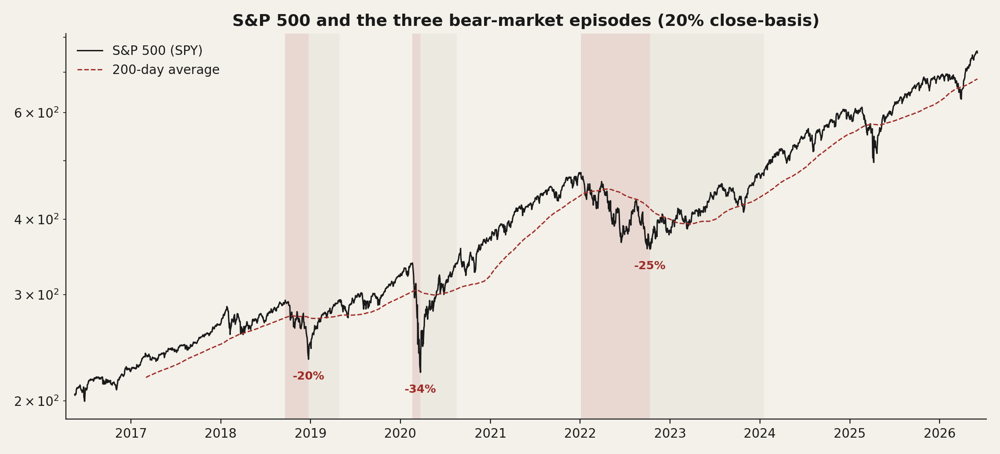
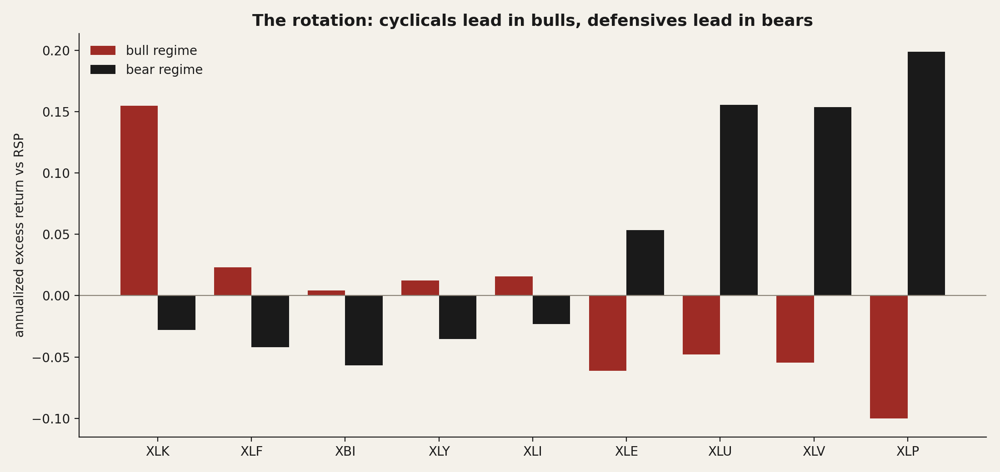
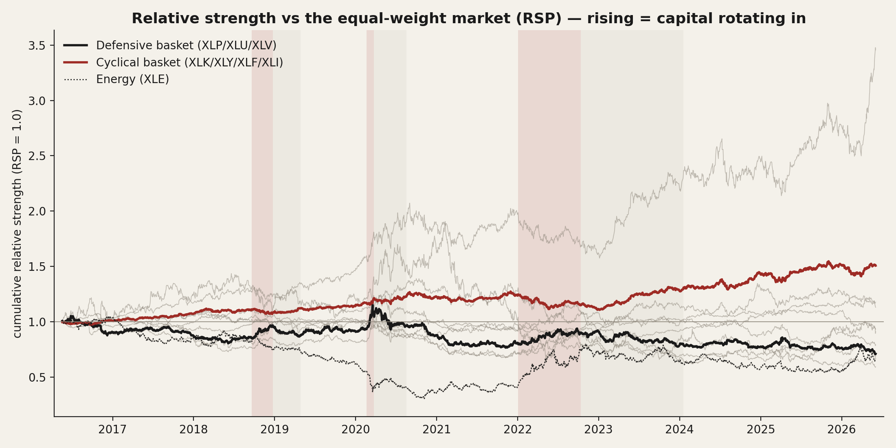
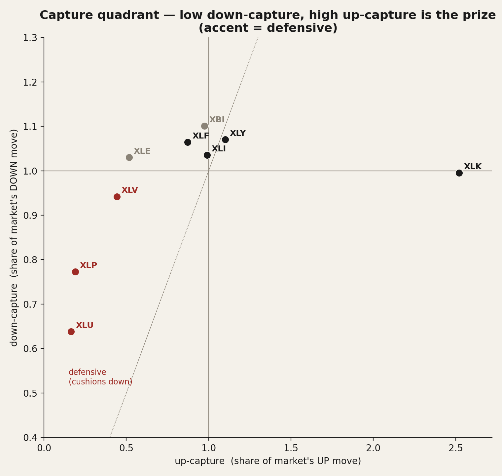
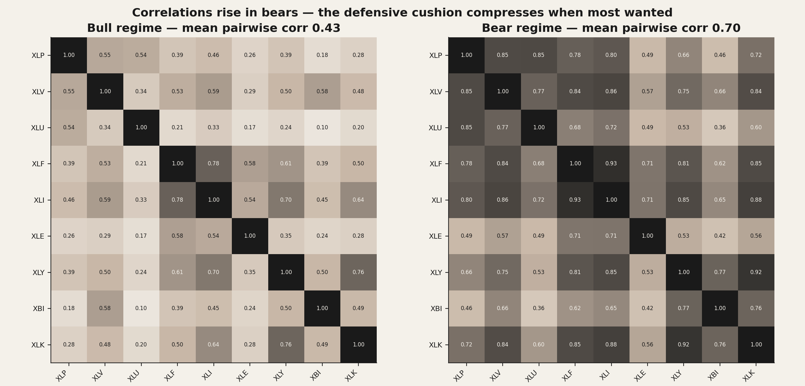
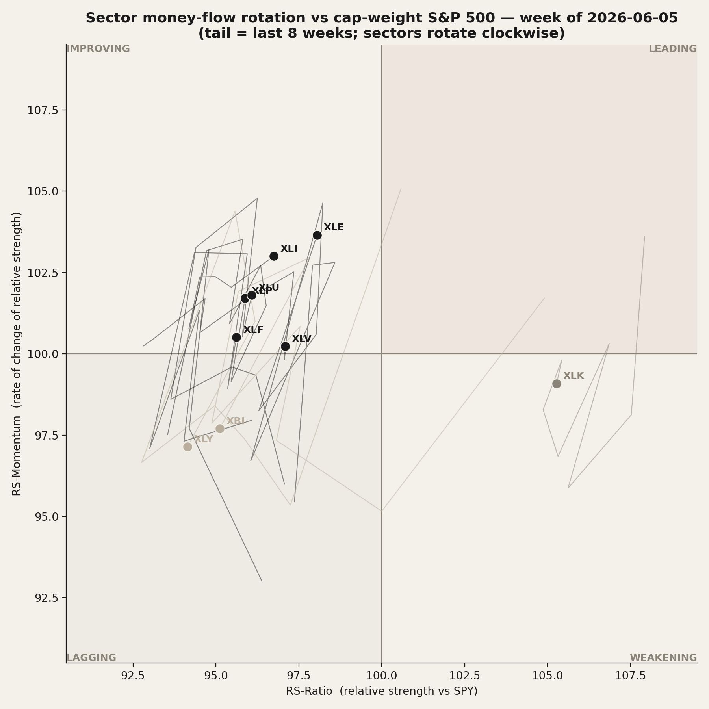

# 20 — Sector rotation: money flows to cyclicals in bulls, to defensives in bears — but you can't time it

**Question.** As the index rises and falls, does capital measurably rotate between sectors — into cyclicals/tech when the market climbs, into defensives when it falls — and can that rotation be traded? **Answer:** The rotation is real and large *descriptively*, but *not* tradeable. Inside bear markets defensives (staples, utilities, health care) beat the market by 15–20 points annualized while cyclicals lead by a similar margin in bulls; energy is the off-axis exception. Yet a causal, real-time version of the rotation loses to simply holding the index, and does not even reduce drawdown.

> Research / backtested. No live capital, no audited track record. "Money flow" is measured as **relative price strength** and **up/down-capture** — the price footprint of demand — not literal fund creation/redemption, which is not in the data. Regime episode count is small (three bears this decade), so descriptive magnitudes are economically clear but statistically wide.

## Data & method

Nine US sector ETFs — XLP (staples), XLU (utilities), XLV (health care) as the **defensive** basket; XLK (technology), XLY (discretionary), XLF (financials), XLI (industrials) as the **cyclical** basket; plus XLE (energy) and XBI (equal-weight biotech) studied separately — benchmarked against both the cap-weight S&P 500 (SPY) and the equal-weight S&P 500 (RSP). Daily split-adjusted prices, **2016-05-18 to 2026-06-03, 2,525 aligned bars**, covering the Q4-2018 selloff, the COVID crash, the 2022 bear and two bull legs.

Two regimes, kept strictly apart:

- **Descriptive** — a 20%-close-drawdown state machine on the S&P dates three bear episodes (Q4-2018 −20%, COVID −34%, 2022 −25%), bull otherwise. Because the exit (a new all-time high) is only knowable in hindsight, this view *describes* and never trades.
- **Predictive** — a causal 200-day-average trend filter (computed through the prior close, acted on the next day) is the only thing allowed to claim "tradeable," charged 20 bps when it rotates.

Validation: per-sector geometric up/down-capture (Morningstar convention), beta and beta-residual via least squares, moving-block bootstrap confidence intervals, walk-forward split, and the deflated-Sharpe / probability-of-backtest-overfitting battery for the tradeable test. RSP (equal-weight) is the primary relative-strength benchmark because one sector (XLK) is ~30% of cap-weight SPY, so "leadership" measured against SPY is partly a concentration artifact.

## Claim 1 — The rotation is real: bulls reward cyclicals, bears reward defensives

The relationship is a clean mirror. Measured as annualized excess return over the equal-weight market, the cyclical sectors lead in bull regimes and the defensives lead in bears, with the sign flipping sector by sector.

| Regime | Leads (excess vs equal-weight RSP) | Lags |
|---|---|---|
| Bull | XLK +15.5%, cyclicals positive | XLP −10.0%, XLV −5.5%, XLU −4.8% |
| Bear | XLP +19.9%, XLU +15.6%, XLV +15.4%, XLE +5.3% | XBI −5.7%, XLF −4.2%, cyclicals negative |

Across the three bear episodes the defensive basket fell far less than the cyclical basket — a pooled cushion of **+11.5 points** (Q4-2018 +13.3, COVID +7.5, 2022 +13.7). The cumulative relative-strength lines make the rotation legible: defensives gain ground against the market inside the shaded bear spans, cyclicals reclaim it through the bull legs.

One honesty note on the leader: XLK's bull excess is +15.5% vs RSP, but its **beta-residual** is only +5.2% — most of tech's "leadership" is high beta and index concentration, not alpha. **Answer: Yes** — money demonstrably rotates cyclical-in-bulls, defensive-in-bears.

## Claim 2 — Down-capture sorts the sectors exactly as theory says — and energy is the exception

Over the full sample, defensives capture far less of the market's down moves than cyclicals. The defensive basket's down-capture is 0.80 versus 1.04 for the cyclical basket — a spread of **−0.24** (90% bootstrap CI [−0.36, −0.14], p=0.001). Ranking all nine by down-capture reproduces the textbook defensive-to-offensive ordering with a Spearman correlation of **+0.90**.

| Sector | Character | Up-capture | Down-capture | Spread |
|---|---|---:|---:|---:|
| XLU | defensive | 0.17 | 0.64 | −0.47 |
| XLP | defensive | 0.19 | 0.77 | −0.58 |
| XLV | defensive | 0.44 | 0.94 | −0.50 |
| XLK | technology | 2.52 | 0.99 | +1.53 |
| XLE | energy | 0.52 | 1.03 | −0.51 |
| XLI | industrials | 0.99 | 1.04 | −0.05 |
| XLF | financials | 0.87 | 1.06 | −0.19 |
| XLY | discretionary | 1.10 | 1.07 | +0.03 |
| XBI | biotech (eq-wt) | 0.98 | 1.10 | −0.13 |

The exception is **energy**. XLE was the only ETF ever positive in a bear (the 2022 inflation bear) and carries the largest positive sensitivity to the 10-year yield (+0.057) while the other defensives are bond-proxies with negative rate sensitivity. A one-factor (market) model leaves XLE with a +91% annualized residual in 2022; adding a rates factor absorbs part of it (to +73%) but not all — the oil/supply shock is a third axis no equity-risk model captures. "Risk-on/off" is an incomplete map of sector flow.

The episode-level answer table — the honest sample is three bears, shown behind the average:

| Sector | Character | Median bear leg | Average | % of bears positive |
|---|---|---:|---:|---:|
| XLP | defensive | −12.8% | −16.3% | 0% |
| XLE | energy | −28.3% | −16.7% | 33% |
| XLU | defensive | −12.9% | −17.3% | 0% |
| XLV | defensive | −14.4% | −17.9% | 0% |
| XLK | technology | −30.8% | −28.8% | 0% |
| XLI | industrials | −24.6% | −29.1% | 0% |
| XLY | discretionary | −33.5% | −29.6% | 0% |
| XBI | biotech (eq-wt) | −29.9% | −30.2% | 0% |
| XLF | financials | −25.3% | −30.3% | 0% |

**Answer: Yes** — the defensive-to-offensive ordering is robust, with energy the documented off-axis exception.

## Claim 3 — The cushion shrinks exactly when it is most wanted

Diversification across sectors thins in a crash. Average pairwise correlation among the nine sectors rises from **0.43 in bulls to 0.70 in bears** (gap +0.15, 90% CI [0.09, 0.22]; correlation with the VIX +0.57). When everything sells off together, sector choice protects less than the static capture numbers imply — the defensive benefit is real but partially compressed in the worst tape.

**Answer: Yes, with a caveat** — the cushion is real but smallest in the fastest declines.

## Claim 4 — You can watch the rotation live, but you cannot trade it

Replacing the hindsight regime with a causal 200-day trend filter — hold cyclicals when the S&P is above its 200-day average (known as of the prior close), defensives otherwise, 20 bps charged on rotations — collapses the edge.

| Strategy (net of cost) | Sharpe | CAGR | Max drawdown |
|---|---:|---:|---:|
| Rotation (cyclical / defensive) | 0.61 | +9.8% | −37.2% |
| Long-short timing tilt | −0.02 | −1.3% | −34.9% |
| De-risking overlay (market / defensive) | 0.65 | +10.0% | −35.2% |
| Buy-and-hold S&P 500 | **0.77** | +13.3% | −34.1% |
| Hold defensives always | 0.48 | +6.3% | **−29.9%** |

No causal use of the filter beats buy-and-hold, and none cuts the drawdown — the worst drawdown was COVID, too fast for a trend filter to dodge, and defensives fell ~30% in it anyway. The shallowest drawdown comes from simply *holding* defensives, but at half the index's return: protection is in the assets, not the timing. Across the de-whipsaw variants the probability of backtest overfitting is **94%**, confirming the in-sample "best" would not persist. Rotation also fails as an early-warning signal: defensive strength rising into the three dated market peaks was statistically indistinguishable from random (placebo p=0.39) and fired falsely 94% of the time.

The rotation *is* worth watching as a positioning lens. A relative-rotation graph plots each sector by its relative strength and the momentum of that strength; capital drifts clockwise through Improving → Leading → Weakening → Lagging. As of mid-2026 the map reads risk-on but narrow: XLK is the strongest sector yet has rotated into "weakening" (momentum rolling over) while energy, industrials, financials and defensives are "improving" — an early broadening signature, not a trade.

**Answer: No** — the rotation is a regime/positioning lens, not a market-timing signal.

## Caveats

- **Price strength, not fund flows.** Every figure is relative return or capture, not net dollars in or out. The direction is demand revealed by price; literal creation/redemption data is not used.
- **Three bears.** The descriptive magnitudes rest on three independent bear episodes; daily samples look large, but the honest n behind every bear average is three. Confidence intervals are correspondingly wide.
- **Annualized regime returns concatenate non-contiguous days** and are read for sign and relative magnitude, not as a return stream; the episode-level table reports the raw leg returns.
- **No costs in the descriptive figures.** Capture and excess returns are gross; the tradeable test (Claim 4) charges cost only on rotation days.
- **Survivorship and composition drift.** These are the surviving sector ETFs; XLK's membership changed with the 2018 GICS communication-services split, so a constant-"tech" read is approximate.
- **The rotation graph uses a transparent open approximation** (per-sector rolling z-score of the price ratio), not the proprietary RRG formula; quadrant membership is what matters and is scale-free.

**Bottom line:** Money clearly rotates — into cyclicals and tech as the index climbs, into staples, utilities and health care as it falls, with energy marching to the inflation cycle instead. That rotation is a useful map of *where the market is in its cycle*. It is not a way to beat the index: a real-time 200-day rotation loses to buy-and-hold net of cost and does not reduce drawdown, and the rotation does not warn of tops. Use it to understand positioning and risk, not to time entries.

## References

- Public daily price history for nine US SPDR/industry sector ETFs (XLP, XLV, XLU, XLF, XLI, XLE, XLY, XBI, XLK) and the cap-weight (SPY) and equal-weight (RSP) S&P 500 ETFs.
- 10-year Treasury par yield (public) for the two-factor energy decomposition; VIX (public) for the correlation-regime overlay.
- Up/down-capture, 200-day-average trend filter, and relative-rotation construction are standard, publicly documented definitions.
