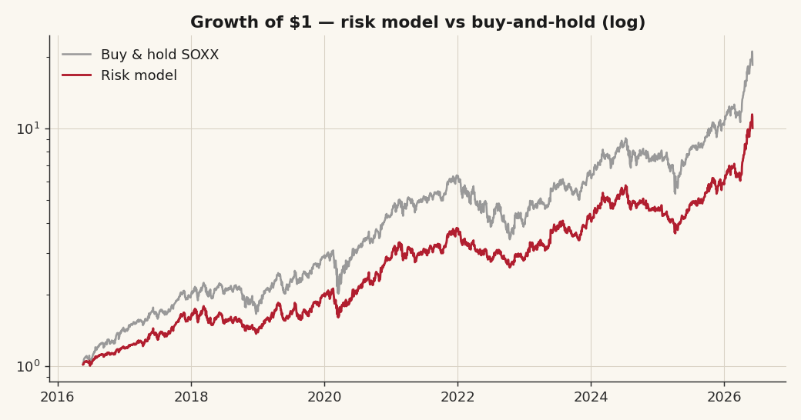
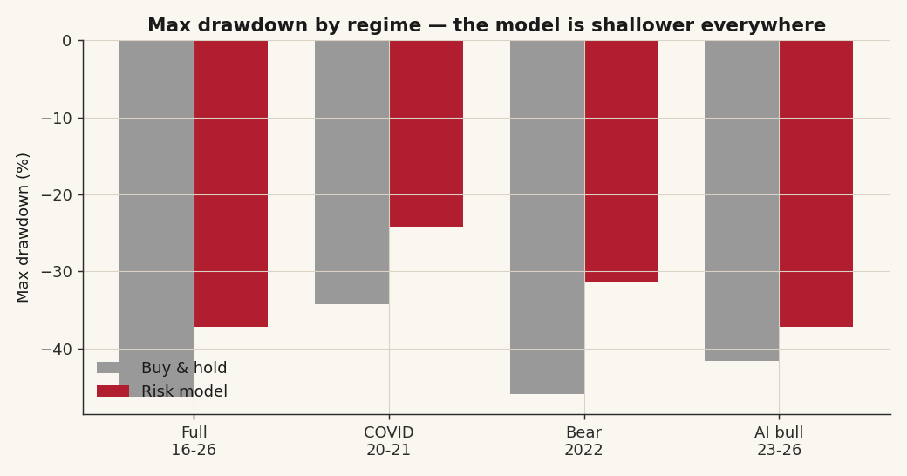

# 21 — A semiconductor risk-overlay model

**Question.** Can a simple, layered risk model improve on holding the semiconductor index — and is what it adds *alpha*, or just *risk management*? **Answer:** Risk management, honestly. It cuts the drawdown in every regime for a modest return give-up, the result is robust to its parameters, and it does **not** beat buy-and-hold on Sharpe. A smoother ride, not a higher return — and saying so plainly is the point.

> Research / backtested. No live capital, no audited track record. Point-to-point returns, idealized fills; a real implementation pays spread, slippage and (for any short leg) borrow, so live results would print *worse* than every number here.

## What the model is

A layered overlay on the semiconductor index. The validated core is a **trend dial**: net exposure is full when the index is above its 200-day moving average, and **halves** when the index loses the 200-day average *or* falls more than 10% off its 60-day high (a fast-breakdown branch, for the gap-down crashes a slow average misses). Around that dial sit deterministic read-outs — constituent **breadth**, a **volatility** regime, sector-**leadership rotation**, and **event flags** (e.g. a bellwether's earnings move the whole group the same day) — combined into a green / amber / red **safety state**.

A separate **judgment layer** (a catalyst screen over a research corpus) exists but is operated privately and is **not backtestable** — it needs forward testing, so it is excluded from every number below. What is published here is the systematic, deterministic spine only.

## Data & method

The semiconductor ETF, May-2016 to Jun-2026 (~2,500 daily bars after a 200-day warm-up), 5 bps per turn of cost. The model's net-exposure path is applied to **next-day** returns (no look-ahead) and compared to buy-and-hold and to cash. It is tested three ways: across **regimes** (sub-periods), for **parameter robustness** (de-risk floor 0.3/0.5/0.7 × moving-average length 150/200/250), and graded pass/fail on its own claims.

## Claim 1 — it cuts drawdown in every regime

| Period | Model CAGR | Buy-hold CAGR | Model maxDD | Buy-hold maxDD | Drawdown saved | Model Sharpe | Buy-hold Sharpe |
|---|---:|---:|---:|---:|---:|---:|---:|
| Full 2016-26 | +26% | +34% | −37% | −46% | **+9pp** | 1.02 | 1.03 |
| Early bull 16-19 | +21% | +34% | −23% | −26% | +3pp | 1.09 | 1.34 |
| COVID 20-21 | +37% | +47% | −24% | −34% | +10pp | 1.19 | 1.19 |
| **Bear 2022** | −24% | −36% | −31% | −46% | **+15pp** | −1.08 | −0.81 |
| AI bull 23-26 | +45% | +57% | −37% | −42% | +4pp | 1.41 | 1.44 |

The model gives up some return in every period but cuts the max drawdown in every period — most where it matters, the 2022 bear (−31% vs −46%, +15pp).

## Claim 2 — it is robust, not knob-fit

The dial has no fitted parameters (the 200-day average is pre-registered, nothing optimized). Varying the de-risk floor (0.3/0.5/0.7) and the moving-average length (150/200/250) across all nine combinations holds the Sharpe in a tight **0.90–1.04** band and the max drawdown in a **−40% to −35%** band. The result does not hinge on the exact knob.

## Claim 3 — it is risk management, not alpha

Full-sample: model **+26% CAGR / Sharpe 1.02 / −37% maxDD** vs buy-and-hold **+34% / 1.03 / −46%**, at lower volatility (26% vs 34%). Same Sharpe, shallower drawdown. **Answer: it is a validated risk-reducer, not an edge over the index** — a legitimate insurance-style overlay if (and only if) it is called insurance, not alpha.

## Current reading + scorecard

The model's live posture is published in [SCORECARD.md](SCORECARD.md) (append-only), so its calls can be tracked against realized 20- and 60-day outcomes and optimized over time. As of **2026-06-05** the safety state is **RED**, the net-long dial reads **0.50** (the index fell >10% off its 60-day high in the 2026-06-05 chip selloff), leadership is still risk-on — posture: core at half, defined-risk hedge armed, no new longs except a high-volume washout.

## Caveats

- **One secular bull.** 2016-26 is essentially one bull market plus two V-shaped crises; every confidence interval is optimistic and the overlay is not tested through a full grind-down bear beyond 2022.
- **Not alpha.** It does not beat buy-and-hold on Sharpe; its only demonstrated value is drawdown and volatility reduction.
- **The judgment layer is excluded** — it is unproven and can only be graded forward (the scorecard).
- **Idealized fills.** Point-to-point, no spread/slippage; the 200-day dial also whipsaws in V-shaped pullbacks (it cost ~16 points of the 2020 round-trip), which a confirmation filter would reduce at the cost of curve-fitting.
