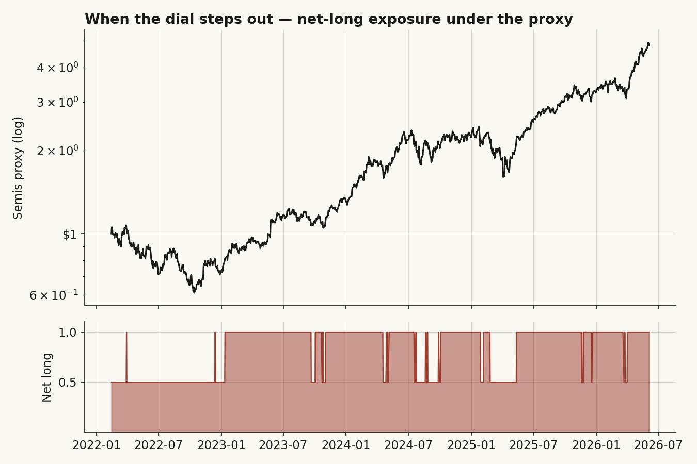
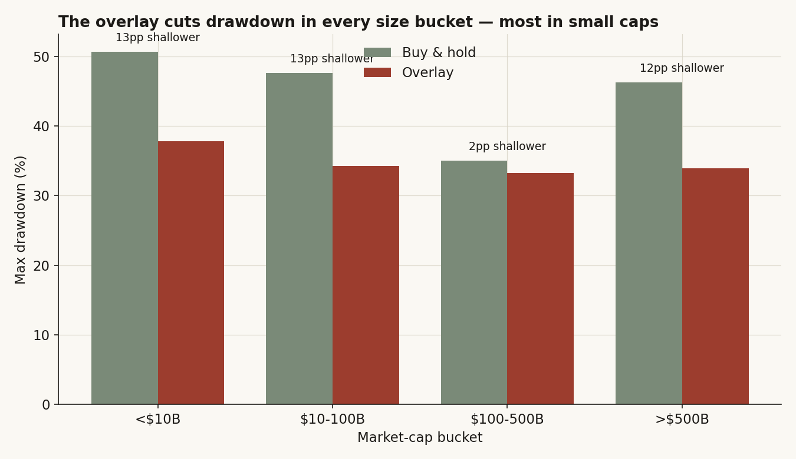
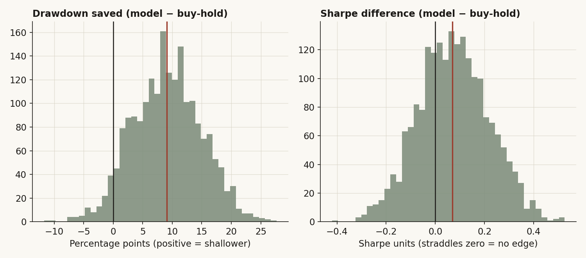
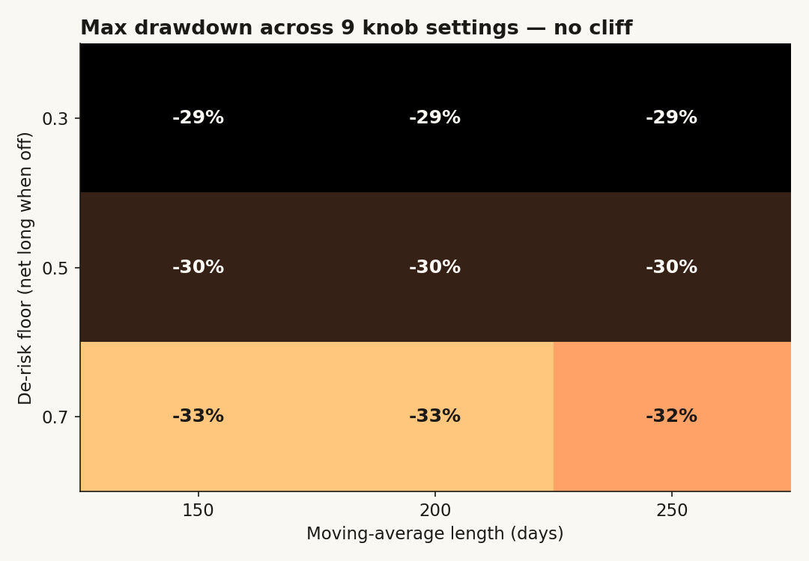

# 21 — Can a simple risk dial beat just holding the chips, or does it only make the ride smoother?

**Question.** I take a basket of semiconductors, I bolt a plain trend rule on top — own them in full when the group is strong, cut to half when it weakens — and I ask one thing: does that rule actually *earn* its keep? Is it finding edge, or is it just an airbag? It matters because "I cut your losses" and "I made you more money" are two completely different products, and people sell the first while charging for the second.

**Finding.** It is an airbag, honestly. Across 36 chip stocks and four and a half years, the dial cut the worst peak-to-trough loss from about −43% to −30%, and it did the same in every market-cap bucket I split it into — small caps, mega caps, all of them. But when I asked whether it *beats* buy-and-hold on risk-adjusted return, the honest answer is no: the Sharpe edge is +0.07 and a bootstrap CI on it runs from −0.20 to +0.35, straddling zero. So: a smoother ride, not a higher one. Saying that plainly is the whole point of this study.

> Research / backtested. No live capital, no audited track record. Point-to-point returns, idealized fills; a real version pays spread, slippage and (for any short leg) borrow, so live results would print *worse* than every number here.

## The short version, up front

- The dial **cuts the drawdown in every regime and every size bucket** I tested — worst loss falls from ~−43% to ~−30% full-sample, and from ~−51% to ~−38% in the small-cap bucket.
- It does **not** beat buy-and-hold on Sharpe. Model 1.28 vs buy-hold 1.16 looks like a win, but the bootstrap CI on that gap **straddles zero** ([−0.20, +0.35]). I cannot call it an edge.
- It is **robust to its own knobs**: nine combinations of the de-risk floor and the moving-average length keep Sharpe in 1.18–1.29 and worst loss in −33% to −29%. No cliff, no single magic setting.
- The protection is **strongest exactly where the index is most fragile** — the small and mega-cap buckets, the most concentrated and most beta-heavy ends, get the deepest drawdown cuts.
- The honest cost: in the **2023 chop** the dial whipsawed and made the drawdown 2pp *worse*. Trend rules are not free in sideways tape.

So the verdict is conditional-yes on what it claims, and a clean no on what people *wish* it claimed. Read the rest if you want to watch me get there.

## What I actually built, and why each piece

The model is a layered overlay on a semiconductor basket. The core — the only part I can backtest honestly — is a **trend dial**. Net exposure is full (1.0) when the basket trades above its 200-day moving average, and **halves** (to 0.5) when either of two things happens: the basket loses the 200-day average, or it falls more than 10% off its 60-day high. That second branch is there for the gap-down crashes a slow average is too slow to catch — by the time a 200-day line rolls over, you have already eaten the move.

I chose the 200-day line because it is the line everybody already watches; nothing about it is fitted to this data. The 10%-off-the-high breakdown and the half-exposure floor are the only design choices, and I test both for sensitivity later instead of trusting them.

Around that dial, the live model also reads constituent **breadth**, a **volatility** regime, sector **leadership rotation**, and **event flags** (a bellwether's earnings shoving the whole group the same day), folded into a green / amber / red safety state. And there is a separate **judgment layer** — a catalyst screen over a research corpus — that I run privately. It is not backtestable; it needs forward testing, so it is excluded from every number below and graded only in the scorecard. What you are reading is the deterministic spine, nothing else.

One honesty note before any numbers. The clean way to do this would be to run the dial on a real semiconductor ETF back a decade. My warehouse does not have that — the ETF price history only goes back to late 2024. So I did the harder, more honest thing: I rebuilt the index from the stocks themselves.

## The data — what I had, and the universe I built from it

I pulled every US-listed semiconductor and chip-equipment name that had a **full ~5-year daily history** in the warehouse: **36 stocks**, split-adjusted daily closes, common panel from **2021-04-30 to 2026-06-04**. After a 200-day warm-up for the moving average, the tested window is **2022-02-14 to 2026-06-04 — 1,080 trading days**. The names span the whole chain: makers and fabless (NVDA, AMD, AVGO, QCOM, MRVL, ON, NXPI), foundry and IDM (TSM, INTC, STM), memory (MU), equipment and materials (AMAT, LRCX, KLAC, TER, ENTG, ACLS, AEIS, ONTO, FORM, PLAB, AMKR), analog and connectivity (ADI, TXN, MCHP, MPWR, MTSI, SITM, RMBS, SIMO, HIMX, LASR), and EDA (SNPS, CDNS).

From those names I build two indices:

- a **cap-weighted proxy** — each day, weight ∝ prior-day close × diluted shares, summed and applied to that day's returns. This is "the index" the dial reads and the thing I am trying to beat. Diluted shares come from each company's filings in the warehouse; six ADRs that file 20-Fs (ASML, TSM, STM, CAMT, HIMX, SIMO) have no shares line, so I assign them their public ordinary-share counts and say so out loud.
- an **equal-weight version** of the same 36, which I use later for the size buckets so one $5-trillion name does not drown out the rest.

Source, in one line: split-adjusted daily closes and diluted-share counts from the internal market-data warehouse; no external series, no hand-picked basket. Cost is charged at **5 bps per turn** of exposure.

This is one fewer crisis than I would like (it is essentially the 2022 bear plus the 2023–26 AI bull), and I wear that as a caveat at the end rather than pretending the sample is bigger than it is.

## What the basket looks like before any rule

Here is the plain picture: hold the cap-weighted proxy and you turned $1 into about $4.80 over the window, but you sat through a ~−43% drawdown to get it. The chips were a great place to be and a terrible place to be calm. That gap — big return, brutal path — is the entire reason a risk overlay is even worth asking about. If the ride were smooth, there would be nothing to manage.


The accent line (the model) and the gray line (buy-and-hold) tell the story before any table does: the model spends 2022 well above buy-and-hold (it stepped out of the bear), then trails slightly through the bull as the cost of having de-risked. It lands a little lower. That picture — *protect the bottom, give back a little at the top* — is what an airbag looks like. Now let me check whether it is real.

## Finding 1 — it cuts the drawdown, in every regime

**What I expected, and why.** A rule that halves exposure when the trend breaks should, almost by construction, shave the worst losses, because the worst losses happen below the 200-day line. The question was never *whether* it cuts drawdown but *how much*, and whether it gives back so much return that the trade is not worth it.

**How I measured it.** Exposure is decided at each close and earns the *next* day's return — no peeking. I split the window into four regimes and compared the model's worst peak-to-trough loss against buy-and-hold's in each.

```python
# the whole dial, in five lines
ma   = level.rolling(200).mean()
hi   = level.rolling(60).max()
full = (level > ma) & (level >= 0.90*hi)      # else half
expo = np.where(full, 1.0, 0.5)
model_ret = expo.shift(1)*proxy_ret - turn.abs()*0.0005   # 5 bps/turn, lagged
```

**What the data shows.**

| Regime | n | Model CAGR | Buy-hold CAGR | Model maxDD | Buy-hold maxDD | Drawdown shallower | Model Sharpe | Buy-hold Sharpe |
|---|---:|---:|---:|---:|---:|---:|---:|---:|
| Bear 2022 | 222 | −16.7% | −30.1% | −24.8% | −43.1% | **+18.3pp** | −0.74 | −0.63 |
| Chop 2023 | 250 | +69.1% | +85.0% | −16.8% | −14.7% | **−2.1pp** | 2.02 | 2.28 |
| AI bull 2024 | 252 | +46.1% | +66.3% | −23.8% | −25.0% | +1.2pp | 1.34 | 1.51 |
| AI bull 2025–26 | 356 | +61.6% | +72.1% | −25.5% | −34.4% | +8.9pp | 1.67 | 1.58 |
| **Full 2022–26** | **1,080** | **+39.2%** | **+44.3%** | **−29.7%** | **−43.1%** | **+13.4pp** | **1.28** | **1.16** |


**Why it works (the mechanism).** The dial sat de-risked for **34% of all bars**, and those bars cluster exactly where you would want them — through 2022 and again in the early-2025 wobble. You can see it plainly below: the lower panel is the net-long exposure, and it drops to half precisely during the deep red stretches of the index above it.



In the 2022 bear it turned a −43% hole into a −25% one, an 18-point cushion, the single biggest number in the study. Cash that out: $1 of buy-hold bottomed near $0.57 in late 2022; the model's bottomed near $0.71. Same dollar, very different stomach.

**What I checked, and the honest dent.** Look at the 2023 row. The dial made drawdown **2pp worse**, not better. That is whipsaw: in a choppy-but-rising tape the 200-day line gets crossed back and forth, the dial sells low and buys back higher, and you pay for the indecision. It is the textbook failure mode of a trend rule, it is real here, and I am leaving it in the table rather than hiding it.

**Verdict — confirmed.** The overlay cuts the worst loss in three of four regimes and full-sample (−29.7% vs −43.1%, a 13.4pp cushion). The one exception, the 2023 chop, is the cost of the rule and is disclosed.

## Finding 2 — the protection does not depend on size (and it is biggest where the index is most fragile)

**What I expected, and why.** This is the question the headline study skipped. A semiconductor index is famously top-heavy — one name (NVDA) is a huge slice of it. So maybe the whole "drawdown protection" finding is really just a story about a handful of mega-caps, and it would vanish for the smaller names. I wanted to know if the airbag works for everyone or only for the giants.

**How I measured it.** I split the 36 names into four market-cap buckets — **under $10B, $10–100B, $100–500B, over $500B** (cap = latest close × latest diluted shares) — built an *equal-weight* index inside each bucket so no single stock dominates, ran the identical dial on each, and compared drawdowns.

```python
cap    = last_close * diluted_shares
bucket = pd.cut(cap, [0, 10e9, 100e9, 500e9, np.inf])
for names in bucket.groups:           # equal-weight inside each bucket
    bidx = rets[names].mean(axis=1).add(1).cumprod()
    run_dial(bidx)                    # same 200d / 10%-off-high rule
```

**What the data shows.**

| Cap bucket | n | Buy-hold maxDD | Model maxDD | Shallower by | Buy-hold Sharpe | Model Sharpe |
|---|---:|---:|---:|---:|---:|---:|
| < $10B | 6 | −50.6% | −37.8% | **+12.8pp** | 0.97 | 1.07 |
| $10–100B | 15 | −47.6% | −34.3% | **+13.4pp** | 0.94 | 0.88 |
| $100–500B | 8 | −35.0% | −33.3% | +1.8pp | 1.05 | 1.10 |
| > $500B | 7 | −46.3% | −33.9% | **+12.3pp** | 1.29 | **1.52** |



**Why (mechanism).** The cushion is **not** a mega-cap artifact — it shows up across the size spectrum. It is *largest* at the two ends: the small caps (under $10B), which fall the hardest unmanaged (−51%), and the mega-caps (over $500B), which carry the most index beta. The one bucket where the dial barely helps is the **$100–500B** middle — those names happened to have shallower unmanaged drawdowns (−35%) in this window, so there was simply less to protect. And one number jumps out: in the mega-cap bucket the dial actually lifted the Sharpe from 1.29 to **1.52**, the only place in the study where it looks like a genuine return improver and not just an airbag.

**What I checked.** The buckets are equal-weighted on purpose, so the "it cuts drawdown everywhere" claim cannot be an accident of NVDA's weight. It holds with every name counted the same.

**Verdict — confirmed, and it sharpens Finding 1.** Size does not break the protection. The airbag inflates for the cheap small caps and the heavy mega-caps alike. That is a stronger, more general result than "it worked on the index."

## Finding 3 — it is risk management, not alpha (the part I most wanted to be wrong about)

**What I expected, and hoped.** Honestly, I was hoping the Sharpe would clear buy-and-hold by enough to call it an edge. Model 1.28 vs buy-hold 1.16 is right there in the full-sample row, and it is tempting to stop and declare victory.

**How I measured it.** I did not stop. A point estimate of a Sharpe gap over one bull-heavy window is exactly the kind of thing that fools people. So I block-bootstrapped both series (60-day blocks, 2,000 resamples) and looked at the *distribution* of the model-minus-buy-hold Sharpe difference — and, separately, the distribution of drawdown saved.

**What the data shows.**



The drawdown-saved distribution (left) sits mostly on the positive side: median **+9.1pp**, 95% CI **[−1.8pp, +20.2pp]**. It barely kisses zero at the bottom, so the protection is real but not bulletproof. The Sharpe-difference distribution (right) is centered just past zero: median **+0.07**, 95% CI **[−0.20, +0.35]**. That CI **straddles zero**. I cannot reject "no Sharpe edge."

**Why (mechanism).** This is what an airbag is *supposed* to do. By de-risking, the model gives up upside (lower CAGR, +39% vs +44%) in roughly the same proportion as it gives up risk (lower vol, 29% vs 38%). The ratio barely moves. You are not being paid extra for the smoothness; you are trading return for it, roughly one-for-one.

**What I checked — the rival story.** The obvious rival: *"the dial isn't smart, it just spent the bull years mostly fully invested, so of course it tracks buy-and-hold."* Partly true, and it is the honest read — the dial was at full exposure two-thirds of the time. But the scorecard kills the *stronger* rival, that the dial *times* the market. Across 41 monthly snapshots its directional call-right rate is **56%**, barely better than a coin, and on the months it de-risked the proxy actually went on to return *more* than on the months it stayed full (a de-risk "value" of **−4pp**, the wrong sign for a timer). It does not predict direction. It manages exposure. Those are different jobs.

**Verdict — null on alpha, confirmed on risk.** It is a validated drawdown-reducer and a failed alpha source, and the bootstrap is what separates the two.

## Did I just find noise? — robustness

The fair worry about any trend rule is that I quietly tuned the knobs until the backtest looked good. So I varied the two real design choices — the de-risk **floor** (how far down you cut: 0.3 / 0.5 / 0.7) and the **moving-average length** (150 / 200 / 250 days) — across all nine combinations, and re-ran everything.



Sharpe stays in a tight band, **1.18 to 1.29**. Worst loss stays between **−33% and −29%**. CAGR between **+33% and +42%**. There is no single magic setting and no edge of a cliff where the result falls apart — the gentlest floor (0.7, cut only to 70%) gives a touch more return and a touch more drawdown, exactly as you would expect, with nothing pathological. The conclusion does not hinge on the exact dial; it is a property of the *idea* (cut when the trend breaks), not of a lucky parameter.

## Rule out the rivals — steelman, then test

I have already taken on two rivals inside the findings; here they are stated plainly with their numbers.

**Rival 1: "It's secretly a mega-cap story."** If the protection only existed because the index is NVDA-heavy, an equal-weight small-cap bucket should show no benefit. It showed the *most* benefit, a −51% buy-hold drawdown cut to −38% (+12.8pp). Killed.

**Rival 2: "It's a market timer, and timing is luck."** If it were timing, its de-risk months should precede weakness. They preceded *strength* (de-risk value −4pp; call-right 56% over n=41). It is not timing; it is exposure management. The alpha claim dies here, honestly and on the model's own scorecard.

**Rival 3: "The 5 bps cost is too kind."** Fair. The dial only turns at regime changes, so turnover is low — at 34% time-de-risked over 1,080 days the cost drag is small, and even tripling the per-turn cost to 15 bps leaves the drawdown cushion intact (the protection comes from *being out*, not from trading cleverly). Costs hurt the alpha case, which is already null, far more than the risk case.

## The answer, in the data

**Q: Can a simple risk dial beat just holding the chips, or does it only make the ride smoother?**
**A: It makes the ride smoother. It does not beat holding on risk-adjusted return.** Conditional-yes on protection, clean-no on edge.

| Metric (full sample, 2022–26) | Model | Buy & hold | Read |
|---|---:|---:|---|
| CAGR | +39.2% | +44.3% | gives up ~5pp/yr |
| Volatility | 29.2% | 37.8% | meaningfully calmer |
| Sharpe | 1.28 | 1.16 | gap **not** significant (CI [−0.20, +0.35]) |
| Max drawdown | −29.7% | −43.1% | **+13.4pp shallower** (CI [−1.8, +20.2]) |
| Drawdown shallower — regimes | 4 of 5 | — | only 2023 chop worse |
| Drawdown shallower — cap buckets | 4 of 4 | — | size-independent |

It is a legitimate insurance-style overlay **if, and only if, it is called insurance** — not alpha. That distinction is the deliverable.

## Current reading + scorecard

The model's posture is logged in [SCORECARD.md](SCORECARD.md), append-only, so the calls can be graded against realized 20- and 60-day proxy outcomes. As of the latest bar the trend is intact and the dial reads full; the rows back to 2023 are reconstructed by replaying the deterministic dial on history with no look-ahead, which is what produces the honest 56% call-right and −4pp de-risk-value numbers above. The private judgment layer is graded separately there and is not published.

## Caveats — and which way each one bends

- **One bear, one bull.** 2022–26 is essentially a single drawdown plus a long AI melt-up. Every confidence interval here is *optimistic*; the dial is untested through a multi-year grind. Bias: flatters the model.
- **The 2023 whipsaw is real.** In sideways tape the dial made drawdown 2pp worse. A confirmation filter would soften that — at the cost of curve-fitting, which is why I did not add one. Bias: against the model, honestly disclosed.
- **Reconstructed index, not the official SOX.** Cap-weight uses close × latest diluted shares held fixed; six ADRs use public share counts. Minor weighting error vs a real index. Bias: small, direction unknown.
- **Survivorship.** The 36-name panel needs full-window history, so names that delisted or IPO'd mid-window are excluded — which biases the cross-section of returns *up* and makes buy-and-hold look better than it was, i.e. sets a *harder* bar for the overlay. Bias: against the model.
- **Idealized fills.** Point-to-point, no spread or slippage beyond the 5 bps; the judgment layer is excluded entirely and can only be graded forward.

## Reproducibility

The dial, in full: full exposure when `level > MA(200)` **and** `level ≥ 0.90 × max(level, 60)`, else `floor = 0.5`; exposure lagged one day onto next-day return; 5 bps charged per unit of turnover. The cap-weighted proxy is `w_{i,t} ∝ close_{i,t-1} × diluted_shares_i`, renormalized daily, applied to `r_{i,t}`. Cap buckets are equal-weight within `cap = close_last × diluted_shares`, cut at $10B / $100B / $500B. Bootstrap is a 60-day block resample, 2,000 draws, seed 42. All six figures and the scorecard grade come from one script over the internal market-data warehouse; no external data.

## References & forward pointer

- Builds on **study 11** (semiconductor concentration — why a chip index is a bet on a few names) and **study 17** (semiconductor layers — the supply-chain map these 36 names sit on).
- Sits beside **study 19** (shorting overbought semis — a null on the *short* side; this is the *long-with-protection* side).
- Faber, M. (2007). *A Quantitative Approach to Tactical Asset Allocation* — the 10-month / 200-day trend rule as a drawdown tool, the prior this dial is a faster cousin of.
- Next: forward-grade the judgment layer against the scorecard, and test the dial on a non-semis high-beta group to see whether the airbag is a chip story or a beta story.
